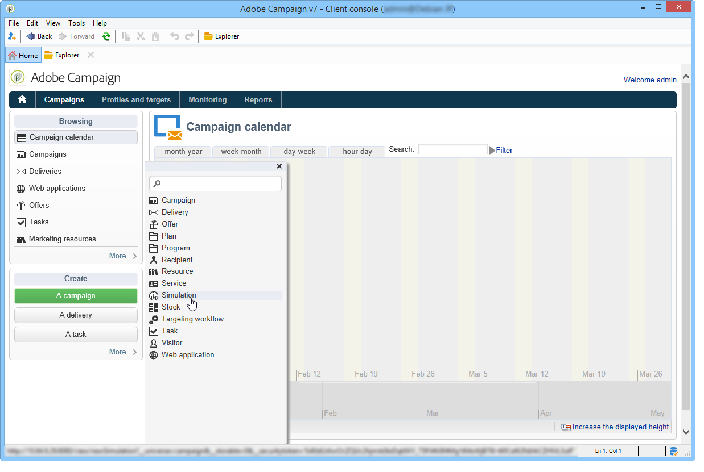

# Simulazioni delle campagne{#campaign-simulations}

L’ottimizzazione di Campaign consente di testare l’efficienza di un piano di campagna utilizzando simulazioni. Questo consente di misurare il potenziale successo di una campagna: ricavi generati, volume target in base alle regole di tipologia applicate, ecc.

La simulazione consente di monitorare e confrontare l’impatto delle consegne.

## Impostare una simulazione {#set-up-a-simulation}

### Attenzione

Le consegne preparate in modalità **Test** non hanno alcun impatto l&#39;una sull&#39;altra, ad esempio durante la valutazione di una campagna nel marketing distribuito o finché le consegne non sono pianificate nel calendario provvisorio.

Ciò significa che le regole di pressione e capacità vengono applicate solo alle consegne in modalità **[!UICONTROL Target estimation and message personalization]**. Le consegne in modalità **[!UICONTROL Estimation and approval of the provisional target]** e **[!UICONTROL Target evaluation]** non vengono prese in considerazione.

La modalità di consegna viene scelta nella scheda secondaria **[!UICONTROL Typology]** delle proprietà di consegna.

### Creare una simulazione {#create-a-simulation}

Per creare una simulazione, attieniti alla seguente procedura:

1. Apri la scheda **[!UICONTROL Campaigns]**, fai clic sul collegamento **[!UICONTROL More]** nella sezione **[!UICONTROL Create]** e seleziona l&#39;opzione **[!UICONTROL Simulation]**.

   

1. Immettere il modello e il nome della simulazione. Fare clic su **[!UICONTROL Save]** per creare la simulazione.

   

1. Fare clic sulla scheda **[!UICONTROL Edit]** per configurarla.

   

1. Nella scheda **[!UICONTROL Scope]**, specifica le consegne da considerare per questa simulazione. A tale scopo, fare clic sul pulsante **[!UICONTROL Add]** e specificare la modalità di selezione della consegna da considerare.

   

   Puoi selezionare ciascuna consegna singolarmente oppure ordinarle per campagna, programma o piano.

   >[!NOTE]
   >
   >Se selezioni le consegne tramite un piano, un programma o una campagna, Adobe Campaign può aggiornare automaticamente l’elenco delle consegne da considerare ogni volta che viene avviata una simulazione. Per eseguire questa operazione, selezionare l&#39;opzione **[!UICONTROL Refresh the selection of deliveries each time the simulation is started]**.
   >  
   >In caso contrario, non verranno prese in considerazione le consegne non disponibili nel piano, nel programma o nella campagna al momento della creazione della simulazione: le consegne aggiunte successivamente verranno ignorate.

   

1. Selezionare gli elementi da includere nell&#39;ambito di simulazione. Se necessario, selezionare più elementi utilizzando i tasti MAIUSC e CTRL.

   

   Fare clic su **[!UICONTROL Finish]** per approvare la selezione.

   Puoi combinare manualmente le consegne selezionate e le consegne appartenenti a piani, programmi o campagne.

   

   Se necessario, è possibile utilizzare una condizione dinamica tramite il collegamento **[!UICONTROL Edit the dynamic condition...]**.

   Fare clic su **[!UICONTROL Save]** per approvare questa configurazione.

   >[!NOTE]
   >
   >Solo le consegne la cui destinazione è stata calcolata vengono prese in considerazione durante il calcolo delle simulazioni (stati: **Target ready** o **Ready to deliver**).

1. Nella scheda **[!UICONTROL Calculations]**, selezionare una dimensione di analisi, ad esempio lo schema del destinatario.

   

1. È quindi possibile aggiungere espressioni.

   

### Impostazioni di esecuzione {#execution-settings}

La scheda **[!UICONTROL General]** della simulazione consente di immettere le impostazioni di esecuzione:

* L&#39;opzione **[!UICONTROL Schedule execution for down-time]** posticipa l&#39;avvio della simulazione a un periodo di tempo meno occupato, in base al livello di priorità scelto. Le simulazioni utilizzano risorse di database significative. Per questo motivo, ad esempio, è necessario pianificare l&#39;esecuzione di simulazioni non urgenti di notte.
* **[!UICONTROL Priority]** è il livello applicato alla simulazione per ritardarne l&#39;attivazione.
* **[!UICONTROL Save SQL queries in the log]**. I registri SQL consentono di diagnosticare una simulazione se termina con errori. Possono anche aiutarti a scoprire perché una simulazione è troppo lenta. Questi messaggi saranno visibili dopo la simulazione nella scheda secondaria **[!UICONTROL SQL logs]** della scheda **[!UICONTROL Audit]**.

## Eseguire una simulazione {#execute-a-simulation}

### Avvia una simulazione {#start-a-simulation}

Una volta definito l’ambito di simulazione, puoi eseguirlo.

Per eseguire questa operazione, aprire il dashboard di simulazione e fare clic su **[!UICONTROL Start simulation]**.

Una volta completata l&#39;esecuzione, aprire la simulazione e fare clic sulla scheda **[!UICONTROL Results]** per visualizzare le destinazioni calcolate per ogni consegna.

1. Nella scheda secondaria **[!UICONTROL Deliveries]** sono elencate tutte le consegne prese in considerazione dalla simulazione. Mostra due conteggi:

   * **[!UICONTROL Initial count]** è la destinazione così come è stata calcolata durante la sua stima nella consegna.
   * **[!UICONTROL Final count]** è il numero di destinatari conteggiati dopo la simulazione.

     La differenza tra i conteggi iniziali e finali riflette l’applicazione delle varie regole o filtri configurati prima della simulazione.

     Per ulteriori informazioni su questo calcolo, modificare la scheda secondaria **[!UICONTROL Exclusions]**.

1. La scheda secondaria **[!UICONTROL Exclusions]** ti consente di visualizzare il raggruppamento di esclusione.

   

1. La scheda secondaria **[!UICONTROL Alerts]** raggruppa tutti i messaggi di avviso generati durante la simulazione. I messaggi di avviso possono essere inviati in caso di sovraccarico di capacità (ad esempio, se il numero di destinatari supera la capacità impostata).
1. La scheda secondaria **[!UICONTROL Exploration of the exclusions]** consente di creare una tabella di analisi dei risultati. L’utente deve indicare le variabili negli assi delle ascisse/ordinate.

   Per un esempio di creazione di tabelle di analisi, fare riferimento alla fine di [questa sezione](#explore-results).

### Visualizza risultati {#view-results}

#### Audit {#audit}

La scheda **[!UICONTROL Audit]** consente di monitorare l&#39;esecuzione della simulazione. La scheda secondaria **[!UICONTROL SQL Logs]** è utile per gli utenti esperti. Elenca i registri di esecuzione in formato SQL. Questi registri vengono visualizzati solo se l&#39;opzione **[!UICONTROL Save SQL queries in the log]** è stata selezionata nella scheda **[!UICONTROL General]** prima dell&#39;esecuzione della simulazione.

#### Esplora i risultati {#explore-results}

La scheda secondaria **[!UICONTROL Exploration of the exclusions]** consente di analizzare i dati risultanti da una simulazione.

<!--
Descriptive analysis is detailed in [this section](../../reporting/using/about-adobe-campaign-reporting-tools.md).
-->

## Risultati di una simulazione {#results-of-a-simulation}

Gli indicatori nelle schede **[!UICONTROL Log]** e **[!UICONTROL Results]** forniscono una prima panoramica dei risultati della simulazione. Per una visualizzazione più dettagliata dei risultati, aprire la scheda **[!UICONTROL Reports]**.

### Rapporti {#reports}

Per analizzare il risultato di una simulazione, modificane i rapporti: mostrano esclusioni e cause.

Per impostazione predefinita, vengono forniti i seguenti rapporti:

* **[!UICONTROL Detail of simulation exclusions]** : questo report fornisce un grafico dettagliato delle cause di esclusione per tutte le consegne interessate.
* **[!UICONTROL Simulation summary]** : questo rapporto mostra le popolazioni escluse dalla simulazione in tutte le varie consegne.
* **[!UICONTROL Summary of exclusions linked to the simulation]** : questo report mostra un grafico delle esclusioni causate dalla simulazione insieme alla regola di tipologia applicata e un grafico che mostra il rapporto di esclusione per regola.

<!--
>[!NOTE]
>
>You can create new reports and add them to the ones offered. For more on this, refer to [this section](../../reporting/using/about-adobe-campaign-reporting-tools.md).
-->

Per accedere ai report, fai clic sul collegamento **[!UICONTROL Reports]** della simulazione di destinazione tramite la relativa dashboard.

È inoltre possibile modificare i report utilizzando il collegamento **[!UICONTROL Reports]** accessibile dal dashboard di simulazione.

### Confrontare simulazioni {#compare-simulations-}

Ogni volta che viene eseguita una simulazione, il risultato sostituisce qualsiasi risultato precedente: non è possibile visualizzare e confrontare i risultati da un’esecuzione all’altra.

Per confrontare i risultati, devi utilizzare i rapporti. In effetti, Adobe Campaign ti consente di salvare una cronologia del rapporto per visualizzarla nuovamente in un secondo momento. Questa cronologia viene salvata durante il ciclo di vita delle simulazioni.

**Esempio:**

1. Creare una simulazione su una consegna alla quale viene applicata la tipologia **A**.
1. Nella scheda **[!UICONTROL Reports]**, modifica uno dei rapporti disponibili, ad esempio **[!UICONTROL Detail of simulation exclusions]**.
1. Nella sezione in alto a destra del rapporto, fai clic sull’icona per creare una nuova cronologia.

   

1. Chiudere la simulazione e modificare la configurazione della tipologia **A**.
1. Esegui nuovamente la simulazione e confronta il risultato con quello visualizzato nel rapporto per il quale è stata creata una cronologia.

   

   Puoi salvare tutte le cronologie dei rapporti necessarie.

### Assi di reporting {#reporting-axes}

La scheda **[!UICONTROL Calculations]** consente di definire gli assi di reporting sulla destinazione. Questi assi verranno utilizzati durante [l&#39;analisi dei risultati](#explore-results).

>[!NOTE]
>
>È consigliabile definire gli assi di calcolo nei modelli di simulazione anziché singolarmente per ogni simulazione.\
>I modelli di simulazione vengono salvati nella cartella **[!UICONTROL Resources > Templates > Simulation templates]** di Campaign Explorer.

**Esempio:**

Nell’esempio seguente, vogliamo creare un asse di reporting aggiuntivo basato sullo stato dei destinatari (&quot;Cliente&quot;, &quot;Potenziale&quot; o nessuno).

1. Per definire un asse di reporting, selezionare la tabella contenente le informazioni da elaborare nel campo **[!UICONTROL Analysis dimension]**. Queste informazioni sono obbligatorie.
1. In questo caso, desideri selezionare il campo Segmento della tabella dei destinatari.

   

1. Sono disponibili le seguenti opzioni:

   * **[!UICONTROL Generate target overlap statistics]** consente di recuperare tutte le statistiche di sovrapposizione nel rapporto di simulazione. Le sovrapposizioni sono destinatari di almeno due consegne nell’ambito di una simulazione.

     >[!CAUTION]
     >
     >Selezionando questa opzione si aumenta notevolmente il tempo di esecuzione della simulazione.

   * **[!UICONTROL Keep the simulation work table]** consente di mantenere le tracce della simulazione.

     >[!CAUTION]
     >
     >Il salvataggio automatico di queste tabelle richiede una capacità di archiviazione significativa: assicurati che il database sia sufficientemente grande.

Quando vengono visualizzati i risultati della simulazione, le informazioni sull&#39;espressione selezionata verranno visualizzate nella scheda secondaria **[!UICONTROL Overlaps]**.

Le sovrapposizioni del target di consegna indicano i destinatari target in almeno due consegne di una simulazione.

>[!NOTE]
>
>Questa scheda secondaria viene visualizzata solo se l&#39;opzione **[!UICONTROL Generate target recovery statistics]** è stata abilitata.

Le informazioni sugli assi di reporting possono essere elaborate nei report di analisi di esclusione creati nella scheda secondaria **[!UICONTROL Exploring exclusions]**. [Ulteriori informazioni](#explore-results).
