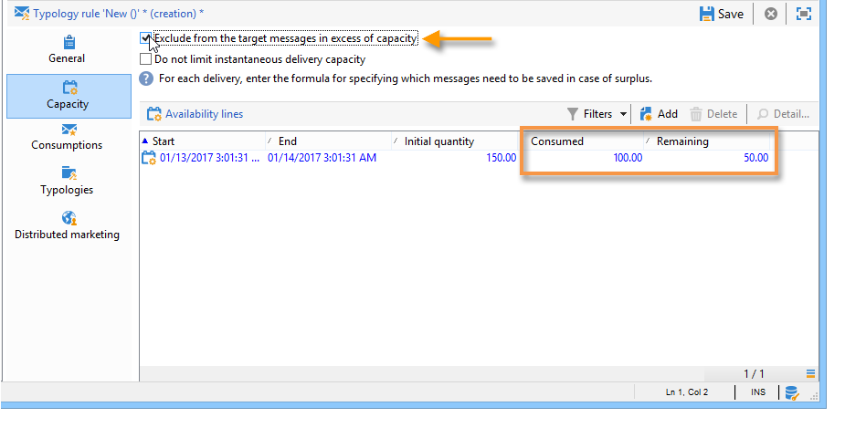

# Regole di coerenza{#consistency-rules}

Adobe Campaign garantisce comunicazioni coerenti grazie a un set di regole contenute nelle tipologie di campagne. Il loro scopo è quello di controllare le consegne inviate ai destinatari, quali volume, natura, pertinenza, ecc.

**Capacità** , ad esempio, può evitare di sovraccaricare la piattaforma interessata dalla consegna dei messaggi. Ad esempio, le offerte speciali contenenti un collegamento per il download non devono essere inviate a troppe persone contemporaneamente, per evitare di saturare il server; le campagne telefoniche non devono superare la capacità di elaborazione dei call center, ecc.

## Capacità di controllo {#control-capacity}

Prima di inviare i messaggi, è necessario assicurarsi che l’organizzazione disponga della capacità necessaria per elaborare la consegna (infrastruttura fisica), le risposte che la consegna può generare (messaggi in entrata) e il numero di chiamate da effettuare agli abbonati (capacità di elaborazione del call center), ad esempio.

A questo scopo, devi creare **[!UICONTROL Capacity]** regole di tipologia.

Nell’esempio seguente, creiamo una regola di tipologia per una campagna di fidelizzazione telefonica. Limitiamo il numero di messaggi a 20 al giorno, ovvero la capacità di elaborazione giornaliera di un call center. Una volta applicata la regola a due consegne, possiamo monitorare il consumo tramite i registri.

Per progettare una nuova regola di capacità, segui i passaggi seguenti:

1. Sotto la **[!UICONTROL Administration > Campaign management > Typology management > Typology rules]** cartella, fai clic su **[!UICONTROL New]**.
1. Seleziona una **[!UICONTROL Capacity]** tipo di regola.

   

1. In **[!UICONTROL Capacity]** creare le righe di disponibilità: nel nostro esempio, si tratta di periodi di tempo durante i quali è possibile effettuare chiamate. Seleziona un periodo di 24 ore e inserisci 150 nella quantità iniziale, il che significa che il call center può gestire 150 chiamate al giorno.

   

   >[!NOTE]
   >
   >Le righe di disponibilità sono solo a scopo informativo. Per escludere i messaggi quando viene raggiunto il limite di capacità, fai riferimento a [questa sezione](#exclude-messages-when-capacity-limit-reached).

1. Associa questa regola a una tipologia, quindi fai riferimento alla tipologia nella consegna per applicare questa regola di capacità. Per ulteriori informazioni al riguardo, consulta [questa sezione](apply-rules.md#apply-a-typology-to-a-delivery).
1. Puoi monitorare il consumo dalla regola **[!UICONTROL Consumptions]** e **[!UICONTROL Capacity]** schede.

   Quando una regola viene utilizzata in una consegna, la **[!UICONTROL Consumed]** e **[!UICONTROL Remaining]** Le colonne forniscono informazioni sul carico, come illustrato di seguito:

   

   Per ulteriori informazioni al riguardo, consulta [questa sezione](#monitor-consumption).

## Definire il carico massimo {#define-the-maximum-load}

Per definire il carico massimo, è necessario definire le linee di disponibilità. A questo scopo sono disponibili due opzioni: è possibile [creare una o più righe di disponibilità](#add-availability-lines-one-by-one) oppure crea intervalli di disponibilità. La frequenza di questi periodi di tempo può essere automatizzata. [Ulteriori informazioni](#add-a-set-of-availability-lines).

### Aggiungi righe di disponibilità una per una {#add-availability-lines-one-by-one}

Per creare una riga di disponibilità, fai clic sul pulsante **[!UICONTROL Add]** e seleziona **[!UICONTROL Add an availability line]**. Inserire il periodo di disponibilità e il carico disponibile.

Aggiungi tutte le righe necessarie per soddisfare la tua capacità di elaborazione.

### Aggiungere un set di righe di disponibilità {#add-a-set-of-availability-lines}

Per definire i periodi di disponibilità per un determinato periodo di tempo, fai clic sul pulsante **[!UICONTROL Add]** e seleziona il pulsante **[!UICONTROL Add a set of availability lines]** opzione . Indica una durata per ogni periodo di tempo e il numero di periodi da creare.

Per automatizzare la frequenza di creazione della pagina, fai clic sul pulsante **[!UICONTROL Change]** e definire la pianificazione del periodo di tempo.

Ad esempio, definiamo una pianificazione per creare periodi di disponibilità per tutti i giorni lavorativi a una velocità di 10 chiamate all’ora compresa tra le 9 e le 5 del mattino. A questo scopo, esegui i seguenti passaggi:

1. Selezionare il tipo di periodicità e i giorni e le ore durante i quali è valida:

   

1. Indicare le date di validità:

   

1. Controlla la pianificazione prima di approvarla:

   

La **[!UICONTROL Forecasting]** crea automaticamente tutte le righe corrispondenti.

>[!NOTE]
>
>È consigliabile creare linee di disponibilità tramite importazioni di file. Questa scheda consente di visualizzare e controllare le linee di consumo.

## Escludere i messaggi quando viene raggiunto il limite di capacità {#exclude-messages-when-capacity-limit-reached}

Le linee di disponibilità sono solo a scopo informativo. Per escludere i messaggi in eccesso, controlla il **[!UICONTROL Exclude from the target messages in excess of capacity]** opzione . Questo impedisce il superamento della capacità. Per la stessa popolazione dell&#39;esempio precedente, il consumo e la capacità residua non possono superare la quantità iniziale:

Il numero di messaggi da elaborare viene suddiviso in modo uniforme nell’intervallo di disponibilità definito. Ciò è particolarmente importante per i call center in quanto il loro numero massimo di chiamate al giorno è limitato. Nel caso di consegne e-mail, il **[!UICONTROL Do not limit instantaneous delivery capacity]** consente di ignorare questo intervallo di disponibilità e di inviare contemporaneamente le e-mail.

>[!NOTE]
>
>In caso di sovraccarico, i messaggi salvati vengono selezionati in base alla formula definita nelle proprietà di consegna.

## Consumo del monitor {#monitoring-consumption}

Per impostazione predefinita, le regole di capacità sono solo a scopo indicativo. Seleziona la **[!UICONTROL Exclude messages in excess of capacity from the target]** per evitare il superamento del carico definito. In questo caso, i messaggi in eccesso verranno automaticamente esclusi dalle consegne che utilizzano questa regola di tipologia.

Per monitorare i consumi, visualizzare i valori visualizzati nella **[!UICONTROL Consumed]** della colonna **[!UICONTROL Capacity]** nella regola di tipologia.

Per visualizzare le linee di consumo, fai clic sul pulsante **[!UICONTROL Consumptions]** nella regola.
