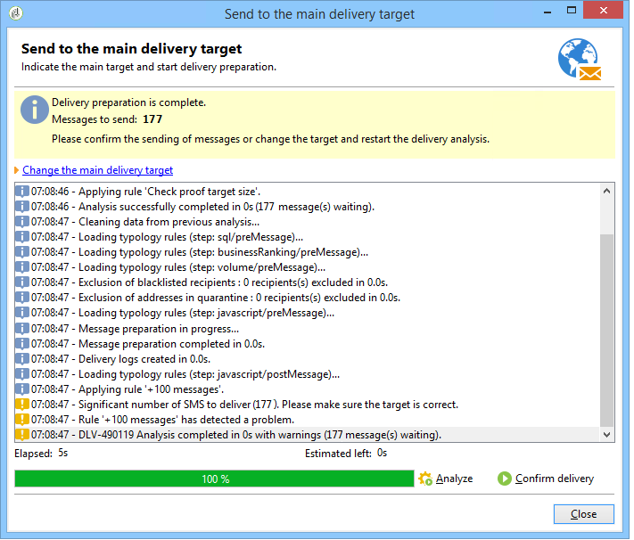

# Regole di controllo{#control-rules}

Le regole di controllo ti consentono di garantire la validità e la qualità dei messaggi prima della consegna: visualizzazione dei caratteri, dimensioni dell’SMS, formato dell’indirizzo, ecc.

Una serie di regole pronte all’uso consente di eseguire i controlli standard. Questi controlli (visualizzati in grassetto nell’interfaccia) sono:

* **[!UICONTROL Object approval]** (e-mail): verifica che l&#39;oggetto e l&#39;indirizzo del mittente non contengano caratteri speciali che potrebbero causare problemi a determinati agenti di posta.
* **[!UICONTROL URL label approval]** (e-mail): verifica che ogni URL di tracciamento presenti un&#39;etichetta.
* **[!UICONTROL URL approval]** (e-mail): verifica gli URL di tracciamento (presenza del carattere &quot;&amp;&quot;).
* **[!UICONTROL Message size approval]** (cellulare): verifica la dimensione dei messaggi SMS.
* **[!UICONTROL Validity period check]** (e-mail): verifica che il periodo di validità della consegna sia sufficientemente lungo da consentire l&#39;invio di tutti i messaggi.
* **[!UICONTROL Proof size check]** (tutti i canali): genera un messaggio di errore se la popolazione target della bozza supera i 100 destinatari.
* **[!UICONTROL Wave scheduling check]** (e-mail): verifica che l&#39;ultimo numero di consegne sia programmato per iniziare prima della fine del periodo di validità, se la consegna è suddivisa in più scaglioni.
* **[!UICONTROL Unsubscription link approval]** (e-mail): verifica la presenza di almeno un URL di annullamento dell&#39;abbonamento (rinuncia) in ogni contenuto (HTML e testo).

## Creare una regola di controllo {#create-a-control-rule}

È possibile creare nuove regole di controllo in base alle tue esigenze. A tale scopo, creare una regola di tipologia **[!UICONTROL Control]** e immettere la formula di controllo in SQL nella scheda **[!UICONTROL Code]**.

**Esempio:**

Nell’esempio seguente verrà creata una regola per impedire l’invio di un’offerta SMS a più di 100 destinatari. Questa regola sarà collegata a una tipologia di campagna, quindi alle consegne di SMS per le quali è disponibile l’offerta in questione.

Applica i seguenti passaggi:

1. Creare una regola di tipologia **[!UICONTROL Control]**. Selezionare un livello di avviso **[!UICONTROL Warning]**.

   

1. Nella scheda **[!UICONTROL Code]**, immettere lo script per applicare la soglia desiderata, come illustrato di seguito:

   

   Questo script attiverà un avviso se il target della consegna supera i 100 contatti:

   ```
   if( delivery.FCP == false && delivery.properties.toDeliver > 100 ) { logWarning("Significant number of SMS to deliver (" + delivery.properties.toDeliver + "). Please make sure the target is correct.") return false; } return true
   ```

1. Collega questa regola a una tipologia di campagna e fai riferimento alla tipologia nell’SMS interessato.

   

1. Durante l’analisi della consegna, la regola viene applicata e viene creato un avviso, se applicabile.

   

   Tuttavia, la consegna sarà ancora pronta per l’invio.

   Se aumenti il livello di avviso, ciò impedirà l’avvio della consegna.

   

   Al termine dell&#39;analisi, il pulsante **[!UICONTROL Confirm delivery]** non sarà disponibile.

   
