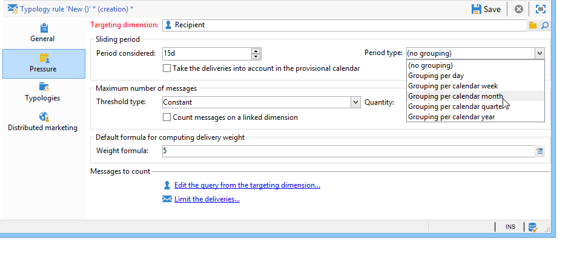
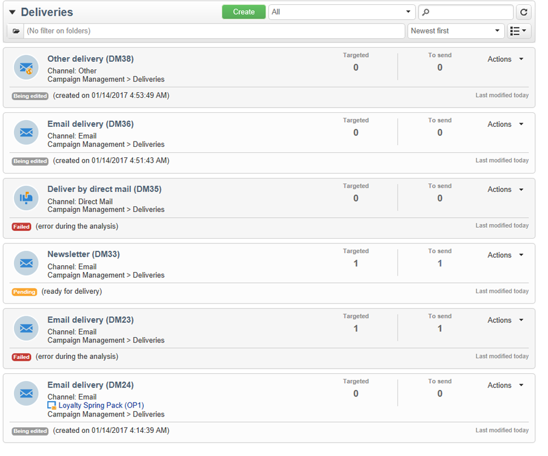
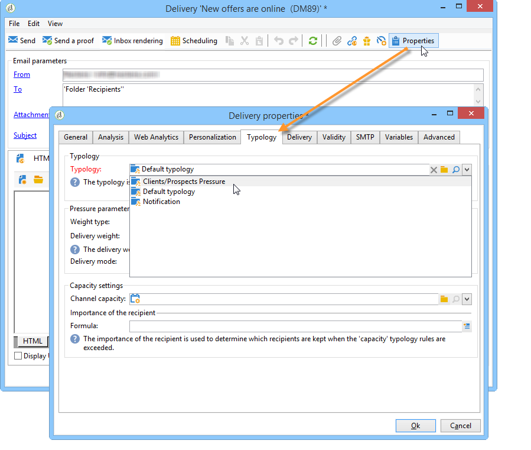
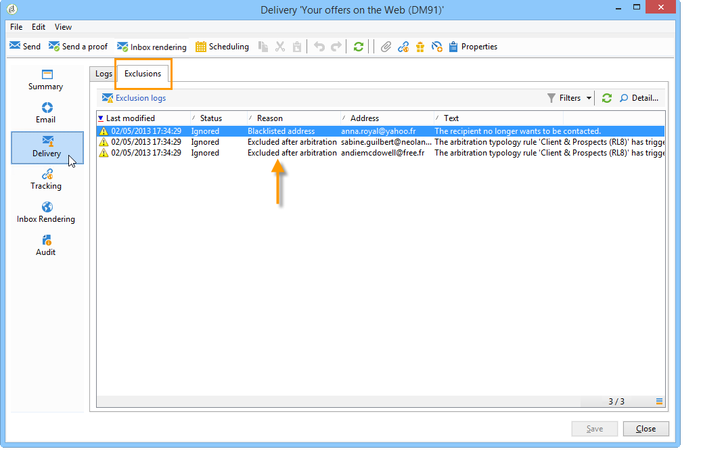

# Regole di pressione{#pressure-rules}

L’implementazione della gestione della pressione di vendita consente di evitare di sollecitare eccessivamente la popolazione nel database, nota anche come affaticamento del marketing. A questo scopo, puoi definire un numero massimo di messaggi per destinatario. Consente inoltre di implementare regole di arbitrato tra le campagne, per inviare il messaggio migliore al pubblico di destinazione.

**Pressione** regole, per gestire l’eccesso di marketing, ad esempio, per limitare a due il numero di lettere da inviare a una popolazione, per selezionare la comunicazione che corrisponde meglio agli interessi di un gruppo di abbonati, per evitare di inviare un SMS a un cliente insoddisfatto, ecc.

Le campagne vengono selezionate in base a soglie e peso del messaggio definiti.

* Una soglia è il numero più elevato di consegne autorizzate per un determinato destinatario in un determinato periodo. Può essere impostato o variabile. Viene impostata o calcolata nelle impostazioni delle regole di tipologia. [Ulteriori informazioni](#maximum-number-of-messages).
* Il “peso” delle consegne consente di individuare le consegne prioritarie nel quadro della gestione della pressione. I messaggi con il peso maggiore hanno priorità. [Ulteriori informazioni](#message-weight).

L’arbitrato consiste nell’assicurarsi che le campagne pianificate il cui peso è maggiore della campagna in corso non comportino un’eccessiva sollecitazione del profilo: in questo caso, il profilo viene escluso dalla consegna.

I criteri di arbitrato (peso del messaggio e/o soglia) possono variare in base a due tipi di informazioni:

* la preferenza del destinatario, che è un&#39;informazione dichiarativa: abbonamenti a newsletter, stato del destinatario (cliente o potenziale cliente),
* comportamento del destinatario: acquisti, collegamenti visitati, ecc.

La regola di arbitrato per la definizione dei messaggi idonei viene applicata durante la fase di analisi. Per ciascun destinatario e per il periodo interessato, il messaggio viene inviato se è vera la seguente formula: **(numero di messaggi inviati) + (numero di messaggi con peso maggiore) &lt; soglia**.

In caso contrario, il destinatario sarà **[!UICONTROL Excluded by arbitration]**. [Ulteriori informazioni](#exclusion-after-arbitration).

## Creare una regola di pressione {#create-a-pressure-rule}

Per impostare l’arbitrato tra le campagne utilizzando Adobe Campaign, inizia creando tipologie di campagne e definendo regole di tipologia collegate (**Pressione** regole).

Per creare e configurare una regola di tipologia **[!UICONTROL Pressure]**, attieniti alla seguente procedura:

1. Nell’elenco delle regole di tipologia della campagna, seleziona la **[!UICONTROL New]** sopra l’elenco.

   

1. In **[!UICONTROL General]** della nuova regola, seleziona una **Pressione** digitare la regola e immettere un nome e una descrizione.

   

1. Se necessario, modifica l’ordine di esecuzione. Quando più regole di tipologia vengono applicate come **[!UICONTROL Typology]** , vengono applicate per prime le regole ordinate inferiori. [Ulteriori informazioni](apply-rules.md#execution-order).
1. In **[!UICONTROL Calculation parameters]** , definisci una frequenza se desideri salvare il targeting oltre la successiva esecuzione di ri-arbitraggio giornaliera. [Ulteriori informazioni](apply-rules.md#adjust-calculation-frequency).
1. Fai clic su **[!UICONTROL Pressure]** e scegli il periodo del calendario durante il quale si applica la regola di tipologia.

   

   La regola verrà applicata alle consegne la cui data di contatto è inclusa nel periodo in questione.

   >[!NOTE]
   >
   >Le consegne pianificate non vengono prese in considerazione.

1. Definisci il metodo di calcolo del numero massimo di messaggi.

   La soglia rappresenta il numero massimo di messaggi che possono essere inviati a un destinatario durante il periodo in questione.

   Per impostazione predefinita, la soglia è costante e devi indicare un numero massimo di messaggi autorizzati dalla regola.

   

   Per definire una soglia di variabile, seleziona la **[!UICONTROL Depends on the recipient]** valore in **[!UICONTROL Type of threshold]** e utilizza l’icona a destra per aprire l’editor di espressioni.

   

   Per ulteriori informazioni, consulta [Numero massimo di messaggi](#maximum-number-of-messages).

1. Specifica il metodo di calcolo del peso della consegna.

   Ogni consegna ha un peso, ovvero un valore che rappresenta il suo livello di priorità: questo consente l’arbitraggio tra le campagne. I pesi vengono calcolati utilizzando la formula definita nella regola di tipologia e/o nelle relative proprietà. [Ulteriori informazioni](#message-weight).

1. Per impostazione predefinita, tutti i messaggi vengono presi in considerazione per il calcolo della soglia. Il **[!UICONTROL Restriction]** La scheda ti consente di filtrare i messaggi interessati dalla regola di tipologia:

   * La sezione superiore di questa scheda ti consente di limitare i destinatari interessati.
   * La sezione inferiore di questa scheda ti consente di filtrare i messaggi da conteggiare.

      Nell’esempio seguente, solo i destinatari salvati nel **Nuovi contatti** vengono prese in considerazione e le consegne che iniziano con **Newsletter** sono preoccupati.
   

1. Il **[!UICONTROL Typologies]** Questa scheda ti consente di visualizzare le tipologie di campagne che applicano questa regola o di collegare la regola a una o più tipologie esistenti. [Ulteriori informazioni](campaign-typologies.md#apply-typologies).

## Definizione di soglie e pesi {#define-thresholds-and-weights}

### Numero massimo di messaggi {#maximum-number-of-messages}

Ogni regola di pressione definisce una soglia, ovvero il numero massimo di messaggi che possono essere inviati a un destinatario in un determinato periodo di tempo. Una volta raggiunta tale soglia, non potranno più essere effettuate ulteriori consegne fino alla fine del periodo considerato. Questo processo ti consente di escludere automaticamente un destinatario da una consegna se un messaggio supera la soglia impostata, evitando in tal modo una sollecitazione eccessiva.

I valori di soglia possono essere costanti o calcolati tramite una formula con variabili. Ciò significa che, per un dato periodo, le soglie possono variare da un destinatario all’altro, o anche per lo stesso destinatario.

>[!CAUTION]
>
>Entrata **0** as a threshold impedisce tutte le consegne alla popolazione target durante il periodo considerato.

**Esempio:**

Puoi indicizzare il numero di messaggi autorizzati in base al segmento a cui appartiene il destinatario. Ciò significa che un destinatario appartenente al segmento web può ricevere più messaggi di altri destinatari. Un **[!UICONTROL Iif (@origin='Web', 5, 3)]** La formula del tipo autorizza la consegna di 5 messaggi ai destinatari e di 3 per altri segmenti. La configurazione sarà la seguente:

Per definire la soglia, puoi utilizzare una dimensione collegata alla dimensione di targeting: ad esempio, per includere i messaggi consegnati ai profili dei destinatari memorizzati nel [tabella dei visitatori](../../v8/audiences/target-mappings.md) o per evitare di inviare più di un messaggio alla settimana alla stessa famiglia (che può fare riferimento a più indirizzi e-mail) identificata in una dimensione collegata a quella dei destinatari.

A questo scopo, seleziona la **[!UICONTROL Count messages on a linked dimension]** , quindi seleziona il visitatore o la tabella dei contatti.

### Peso del messaggio {#message-weight}

Ogni consegna ha un peso che rappresenta il suo livello di priorità. Per impostazione predefinita, il peso di una consegna è impostato su 5. Le regole di pressione ti consentono di definire il peso delle consegne a cui verranno applicate.

I pesi possono essere impostati o calcolati tramite una formula adatta ai destinatari. Ad esempio, puoi definire il peso di una consegna in base agli interessi dei destinatari.

>[!CAUTION]
>
>Il peso definito in una regola di tipologia può essere sovraccaricato singolarmente per ogni consegna, nel **[!UICONTROL Properties]** scheda. Fai clic su **[!UICONTROL Typology]** per selezionare la tipologia della campagna e, se necessario, specificare il peso da applicare.\
>Tuttavia, il peso dichiarato in una regola di tipologia A non verrà utilizzato per calcolare una regola di tipologia B: questo peso riguarderà solo le consegne che utilizzano la regola A.

**Esempio:**

Nell’esempio seguente, vogliamo collegare il peso delle newsletter sulla musica al punteggio di tendenza dei destinatari. Per eseguire questa operazione:

1. Crea un nuovo campo per memorizzare i punteggi di tendenza dei destinatari. Il campo, **@Music** in questo caso, saranno arricchiti con risposte a sondaggi e sondaggi online, dati di tracciamento raccolti, ecc.
1. Crea una regola di tipologia per calcolare il peso del messaggio in base a questo campo.

   

1. Applica questa regola ai messaggi con il seguente argomento: newsletter, offerte speciali, ecc. Il peso di queste consegne, e quindi il loro livello di priorità, dipenderà dal punteggio di propensione di ogni destinatario.

## Imposta il periodo {#setting-the-period}

Le regole di pressione sono definite in **n** Periodi continui giornalieri.

Il periodo è configurato in **[!UICONTROL Pressure]** della regola. Puoi specificare il numero di giorni e, se necessario, selezionare il tipo di raggruppamento da applicare (giorno, settimana, mese, trimestre, ecc.).

Il tipo di raggruppamento consente di estendere **[!UICONTROL Period considered]** campo all&#39;intero giorno, settimana, mese o anno del calendario per le date del periodo.

Ad esempio, una regola di pressione che definisce una soglia di 2 messaggi alla settimana, con un raggruppamento per ogni mese di calendario, impedirà la consegna di più di 2 messaggi nella stessa settimana E nello stesso mese di calendario. Attenzione, se il periodo si sovrappone di due mesi, la soglia di calcolo terrà conto delle consegne di questi due mesi di calendario e potrebbe quindi impedire tutte le nuove consegne durante il secondo mese.

>[!CAUTION]
>
>Solo le consegne già inviate vengono prese in considerazione nel calcolo della soglia.

Per limitare le consegne prese in considerazione a un periodo di 2 settimane, immetti **15d** nel **[!UICONTROL Concerned period]** campo: nel calcolo verranno prese in considerazione le consegne inviate fino a due settimane prima della data di consegna a cui si applica la regola

La data di inizio del periodo dipende dalla configurazione del database.

Ad esempio, se applichi una regola di pressione di 15 giorni senza raggruppamento a una consegna dell’11/12, le consegne verranno prese in considerazione tra il 27/11 e il 12/12. Se la regola della pressione prende in considerazione le consegne nel calendario provvisorio, saranno prese in considerazione tutte le consegne programmate tra il 27/11 e il 27/12. Infine, se nella regola configuri un raggruppamento per mese di calendario, per calcolare la soglia verranno prese in considerazione tutte le consegne di novembre e dicembre (dall’11/1 al 12/31).

**Casi frequenti**

Per evitare che le consegne per la settimana di calendario corrente vengano prese in considerazione, nonché per non rischiare di tenere conto anche di quelle della settimana precedente per la soglia di calcolo, specifica la **[!UICONTROL Period considered]** su &#39;0&#39; e selezionare &#39;Raggruppamento per settimana di calendario&#39; come **[!UICONTROL Period type]**.

Quando un periodo è superiore a 0 (ad esempio, 1), la soglia di calcolo può tenere conto delle consegne del giorno precedente. Pertanto, se il giorno precedente corrisponde alla settimana di calendario precedente e il tipo di periodo selezionato è &quot;Raggruppamento per settimana di calendario&quot;, per la soglia di calcolo verrà presa in considerazione tutta la settimana precedente.

**Esempio:**

Vogliamo creare una regola di pressione che limiti la richiesta a 3 messaggi per periodo di 2 settimane, con un raggruppamento per il mese di calendario.

Prendiamo 6 newsletter con lo stesso peso, in programma per il 30/05/06, 3/06, 8/06, 12/06/06 e 22/06/30.

Le consegne programmate per il 12 e il 30 giugno non saranno inviate: la consegna 06/12 supererebbe la soglia di 3 messaggi per periodo di 2 settimane e la consegna 30 supererebbe la soglia di comunicazioni autorizzate per mese di calendario.

Tutti i destinatari di queste consegne sono esclusi per arbitrato durante la fase di analisi:

Per la stessa regola, se raggruppi le consegne per trimestre, i destinatari di **newsletter n. 5** sarà escluso anche e non verrà inviato.

Infine, se non è selezionato alcun raggruppamento, solo **newsletter n. 4** non verrà inviato, poiché era pianificato per lo stesso periodo di 2 settimane delle prime tre newsletter.

>[!NOTE]
>
>Quando modifichi la definizione di una regola di tipologia, puoi creare una **Simulazione** per controllarne l’impatto sulle consegne a cui viene applicato e per monitorare l’impatto reciproco delle consegne. [Ulteriori informazioni](campaign-simulations.md).

## Esclusione dopo arbitrato {#exclusion-after-arbitration}

L&#39;arbitrato viene riapplicato ogni notte tramite il **[!UICONTROL Forecasting]** del flusso di lavoro tecnico e **[!UICONTROL Campaign jobs]** flusso di lavoro.

Il **[!UICONTROL Forecasting]** il flusso di lavoro calcola anticipatamente i dati per il periodo in corso (dalla data di inizio alla data corrente), consentendo l’applicazione delle regole di tipologia durante l’analisi. Inoltre, ricalcola ogni notte i contatori di esclusione per l&#39;arbitrato.

Pertanto, per ciascun destinatario, Adobe Campaign controlla che il numero di messaggi da inviare non superi la soglia, tenendo conto del numero di messaggi già inviati per il periodo in questione. Queste informazioni sono **indicatore**, poiché tutti i calcoli vengono aggiornati al momento della consegna.

Se questo numero supera la soglia, vengono applicate le regole di arbitrato definite nella tipologia della campagna e i destinatari vengono esclusi dalle campagne con un peso inferiore.

>[!NOTE]
>
>Se più consegne hanno lo stesso punteggio, verrà inviata la campagna pianificata per la data più vicina.

## Casi d’uso sulle regole di pressione {#use-cases-on-pressure-rules}

### Adattare la soglia in base al criterio {#adapt-the-threshold-based-on-criterion}

Vogliamo creare una regola di tipologia per impedire la consegna di più di 4 messaggi alla settimana ai clienti e di 2 messaggi alla settimana ai potenziali clienti.

Per identificare clienti e potenziali clienti, utilizza **[!UICONTROL Status]** , che contiene 0 per i potenziali clienti e 1 per i clienti.

Per creare la regola, esegui i seguenti passaggi:

1. Crea un nuovo **Pressione** digita la regola di tipologia.
1. Modifica il **[!UICONTROL Pressure]** scheda: in **[!UICONTROL Maximum number of messages]** , vogliamo creare una formula per calcolare la soglia in base a ciascun destinatario. Seleziona la **[!UICONTROL Depends on the recipient]** valore in **[!UICONTROL Threshold type]** , quindi fai clic su **[!UICONTROL Edit expression]** a destra del **[!UICONTROL Formula]** campo.

   Fai clic su **[!UICONTROL Advanced parameters]** per definire la formula di calcolo

   

1. Seleziona la **[!UICONTROL Edit the formula using an expression]** e fai clic su **[!UICONTROL Next]**.

   

1. Nell&#39;elenco delle funzioni fare doppio clic sul pulsante **Iif** funzione in **[!UICONTROL Others]** nodo.

   Quindi seleziona la scheda dei destinatari **Stato** nel **[!UICONTROL Available fields]** sezione.

   

   Immettere la formula seguente: **Iif(@status=0,2,4)**

   

   Questa formula ti consente di assegnare il valore 2 se lo stato è uguale a 0 e il valore 4 per tutti gli altri stati.

   Fai clic su **[!UICONTROL Finish]** per approvare la formula.

1. Indica il periodo durante il quale la regola verrà applicata: 7 giorni in questo caso, per contare il numero di messaggi alla settimana.

   

1. Salva la regola per approvare la creazione.

Collega ora la regola appena creata a una tipologia per applicarla alle consegne. Per eseguire questa operazione:

1. Creare una tipologia di campagna.
1. Vai a **[!UICONTROL Rules]** , fare clic sulla scheda **[!UICONTROL Add]** e seleziona la regola appena creata.

   

1. Salva la tipologia: viene aggiunta all’elenco delle tipologie esistenti.

Per utilizzare questa tipologia nelle consegne, selezionala nelle proprietà di consegna, nella **[!UICONTROL Typology]** come mostrato di seguito:

>[!NOTE]
>
>La tipologia può essere definita nel modello di consegna, da applicare automaticamente a tutte le consegne create utilizzando questo modello.

Durante l’analisi della consegna, i destinatari della consegna sono esclusi dalla consegna se applicabile, in base al numero di consegne già inviate. Per visualizzare queste informazioni, puoi effettuare le seguenti operazioni:

* Visualizzare il risultato dell&#39;analisi:

   

* Modifica la consegna e fai clic su **[!UICONTROL Delivery]** e il **[!UICONTROL Exclusions]** scheda secondaria:

   

* Fai clic su **[!UICONTROL Audit]** , quindi la scheda **[!UICONTROL Causes of exclusions]** scheda secondaria per visualizzare il numero di esclusioni e le regole di tipologia applicate:

   

### Calcolare il peso della consegna in base al comportamento {#calculate-the-delivery-weight-based-on-behavior}

Puoi definire regole di pressione in base al comportamento del destinatario: pertanto, il peso di una consegna può adattarsi a criteri che variano da un destinatario all’altro. Ad esempio, puoi decidere di inviare un messaggio a seconda che un destinatario abbia visitato o meno il tuo sito Internet, abbia fatto clic in una sezione specifica dell’ultima newsletter, sia abbonato a un servizio di informazioni o anche in base alle risposte a un sondaggio, a un gioco online e così via.

Nell’esempio seguente, vogliamo creare una consegna con un peso di 5. Questo peso è arricchito dai punteggi di tendenza basati sul comportamento del destinatario: i clienti che hanno già ordinato da questo sito avranno un punteggio di 5, mentre i clienti che non hanno mai ordinato online avranno un punteggio di 4.

Per eseguire questo tipo di configurazione, è necessario utilizzare una formula per definire il peso del messaggio. Le informazioni sui punteggi di tendenza e sulle risposte ai sondaggi devono essere accessibili nel modello di dati. Nel nostro esempio, il **Propensione** è stato aggiunto.

Applica i seguenti passaggi di configurazione:

1. Crea un nuovo **Pressione** digita la regola di tipologia.
1. Modifica il **[!UICONTROL Pressure]** scheda. Vogliamo creare una formula di soglia che sarà basata su ogni singolo destinatario: fai clic sul **[!UICONTROL Edit expression]** a destra del **[!UICONTROL Weight formula]** campo.

   

1. Per impostazione predefinita, il valore **5** viene visualizzato nella sezione superiore dell’editor di espressioni. Desideriamo aggiungere il punteggio di tendenza di ciascun destinatario a questo peso: posiziona il cursore a destra del 5, immetti il **+** e seleziona il **Propensione** campo.

   

1. Quindi aggiungi un valore più alto per i destinatari che hanno già effettuato un acquisto. Per loro, il peso della consegna deve essere aumentato di 5, mentre per altri aumenta solo di 4.

   

1. Clic **[!UICONTROL Finish]** per salvare questa regola.
1. Collega la regola a una tipologia di campagna e fai riferimento a tale tipologia in una consegna per approvarla.

### Invia solo i messaggi con la ponderazione più alta {#send-only-the-highest-weighted-messages}

Desideri inviare non più di 2 messaggi nella stessa settimana, con un limite di 2 messaggi al giorno, a ciascuno dei destinatari e desideri solo recapitare i messaggi con un peso maggiore.

A questo scopo, devi pianificare diverse consegne con pesi diversi per lo stesso destinatario e applicare una regola di pressione per escludere le consegne con pesi inferiori.

Innanzitutto, configura la regola di pressione.

1. Creare una regola di pressione. [Ulteriori informazioni](#create-a-pressure-rule).
1. In **[!UICONTROL General]** , seleziona la scheda **[!UICONTROL Re-apply the rule at the start of personalization]** opzione.

   

   Questa opzione sovrascrive il valore definito nella **[!UICONTROL Frequency]** e applica automaticamente la regola durante la fase di personalizzazione. [Ulteriori informazioni](apply-rules.md#adjust-calculation-frequency).

1. In **[!UICONTROL Pressure]** , seleziona **[!UICONTROL 7d]** come **[!UICONTROL Period considered]** e **[!UICONTROL Grouping per day]** come **[!UICONTROL Period type]**.
1. In **[!UICONTROL Typologies]** , collega la regola a una tipologia di campagna.
1. Salva le modifiche.

Ora crea e configura un flusso di lavoro per ogni consegna a cui desideri applicare la regola di pressione.

1. Creare una campagna. [Ulteriori informazioni](../campaigns/marketing-campaign-create.md#create-a-campaign).
1. In **[!UICONTROL Targeting and workflows]** della campagna, aggiungi un **Query** al flusso di lavoro. Per ulteriori informazioni sull&#39;utilizzo di questa attività, consulta [questa sezione](../workflow/query.md).
1. Aggiungi un **[!UICONTROL Email delivery]** al flusso di lavoro e aprirlo. Per ulteriori informazioni sull&#39;utilizzo di questa attività, consulta [questa sezione](../workflow/delivery.md).
1. Vai a **[!UICONTROL Approvals]** scheda di **[!UICONTROL Delivery properties]** e disabilita tutte le approvazioni.

   

1. In **[!UICONTROL Typology]** scheda di **[!UICONTROL Delivery properties]**, fai riferimento alla tipologia di campagna su cui applicare la regola. Definisci un peso per la consegna.

   

1. Nella consegna, fai clic su **[!UICONTROL Scheduling]** e seleziona **[!UICONTROL Schedule delivery (automatic execution when the scheduled date is reached)]**. In questo esempio, seleziona la **[!UICONTROL Use a calculation formula]** opzione.
1. Imposta la data di estrazione su 10 minuti (data corrente + 10 minuti).
1. Impostare la data di contatto sul giorno successivo (data corrente + 1 giorno).

   

   Per implementare correttamente le esclusioni della regola di pressione, assicurati di impostare la data e l’ora di estrazione prima della data e dell’ora di contatto, nonché prima di riapplicare l’arbitrato notturno. [Ulteriori informazioni](#exclusion-after-arbitration).

1. Deseleziona il **[!UICONTROL Confirm the delivery before sending]** e salvare le modifiche.
1. Procedi in modo simile per ogni consegna che desideri inviare. Assicurati di impostare il peso desiderato per ogni consegna.
1. Esegui i flussi di lavoro pertinenti per preparare e inviare le consegne.

Quando l&#39;arbitrato notturno è applicato, le consegne con i pesi inferiori per lo stesso destinatario saranno escluse. Per l’invio verranno considerate solo le consegne con il peso più alto. [Ulteriori informazioni](#message-weight).

Considerando che un’e-mail è già stata inviata ai destinatari interessati in precedenza durante la settimana, la tabella seguente mostra un esempio delle configurazioni che possono essere applicate per altre due consegne.

<table> 
 <thead> 
  <tr> 
   <th> Consegna  </th> 
   <th> Approvazioni  </th> 
   <th> Peso  </th> 
   <th> Data/ora di estrazione  </th> 
   <th> Data di contatto  </th> 
   <th> Data/ora di inizio della consegna  </th> 
   <th> Data/ora di esecuzione del flusso di lavoro di arbitrato  </th> 
   <th> Stato della consegna  </th> 
   <th> Consegna inviata (data/ora)  </th> 
  </tr> 
 </thead> 
 <tbody> 
  <tr> 
   <td> Consegna 1  </td> 
   <td> Disabilitato  </td> 
   <td> 5  </td> 
   <td> 3pm  </td> 
   <td> 8:00 (giorno successivo)  </td> 
   <td> 2pm  </td> 
   <td> Notte  </td> 
   <td> Esclusi  </td> 
   <td> Esclusi  </td> 
  </tr> 
  <tr> 
   <td> Consegna 2  </td> 
   <td> Disabilitato  </td> 
   <td> 10  </td> 
   <td> 4pm  </td> 
   <td> 9 (giorno successivo)  </td> 
   <td> 2pm  </td> 
   <td> Notte  </td> 
   <td> Inviato  </td> 
   <td> 9 (giorno successivo)  </td> 
  </tr> 
 </tbody> 
</table>

Dopo che la data di estrazione è passata per le due consegne, l&#39;arbitrato notturno viene riapplicato prima delle date di contatto di entrambe le consegne. Questo consente di trovare tutte le consegne già inviate (destinatari per i quali viene elaborata una consegna, registrate nei registri ampi) o pianificate per l’invio (destinatari idonei a ricevere una consegna, registrati nei registri di previsione).

Una volta elencate tutte le consegne inviate e potenziali per il periodo definito nella regola di pressione, Adobe Campaign le ordina in base al peso, con la prima ponderata più alta. Quando viene raggiunta la soglia impostata nella regola di pressione (in questo caso non più di 2 e-mail nella stessa settimana), i destinatari vengono esclusi dalla consegna.
