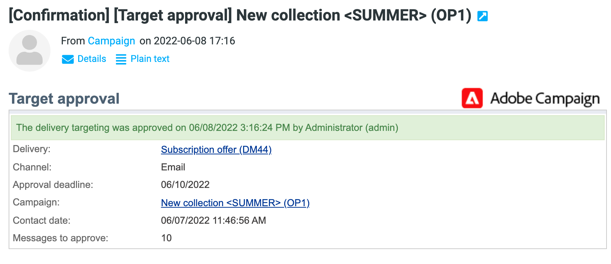

# Impostare e gestire il processo di approvazione {#approval-marketing-campaigns}

I metodi e le persone coinvolte nella creazione e nell’approvazione di campagne di marketing sono specifici per ogni organizzazione. Il processo di approvazione della campagna prevede il coordinamento di più parti interessate: esperti di marketing digitale, responsabili della consegna, responsabili del contenuto e proprietari esterni come partner o fornitori.

Con Adobe Campaign, puoi impostare un flusso di approvazione per le campagne e avvisare gli operatori quando è necessaria un’azione. Puoi definire le approvazioni per ogni passaggio di una consegna: targeting, contenuto, budget, estrazione e invio di bozze. Man mano che le consegne delle campagne procedono attraverso i vari passaggi di convalida, Adobe Campaigns compila una cronologia di modifiche e approvazioni, inclusi feedback, commenti, richieste di modifica e commenti.

I messaggi di notifica vengono inviati agli operatori di Adobe Campaign designati come revisori per informarli di una richiesta di approvazione.

Gli operatori possono approvare in diversi modi:

* Dal messaggio di notifica. Il collegamento nell’e-mail porta l’operatore a Campaign tramite un browser web. Dopo la connessione, il revisore può scegliere se approvare o meno il contenuto.
  

* Dal dashboard della campagna.
  

* Dal dashboard di consegna.
  

Gli operatori possono accedere alla campagna e alla consegna dalla finestra di approvazione. Possono anche inserire un commento.

Una volta convalidata da un operatore, le informazioni vengono visualizzate nelle dashboard di campagna e consegna e nei registri.

Le informazioni sono disponibili anche nei registri di approvazione della consegna e nel giornale di approvazione della campagna. Per accedere a questi registri, utilizzare le schede **[!UICONTROL Edit > Audit > Approvals]**.

## Abilita approvazioni{#enable-approvals}

Le notifiche di approvazione vengono inviate agli operatori interessati a ciascun processo per il quale è stata abilitata l’approvazione.

Possono essere abilitati per il modello della campagna, per ogni singola campagna o per una consegna.

Tutti i processi che richiedono l&#39;approvazione sono selezionati nel modello della campagna tramite la scheda **[!UICONTROL Properties]** > **[!UICONTROL Advanced campaign parameters...]** > **[!UICONTROL Approvals]**. I revisori o i gruppi di revisori sono selezionati da questa scheda. Ricevono notifiche, a meno che questa opzione non sia abilitata. [Ulteriori informazioni](#approving-processes).

Queste impostazioni possono essere ignorate per ogni campagna creata utilizzando questo modello e singolarmente per ogni consegna. Sfoglia il pulsante **[!UICONTROL Properties]** della consegna, quindi la scheda **[!UICONTROL Approvals]**.

Nell’esempio seguente, il contenuto della consegna non richiederà approvazioni:

>[!CAUTION]
>
>Verificare che i revisori dispongano delle **autorizzazioni appropriate** per l&#39;approvazione e che l&#39;area di sicurezza sia definita correttamente. [Ulteriori informazioni](#selecting-reviewers).

Il processo di approvazione per le consegne è descritto in [questa sezione](#review-and-approve-deliveries).

## Seleziona revisori {#select-reviewers}

Per ogni tipo di approvazione, gli operatori o i gruppi di operatori responsabili dell’approvazione vengono selezionati dall’elenco a discesa nella consegna. È possibile aggiungere altri operatori utilizzando il collegamento **[!UICONTROL Edit...]**. Questa finestra consente inoltre di modificare la scadenza dell’approvazione. Per impostazione predefinita, i revisori dispongono di tre giorni a partire dalla data di invio per approvare un processo. Per aggiungere un promemoria automatico, utilizzare il collegamento **[!UICONTROL Add a reminder]**.

Se non viene specificato alcun revisore, il proprietario della campagna è responsabile delle approvazioni e riceve le notifiche. Il proprietario della campagna è specificato nella scheda **[!UICONTROL Edit > Properties]** della campagna:

Anche tutti gli altri operatori Adobe Campaign con diritti **[!UICONTROL Administrator]** possono approvare i processi, ma non ricevono notifiche.

>[!NOTE]
>
>Per impostazione predefinita, il proprietario della campagna non può eseguire l’approvazione o avviare le consegne se sono stati definiti degli operatori di approvazione. In qualità di amministratore di Adobe Campaign, puoi modificare questo comportamento e consentire ai proprietari della campagna di approvare/avviare le consegne creando l&#39;opzione **NmsCampaign_Activate_OwnerConfirmation**, impostata su **1**.

Se è definito un elenco di revisori, un processo viene approvato quando un revisore lo ha approvato. Il collegamento di approvazione non è più disponibile nelle dashboard di campagna e consegna. Quando l’invio delle notifiche è abilitato, se un altro revisore fa clic sul collegamento di approvazione nel messaggio di notifica, riceve una notifica che indica che un altro operatore ha già approvato il processo.

## Rivedere e approvare le consegne {#review-and-approve-deliveries}

Per ogni campagna puoi approvare il target della consegna, [il contenuto della consegna](#approving-content) e i costi. Gli operatori Adobe Campaign incaricati dell’approvazione possono ricevere una notifica tramite e-mail e accettare o rifiutare l’approvazione dalla console client o tramite una connessione web. [Ulteriori informazioni](#approving-processes).

Per le consegne di direct mailing, gli operatori Adobe Campaign possono visualizzare il file di estrazione prima di inviarlo al router, e se necessario possono modificare il formato e riavviare l’estrazione. [Ulteriori informazioni](#approve-an-extraction-file).

Al termine di queste fasi di convalida, la consegna può essere avviata. [Ulteriori informazioni](marketing-campaign-deliveries.md#starting-a-delivery).

>[!NOTE]
>
>I processi che richiedono un’approvazione vengono selezionati nel modello della campagna. [Ulteriori informazioni](marketing-campaign-templates.md).
>

### Passaggi per approvare una consegna {#approving-processes}

Le fasi che richiedono l’approvazione vengono visualizzate nel dashboard della campagna (tramite la console client o l’interfaccia web). Vengono inoltre visualizzati nella tabella di tracciamento della consegna e nel dashboard della consegna.

Per ogni consegna nella campagna, puoi approvare i seguenti processi:

* **Impostazione destinazione, contenuto e budget**

  Quando le opzioni **[!UICONTROL Enable target approval]**, **[!UICONTROL Enable content approval]** o **[!UICONTROL Enable budget approval]** sono selezionate nella finestra delle impostazioni di approvazione, i collegamenti correlati vengono visualizzati nelle dashboard della campagna e della consegna.

  

  >[!NOTE]
  >
  >L&#39;approvazione del budget è disponibile solo se l&#39;approvazione target è abilitata nella finestra delle impostazioni di approvazione. Il collegamento per l&#39;approvazione del budget viene visualizzato solo dopo l&#39;analisi della destinazione.

  Se le opzioni **[!UICONTROL Assign content editing]** o **[!UICONTROL External content approval]** sono selezionate nella finestra delle impostazioni di approvazione, nel dashboard verranno visualizzati i collegamenti **[!UICONTROL Available content]** e **[!UICONTROL External content approval]**.

  L’approvazione del contenuto ti consente di accedere alle bozze inviate.

* **Approvazione estrazione (consegna direct mailing)**

  Quando si seleziona **[!UICONTROL Enable extraction approval]** nella finestra delle impostazioni di approvazione, il file estratto deve essere approvato prima che il router possa ricevere una notifica.

  L&#39;opzione **[!UICONTROL Approve file]** è disponibile nei dashboard di campagna e consegna.

  

  È possibile visualizzare in anteprima il file di output prima della convalida. L’anteprima del file di estrazione mostra solo un esempio di dati. L&#39;intero file non è stato caricato.

* **Approvazione delle consegne associate**

  L&#39;opzione **[!UICONTROL Enable individual approval of each associated delivery]** viene utilizzata per una consegna principale associata alle consegne secondarie. Per impostazione predefinita, questa opzione non è selezionata, pertanto è possibile eseguire un’approvazione complessiva della consegna principale. Se questa opzione è selezionata, ogni consegna deve essere approvata singolarmente.

  

>[!NOTE]
>
>In un flusso di lavoro di targeting, se durante la preparazione dei messaggi si verifica un errore collegato a un problema di configurazione, il collegamento **[!UICONTROL Restart message preparation]** viene visualizzato nel dashboard. Correggi l’errore e utilizza questo collegamento per riavviare la preparazione dei messaggi ignorando la fase di targeting.

### Approvare un contenuto {#approve-content}

>[!CAUTION]
>
>Per approvare un contenuto, è obbligatorio un ciclo di bozza. Le bozze ti consentono di approvare la visualizzazione di informazioni, dati di personalizzazione e verificare che i collegamenti funzionino.
>
>Le funzionalità di approvazione del contenuto descritte di seguito si riferiscono alla consegna della bozza.

È possibile configurare un ciclo di approvazione dei contenuti. A tale scopo, selezionare l&#39;opzione **[!UICONTROL Enable content approval]** nella finestra delle impostazioni di approvazione. I passaggi principali del ciclo di approvazione dei contenuti sono i seguenti:

1. Dopo aver creato una nuova consegna, il manager della campagna fa clic sul collegamento **[!UICONTROL Submit content]** nel dashboard della campagna per avviare il ciclo di approvazione dei contenuti.

   >[!NOTE]
   >
   >Se nella finestra delle impostazioni di approvazione sono state selezionate le opzioni **[!UICONTROL Enable the sending of proofs]** (per le consegne e-mail) o **[!UICONTROL Enable the sending and approval of proofs]** (per le consegne di direct mailing), le bozze verranno inviate automaticamente.

1. Viene inviata un’e-mail di notifica alla persona responsabile del contenuto, che può scegliere se approvarla o meno:

   * tramite l&#39;e-mail di notifica: l&#39;e-mail di notifica contiene un collegamento alle bozze già inviate ed eventualmente a un rendering del messaggio per i vari webmail se il componente aggiuntivo **Deliverability** è abilitato per questa istanza.

   * tramite la console client o l’interfaccia web, il tracciamento della consegna, il dashboard di consegna o il dashboard della campagna. Questo dashboard della campagna consente di visualizzare l&#39;elenco delle bozze inviate facendo clic sul collegamento **[!UICONTROL Inbox rendering...]**. Per visualizzarne il contenuto, fare clic sull&#39;icona **[!UICONTROL Detail]** a destra dell&#39;elenco.

1. Alla persona responsabile della campagna viene inviata un’e-mail di notifica per informarla se il contenuto è stato approvato o meno. Il responsabile della campagna può riavviare il ciclo di approvazione dei contenuti in qualsiasi momento. A questo scopo, fai clic sul collegamento nella riga **[!UICONTROL Content status]** del dashboard della campagna (a livello di consegna), quindi fai clic su **[!UICONTROL Reset content approval to submit it again]**.

#### Assegna modifica dei contenuti {#assign-content-editing}

Questa opzione consente di definire un utente responsabile della modifica del contenuto, ad esempio un webmaster. Se l&#39;opzione **[!UICONTROL Assign content editing]** è selezionata nella finestra delle impostazioni di approvazione, vengono aggiunti diversi passaggi di approvazione tra la creazione della consegna e la consegna dell&#39;e-mail di notifica alla persona responsabile del contenuto:

1. Dopo aver creato una nuova consegna, il responsabile della campagna fa clic sul collegamento **[!UICONTROL Submit content editing]** nel dashboard della campagna per avviare il ciclo di modifica dei contenuti.

1. La persona responsabile della modifica dei contenuti riceverà un’e-mail per informarla che i contenuti sono disponibili.

1. Possono quindi accedere alla console client, aprire la consegna e modificarla utilizzando una procedura guidata semplificata per modificare l’oggetto, il HTML e il contenuto di testo e inviare le bozze.

   >[!NOTE]
   >
   >Se nella finestra delle impostazioni di approvazione sono state selezionate le opzioni **[!UICONTROL Enable the sending of proofs]** (per le consegne e-mail) o **[!UICONTROL Enable the sending and approval of proofs]** (per le consegne di direct mailing), le bozze verranno inviate automaticamente.

1. Una volta che la persona responsabile della modifica del contenuto ha terminato di apportare modifiche al contenuto della consegna, può rendere disponibile il contenuto.

   A questo scopo, possono utilizzare:

   * il collegamento **[!UICONTROL Available content]** nella console client di Adobe Campaign.
   * il collegamento nel messaggio di notifica.
L’operatore può aggiungere un commento prima di inviare il contenuto alla persona responsabile della campagna.
Il messaggio di notifica consente al revisore di approvare o rifiutare il contenuto.

#### Approvazione contenuti esterna {#external-content-approval}

Questa opzione consente di definire un operatore esterno incaricato di approvare il rendering della consegna, ad esempio coerenza della comunicazione del brand, tassi e così via. Quando l&#39;opzione **[!UICONTROL External content approval]** è selezionata nella finestra delle impostazioni di approvazione, vengono aggiunti diversi passaggi di approvazione tra l&#39;approvazione del contenuto e la consegna della notifica alla persona responsabile della campagna:

1. Il gestore di contenuti esterno riceve un’e-mail di notifica che informa che il contenuto è stato approvato e richiede l’approvazione esterna.
1. L’e-mail di notifica contiene collegamenti alle bozze inviate, che consentono di visualizzare il rendering della consegna, e un pulsante per approvare o rifiutare il contenuto della consegna.

Questi collegamenti sono disponibili solo se sono state inviate una o più bozze. In caso contrario, il rendering della consegna è disponibile solo tramite la console client o l’interfaccia web.

### Approvare un file di estrazione {#approve-an-extraction-file}

Per le consegne offline, Adobe Campaign genera un file di estrazione che, a seconda di come è configurato, viene inviato al router. Il contenuto dipende dal modello di esportazione utilizzato.

Dopo l&#39;approvazione del contenuto, del targeting e del budget, la consegna diventa **[!UICONTROL Extraction pending]** fino all&#39;avvio del flusso di lavoro di estrazione per le campagne.

Alla data della richiesta di estrazione, il file di estrazione viene creato e lo stato di consegna cambia in **[!UICONTROL File to approve]**.

Puoi visualizzare il contenuto del file estratto (facendo clic sul nome), approvarlo o, se necessario, modificare il formato e riavviare l’estrazione utilizzando i collegamenti nel dashboard.

Una volta approvato il file, è possibile inviare l&#39;e-mail di notifica al router. [Ulteriori informazioni](marketing-campaign-deliveries.md#start-an-offline-delivery).

## Modalità di approvazione {#approval-modes}

I processi possono essere approvati nel dashboard della campagna, nella scheda di tracciamento della consegna, nel dashboard di consegna o nella notifica e-mail inviata ai revisori.

### Approva nel dashboard {#approval-via-the-dashboard}

Per approvare un processo tramite la console client o l’interfaccia web, fai clic sul collegamento appropriato nel dashboard della campagna.

Ad esempio, una volta eseguita l’analisi della consegna:

1. Seleziona **[!UICONTROL Approve targeting]**.

1. Nella finestra pop-up, controlla le informazioni da approvare.
1. Selezionare **[!UICONTROL Accept]** o **[!UICONTROL Reject]** e immettere un commento, se necessario. Questo commento verrà visualizzato nei registri di convalida.
1. Conferma la scelta con il pulsante **[!UICONTROL Target approval]**.

Se un processo è già stato approvato da un altro operatore, il collegamento di approvazione non è disponibile.

Se un processo è stato rifiutato, le informazioni vengono visualizzate nel dashboard di consegna come segue:

### Approva dai messaggi di notifica {#approval-via-notification-messages}

Per approvare un processo dal [messaggio di notifica](#notifications):

1. Fai clic sul collegamento nella notifica.
1. Accedi ad Adobe Campaign.
1. Controllare le informazioni da approvare
1. Selezionare **[!UICONTROL Accept]** o **[!UICONTROL Reject]** e immettere un commento, se necessario.
1. Convalida. La scelta e il commento vengono visualizzati nei registri di convalida.

>[!NOTE]
>
>Se durante il processo sono stati generati avvisi, nella notifica viene visualizzato un avviso.

### Tracciare l’approvazione{#approval-tracking}

I registri di approvazione sono disponibili nell’interfaccia utente:

* Nel registro di approvazione della campagna, scheda secondaria **[!UICONTROL Approvals]** della scheda **[!UICONTROL Edit > Audit]**:

  

* Nel registro di consegna della campagna, scheda secondaria **[!UICONTROL Deliveries]** della scheda **[!UICONTROL Edit > Audit]**:

  

* È possibile visualizzare lo stato di approvazione per ogni consegna facendo clic sull&#39;opzione **[!UICONTROL Hide/display logs]** della scheda **[!UICONTROL Summary]**.

  

* È inoltre possibile accedere a queste informazioni tramite la scheda **[!UICONTROL Audit > Approvals]** di ciascuna consegna:

  

>[!NOTE]
>
>Una volta che un operatore ha approvato o rifiutato un processo, gli altri revisori non possono più modificarlo.

### Approvazioni automatiche/manuali {#automatic-and-manual-approval}

Durante la creazione di un flusso di lavoro di targeting, se l’approvazione è automatica (modalità predefinita), Adobe Campaign visualizza il collegamento di approvazione o invia una notifica non appena è necessaria un’approvazione.

Per scegliere la modalità di approvazione (manuale o automatica), fare clic sulla scheda **[!UICONTROL Edit > Properties]** della campagna o del modello della campagna, quindi su **[!UICONTROL Advanced campaign parameters...]** e infine sulla scheda **[!UICONTROL Approvals]**.
par

>[!NOTE]
>
>La modalità di approvazione si applica a tutte le consegne della campagna.

Quando viene generato un flusso di lavoro di targeting, l’approvazione manuale ti consente di evitare la creazione di collegamenti di approvazione o l’invio automatico di notifiche. Il dashboard della campagna offre quindi un collegamento **[!UICONTROL Submit targeting for approval]** per avviare manualmente il processo di approvazione.

Un messaggio di conferma ti consente di autorizzare le approvazioni per i processi selezionati per questa consegna.

I pulsanti di approvazione vengono quindi visualizzati nel dashboard della campagna (per questa consegna), nel dashboard della consegna e nel tracciamento della consegna. Se le notifiche sono abilitate, verranno inviate in parallelo.

Questo metodo di abilitazione delle approvazioni consente di lavorare sul targeting senza inviare notifiche false ai revisori.

## Notifiche {#notifications}

Le notifiche sono messaggi e-mail specifici inviati ai revisori per informarli che un processo è in attesa di approvazione. Quando l’operatore fa clic sul collegamento nel messaggio, viene visualizzata una pagina di autenticazione e, dopo aver effettuato l’accesso, può visualizzare le informazioni e approvare o rifiutare il processo. È inoltre possibile immettere un commento nella finestra di approvazione.

Il contenuto delle e-mail di notifica può essere personalizzato. Vedi [Contenuto notifica](#notification-content).

### Attiva/Disattiva notifica {#enabling-disabling-notification}

Per impostazione predefinita, i messaggi di notifica vengono inviati se l’approvazione del processo correlato è abilitata nel modello della campagna, nella campagna o nella consegna. Le notifiche possono, tuttavia, essere disabilitate per autorizzare le approvazioni solo dalla console client.

A questo scopo, modifica la finestra di approvazione della campagna o del modello della campagna ( **[!UICONTROL Edit > Properties]** > **[!UICONTROL Advanced campaign parameters...]** > scheda **[!UICONTROL Approvals]**) e seleziona **[!UICONTROL Do not enable notification sending]**.

### Contenuto della notifica {#notification-content}

Il contenuto della notifica è definito in un modello specifico: **[!UICONTROL Notification of validations for the marketing campaign]**. Questo modello viene salvato nella cartella **[!UICONTROL Administration > Campaign management > Technical delivery templates]** della struttura Adobe Campaign.
