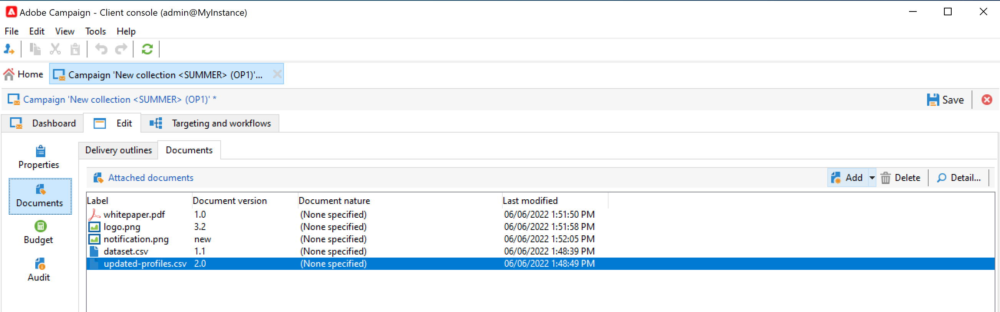
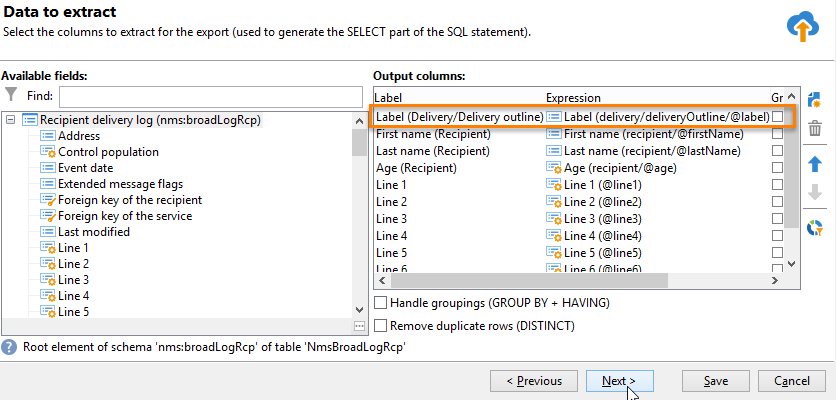

# Gestire risorse e documenti {#manage-assets-documents}

È possibile associare vari documenti a una campagna: rapporti, foto, pagine web, diagrammi, ecc. Questi documenti possono essere in qualsiasi formato.

In una campagna puoi anche fare riferimento ad altri articoli, come coupon promozionali, offerte speciali relative a una marca o a un negozio specifico, ecc. Quando questi elementi sono inclusi in una struttura, possono essere associati a una consegna direct mailing. [Ulteriori informazioni](#associating-and-structuring-resources-linked-via-a-delivery-outline).

>[!CAUTION]
>
>Questa funzionalità è progettata per risorse e documenti di piccole dimensioni.

<!--
>[!NOTE]
>
>If you are using Campaign Marketing Resource Management module, you can also manage a library of marketing resources that are available for several users for collaborative work. [Learn more](../../mrm/using/managing-marketing-resources.md).
-->

## Aggiungi documenti {#add-documents}

I documenti possono essere associati a livello di campagna (documenti contestuali) o di programma (documenti generali).

Per una campagna, il **[!UICONTROL Documents]** La scheda contiene:

* L’elenco di tutti i documenti necessari per il contenuto (modello, immagini, ecc.) che possono essere scaricati localmente dagli operatori Adobe Campaign con i diritti appropriati,
* Documenti contenenti informazioni per il router, se presenti.

I documenti sono collegati al programma o alla campagna tramite **[!UICONTROL Edit > Documents]** scheda.

Puoi anche aggiungere un documento a una campagna dal collegamento dedicato nella dashboard.

Fai clic su **[!UICONTROL Detail...]** per visualizzare il contenuto di un file e aggiungere informazioni:

Nel dashboard, i documenti associati alla campagna sono raggruppati nel **[!UICONTROL Document(s)]** come nell’esempio seguente:

Da questa vista è possibile modificarli.

## Utilizzare i profili di consegna {#delivery-outlines}

Una struttura di consegna è un set strutturato di elementi (documenti, negozi, coupon promozionali, ecc.) create dall’azienda e per una determinata campagna. Viene utilizzato nel contesto delle consegne di direct mailing.

Questi elementi sono raggruppati in profili di consegna e ogni profilo di consegna sarà associato a una consegna; vi verrà fatto riferimento nel file di estrazione inviato al **service provider** per essere collegato alla consegna. Ad esempio, puoi creare una struttura di consegna che faccia riferimento a un’unità e alle brochure di marketing utilizzate.

Per una campagna, i profili di consegna ti consentono di strutturare elementi esterni da associare alla consegna in base a determinati criteri: unità correlata, offerta promozionale concessa, invito a un evento locale, ecc.

>[!CAUTION]
>
>I profili di consegna sono limitati alle campagne direct mailing.

### Creare una struttura di consegna {#create-an-outline}

Per creare una struttura di consegna, fai clic su **[!UICONTROL Delivery outlines]** scheda secondaria in **[!UICONTROL Edit > Documents]** scheda della campagna in questione.

>[!NOTE]
>
>Se non riesci a visualizzare questa scheda, questa funzionalità non è disponibile per questa campagna o la consegna direct mailing non è abilitata nella tua istanza. Consulta la sezione [configurazione del modello di campagna](marketing-campaign-templates.md#campaign-templates) o al contratto di licenza.

Quindi, fai clic su **[!UICONTROL Add a delivery outline]** e creare la gerarchia di profili per la campagna:

1. Fare clic con il pulsante destro del mouse sulla radice della struttura e selezionare **[!UICONTROL New > Delivery outlines]**.
1. Fare clic con il pulsante destro del mouse sulla struttura appena creata e selezionare **[!UICONTROL New > Item]** o **[!UICONTROL New > Personalization fields]**.

Una struttura può contenere elementi, campi di personalizzazione e offerte:

* Gli elementi possono essere, ad esempio, documenti fisici a cui viene fatto riferimento e che vengono descritti qui e che verranno allegati alla consegna.
* I campi di personalizzazione ti consentono di creare elementi di personalizzazione relativi alle consegne anziché ai destinatari. È quindi possibile creare valori da utilizzare nelle consegne per un target specifico (offerta di benvenuto, uno sconto, ecc.) Vengono creati in Adobe Campaign e importati nella struttura tramite **[!UICONTROL Import personalization fields...]** collegamento.

  

  È inoltre possibile crearli direttamente nella struttura facendo clic sul pulsante **[!UICONTROL Add]** a destra della zona elenco.

  

### Seleziona una struttura {#select-an-outline}

Per ogni consegna, puoi selezionare la struttura da associare dalla sezione riservata alla struttura di estrazione, come nell’esempio seguente:

La struttura selezionata viene quindi visualizzata nella sezione inferiore della finestra. Può essere modificata utilizzando l’icona a destra del campo o modificata utilizzando l’elenco a discesa:

Il **[!UICONTROL Summary]** Nella scheda della consegna vengono visualizzate anche le seguenti informazioni:

### Risultato estrazione {#extraction-result}

Nel fascicolo estratto e inviato al prestatore di servizi, il nome della struttura e, se del caso, le sue caratteristiche (costo, descrizione, ecc.) vengono aggiunti al contenuto in base alle informazioni contenute nel modello di esportazione associato al provider di servizi.

Nell’esempio seguente, l’etichetta, il costo stimato e la descrizione della struttura associata alla consegna verranno aggiunti al file di estrazione.

Il modello di esportazione deve essere associato al fornitore di servizi selezionato per la consegna interessata. Consulta [questa sezione](providers--stocks-and-budgets.md#creating-service-providers-and-their-cost-structures).
