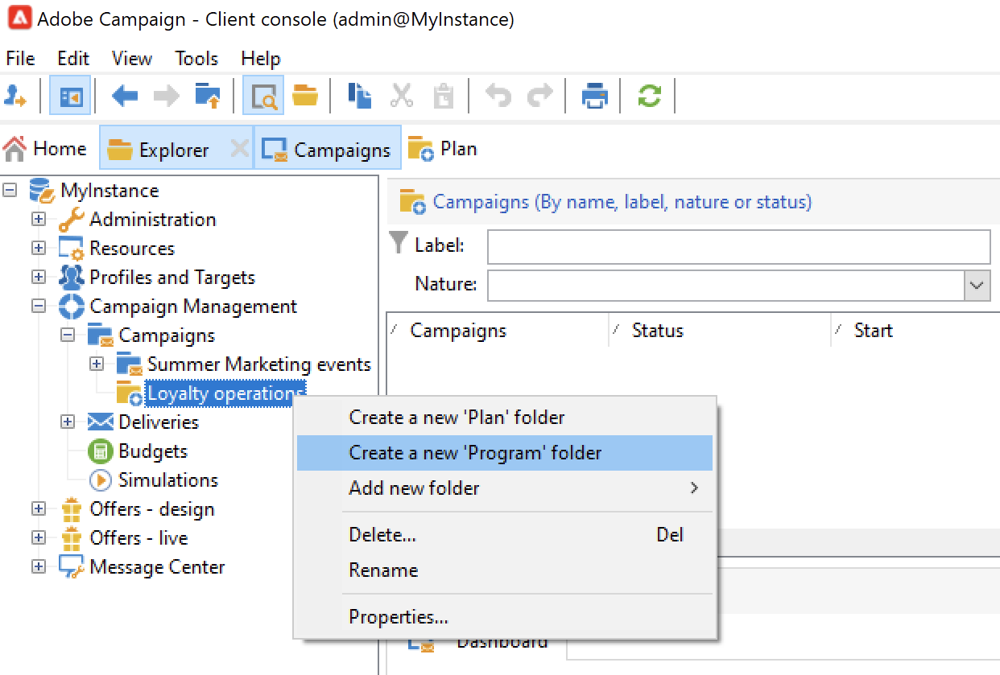
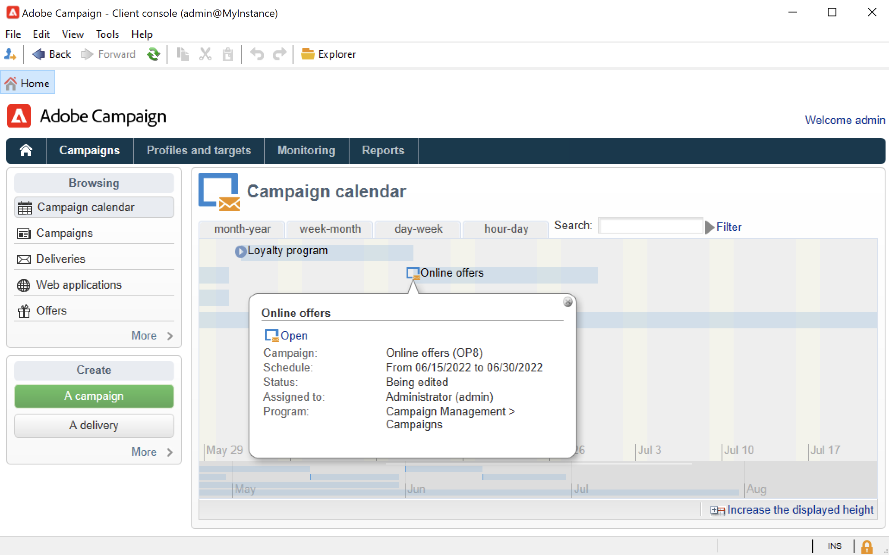
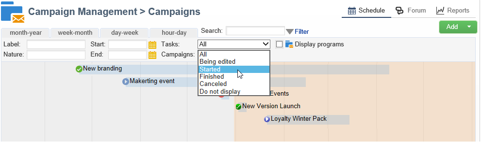

# Creare programmi e campagne{#create-programs-and-campaigns}

I componenti di orchestrazione della campagna si trovano nel **[!UICONTROL Campaigns]** scheda: qui puoi vedere una panoramica dei programmi e delle campagne di marketing e dei relativi elementi associati.

Un programma di marketing è costituito da campagne, che sono costituite da consegne, risorse, ecc. Tutte le informazioni relative a consegne, budget, revisori e documenti collegati sono raggruppate nella campagna.

 [Scopri i programmi e le campagne nel video](#video)

## Utilizzare programmi e piani{#work-with-plan-and-program}

### Creare la gerarchia di piani e programmi {#create-plan-and-program}

Ogni campagna appartiene a un programma che a sua volta appartiene a un piano. Tutti i piani, i programmi e le campagne sono disponibili tramite **[!UICONTROL Campaign calendar]** menu in **Campagne** scheda.

Prima di iniziare a creare campagne e consegne, configura la gerarchia di cartelle per i piani e i programmi di marketing.

1. Fai clic su **Esplora** nella home page.
1. Fare clic con il pulsante destro del mouse sulla cartella in cui si desidera creare il piano.
1. Seleziona **Aggiungi nuova cartella > Campaign Management > Piano**.

   

1. Rinominare il piano.
1. Fare clic con il pulsante destro del mouse sul piano appena creato e selezionare **Proprietà...**.
1. In **Generale** , modificare la scheda **Nome interno** per evitare duplicati durante le esportazioni dei pacchetti.

   

1. Fai clic su **Salva**.
1. Fare clic con il pulsante destro del mouse sul piano appena creato e selezionare **Crea una nuova cartella &quot;Programma&quot;**.

   

1. Ripetere i passaggi precedenti per rinominare la nuova cartella del programma e il relativo nome interno.

### Configurare un programma {#edit-a-program}

Durante la modifica di un programma, utilizza le schede descritte di seguito per sfogliarlo e configurarlo.

* Il **Pianificazione** scheda visualizza il calendario dei programmi per un mese, una settimana o un giorno, a seconda della scheda su cui si fa clic nell&#39;intestazione del calendario. Da questa pagina è possibile creare una campagna, un programma o un’attività. [Ulteriori informazioni](#campaign-calendar)

* Il **Modifica** Questa scheda ti permette di personalizzare il programma: nome, date di inizio e fine, budget, documenti collegati, ecc.

  

## Utilizzare le campagne{#work-with-campaigns}

### Creare una campagna {#create-a-campaign}

Puoi creare una campagna tramite l’elenco delle campagne. Per visualizzare questa visualizzazione, selezionare **[!UICONTROL Campaigns]** menu in **[!UICONTROL Campaigns]** e fai clic su **[!UICONTROL Create]**.

Il **[!UICONTROL Program]** consente di selezionare il programma a cui allegare la campagna. Queste informazioni sono obbligatorie.

Le campagne possono essere create anche tramite dal calendario della campagna o del programma. [Ulteriori informazioni](#campaign-calendar)

Nella finestra di creazione della campagna, seleziona il modello della campagna e aggiungi un nome e una descrizione della campagna. Puoi anche specificare le date di inizio e di fine della campagna.

Clic **[!UICONTROL OK]** per creare la campagna. Viene aggiunta alla pianificazione del programma e all’elenco delle campagne.

Puoi quindi modificare la campagna appena creata e definirne i parametri. Per aprire e configurare questa campagna, puoi:

1. Sfoglia il calendario della campagna e seleziona la campagna da visualizzare, quindi fai clic su **[!UICONTROL Open]** collegamento.
1. Sfoglia **[!UICONTROL Schedule]** del programma, seleziona la campagna e aprila.
1. Sfoglia l’elenco delle campagne e fai clic sul nome della campagna da modificare.

Tutte queste azioni ti portano al dashboard della campagna.

Accedi alle sezioni seguenti per scoprire come configurare la campagna:

* [Aggiungere consegne](marketing-campaign-deliveries.md)
* [Gestire risorse e documenti](marketing-campaign-assets.md)
* [Creare il pubblico di destinazione](marketing-campaign-target.md)
* [Impostare il processo di approvazione](marketing-campaign-approval.md)
* [Gestire scorte e budget](providers-stocks-and-budgets.md)

### Modificare le impostazioni della campagna {#campaign-settings}

Le campagne vengono create tramite modelli di campagna. Puoi configurare modelli riutilizzabili per i quali sono selezionate alcune opzioni e altre impostazioni sono già salvate.

Per ogni campagna sono disponibili le seguenti funzionalità:

* Documentazione e risorse di riferimento: è possibile associare documenti alla campagna (breve, rapporto, immagini, ecc.). Sono supportati tutti i formati di documento. [Ulteriori informazioni](marketing-campaign-deliveries.md#manage-associated-documents).
* Definire i costi: per ogni campagna, Adobe Campaign consente di definire le voci di costo e le strutture di calcolo dei costi che possono essere utilizzate durante la creazione della campagna di marketing. Ad esempio: spese di stampa, ricorso ad agenzie esterne, affitto di stanze, ecc. [Ulteriori informazioni](providers-stocks-and-budgets.md#defining-cost-categories).
* Definire gli obiettivi: puoi definire obiettivi quantificabili per una campagna, ad esempio numero di abbonati, volume di business, ecc. Queste informazioni vengono successivamente utilizzate nei rapporti delle campagne.
* Gestisce gli indirizzi seed e i gruppi di controllo. [Ulteriori informazioni](marketing-campaign-deliveries.md#defining-a-control-group).
* Gestisci approvazioni: puoi selezionare i trattamenti da approvare e, se necessario, selezionare gli operatori o i gruppi di operatori per la revisione. [Ulteriori informazioni](marketing-campaign-approval.md#checking-and-approving-deliveries).

>[!NOTE]
>
>Per accedere e aggiornare le impostazioni della campagna, passa alla **[!UICONTROL Advanced campaign parameters...]** collegamento in **[!UICONTROL Edit]** scheda.

### Monitorare una campagna {#monitor-a-campaign}

Per ogni campagna, i processi, le risorse e le consegne sono centralizzati in un dashboard. Questa interfaccia consente di gestire e orchestrare azioni di marketing.

Con Adobe Campaign puoi impostare processi collaborativi per la creazione e l’approvazione dei vari passaggi delle campagne: approvazione del budget, target, contenuto, ecc. Questa orchestrazione è descritta in [questa sezione](marketing-campaign-approval.md).

>[!NOTE]
>
>I componenti disponibili in una campagna dipendono dal relativo modello. La configurazione del modello di campagna è presentata in [questa sezione](marketing-campaign-templates.md#campaign-templates).

Al termine della campagna, utilizza **[!UICONTROL Reports]** collegamento per accedere ai rapporti della campagna.

## Calendario della campagna {#campaign-calendar}

Il calendario della campagna mostra tutti i programmi, i piani, le campagne e le consegne.

Per modificare un piano, un programma, una campagna o una consegna, individuarne il nome nel calendario e quindi utilizzare **[!UICONTROL Open]** collegamento. Viene quindi visualizzato in una nuova scheda, come illustrato di seguito:

Puoi filtrare le informazioni visualizzate nel calendario della campagna. A questo scopo, fai clic su **[!UICONTROL Filter]** e selezionare i criteri di filtro.

>[!NOTE]
>
>Quando si applica un filtro in base a una data, vengono visualizzate tutte le campagne con una data di inizio successiva alla data specificata e/o con una data di fine precedente alla data specificata. Le date vengono selezionate utilizzando i calendari a destra di ciascun campo.

È inoltre possibile utilizzare **[!UICONTROL Search]** per filtrare gli elementi visualizzati.

Le icone collegate a ciascun elemento ti consentono di visualizzarne lo stato: completato, in corso, in corso di modifica, ecc.

Per filtrare le campagne da visualizzare, fai clic su **[!UICONTROL Filter]** collega e seleziona lo stato delle campagne da visualizzare.

Durante l’esplorazione del calendario, puoi anche creare un programma o una campagna.

Quando crei una campagna tramite **[!UICONTROL Schedule]** di un programma, la campagna viene automaticamente collegata al programma in questione. Il **[!UICONTROL Program]** è nascosto in questo caso.

## Accedere a Campaign con un browser web {#use-the-web-interface}

>[!AVAILABILITY]
>
>A partire dalla versione 8.6 di Campaign, Campaign è disponibile in un’interfaccia utente web. La maggior parte delle azioni di marketing può essere eseguita da questa nuova interfaccia. [Ulteriori informazioni](../../v8/start/campaign-ui.md#discover-the-user-interface).

Puoi accedere ad alcune delle schermate della console client di Adobe Campaign tramite un browser Internet per visualizzare tutte le campagne e le consegne, nonché i rapporti e le informazioni sui profili nel database. Non è possibile creare componenti da questo accesso Web ma, a seconda dei diritti di accesso, è possibile visualizzare e/o agire sui dati nel database. In genere, puoi approvare il contenuto della campagna e il targeting, riavviare o interrompere una consegna, ecc.

1. Accedi come al solito tramite https://`<your instance>:<port>/view/home`.
1. Utilizza i menu per accedere alle panoramiche.

   

Oltre a navigare tra le campagne e visualizzarle, puoi eseguire i seguenti tipi di attività:

* Monitorare l’attività su un’istanza
* Partecipa ai processi di convalida, ad esempio approva o rifiuta un contenuto di consegna
* Eseguire altre azioni rapide, ad esempio sospendere un flusso di lavoro
* Accedere a tutte le funzioni di reporting
* Partecipa alle discussioni del forum

Questa tabella fornisce un riepilogo delle azioni che è possibile eseguire sulle campagne da un browser:

| Pagina  | Azione |
| --- | --- |
| Elenco di campagne, consegne, offerte, ecc. | Eliminare una voce di elenco |
| Campaign | Annullare una campagna |
| Consegna | Approvare il contenuto e la destinazione della consegna Inviare il contenuto della consegna Conferma una consegna Sospendere e interrompere una consegna |
| Applicazione web | Creare un’applicazione web Modificare il contenuto e le proprietà dell’applicazione Salvare il contenuto dell’applicazione come modello Pubblicare l’applicazione |
| Offerta | Approvare il contenuto e l’idoneità dell’offerta Disattivare un’offerta online |
| Attività Task | Terminare un’attività Annullare un’attività |
| Risorse di marketing | Approvare una risorsa Bloccare e sbloccare una risorsa |
| Pacchetto campagna | Inviare un pacchetto per l&#39;approvazione Approvare o rifiutare un pacchetto Annullare un pacchetto |
| Ordine delle campagne | Crea un ordine Accettare o rifiutare un ordine |
| Magazzino | Eliminare una linea di magazzino |
| Simulazione di offerta | Avviare e interrompere una simulazione |
| Flusso di lavoro di destinazione | Avviare, mettere in pausa e interrompere un flusso di lavoro |
| Report | Salva i dati correnti nella cronologia del rapporto |
| Forum | Aggiungere una discussione Rispondere a un messaggio in una discussione Segui una discussione e annulla l’iscrizione |

### Gestire le approvazioni

Le approvazioni di un target o di un contenuto di consegna possono essere eseguite tramite accesso web.

Puoi anche utilizzare il collegamento contenuto nei messaggi di notifica. Per ulteriori informazioni al riguardo, consulta [questa sezione](marketing-campaign-approval.md#checking-and-approving-deliveries).

## Video tutorial {#video}

Questo video mostra come creare un piano di marketing, programmi e campagne.

>[!VIDEO](https://video.tv.adobe.com/v/333810?quality=12)
