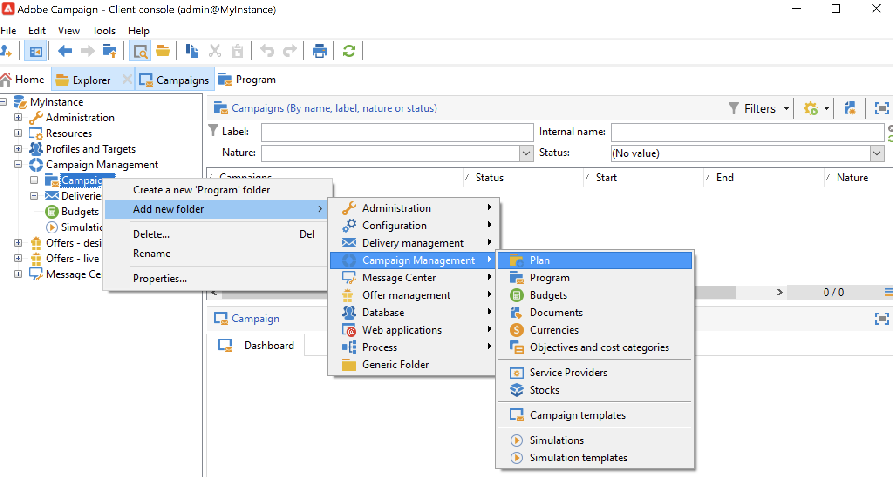

# Creare programmi e campagne{#create-programs-and-campaigns}

I componenti di orchestrazione delle campagne si trovano nella **[!UICONTROL Campaigns]** scheda: qui puoi vedere una panoramica dei programmi e delle campagne di marketing e dei relativi elementi associati.

Un programma di marketing è costituito da campagne, costituite da consegne, risorse, ecc. Tutte le informazioni relative a consegne, budget, revisori e documenti collegati sono raggruppate nella campagna.

 [Scopri programmi e campagne nei video](#video)

## Lavorare con programmi e piani{#work-with-plan-and-program}

### Creare la gerarchia dei piani e dei programmi {#create-plan-and-program}

Ogni campagna appartiene a un programma che appartiene a un piano. Tutti i piani, programmi e campagne sono disponibili tramite **[!UICONTROL Campaign calendar]** nel menu **Campagne** scheda .

Prima di iniziare a creare le campagne e le consegne, configura la gerarchia delle cartelle per i piani e i programmi di marketing.

1. Fai clic sul pulsante **Esplora risorse** nella home page.
1. Fare clic con il pulsante destro del mouse sulla cartella in cui si desidera creare il piano.
1. Seleziona **Aggiungi nuova cartella > Campaign Management > Pianifica**.

   

1. Rinomina il piano.
1. Fare clic con il pulsante destro del mouse sul piano appena creato e selezionare **Proprietà...**.
1. In **Generale** scheda , modifica **Nome interno** per evitare duplicati durante le esportazioni dei pacchetti.

   

1. Fai clic su **Salva**.
1. Fare clic con il pulsante destro del mouse sul piano appena creato e selezionare **Crea una nuova cartella &quot;Programma&quot;**.

   

1. Ripetere i passaggi indicati per rinominare la nuova cartella del programma e il relativo nome interno.

### Configurare un programma {#edit-a-program}

Quando modifichi un programma, utilizza le schede descritte di seguito per sfogliare e configurarlo.

* La **Pianificazione** Visualizza il calendario dei programmi per un mese, una settimana o un giorno a seconda della scheda su cui fai clic nell’intestazione del calendario. Puoi creare una campagna, un programma o un’attività da questa pagina. [Ulteriori informazioni](#campaign-calendar)

* La **Modifica** consente di personalizzare il programma: nome, date di inizio e fine, budget, documenti collegati, ecc.

   

## Utilizzare le campagne{#work-with-campaigns}

### Creare una campagna {#create-a-campaign}

Puoi creare una campagna tramite l’elenco delle campagne. Per visualizzare questa visualizzazione, seleziona la **[!UICONTROL Campaigns]** nel menu **[!UICONTROL Campaigns]** dashboard e fai clic su **[!UICONTROL Create]**.

La **[!UICONTROL Program]** consente di selezionare il programma a cui verrà allegata la campagna. Queste informazioni sono obbligatorie.

Le campagne possono essere create anche tramite dal calendario della campagna o del programma. [Ulteriori informazioni](#campaign-calendar)

Nella finestra di creazione della campagna, seleziona il modello di campagna e aggiungi un nome e una descrizione della campagna. Puoi inoltre specificare le date di inizio e di fine della campagna.

Fai clic su **[!UICONTROL OK]** per creare la campagna. Viene aggiunto alla pianificazione del programma e all’elenco delle campagne.

Puoi quindi modificare la campagna appena creata e definirne i parametri. Per aprire e configurare questa campagna, puoi:

1. Sfoglia il calendario della campagna e seleziona la campagna da visualizzare, quindi fai clic sul **[!UICONTROL Open]** link.
1. Sfoglia il **[!UICONTROL Schedule]** , seleziona la campagna e aprila.
1. Sfoglia l’elenco delle campagne e fai clic sul nome della campagna da modificare.

Tutte queste azioni consentono di accedere al dashboard della campagna.

Per informazioni su come configurare la campagna, consulta le sezioni seguenti:

* [Aggiungere consegne](marketing-campaign-deliveries.md)
* [Gestione di risorse e documenti](marketing-campaign-assets.md)
* [Creare il pubblico di destinazione](marketing-campaign-target.md)
* [Impostare il processo di approvazione](marketing-campaign-approval.md)
* [Gestione di scorte e budget](providers--stocks-and-budgets.md)

### Modificare le impostazioni della campagna {#campaign-settings}

Le campagne vengono create tramite modelli di campagna. Puoi configurare modelli riutilizzabili per i quali sono selezionate alcune opzioni e altre impostazioni già salvate.

Per ogni campagna sono disponibili le seguenti funzionalità:

* Documenti e risorse di riferimento: puoi associare i documenti alla campagna (breve, rapporto, immagini, ecc.). Sono supportati tutti i formati di documento. [Ulteriori informazioni](marketing-campaign-deliveries.md#manage-associated-documents).
* Definire i costi: per ogni campagna, Adobe Campaign ti consente di definire voci di costo e strutture di calcolo dei costi che possono essere utilizzate durante la creazione della campagna di marketing. Ad esempio: costi di stampa, utilizzo di un&#39;agenzia esterna, noleggio di camere, ecc. [Ulteriori informazioni](providers--stocks-and-budgets.md#defining-cost-categories).
* Definire gli obiettivi: puoi definire obiettivi quantificabili per una campagna, ad esempio numero di abbonati, volume di affari, ecc. Queste informazioni vengono successivamente utilizzate nei rapporti delle campagne.
* Gestisci gli indirizzi di seed e i gruppi di controllo. [Ulteriori informazioni](marketing-campaign-deliveries.md#defining-a-control-group).
* Gestisci le approvazioni: è possibile selezionare i trattamenti da approvare e, se necessario, selezionare gli operatori di revisione o i gruppi di operatori. [Ulteriori informazioni](marketing-campaign-approval.md#checking-and-approving-deliveries).

>[!NOTE]
>
>Per accedere e aggiornare le impostazioni della campagna, individua la **[!UICONTROL Advanced campaign parameters...]** nel collegamento **[!UICONTROL Edit]** scheda .

### Monitorare una campagna {#monitor-a-campaign}

Per ogni campagna, processi, risorse e consegne sono centralizzati in un dashboard. Questa interfaccia ti consente di gestire e orchestrare azioni di marketing.

Con Adobe Campaign puoi impostare processi di collaborazione per la creazione e l’approvazione dei vari passaggi delle campagne: approvazione del bilancio, dell&#39;obiettivo, del contenuto, ecc. Questa orchestrazione è descritta in [questa sezione](marketing-campaign-approval.md).

>[!NOTE]
>
>I componenti disponibili in una campagna dipendono dal relativo modello. La configurazione del modello di campagna è presentata in [questa sezione](marketing-campaign-templates.md#campaign-templates).

Una volta ottenuta la campagna, utilizza **[!UICONTROL Reports]** collegamento per accedere ai rapporti della campagna.

## Calendario delle campagne {#campaign-calendar}

Il calendario della campagna mostra tutti i programmi, i piani, le campagne e le consegne.

Per modificare un piano, un programma, una campagna o una consegna, utilizza il nome corrispondente nel calendario, quindi utilizza l’ **[!UICONTROL Open]** link. Viene quindi visualizzato in una nuova scheda, come illustrato di seguito:

Puoi filtrare le informazioni visualizzate nel calendario della campagna. A questo scopo, fai clic sul pulsante **[!UICONTROL Filter]** collega e seleziona i criteri di filtro.

>[!NOTE]
>
>Quando si filtra una data, vengono visualizzate tutte le campagne con una data di inizio successiva alla data specificata e/o con una data di fine precedente alla data specificata. Le date vengono selezionate utilizzando i calendari a destra di ciascun campo.

È inoltre possibile utilizzare **[!UICONTROL Search]** per filtrare gli elementi visualizzati.

Le icone collegate a ciascun elemento consentono di visualizzarne lo stato: finito, in corso, in corso, in corso di modifica, ecc.

Per filtrare le campagne da visualizzare, fai clic sul pulsante **[!UICONTROL Filter]** e seleziona lo stato delle campagne da visualizzare.

Mentre esplori il calendario, puoi anche creare un programma o una campagna.

Quando crei una campagna tramite il **[!UICONTROL Schedule]** scheda di un programma, la campagna viene automaticamente collegata al programma interessato. La **[!UICONTROL Program]** Questo campo è nascosto in questo caso.

## Utilizzare l’interfaccia web {#use-the-web-interface-}

Puoi accedere alle schermate della console Adobe Campaign tramite un browser Internet per visualizzare tutte le campagne e le consegne, nonché i rapporti e le informazioni sui profili nel database. L&#39;accesso non consente la creazione di record. A seconda dei diritti dell’operatore, è possibile visualizzare e/o intervenire sui dati nel database. Ad esempio, puoi approvare il contenuto e il targeting della campagna, riavviare o interrompere una consegna, ecc.

1. Accedi come di consueto tramite https://`<your instance>:<port>/view/home`.
1. Utilizza i menu per accedere alle panoramiche.

   

Oltre a navigare tra le campagne e visualizzarle, è possibile eseguire i seguenti tipi di attività:

* Monitorare l’attività su un’istanza
* Partecipa ai processi di convalida, ad esempio per approvare o rifiutare un contenuto di consegna
* Eseguire altre azioni rapide, ad esempio sospendere un flusso di lavoro
* Accedere a tutte le funzioni di reporting
* Partecipare alle discussioni del forum

In questa tabella sono riepilogate le azioni che è possibile eseguire sulle campagne da un browser:

| Pagina  | Azione |
| --- | --- |
| Elenco di campagne, consegne, offerte, ecc. | Eliminare una voce dell’elenco |
| Campaign | Annullare una campagna |
| Consegna | Approvare il contenuto e la destinazione della consegna Inviare il contenuto della consegna Conferma di una consegna Sospendi e interrompi una consegna |
| Applicazione web | Creare un’applicazione web Modifica del contenuto e delle proprietà dell&#39;applicazione Salva il contenuto dell’applicazione come modello Pubblicare l’applicazione |
| Offerta | Approvare il contenuto dell’offerta e l’idoneità Disattiva un’offerta online |
| Attività Task | Completare un&#39;attività Annullare un’attività |
| Risorse di marketing | Approvare una risorsa Bloccare e sbloccare una risorsa |
| Pacchetto campagne | Invia un pacchetto per l&#39;approvazione Approvare o rifiutare un pacchetto Annullare un pacchetto |
| Ordine delle campagne | Creare un ordine Accettare o rifiutare un ordine |
| Magazzino | Elimina una linea di magazzino |
| Simulazione dell’offerta | Avviare e arrestare una simulazione |
| Flusso di lavoro di targeting | Avviare, mettere in pausa e interrompere un flusso di lavoro |
| Rapporto | Salva i dati correnti nella cronologia del report |
| Forum | Aggiungi una discussione Risposta a un messaggio in una discussione Seguire una discussione e cancellarla |

### Gestire le approvazioni

Le approvazioni di un target o di un contenuto di consegna possono essere eseguite tramite accesso web.

Puoi anche utilizzare il collegamento contenuto nei messaggi di notifica. Per ulteriori informazioni al riguardo, consulta [questa sezione](marketing-campaign-approval.md#checking-and-approving-deliveries).

## Video tutorial {#video}

Questo video mostra come creare un piano di marketing, programmi e campagne.

>[!VIDEO](https://video.tv.adobe.com/v/333810?quality=12)
