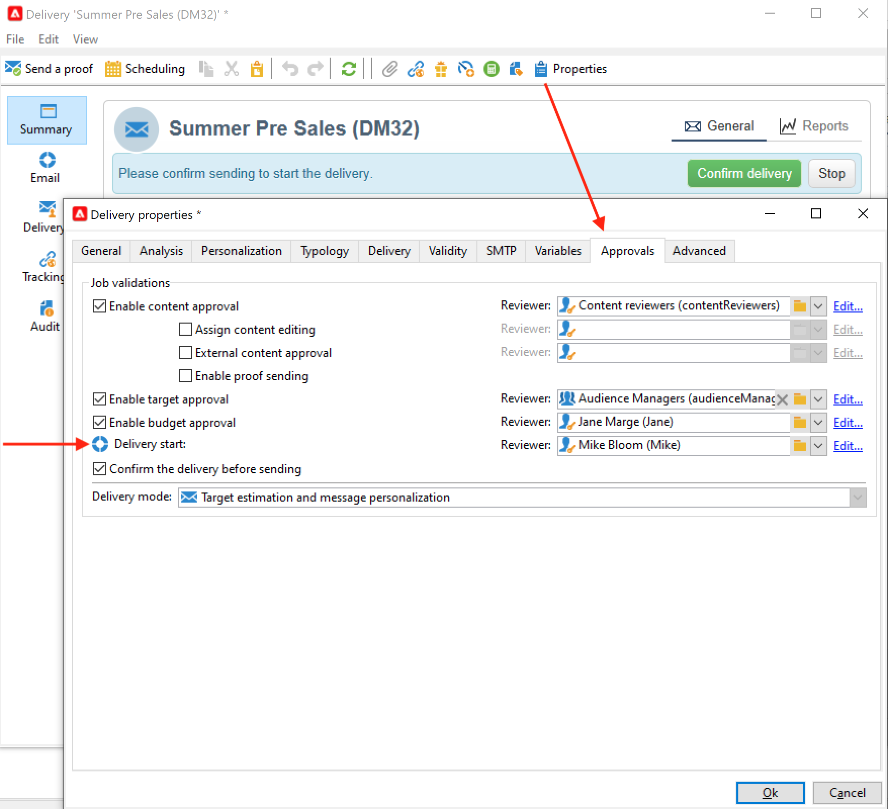

# Consegne di campagne di marketing {#marketing-campaign-deliveries}

Orchestrazione delle consegne cross-channel nelle campagne: semplifica le comunicazioni con Adobe Campaign tramite e-mail, SMS, notifiche push e messaggi in-app personalizzati. Puoi utilizzare rich media come video, emoji o GIF e integrarli direttamente.

Le consegne possono essere create tramite il dashboard della campagna, un flusso di lavoro della campagna o direttamente tramite la panoramica delle consegne. Quando vengono create da una campagna, le consegne verranno collegate a questa campagna e consolidate a livello di campagna.

## Creare consegne {#create-deliveries}

Puoi aggiungere consegne alle campagne di marketing in due modi:

* Dal collegamento **[!UICONTROL Add a delivery]** nel dashboard della campagna.

  

  Una volta salvata, la consegna viene aggiunta al dashboard della campagna.

* Da un flusso di lavoro della campagna, nella scheda **[!UICONTROL Targeting and workflows]**, aggiungendo la consegna.

  

  Una volta avviato il flusso di lavoro, la consegna viene aggiunta al dashboard della campagna.

Scopri come impostare ed eseguire il flusso di approvazione della consegna [in questa pagina](marketing-campaign-approval.md).

## Avviare una consegna {#start-a-delivery}

Una consegna può essere inviata una volta che tutte le approvazioni sono state concesse. Il processo di esecuzione della consegna dipende dal canale.

* Per le consegne tramite e-mail o canale mobile, consulta [questa sezione](#start-an-online-delivery)

* Per le consegne di direct mailing, consulta [questa sezione](#start-an-offline-delivery)

### Avviare un’e-mail o una consegna mobile {#start-an-online-delivery}

Dopo aver concesso tutte le richieste di approvazione, lo stato di consegna cambia in **[!UICONTROL Pending confirmation]** e può essere avviato. I revisori che possono avviare la consegna ricevono una notifica che indica che la consegna è pronta per essere avviata.

Le informazioni vengono visualizzate anche nel dashboard della campagna. Il collegamento **[!UICONTROL Confirm delivery]** ti consente di avviare la consegna.

La conferma della consegna è riservata agli amministratori e all’operatore o al gruppo di operatori esplicitamente menzionati nelle proprietà della consegna o della campagna. Se non è stato progettato alcun operatore, gli amministratori e il proprietario della campagna possono approvare.

Tuttavia, puoi anche consentire al proprietario della campagna di confermare l’invio, anche se nelle proprietà della consegna o della campagna sono stati definiti revisori specifici. Per eseguire questa operazione, come amministratore, crea l&#39;opzione **NmsCampaign_Activate_OwnerConfirmation** e impostala su **1**. Le opzioni sono gestite dalla cartella **[!UICONTROL Administration]** > **[!UICONTROL Platform]** > **[!UICONTROL Options]** di Campaign Explorer.

### Avviare una consegna direct mailing {#start-an-offline-delivery}

Dopo aver concesso tutte le approvazioni, lo stato di consegna cambia in **[!UICONTROL Pending extraction]**. I file di estrazione vengono creati tramite un [flusso di lavoro tecnico](../workflow/technical-workflows.md) dedicato che, in una configurazione predefinita, viene avviato automaticamente quando una consegna direct mailing è in attesa di estrazione. Quando un processo è in corso, viene visualizzato nel dashboard e può essere modificato tramite il relativo collegamento.

Una volta eseguito correttamente il flusso di lavoro di estrazione, il file di estrazione deve essere approvato (a condizione che l’approvazione del file di estrazione sia stata selezionata nelle impostazioni di consegna). [Ulteriori informazioni](marketing-campaign-approval.md#approving-an-extraction-file).

Per convalidare i contenuti e inviare il file al provider, segui la procedura riportata di seguito:

1. Una volta approvato il file di estrazione, puoi generare la bozza dell’e-mail di notifica del router. Questo messaggio e-mail è costruito in base a un modello di consegna. Deve essere approvato.

   Questo passaggio è disponibile solo se l&#39;opzione **[!UICONTROL Enable the sending and validation of proofs (Direct mail)]** è stata abilitata nella scheda **[!UICONTROL Approvals]** dei parametri della campagna avanzata.

   

1. Fare clic sul pulsante **[!UICONTROL Send a proof]** per creare le bozze.

   Il target della bozza deve essere definito in anticipo.

   Puoi creare tutte le bozze necessarie. Sono accessibili tramite il collegamento **[!UICONTROL Direct mail...]** dei dettagli di consegna.

1. Lo stato della consegna cambia in **[!UICONTROL To submit]**. Fare clic sul pulsante **[!UICONTROL Submit proofs]** per avviare il processo di approvazione.

1. Lo stato della consegna cambia in **[!UICONTROL Proof to validate]** e un pulsante consente di accettare o rifiutare l&#39;approvazione.

   Puoi accettare o rifiutare questa approvazione oppure tornare al passaggio di estrazione.

1. Una volta approvata la bozza, il file di estrazione viene inviato al router e la consegna è terminata.

### Calcolo del budget e dei costi {#compute-costs-and-stocks}

L’estrazione del file avvia due processi: il calcolo del budget e il calcolo delle scorte. Le voci di budget vengono aggiornate.

* La scheda **[!UICONTROL Budget]** consente di gestire i budget per la campagna. Il totale delle voci di costo è visualizzato nel campo **[!UICONTROL Calculated cost]** della scheda principale della campagna e nel programma a cui appartiene. Gli importi sono riportati anche nel bilancio della campagna.

  

  Il costo reale verrà calcolato in base alle informazioni fornite dal router. Solo i messaggi effettivamente inviati vengono fatturati.

* Le scorte sono definite nel nodo **[!UICONTROL Administration > Campaign management > Stocks]** della struttura.

  

  Strutture di costo nel nodo **[!UICONTROL Administration > Campaign management > Service providers]**.

  

  Le linee del grezzo sono visibili nella sezione del grezzo. Per definire il materiale iniziale, aprire una linea del materiale. Le scorte vengono diminuite ogni volta che si verifica una consegna. Puoi definire un livello di avviso e le notifiche.

  >[!NOTE]
  >
  >Ulteriori informazioni sui budget [in questa sezione](providers-stocks-and-budgets.md).
