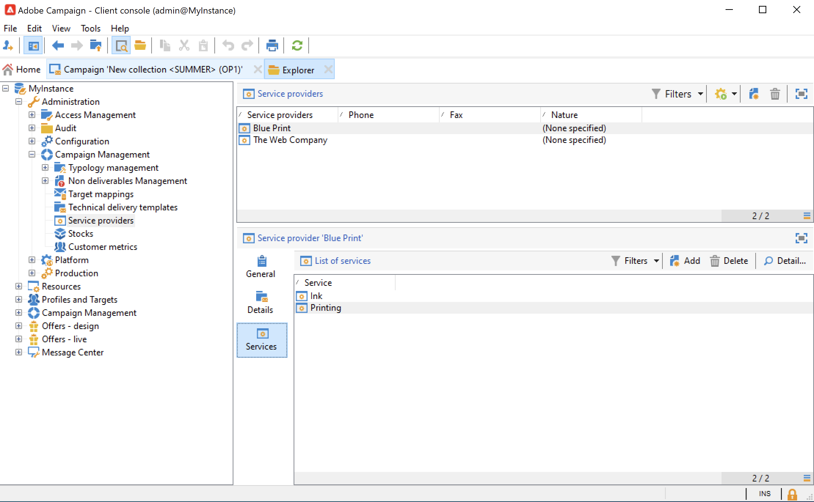

# Consegne di campagne di marketing {#marketing-campaign-deliveries}

Organizza le consegne cross-channel nelle campagne: semplifica le comunicazioni con Adobe Campaign tramite e-mail, SMS, notifiche push e messaggi in-app personalizzati. Puoi utilizzare contenuti multimediali avanzati come video, emoticon o GIF e integrarli direttamente.

Le consegne possono essere create tramite il dashboard della campagna, un flusso di lavoro della campagna o direttamente tramite la panoramica delle consegne. Una volta create da una campagna, le consegne saranno collegate a questa campagna e consolidate a livello di campagna.

## Creare consegne {#create-deliveries}

Puoi aggiungere consegne alle campagne di marketing in due modi:

* Da **[!UICONTROL Add a delivery]** nel dashboard della campagna.

Una volta salvata, la consegna viene aggiunta al dashboard della campagna.

* Da un flusso di lavoro della campagna, nella **[!UICONTROL Targeting and workflows]** mediante l’aggiunta della consegna.

   

   Una volta avviato il flusso di lavoro, la consegna viene aggiunta al dashboard della campagna.

Scopri come impostare ed eseguire il flusso di approvazione della consegna [in questa pagina](marketing-campaign-approval.md).

## Inizia una consegna {#start-a-delivery}

Una consegna può essere inviata una volta che tutte le approvazioni sono state rilasciate. Il processo di esecuzione della consegna dipende dal canale.

* Per le consegne e-mail o di canali mobili, fai riferimento a [questa sezione](#start-an-online-delivery)

* Per le consegne di direct mailing, consulta [questa sezione](#start-an-offline-delivery)

### Avviare un&#39;e-mail o una consegna mobile {#start-an-online-delivery}

Una volta concesse tutte le richieste di approvazione, lo stato di consegna cambia in **[!UICONTROL Pending confirmation]** e può essere avviato. Ai revisori che possono avviare la consegna viene notificato che una consegna è pronta per essere avviata.

Le informazioni vengono visualizzate anche sul dashboard della campagna. La **[!UICONTROL Confirm delivery]** consente di avviare la consegna.

La conferma della consegna è limitata agli amministratori e all’operatore o al gruppo di operatori esplicitamente menzionati nelle proprietà della consegna o della campagna. Se non è progettato alcun operatore, gli amministratori e il proprietario della campagna possono approvare.

Tuttavia, puoi anche consentire al proprietario della campagna di confermare l’invio, anche se sono stati definiti revisori specifici nelle proprietà di consegna o campagna. Per eseguire questa operazione, in qualità di amministratore, crea il **NmsCampaign_Activate_OwnerConfirmation** e impostalo su **1**. Le opzioni vengono gestite dal **[!UICONTROL Administration]** > **[!UICONTROL Platform]** > **[!UICONTROL Options]** cartella di Campaign explorer.

### Avviare una consegna direct mailing {#start-an-offline-delivery}

Una volta concesse tutte le approvazioni, lo stato di consegna cambia in **[!UICONTROL Pending extraction]**. I file di estrazione vengono creati tramite un [flusso di lavoro tecnico](../workflow/technical-workflows.md) che, in una configurazione predefinita, viene avviato automaticamente quando una consegna direct mailing è in attesa di estrazione. Quando un processo è in corso, viene visualizzato nel dashboard e può essere modificato tramite il relativo collegamento.

Una volta eseguito correttamente il flusso di lavoro di estrazione, il file di estrazione deve essere approvato (a condizione che l’approvazione del file di estrazione sia stata selezionata nelle impostazioni di consegna). [Ulteriori informazioni](marketing-campaign-approval.md#approving-an-extraction-file).

Per convalidare il contenuto e inviare il file al provider, effettua le seguenti operazioni:

1. Una volta approvato il file di estrazione, puoi generare la bozza dell’e-mail di notifica del router. Questo messaggio e-mail viene creato in base a un modello di consegna. Deve essere approvato.

   Questo passaggio è disponibile solo se **[!UICONTROL Enable the sending and validation of proofs (Direct mail)]** opzione abilitata in **[!UICONTROL Approvals]** dei parametri della campagna avanzata.

   

1. Fai clic sul pulsante **[!UICONTROL Send a proof]** per creare le bozze.

   Il target della bozza deve essere definito in anticipo.

   Puoi creare tutte le prove necessarie. Sono accessibili tramite il **[!UICONTROL Direct mail...]** collegamento dei dettagli di consegna.

1. Lo stato di consegna cambia in **[!UICONTROL To submit]**. Fai clic sul pulsante **[!UICONTROL Submit proofs]** per avviare il processo di approvazione.

1. Lo stato di consegna cambia in **[!UICONTROL Proof to validate]** e un pulsante consente di accettare o rifiutare l’approvazione.

   Puoi accettare o rifiutare questa approvazione o tornare al passaggio di estrazione.

1. Una volta approvata la bozza, il file di estrazione viene inviato al router e la consegna è terminata.

### Calcolo del bilancio e dei costi {#compute-costs-and-stocks}

L’estrazione del file avvia due processi: calcolo del budget e calcolo delle scorte. Le voci di budget vengono aggiornate.

* La **[!UICONTROL Budget]** consente di gestire i budget per la campagna. Il totale delle voci di costo è indicato nella variabile **[!UICONTROL Calculated cost]** campo della scheda principale della campagna e del programma a cui appartiene. Gli importi si riflettono anche nel bilancio della campagna.

   

   Il costo reale sarà calcolato in base alle informazioni fornite dal router. Vengono fatturati solo i messaggi effettivamente inviati.

* Le consistenze sono definite nella **[!UICONTROL Administration > Campaign management > Stocks]** nodo dell&#39;albero.

   

   Strutture dei costi **[!UICONTROL Administration > Campaign management > Service providers]** nodo.

   

   Le linee di scorta sono visibili nella sezione di scorta. Per definire il magazzino iniziale, aprire una linea di magazzino. Lo stock viene ridotto ogni volta che si verifica una consegna. Puoi definire un livello di avviso e le notifiche.

   >[!NOTE]
   >
   >Ulteriori informazioni sui budget [in questa sezione](providers--stocks-and-budgets.md).
