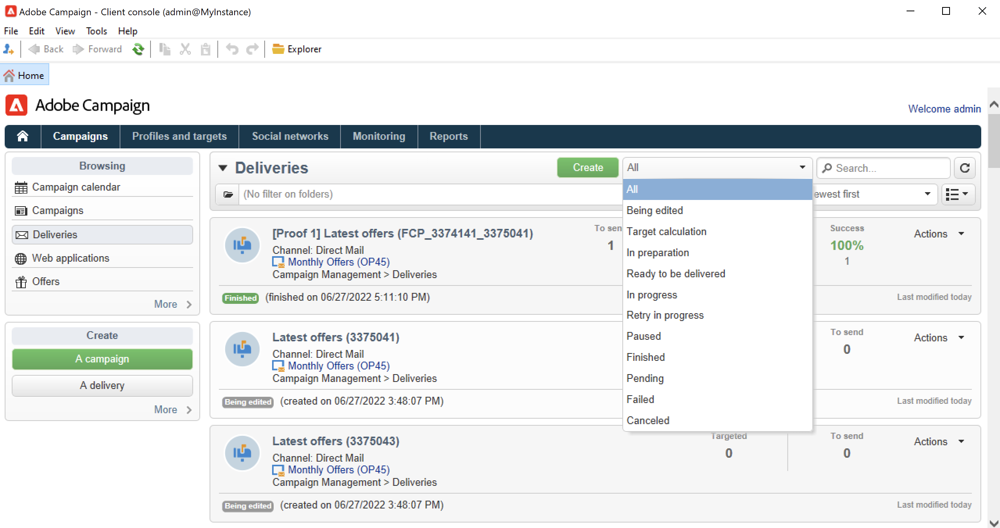

# Monitorare le campagne di marketing {#monitor-marketing-campaigns}

## Tracciare una campagna {#tracking-a-campaign}

Per ogni campagna, il **[!UICONTROL Tracking]** Questa scheda consente di visualizzare tutti i job e i relativi stati.

Le seguenti informazioni sono accessibili tramite questa scheda secondaria:

* Il **[!UICONTROL Audit]** scheda secondaria mostra il giornale di registrazione attività. Contiene i processi eseguiti nella campagna: creazione o avvio del flusso di lavoro, approvazione, estrazione, gestione del magazzino, ecc.

  

* Il **[!UICONTROL Deliveries]** scheda secondaria contiene tutte le consegne della campagna. Da questa vista è possibile modificarli. A questo scopo, seleziona la consegna e fai clic sul pulsante **[!UICONTROL Detail]** icona.

  

* Il **[!UICONTROL Approvals]** scheda secondaria contiene tutto il processo di approvazione per la campagna. Puoi controllare dettagli e commenti

* I flussi di lavoro creati per generare messaggi per i provider di servizi vengono visualizzati nella sezione **[!UICONTROL Jobs on service providers]** scheda secondaria. Fai clic su **[!UICONTROL Detail]** per visualizzare il workflow selezionato.

## Tracciare le consegne {#delivery-tracking}

L’elenco delle consegne è disponibile tramite **[!UICONTROL Deliveries]** collegamento del nodo Campaign.

Per ogni consegna, questo elenco ti consente di accedere agli indicatori chiave: stato, numero di destinatari target, campagne collegate, ecc.

Per controllare lo stato di una consegna, modificala e visualizzarne il dashboard e le schede.

<!--
>[!NOTE]
>
>Information concerning delivery details is available in [this section](../../delivery/using/about-message-tracking.md) section.
-->

## Tracciare l’esecuzione {#execution-tracking}

Puoi controllare lo stato delle consegne facendo clic sul pulsante **[!UICONTROL Deliveries]**, accessibile tramite la home page di Adobe Campaign.

I dettagli sui processi eseguiti in una campagna sono raccolti nel **[!UICONTROL Edit > Audit]** della campagna. Puoi visualizzare l’elenco delle consegne nella campagna. [Ulteriori informazioni](#tracking-a-campaign).
