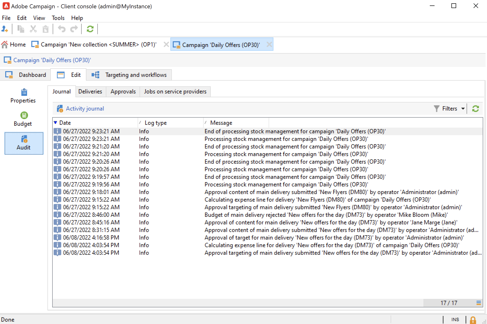

# Monitorare le campagne di marketing {#monitor-marketing-campaigns}

## Tracciare una campagna {#tracking-a-campaign}

Per ogni campagna, la scheda **[!UICONTROL Tracking]** ti consente di visualizzare tutti i processi e i relativi stati.

Le seguenti informazioni sono accessibili tramite questa scheda secondaria:

* La scheda secondaria **[!UICONTROL Audit]** mostra il giornale di registrazione attività. Contiene i processi eseguiti nella campagna: creazione o avvio del flusso di lavoro, approvazione, estrazione, gestione del magazzino, ecc.

  

* La scheda secondaria **[!UICONTROL Deliveries]** contiene tutte le consegne della campagna. Da questa vista è possibile modificarli. A tale scopo, selezionare la consegna e fare clic sull&#39;icona **[!UICONTROL Detail]**.

  

* La scheda secondaria **[!UICONTROL Approvals]** contiene tutto il processo di approvazione per la campagna. Puoi controllare dettagli e commenti

* I flussi di lavoro creati per generare messaggi per i provider di servizi vengono visualizzati nella scheda secondaria **[!UICONTROL Jobs on service providers]**. Fare clic sull&#39;icona **[!UICONTROL Detail]** per visualizzare il flusso di lavoro selezionato.

## Tracciare le consegne {#delivery-tracking}

L’elenco delle consegne è disponibile tramite il collegamento **[!UICONTROL Deliveries]** del nodo Campaign.

Per ogni consegna, questo elenco ti consente di accedere agli indicatori chiave: stato, numero di destinatari target, campagne collegate, ecc.

Per controllare lo stato di una consegna, modificala e visualizzarne il dashboard e le schede.

<!--
>[!NOTE]
>
>Information concerning delivery details is available in [this section](../../delivery/using/about-message-tracking.md) section.
-->

## Tracciare l’esecuzione {#execution-tracking}

È possibile controllare lo stato delle consegne facendo clic su **[!UICONTROL Deliveries]**, accessibile tramite la home page di Adobe Campaign.

I dettagli sui processi eseguiti in una campagna sono raccolti nella scheda **[!UICONTROL Edit > Audit]** della campagna. Puoi visualizzare l’elenco delle consegne nella campagna. [Ulteriori informazioni](#tracking-a-campaign).
