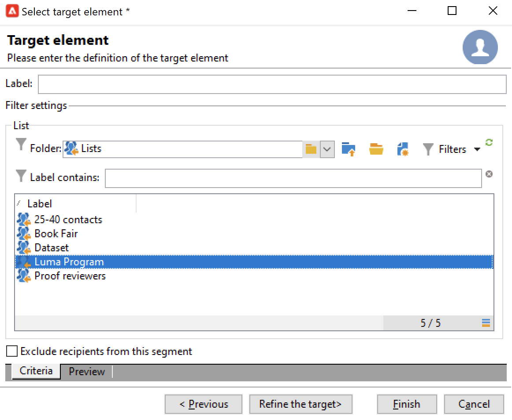
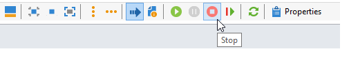

# Selezionare il pubblico delle campagne {#marketing-campaign-deliveries}

In una campagna di marketing, per ogni consegna, puoi definire:

* Il pubblico di destinazione. Puoi inviare messaggi a un [elenco di destinatari](#send-to-a-group) o generare un [pubblico in un flusso di lavoro](#build-the-main-target-in-a-workflow)
* Un gruppo di controllo. Puoi [aggiungere un gruppo di controllo](#add-a-control-group) per monitorare il comportamento dei destinatari dopo la consegna dei messaggi
* Indirizzi seed - Ulteriori informazioni in [questa sezione](../../v8/audiences/test-profiles.md).

Alcune di queste informazioni possono essere ereditate dal [modello di campagna](marketing-campaign-templates.md#campaign-templates).

<!--
To build the delivery target, you can define filtering criteria for the recipients in the database. This recipient selection mode is presented in [this section](../../delivery/using/steps-defining-the-target-population.md).
-->

## Invia a un gruppo{#send-to-a-group}

Puoi importare una popolazione in un elenco, quindi eseguire il targeting di questo elenco nelle consegne. A questo scopo, segui la procedura indicata di seguito:

1. Modifica la consegna e fai clic sul collegamento **[!UICONTROL To]** per modificare la popolazione target.
1. Nella scheda **[!UICONTROL Main target]**, selezionare l&#39;opzione **[!UICONTROL Defined via the database]** e fare clic su **[!UICONTROL Add]** per selezionare i destinatari.

   

1. Scegli **[!UICONTROL A list of recipients]**.

   

1. Fare clic su **[!UICONTROL Next]** per selezionare l&#39;elenco.

   

   Puoi perfezionare la destinazione aggiungendo nuovi criteri di filtro.

1. Fare clic su **[!UICONTROL Finish]** una volta definiti tutti i criteri e salvare la destinazione principale.

## Creare il pubblico in un flusso di lavoro della campagna {#build-the-main-target-in-a-workflow}

Il target principale di una consegna può essere definito anche nel flusso di lavoro della campagna: questo ambiente grafico consente di creare un target utilizzando query, test e operatori: unione, deduplicazione, condivisione, ecc.

>[!IMPORTANT]
>
>Non è necessario aggiungere più di 28 flussi di lavoro in una campagna. Oltre questo limite, nell’interfaccia non sono visibili flussi di lavoro aggiuntivi che possono generare errori.

### Creare il flusso di lavoro {#create-a-targeting-workflow}

Il targeting può essere creato tramite una combinazione di condizioni di filtro in una sequenza grafica in un flusso di lavoro. Puoi creare popolazioni e sottopopolazioni che saranno oggetto di targeting in base alle tue esigenze. Per visualizzare l&#39;editor del workflow, fare clic sulla scheda **[!UICONTROL Targeting and workflows]** nel dashboard della campagna.

La popolazione target viene estratta dal database di Adobe Campaign tramite una o più query inserite in un flusso di lavoro. Scopri come creare una query in [questa sezione](../workflow/query.md).

Puoi avviare query e condividere popolazioni tramite caselle quali Unione, Intersezione, Condivisione, Esclusione e così via.

Selezionate gli oggetti dagli elenchi a sinistra del workspace e collegateli per costruire la destinazione.

Nel diagramma, collega le query di targeting e pianificazione necessarie per la costruzione del target nel diagramma. Puoi eseguire il targeting mentre la costruzione è in corso per controllare la popolazione estratta dal database.

>[!NOTE]
>
>Esempi e procedure per la definizione delle query sono descritti in [questa sezione](../workflow/query.md).

La sezione a sinistra dell’editor contiene una libreria di oggetti grafici che rappresentano le attività. La prima scheda contiene le attività di targeting e la seconda contiene le attività di controllo del flusso, utilizzate occasionalmente per coordinare le attività di targeting.

Le funzioni di esecuzione del flusso di lavoro di targeting e formattazione sono accessibili tramite la barra degli strumenti dell’editor di diagrammi.

>[!NOTE]
>
>Le attività disponibili per la creazione del diagramma e tutte le funzionalità di visualizzazione e layout sono descritte in [questa sezione](../workflow/about-workflows.md).

Puoi creare diversi flussi di lavoro di targeting per una singola campagna. Per aggiungere un flusso di lavoro:

1. Andare alla sezione superiore sinistra dell&#39;area di creazione del flusso di lavoro, fare clic con il pulsante destro del mouse e selezionare **[!UICONTROL Add]**. È inoltre possibile utilizzare il pulsante **[!UICONTROL New]** situato sopra l&#39;area.

   

1. Selezionare il modello **[!UICONTROL New workflow]** e denominare il flusso di lavoro.
1. Fare clic su **[!UICONTROL OK]** per confermare la creazione del flusso di lavoro, quindi creare il diagramma per il flusso di lavoro.

### Eseguire il flusso di lavoro {#execute-a-workflow}

I flussi di lavoro di targeting possono essere avviati manualmente tramite il pulsante **[!UICONTROL Start]** nella barra degli strumenti, purché si disponga dei diritti appropriati.

Il targeting può essere programmato per l’esecuzione automatica in base a una pianificazione (scheduler) o a un evento (segnale esterno, importazione file, ecc.).

Le azioni correlate all&#39;esecuzione del flusso di lavoro di targeting (avvio, arresto, pausa, ecc.) sono **processi asincroni**: il comando viene salvato e avrà effetto non appena il server sarà disponibile per applicarlo.

Le icone della barra degli strumenti consentono di intervenire sull’esecuzione del flusso di lavoro di targeting.

* Avvia o riavvia

   * L&#39;icona **[!UICONTROL Start]** consente di avviare il flusso di lavoro di targeting. Quando fai clic su questa icona, vengono attivate tutte le attività senza una transizione di input (tranne i salti al punto finale).

     

     Il server prende in considerazione la richiesta, come mostrato dal suo stato: **[!UICONTROL Start as soon as possible]**.

   * Puoi riavviare il flusso di lavoro di targeting tramite l’icona appropriata della barra degli strumenti. Questo comando può essere utile se l&#39;icona **[!UICONTROL Start]** non è disponibile, ad esempio quando è in corso l&#39;arresto del flusso di lavoro di targeting. In questo caso, fare clic sull&#39;icona **[!UICONTROL Restart]** per anticipare il riavvio. Il server prende in considerazione la richiesta, come mostra il suo stato: **[!UICONTROL Restart requested]**.

* Interrompi o sospendi

   * Le icone della barra degli strumenti consentono di interrompere o mettere in pausa un flusso di lavoro di targeting in corso.

     Quando si fa clic su **[!UICONTROL Pause]**, le operazioni in corso **[!UICONTROL are not]** sono state sospese, ma nessun&#39;altra attività viene avviata fino al successivo riavvio.

     

     Il server prende in considerazione il comando, come mostra il suo stato: **[!UICONTROL Pause requested]**.

     Puoi anche mettere in pausa automaticamente un flusso di lavoro di targeting quando l’esecuzione raggiunge una particolare attività. A questo scopo, fai clic con il pulsante destro del mouse sull&#39;attività da cui sospendere il flusso di lavoro di targeting e seleziona **[!UICONTROL Enable but do not execute]**.

     

     Questa configurazione è illustrata da un’icona speciale.

     

     >[!NOTE]
     >
     >Questa opzione è utile durante le fasi avanzate di progettazione e test delle campagne di targeting.

     Fare clic su **[!UICONTROL Start]** per riprendere l&#39;esecuzione.

   * Fare clic sull&#39;icona **[!UICONTROL Stop]** per interrompere l&#39;esecuzione in corso.

     

     Il server prende in considerazione il comando, come mostra il suo stato: **[!UICONTROL Stop requested]**.

  Puoi anche interrompere automaticamente un flusso di lavoro di targeting quando l’esecuzione raggiunge un’attività. A tale scopo, fare clic con il pulsante destro del mouse sull&#39;attività da cui verrà interrotto il flusso di lavoro di targeting e selezionare **[!UICONTROL Do not activate]**.

  

  Questa configurazione è illustrata da un’icona speciale.

  

  >[!NOTE]
  >
  >Questa opzione è utile durante le fasi avanzate di progettazione e test delle campagne di targeting.

* Interruzione incondizionata

  In Esplora, seleziona **[!UICONTROL Administration > Production > Object created automatically > Campaign workflows]** per accedere e agire su ogni flusso di lavoro della campagna.

  È possibile interrompere incondizionatamente il flusso di lavoro facendo clic sull&#39;icona **[!UICONTROL Actions]** e selezionando **[!UICONTROL Unconditional]** Interrompi. Questa azione interrompe il flusso di lavoro della campagna.

  

  >[!CAUTION]
  >
  >L’arresto incondizionato è limitato agli utenti amministratori.

## Aggiungere un gruppo di controllo {#add-a-control-group}

Un gruppo di controllo è una popolazione che non riceverà la consegna; viene utilizzato per monitorare il comportamento post-consegna e l’impatto della campagna effettuando un confronto con il comportamento della popolazione target che ha ricevuto la consegna.

Il gruppo di controllo può essere estratto dal target principale e/o provenire da un gruppo o una query specifica.

>[!CAUTION]
>
>Non è possibile utilizzare i gruppi di controllo durante il caricamento della popolazione target da un file esterno.

### Attivare il gruppo di controllo per una campagna {#activate-the-control-group-for-a-campaign}

Puoi definire un gruppo di controllo a livello di campagna, nel qual caso verrà applicato a ogni consegna della campagna interessata.

1. Modificare la campagna in questione e fare clic sulla scheda **[!UICONTROL Edit]**.
1. Fai clic su **[!UICONTROL Advanced campaign parameters...]**.

   

1. Seleziona l’opzione **[!UICONTROL Enable and edit control group configuration]**.
1. Fare clic su **[!UICONTROL Edit...]** per configurare il gruppo di controllo.

   

La procedura completa è descritta in [questa sezione](#extract-the-control-group-from-the-main-target). Ulteriori informazioni sui gruppi di controllo in [questa sezione](#add-a-population).

### Attivare il gruppo di controllo per una consegna {#activate-the-control-group-for-a-delivery}

Puoi definire un gruppo di controllo a livello di consegna, nel qual caso il gruppo di controllo verrà applicato a ogni consegna della campagna interessata.

Per impostazione predefinita, la configurazione del gruppo di controllo definita a livello di campagna si applica a ogni consegna di tale campagna. Tuttavia, puoi adattare il gruppo di controllo per una singola consegna.

>[!NOTE]
>
>Se hai definito un gruppo di controllo per una campagna e lo configuri anche per una consegna collegata a questa campagna, verrà applicato solo il gruppo di controllo definito per la consegna.

1. Modificare la consegna interessata e quindi fare clic sul collegamento **[!UICONTROL To]**.
1. Fare clic sulla scheda **[!UICONTROL Control group]** e quindi selezionare **[!UICONTROL Enable and edit control group configuration]**.

   

1. Fare clic su **[!UICONTROL Edit...]** per configurare il gruppo di controllo.

La procedura completa è descritta in [questa sezione](#extract-the-control-group-from-the-main-target).

### Utilizzare una nuova popolazione come gruppo di controllo {#add-a-population}

È possibile utilizzare una popolazione specifica per il gruppo di controllo. In tal caso, selezionare l&#39;elenco da utilizzare come gruppo di controllo nel campo correlato.

Questa popolazione può provenire da un elenco di destinatari o puoi definirla tramite una query specifica.

>[!NOTE]
>
>L&#39;editor di query di Adobe Campaign è presentato in [questa sezione](../../v8/start/query-editor.md).

### Estrarre il gruppo di controllo dal target principale {#extract-the-control-group-from-the-main-target}

Puoi anche estrarre i destinatari dal target principale della consegna. In questo caso, i destinatari verranno ricavati dal target delle azioni di consegna interessate da questa configurazione. Questa estrazione può essere casuale o può essere il risultato dell’ordinamento dei destinatari.

Per estrarre un gruppo di controllo, abilitare il gruppo di controllo per la campagna o la consegna e selezionare una delle opzioni seguenti: **[!UICONTROL Activate random sampling]** o **[!UICONTROL Keep only the first records after sorting]**.

* Utilizzare l&#39;opzione **[!UICONTROL Activate random sampling]** per applicare il campionamento casuale ai destinatari nella popolazione principale. Se in seguito imposti su 100 la soglia, il gruppo di controllo sarà composto da 100 destinatari selezionati in modo casuale dalla popolazione target. Il campionamento casuale dipende dal motore del database.
* Utilizzare l&#39;opzione **[!UICONTROL Keep only the first records after sorting]** per definire un limite basato su uno o più ordini di ordinamento. Se si seleziona il campo **[!UICONTROL Age]** come criterio di ordinamento e quindi si definisce 100 come soglia, il gruppo di controllo sarà composto dai 100 destinatari più giovani. Ad esempio, potrebbe essere interessante definire un gruppo di controllo che includa destinatari che effettuano pochi acquisti, o destinatari che effettuano acquisti frequenti, e confrontare il loro comportamento con quello dei destinatari contattati.

Fare clic su **[!UICONTROL Next]** per definire l&#39;ordinamento (se necessario) e selezionare la modalità di limitazione del destinatario.

Questa configurazione equivale a un&#39;attività **[!UICONTROL Split]** nel flusso di lavoro, che consente di suddividere la destinazione in sottoinsiemi. Il gruppo di controllo è uno di questi sottoinsiemi.

### Video tutorial {#create-email-video}

Questo video spiega come aggiungere un gruppo di controllo a una campagna.

>[!VIDEO](https://video.tv.adobe.com/v/335606?quality=12)

Ulteriori video dimostrativi di Campaign sono disponibili [qui](https://experienceleague.adobe.com/docs/campaign-learn/tutorials/getting-started/introduction-to-adobe-campaign.html?lang=it){target="_blank"}.
