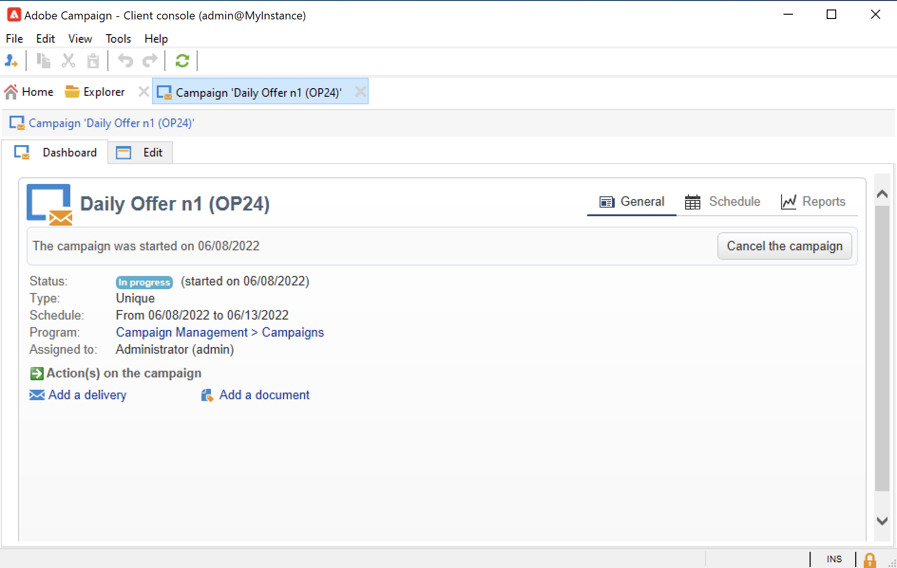

# Creare e configurare modelli di campagna {#campaign-templates}

Tutte le campagne di marketing si basano su un modello, che memorizza le caratteristiche e le funzionalità principali. Campaign viene fornito con un modello integrato per la creazione di campagne. Questo modello presenta tutte le funzionalità abilitate: documenti, indirizzi seed, approvazioni, profili di consegna, ecc.

Le funzionalità disponibili dipendono dalle autorizzazioni, dai componenti aggiuntivi e dalla configurazione della piattaforma Adobe Campaign.

>[!NOTE]
>
>L&#39;albero viene visualizzato quando si fa clic su **[!UICONTROL Explorer]** nella home page.

Viene fornito un modello integrato al fine di creare una campagna per la quale non è stata definita alcuna configurazione specifica. Puoi creare e configurare i modelli della campagna e quindi creare campagne a partire da questi modelli.

## Creare un modello di campagna {#create-a-campaign-template}

Per creare un modello per campagne, segui la procedura seguente:

1. Apri campagna **Esplora**, e naviga su **Risorse > Modelli > Modelli per campagne**.
1. Clic **Nuovo** nella barra degli strumenti sopra l’elenco dei modelli.

È inoltre possibile **duplicare** il modello incorporato per riutilizzare e adattare la propria configurazione. A questo scopo, fai clic con il pulsante destro del mouse sul modello e seleziona (Confronta periodi di tempo) **Duplica**.

1. Immetti l’etichetta del nuovo modello di campagna.
1. Clic **Salva** e riapri il modello.
1. In **Modifica** , definire le proprietà del modello.
1. Seleziona **Parametri campagna avanzati...** per aggiungere un flusso di lavoro al modello della campagna.

   

1. Modificare il **Targeting e flussi di lavoro** valore per **Sì**. e conferma. Scopri come aggiungere funzionalità in [questa sezione](#typology-of-enabled-modules).
1. Il **Targeting e flussi di lavoro** al modello. Clic **Aggiungi un flusso di lavoro...**, immetti un **Etichetta** e fai clic su **Ok**.
1. Crea il flusso di lavoro in base alle tue esigenze.

   

1. Fai clic su **Salva**. Il modello è ora pronto per essere utilizzato per creare una nuova campagna.

Le varie schede e schede secondarie del modello della campagna consentono di accedere alle relative impostazioni, descritte in [Configurazione generale](#general-configuration).

## Seleziona moduli {#select-modules}

Il **[!UICONTROL Advanced campaign parameters...]** consente di abilitare e disabilitare i processi per le campagne basate su questo modello. Seleziona le funzionalità che desideri abilitare nelle campagne create in base a questo modello.

Se non è selezionata una funzionalità, gli elementi relativi al processo (menu, icone, opzioni, schede, schede secondarie, ecc.) non vengono visualizzati nell’interfaccia del modello o nelle campagne basate su questo modello. Le schede a sinistra dei dettagli della campagna e le schede disponibili coincidono con le funzionalità selezionate nel modello. Ad esempio, il **Spese e obiettivi** funzionalità non è abilitata, il corrispondente **[!UICONTROL Budget]** non viene visualizzata nelle campagne basate su questo modello.

Inoltre, al dashboard della campagna vengono aggiunte scelte rapide per le finestre di configurazione. Quando una funzionalità è abilitata, un collegamento diretto consente di accedervi dal dashboard della campagna.

### Esempi di configurazione

* Ad esempio, con le seguenti impostazioni:

  

  Il dashboard della campagna mostra:

  

  Tieni presente che **[!UICONTROL Targeting and workflows]** scheda mancante.

  Sono disponibili le seguenti funzionalità:

  

  Tieni presente che **[!UICONTROL Budget]** scheda mancante.

  Anche le impostazioni avanzate della campagna riflettono questa configurazione.

  

  Tieni presente che **[!UICONTROL Approvals]** non è disponibile.

* Con questa configurazione:
  

  Il dashboard della campagna mostra:

  

  Tieni presente che **[!UICONTROL Targeting and workflows]** è disponibile, ma il **Aggiungi un documento** collegamento mancante.

  Sono disponibili le seguenti funzionalità:

  

  Tieni presente che **[!UICONTROL Budget]** è disponibile.

  Anche le impostazioni avanzate della campagna riflettono questa configurazione.

  

  Tieni presente che **[!UICONTROL Approvals]** è disponibile, ma il **[!UICONTROL Control population]** e **[!UICONTROL Seed addresses]** non sono abilitate.

## Tipologia dei moduli {#typology-of-enabled-modules}

* **Gruppo di controllo**

  Quando questo modulo è selezionato, viene aggiunta una scheda aggiuntiva alle impostazioni avanzate del modello e delle campagne basate su questo modello. La configurazione può essere definita tramite il modello o singolarmente per ogni campagna. Ulteriori informazioni sui gruppi di controllo in [questa sezione](marketing-campaign-deliveries.md#defining-a-control-group).

  

* **Indirizzi di seed**

  Quando questo modulo è selezionato, viene aggiunta una scheda aggiuntiva alle impostazioni avanzate del modello e delle campagne basate su questo modello. La configurazione può essere definita tramite il modello o singolarmente per ogni campagna.

  

* **Documenti**

  Quando questo modulo è selezionato, viene aggiunta una scheda aggiuntiva al **[!UICONTROL Edit]** del modello e delle campagne basate su questo modello. I documenti allegati possono essere aggiunti dal modello o singolarmente per ciascuna campagna. Ulteriori informazioni sui documenti in [questa sezione](marketing-campaign-deliveries.md#manage-associated-documents).

  

* **Profilo di consegna**

  Quando questo modulo è selezionato, **[!UICONTROL Delivery outlines]** scheda secondaria aggiunta al **[!UICONTROL Documents]** per definire i profili di consegna per la campagna. Ulteriori informazioni sui profili di consegna in [questa sezione](marketing-campaign-assets.md#delivery-outlines).

  

* **Targeting e flussi di lavoro**

  Quando selezioni il **[!UICONTROL Targeting and workflows]** , viene aggiunta una scheda che consente di creare uno o più flussi di lavoro per le campagne basate su questo modello. I flussi di lavoro possono anche essere configurati singolarmente per ogni campagna in base a questo modello.Ulteriori informazioni sui flussi di lavoro delle campagne in [questa sezione](marketing-campaign-deliveries.md#build-the-main-target-in-a-workflow).

  

  Quando questo modulo è abilitato, un **[!UICONTROL Jobs]** alle impostazioni avanzate della campagna viene aggiunta una scheda per definire la sequenza di esecuzione del processo.

* **Approvazioni**

  Se si abilita **[!UICONTROL Approvals]**, puoi selezionare i processi da approvare e gli operatori responsabili delle approvazioni. Ulteriori informazioni sulle approvazioni in [questa sezione](marketing-campaign-approval.md#select-reviewers).

  

  È possibile scegliere se abilitare o meno l&#39;approvazione del processo tramite **[!UICONTROL Approvals]** della sezione impostazioni avanzate dei modelli.

* **Spese e obiettivi**

  Quando questo modulo è selezionato, **[!UICONTROL Budget]** Questa scheda viene aggiunta ai dettagli del modello e delle campagne basate su questo modello, in modo da poter selezionare il budget associato.

  

## Proprietà modello {#template-properties}

Quando crei un modello di campagna, devi immettere le seguenti informazioni:

* Inserisci il **etichetta** del modello: l’etichetta è obbligatoria ed è l’etichetta predefinita per tutte le campagne basate su questo modello.
* Seleziona la campagna **natura** dall’elenco a discesa. I valori disponibili in questo elenco sono quelli salvati nel **[!UICONTROL natureOp]** enumerazione.

Scopri come accedere e configurare le enumerazioni in [questa pagina](../../v8/config/ui-settings.md#enumerations).

* Seleziona la **tipo di campagna**: univoco, ricorrente o periodico. Per impostazione predefinita, i modelli di campagna si applicano a campagne univoche. Le campagne ricorrenti e periodiche sono descritte in [questa sezione](recurring-periodic-campaigns.md).
* Specifica la durata della campagna, ovvero il numero di giorni durante i quali la campagna avrà luogo. Quando crei una campagna basata su questo modello, le date di inizio e di fine della campagna verranno compilate automaticamente.

  Se la campagna è ricorrente, devi specificare le date di inizio e di fine della campagna direttamente nel modello.

* Specifica la **programma correlato** del modello: le campagne basate su questo modello sono collegate al programma selezionato.

<!--
## Track campaign execution{#campaign-reverse-scheduling}

You can create a schedule for a campaign and track accomplishments, for instance to prepare an event schedule for a specific date. Campaign templates now let you calculate the start date of a task based on the end date of a campaign.

In the task configuration box, go to the **[!UICONTROL Implementation schedule]** area and check the **[!UICONTROL The start date is calculated based on the campaign end date]** box. (Here, "start date" is the task start date). Go to the **[!UICONTROL Start]** field and enter an interval: the task will start this long before the campaign end date. If you enter a period which is longer than the campaign is set to last, the task will begin before the campaign.

When you create a campaign using this template, the task start date will be calculated automatically. However, you can always change it later.-->
