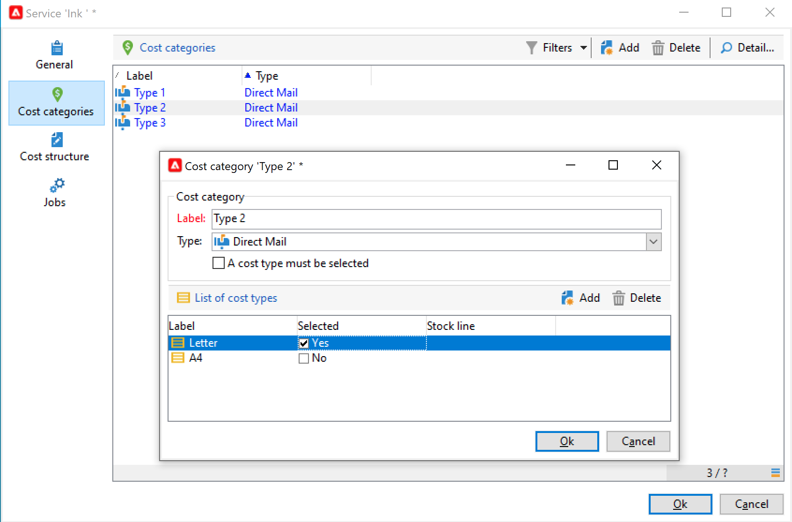
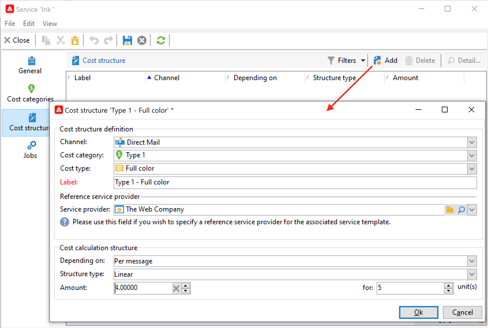

# Fornitori, scorte e budget{#providers-stocks-and-budgets}

Adobe Campaign ti consente di definire i provider di servizi che saranno coinvolti nei lavori svolti all’interno delle campagne. Dal punto di vista principale, l’amministratore di Adobe Campaign definisce le informazioni relative ai fornitori di servizi e alle relative strutture di costo. Il fornitore di servizi è indicato dalla consegna e le sue strutture di costo consentono il calcolo dei costi associati a tale consegna e la gestione delle scorte in questione.

## Creare fornitori di servizi e relative strutture di costo {#create-service-providers-and-their-cost-structures}

Ogni provider di servizi viene salvato in un file con i dati di contatto, i modelli di servizio e i relativi processi.

I provider di servizi sono configurati nel **[!UICONTROL Administration > Campaign management]** cartella di Campaign explorer.

I lavori svolti durante le consegne sono eseguiti dai fornitori di servizi, in particolare per la direct mailing e i canali mobili. Questi fornitori di servizi possono, ad esempio, essere coinvolti nella stampa o nella distribuzione di messaggi. Questi lavori comportano configurazioni e costi specifici per ogni fornitore di servizi. La configurazione dei fornitori di servizi prevede quattro fasi:

1. Creazione di un provider di servizi in Adobe Campaign. [Ulteriori informazioni](#add-a-service-provider)

1. Definizione delle categorie di costi e delle strutture dei modelli di servizio associati. [Ulteriori informazioni](#define-cost-categories)

1. Configurazione dei processi. [Ulteriori informazioni](#configure-processes-associated-with-a-service).

1. Riferimento al provider di servizi a livello di campagna. [Ulteriori informazioni](#associate-a-service-with-a-campaign).

### Creare un provider di servizi e le relative categorie di costi {#create-a-service-provider-and-its-cost-categories}

#### Aggiungere un provider di servizi {#add-a-service-provider}

Puoi creare quanti provider di servizi sono necessari per le consegne. La procedura per l&#39;aggiunta di un fornitore di servizi è la seguente:

1. Fai clic sul pulsante **[!UICONTROL New]** , sopra l’elenco dei fornitori di servizi.
1. Nella sezione inferiore della finestra specificare il nome e i dati di contatto del fornitore del servizio.

   

1. Fai clic sul pulsante **[!UICONTROL Save]** per aggiungere il provider di servizi all&#39;elenco.

#### Definire le categorie di costi {#define-cost-categories}

È ora possibile associare i modelli di servizio a ciascun provider di servizi. In questi modelli è innanzitutto necessario identificare le categorie di costi e, se necessario, le scorte interessate. È quindi possibile creare le regole di calcolo dei costi per ciascuna categoria, tramite le strutture dei costi. [Ulteriori informazioni](#define-the-cost-structure).

Una categoria di costo è un’entità contenente un insieme di costi ammissibili per un tipo di consegna (e-mail, direct mailing, SMS, ecc.). Le categorie di costo sono raggruppate nei modelli di servizi associati ai fornitori di servizi. Ogni provider di servizi può fare riferimento a uno o più modelli di servizio.

Per creare un modello di servizio e definirne il contenuto, effettua le seguenti operazioni:

1. In **[!UICONTROL Services]** scheda del provider di servizi, fai clic sul pulsante **[!UICONTROL Add]** e immettere il nome del modello di servizio.

   

1. Crea le categorie di costi per ogni tipo di processo (consegna tramite direct mailing/email/ecc.) o attività). A questo scopo, fai clic sul pulsante **[!UICONTROL Cost categories]** e quindi la **[!UICONTROL Add]** e immettere i parametri di ciascuna categoria di costo.

   

   * Inserire un&#39;etichetta per questa categoria di costo e selezionare il tipo di processo interessato: **[!UICONTROL Direct mail]**, **[!UICONTROL Email]**, **[!UICONTROL Mobile]**, ecc.
   * Fai clic sul pulsante **[!UICONTROL Add]** per definire i tipi di costo associati a questa categoria.
   * Se necessario, ha associato una linea di magazzino a ciascun tipo di costo in modo che i quantitativi utilizzati siano automaticamente correlati alle scorte esistenti.

      >[!NOTE]
      >
      >Le linee di stock sono definite nel **[!UICONTROL Stock management]** nodo. [Ulteriori informazioni](#stock-and-order-management).

1. È possibile preselezionare un valore per questa categoria di costo, che è l&#39;impostazione predefinita nelle categorie di costo del fornitore di servizi (invece di un valore vuoto). A questo scopo, abilita la **Sì** in **[!UICONTROL Selected]** colonna relativa al tipo di categoria in questione:

   

   A livello di consegna, il valore verrà selezionato per impostazione predefinita.

### Definire la struttura dei costi {#define-the-cost-structure}

Per ogni tipo di costo, la struttura del costo specifica le regole di calcolo da applicare.

Fai clic sul pulsante **[!UICONTROL Cost structure]** per configurare il calcolo del costo per ogni categoria e tipo di costo. Fai clic su **[!UICONTROL Add]** e inserire la struttura dei costi.

* Per creare la struttura dei costi, selezionare il tipo di messaggio e la categoria di costi interessati dagli elenchi a discesa, nonché il tipo di costo a cui si applica la regola di calcolo. Il contenuto di questi elenchi a discesa deriva dalle informazioni immesse tramite il **[!UICONTROL Cost categories]** scheda .

   È necessario assegnare un&#39;etichetta alla struttura dei costi. Per impostazione predefinita, dispone del seguente profilo di consegna: **Categoria di costo - Tipo di costo**.

   È tuttavia possibile rinominarlo: inserisci il valore desiderato direttamente nel **[!UICONTROL Label]** campo .

* La formula di calcolo del costo è definita nella sezione inferiore della finestra.

   Questa formula può essere fissa (per qualsiasi numero di messaggi) o calcolata in base al numero di messaggi.

   Quando dipende dal numero di messaggi, la struttura di calcolo del costo può essere **[!UICONTROL Linear]**, **[!UICONTROL Linear by threshold]** oppure **[!UICONTROL Constant by threshold]**.

#### Struttura lineare {#linear-structure}

Se la quantità è sempre la stessa per un messaggio (o un batch di messaggi) indipendentemente dal numero totale di messaggi, seleziona **[!UICONTROL Linear]** e inserisci il costo di ogni messaggio.

Se tale importo si applica a un batch di messaggi, specificare il numero di messaggi interessati nel **[!UICONTROL for]** campo .

#### Struttura lineare per soglia {#linear-structure-by-threshold}

Se l’importo viene applicato in base alla soglia per ogni messaggio, devi definire un **[!UICONTROL Linear by threshold]** struttura di calcolo. In questo tipo di struttura dei costi, ogni messaggio costerà 0,13, ad esempio, se il numero totale di messaggi è compreso tra 1 e 100 e costerà 0,12 da 100 a 1000 messaggi inviati, o 0,11 oltre 1000 messaggi.

La configurazione è la seguente:

Per aggiungere una soglia, fai clic sul pulsante **[!UICONTROL Add]** a destra dell&#39;elenco.

#### Struttura costante per soglia {#constant-structure-by-threshold}

Infine, puoi configurare un calcolo dei costi in base al numero totale di messaggi. A questo scopo, seleziona una **[!UICONTROL Constant by threshold]** struttura di calcolo. Ad esempio, il costo verrà fissato a un importo fisso di 12,00 per 1 a 100 messaggi e a 100,00 per una consegna di 101 a 1000 messaggi e a 500,00 per qualsiasi consegna oltre 1000 messaggi, indipendentemente dal numero totale.

### Configurare i processi associati a un servizio {#configure-processes-associated-with-a-service}

È possibile associare informazioni sui processi associati al provider di servizi tramite **[!UICONTROL Jobs]** scheda . Questa sezione consente di configurare l&#39;invio di informazioni al router.

* La **[!UICONTROL File extraction]** la sezione indica il modello di esportazione utilizzato per la consegna quando il servizio è selezionato. È possibile indicare il nome del file di output nel **[!UICONTROL Extraction file]** campo . Il pulsante a destra del campo consente di inserire le variabili.

* La **[!UICONTROL Notification email]** consente di specificare il modello per la notifica ai provider di servizi dopo l’invio dei file. Seleziona il modello utilizzato per creare il messaggio di avviso e il gruppo di destinatari.

   Per impostazione predefinita, i modelli di consegna per i messaggi di notifica vengono salvati nella **[!UICONTROL Administration > Campaign management > Technical delivery templates]** , accessibile dalla visualizzazione generale.

* La **[!UICONTROL Post-processing]** consente di selezionare il flusso di lavoro da avviare dopo l’approvazione della consegna. Se si immette un modello di flusso di lavoro, viene automaticamente creata un’istanza di flusso di lavoro e quindi avviata non appena l’approvazione ha effetto. Questo flusso di lavoro può inviare il file di estrazione a un provider di servizi esterno per l’elaborazione, ad esempio.

### Associare un servizio a una campagna {#associate-a-service-with-a-campaign}

I fornitori di servizi sono associati alle consegne delle campagne. Nei modelli di consegna sono indicati i riferimenti per offrire i propri servizi nelle consegne create tramite questo modello.

Quando un servizio è selezionato, le categorie di costi corrispondenti al tipo di consegna (direct mailing, e-mail, ecc.) sono indicate automaticamente nella tabella centrale insieme alle opzioni di elaborazione definite.

>[!NOTE]
>
>Se non viene visualizzata alcuna categoria di costo quando si seleziona un servizio, significa che non è stata definita alcuna categoria di costo per questo tipo di processo. Ad esempio, per una consegna e-mail, se no **[!UICONTROL Email]** la categoria di costo del tipo è stata definita, non verrà visualizzata alcuna categoria e la selezione del servizio non avrà alcun effetto.

* Per una consegna direct mailing, puoi selezionare il servizio dalla finestra di configurazione.

   

* Per la consegna su canali mobili o telefonici, si applica la stessa modalità di selezione.
* Per una consegna e-mail, il servizio viene selezionato dalla **[!UICONTROL Advanced]** nelle proprietà di consegna, come nell’esempio seguente:

   

La **[!UICONTROL Amount to surcharge]** consente di aggiungere un costo per questa categoria nel contesto della consegna o dell’attività in questione.

È possibile definire una selezione obbligatoria di un tipo di costo durante la definizione delle categorie di costo per una consegna. A questo scopo, seleziona **[!UICONTROL A cost type must be selected]**.

## Gestione delle scorte e degli ordini {#stock-and-order-management}

I tipi di costo possono essere associati alle linee di magazzino per gestire avvisi, tenere traccia delle forniture e degli ordini di avvio.

La procedura per la creazione della gestione delle scorte e degli ordini in Adobe Campaign e gli operatori che avvertono in caso di forniture insufficienti per una consegna da effettuare è la seguente:

1. Creazione di azioni e riferimento a fornitori di servizi associati. [Ulteriori informazioni](#create-a-stock).

1. Aggiunta di linee di magazzino. [Ulteriori informazioni](#add-stock-lines).

1. Notifica agli operatori in caso di segnalazione. [Ulteriori informazioni](#alert-operators).

1. Ordini e forniture. [Ulteriori informazioni](#orders).

### Gestione delle scorte {#stock-management}

Adobe Campaign può avvisare un gruppo di operatori se le scorte sono esaurite o hanno raggiunto una soglia minima. I livelli delle scorte sono accessibili tramite **[!UICONTROL Stocks]** collegamento **[!UICONTROL Campaigns]** scheda tramite **[!UICONTROL Other choices]** collegamento dell&#39;area di navigazione.

#### Crea un titolo {#creating-a-stock}

Per creare un nuovo stock, effettuate le seguenti operazioni:

1. Fai clic sul pulsante **[!UICONTROL Create]** sopra l&#39;elenco delle scorte.
1. Immettere l&#39;etichetta della risorsa e selezionare il fornitore di servizi a cui è associata dall&#39;elenco a discesa. [Ulteriori informazioni](#create-service-providers-and-their-cost-structures).

#### Aggiungi linee di materiale {#add-stock-lines}

Una scorta comprende varie linee di scorta. Una linea di magazzino contiene una quantità iniziale di risorse che verranno utilizzate dalle consegne. Ciascuna linea di magazzino indica la quantità consumata, la quantità in magazzino e la quantità ordinata.

Quando crei una risorsa, fai clic sul pulsante **[!UICONTROL Stock lines]** per aggiungere nuove righe.

Una volta creata la risorsa, utilizzare il proprio dashboard per creare e monitorare le linee di scorta.

Fai clic sul pulsante **[!UICONTROL Create]** per aggiungere nuove linee di stock.

* Indicare la quantità inizialmente in magazzino nel **[!UICONTROL Initial stock]** campo . La **[!UICONTROL Consumed]** e **[!UICONTROL In stock]** i campi vengono calcolati automaticamente e aggiornati con l’avanzamento delle campagne.

   

* Indicare la soglia a partire dalla quale gli operatori devono essere avvisati per ordinare le scorte nel **[!UICONTROL Alert level]** campo . Una volta raggiunto il livello di avviso, nella finestra di approvazione delle consegne che utilizzano questo stock viene visualizzato un messaggio di avviso.

#### Associa un titolo a categorie di costo {#associate-a-stock-with-cost-categories}

Per un determinato fornitore di servizi, in un servizio, una linea di magazzino può essere referenziata da una delle categorie di costi, come segue:

### Tracciamento delle scorte {#stock-tracking}

#### Operatori di avvisi {#alert-operators}

Viene visualizzato un avviso quando una scorta a cui si fa riferimento in una consegna è insufficiente. Ad esempio, quando un file di estrazione viene approvato viene visualizzato il seguente avviso:

#### Ordini {#orders}

La **[!UICONTROL Orders]** la sottoscheda ti consente di visualizzare gli ordini correnti e salvare i nuovi ordini.

Per salvare un ordine, modifica la linea di magazzino di destinazione, fai clic sul pulsante **[!UICONTROL Add]** e specificare la data di consegna e la quantità ordinata.

>[!NOTE]
>
>Una volta raggiunta la data di consegna, la linea di magazzino ordinata scompare automaticamente e la quantità inserita nel **[!UICONTROL Volume on order]** viene aggiunto al campo **[!UICONTROL Tracking]** scheda . Questa quantità viene aggiunta automaticamente al volume delle scorte.

La **[!UICONTROL Consumptions]** contiene il volume consumato per campagna. Le informazioni di questa scheda vengono immesse automaticamente in base alle consegne eseguite. Fai clic sul pulsante **[!UICONTROL Edit]** per aprire la campagna in questione.

## Calcola budget {#calculate-budgets}

### Principio {#principle}

I costi vengono gestiti per consegne e campagne. In base ai progressi compiuti, questi costi sono assegnati ai bilanci.

I costi di consegna di una campagna sono consolidati a livello di campagna e i costi di tutte le campagne di un programma sono trasferiti al programma a cui sono associati. I rapporti dedicati ti consentono di tenere traccia dei budget per l’intera piattaforma o per ogni piano e per ogni programma.

### Implementazione {#implementation}

In una campagna, quando selezioni il budget devi inserire l&#39;importo iniziale. I costi calcolati saranno aggiornati automaticamente in base al livello di impegno degli importi inseriti (spese effettuate, attese, riservate, impegnate).

<!--
See [Calculating amounts](../../mrm/using/controlling-costs.md#calculating-amounts).

>[!NOTE]
>
>The procedure for creating budgets is presented in [Creating a budget](../../mrm/using/controlling-costs.md#creating-a-budget).
-->
