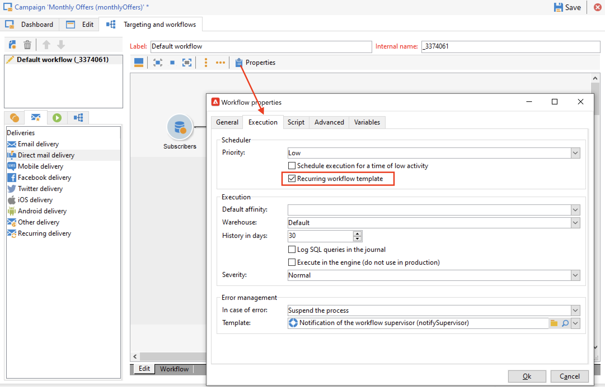

# Campagne ricorrenti e periodiche {#recurring-and-periodic-campaigns}

A **campagna ricorrente** è una campagna basata su un modello specifico, i cui flussi di lavoro sono configurati per essere eseguiti in base a una pianificazione associata. Il targeting viene duplicato su ogni esecuzione e vengono monitorati i vari processi e popolazioni target.  Una volta configurato, le campagne ricorrenti creano automaticamente un nuovo flusso di lavoro (duplicando il modello di flusso di lavoro) ed lo eseguono. Ad esempio, se devi inviare un promemoria mensile a un segmento di pubblico, configura una campagna ricorrente in modo che all’inizio di ogni anno vengano creati 12 flussi di lavoro, uno per ogni mese. [Ulteriori informazioni](#create-a-recurring-campaign)

A **campagna periodica** è una campagna basata su un modello specifico che consente di creare istanze di campagne basate su una pianificazione di esecuzione. Le istanze di Campaign vengono create automaticamente in base a un modello di campagna periodica, a seconda della frequenza definita nella pianificazione del modello. [Ulteriori informazioni](#create-a-periodic-campaign)

## Creare una campagna ricorrente {#create-a-recurring-campaign}

Le campagne ricorrenti vengono create da un modello specifico che definisce il modello di flusso di lavoro da eseguire e la pianificazione di esecuzione.

### Creare un modello per campagne ricorrenti {#create-the-campaign-template}

Per creare un modello per campagne ricorrenti, effettua le seguenti operazioni:

1. Apri Campaign Explorer e cerca **[!UICONTROL Resources > Templates > Campaign templates]**.
1. Duplica il predefinito **[!UICONTROL Recurring campaign]** modello.
   
1. Inserisci il nome del modello e la durata della campagna.
1. Per questo tipo di campagna, un **[!UICONTROL Schedule]** viene aggiunta una scheda per creare la pianificazione di esecuzione del modello. Utilizza questa scheda per definire le date di esecuzione delle campagne in base a questo modello.
   

   La modalità di configurazione della pianificazione di esecuzione coincide con la **[!UICONTROL Scheduler]** oggetto del flusso di lavoro. [Ulteriori informazioni](../workflow/scheduler.md).

   >[!CAUTION]
   >
   >La configurazione del programma di esecuzione deve essere eseguita con attenzione. Le campagne ricorrenti duplicano i flussi di lavoro del modello a seconda della pianificazione specificata. Questa operazione può sovraccaricare il database.

1. Specifica un valore nella **[!UICONTROL Create in advance for]** per creare i flussi di lavoro corrispondenti per il periodo indicato.
1. In **[!UICONTROL Targeting and workflows]** , progetta il modello di flusso di lavoro da utilizzare nelle campagne basate su questo modello. Questo flusso di lavoro contiene in genere i parametri di targeting e una o più consegne.

   >[!NOTE]
   >
   >Questo flusso di lavoro deve essere salvato come modello di flusso di lavoro ricorrente. A questo scopo, modifica le proprietà del flusso di lavoro e seleziona la **[!UICONTROL Recurring workflow template]** in **[!UICONTROL Execution]** scheda .

   

### Creare una campagna ricorrente {#create-the-recurring-campaign}

Per creare la campagna ricorrente ed eseguire i relativi flussi di lavoro in base alla pianificazione definita nel modello, devi:

1. Crea una nuova campagna basata sul modello di campagna ricorrente.
1. Compila la pianificazione dell’esecuzione del flusso di lavoro nella **[!UICONTROL Schedule]** scheda . La pianificazione della campagna ti consente di inserire una data di inizio automatica per la creazione o l’esecuzione di un flusso di lavoro per ogni riga.

   Per ogni riga, puoi aggiungere le seguenti opzioni aggiuntive:

   * Abilita la **[!UICONTROL To be approved]** per forzare le richieste di approvazione della consegna nel flusso di lavoro.
   * Abilita la **[!UICONTROL To be started]** per avviare il flusso di lavoro una volta raggiunta la data di inizio.

   La **[!UICONTROL Create in advance for]** consente di creare tutti i flussi di lavoro che coprono il periodo inserito.

   Al momento dell&#39;esecuzione del **[!UICONTROL Jobs on campaigns]** i flussi di lavoro dedicati vengono creati in base alle occorrenze definite nella pianificazione della campagna. Viene quindi creato un flusso di lavoro per ogni data di esecuzione.

1. I flussi di lavoro ricorrenti vengono creati automaticamente dal modello di flusso di lavoro presente nella campagna. Sono visibili dal **[!UICONTROL Targeting and workflows]** scheda della campagna.

   

   L’etichetta di un’istanza di flusso di lavoro ricorrente è costituita dall’etichetta del modello e dal numero del flusso di lavoro, con il carattere # compreso tra .

   I flussi di lavoro creati dalla pianificazione vengono associati automaticamente nella **[!UICONTROL Workflow]** della colonna **[!UICONTROL Schedule]** scheda .

   

   È possibile modificare ogni flusso di lavoro da questa scheda.

   >[!NOTE]
   >
   >La data di inizio della riga di pianificazione associata al flusso di lavoro è disponibile da una variabile del flusso di lavoro con la seguente sintassi:\
   >`$date(instance/vars/@startPlanningDate)`

## Creare una campagna periodica {#create-a-periodic-campaign}

Una campagna periodica è una campagna basata su un modello specifico che consente di creare istanze di campagna basate su una pianificazione di esecuzione. Le istanze di Campaign vengono create automaticamente in base a un modello di campagna periodica, a seconda della frequenza definita nella pianificazione del modello.

### Creare il modello di campagna {#create-the-campaign-template-1}

1. Apri Campaign Explorer e cerca **[!UICONTROL Resources > Templates > Campaign templates]**.
1. Duplica il predefinito **[!UICONTROL Periodic campaign]** modello.
1. Immetti le proprietà del modello.

   >[!NOTE]
   >
   >L’operatore a cui è assegnato il modello deve disporre delle autorizzazioni appropriate per creare campagne nel programma selezionato.

1. Crea il flusso di lavoro associato a questo modello. Questo flusso di lavoro viene duplicato in ogni campagna periodica creata dal modello.

   >[!NOTE]
   >
   >Questo flusso di lavoro è un modello di flusso di lavoro. Non può essere eseguito dal modello della campagna.

1. Completa la pianificazione di esecuzione come per un modello di campagna ricorrente: fai clic su **[!UICONTROL Add]** e definisci le date di inizio e di fine o compila la pianificazione di esecuzione tramite il collegamento.

   >[!CAUTION]
   >
   >I modelli di campagne periodiche creano nuove campagne in base alla pianificazione definita in precedenza. Deve pertanto essere completato con attenzione, per evitare di sovraccaricare il database Adobe Campaign.

1. Una volta raggiunta la data di inizio dell’esecuzione, la campagna corrispondente viene creata automaticamente. Prende tutte le caratteristiche del suo modello.

   È possibile modificare ogni campagna tramite la pianificazione dei modelli.

   Ogni campagna periodica contiene gli stessi elementi. Una volta creato, viene gestito come campagna standard.
