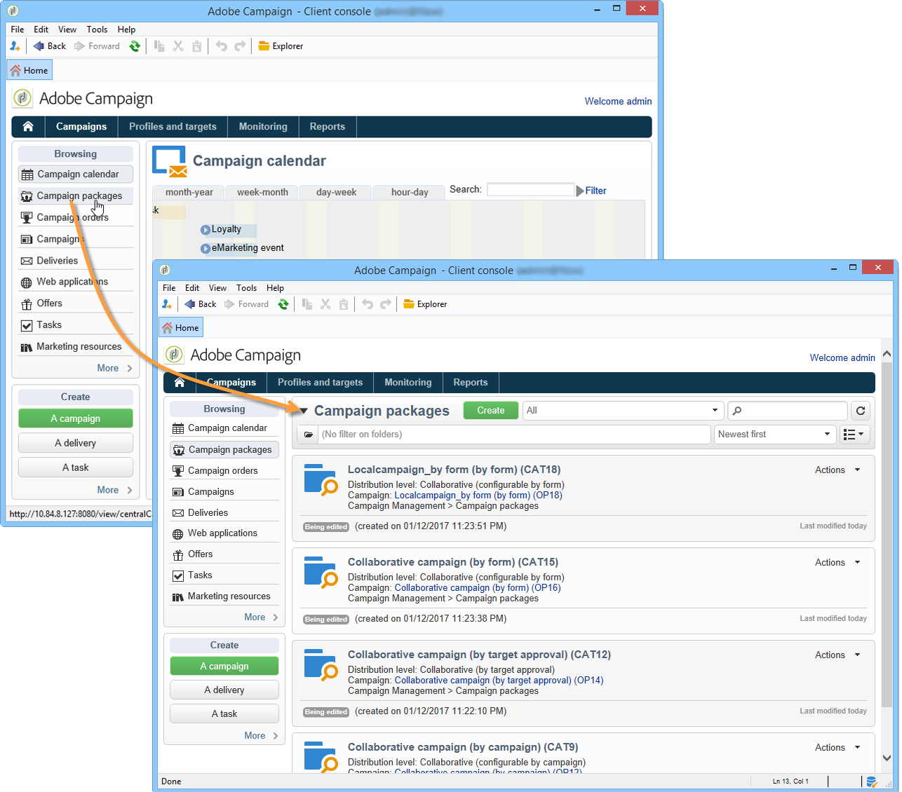

# Introduzione al marketing distribuito{#about-distributed-marketing}

Adobe Campaign offre **Marketing distribuito** domanda di attuazione di campagne di cooperazione tra enti centrali (sedi centrali, dipartimenti di marketing, ecc.) e gli enti locali (punti vendita, agenzie regionali, ecc.). Questa cooperazione si basa su un’area di lavoro condivisa nota come **[!UICONTROL list of campaign packages]**: i modelli e le istanze di campagna creati a livello centrale sono offerti alle entità locali.

L’entità centrale fornisce campagne che le entità locali possono utilizzare. Le campagne vengono materializzate da pacchetti che rappresentano campagne locali o collaborative. Per utilizzare una campagna, l’entità locale deve ordinarla e l’ordine deve essere approvato.

>[!CAUTION]
>
>Il modulo Marketing distribuito è un **Campagna** opzione. Controlla il contratto di licenza.

## Terminologia {#terminology}

* **Entità centrali**

  Gli enti centrali sono composti da operatori di marketing incaricati di specificare le comunicazioni e assistere gli enti locali nell’esecuzione della loro campagna di marketing.

  Il modulo di marketing distribuito consente all’entità centrale di:

   * configurare pacchetti di campagne di marketing per enti locali,
   * aumentare il grado di autonomia delle entità locali per quanto riguarda la scelta di comunicazione, targeting, contenuto, ecc. tra clienti e potenziali.
   * gestire e controllare i costi,
   * gestisce una rete di agenzie.

* **Entità locali**

  Gli enti locali possono essere agenzie, negozi o gruppi di operatori locali specifici (responsabili nazionali o regionali, gestori di marchi, ecc.).

  Il Marketing distribuito consente alle entità locali di disporre di maggiore autonomia, ottimizzando al contempo i costi di esecuzione.

* **Localizzazione**

  La localizzazione è la capacità di un’entità locale di modificare la destinazione e il contenuto di una campagna. Il possibile livello di localizzazione dipende dal tipo di campagna e dalla relativa implementazione.

* **Elenco dei pacchetti di campagne**

  L’elenco dei pacchetti di campagne contiene le campagne disponibili per le entità locali.

* **Pacchetto campagne**

  Modello (o istanza della campagna) creato da un&#39;entità centrale e reso disponibile a un set di entità locali.

* **Campagna locale**

  Una campagna locale è un’istanza creata da un modello a cui si fa riferimento nell’elenco di **[!UICONTROL campaign packages]** con un **pianificazione di esecuzione specifica**. Il suo obiettivo è soddisfare una necessità di comunicazione locale utilizzando un modello di campagna configurato e configurato dall’entità centrale.

  Il grado di autonomia dell’entità locale dipende dall’implementazione utilizzata.

  Fai riferimento a [Creazione di una campagna locale](creating-a-local-campaign.md).

* **Campagna collaborativa**

  Una campagna collaborativa è una campagna **pianificazione di esecuzione definita** dall&#39;entità centrale, che l&#39;entità locale può utilizzare. Il contenuto rimane lo stesso per ogni entità locale, ma i costi sono condivisi. Per partecipare, gli enti locali si abbonano alla campagna collaborativa.

   * **[!UICONTROL Collaborative campaign (by form)]**: consigliato per campagne che coinvolgono fino a 300 entità locali. L’entità locale può immettere parametri predefiniti per il targeting e la personalizzazione del contenuto in un modulo web. Il modulo può essere un modulo Adobe Campaign o un modulo esterno (client Extranet). Un amministratore funzionale può definire e configurare il modulo in base a un modello di modulo definito dall&#39;integratore. Per ordinare la campagna, l’entità locale ha solo bisogno dell’accesso web.
   * **[!UICONTROL Collaborative campaign (by campaign)]**: consigliato per campagne destinate a decine di entità locali. Questo tipo di campagna crea campagne secondarie per ogni entità locale. Una volta **[!UICONTROL collaborative campaign (by campaign)]** è approvata dall’entità centrale, la campagna viene resa disponibile all’entità locale, che può modificarla. L’esecuzione viene sincronizzata automaticamente tra le campagne principali e secondarie. L’entità locale deve avere accesso a un’istanza per ordinare una campagna e parteciparvi.
   * **[!UICONTROL Collaborative campaign (by target approval)]**: consigliato per campagne indirizzate a diverse migliaia di enti locali. L&#39;entità locale riceve un elenco di contatti predefinito dall&#39;entità centrale. L’entità locale decide se mantenere o meno alcuni contatti in base al contenuto della campagna tramite un modulo web. Le entità locali vengono dedotte dall&#39;elenco dei contatti selezionati. Per partecipare alla campagna, l’entità locale ha solo bisogno dell’accesso web.
   * **[!UICONTROL Collaborative campaign (simple)]**: questa modalità garantisce la compatibilità con i processi di esecuzione specifici delle versioni precedenti.

  Fai riferimento a [Creazione di una campagna collaborativa](creating-a-collaborative-campaign.md).

**Ordinamento di pacchetti di campagne**

Se un’entità locale si registra per una campagna, questa viene inserita in un ordine che raggruppa tutte le informazioni relative alla localizzazione della campagna.

## Area di lavoro {#workspace}

L’elenco dei pacchetti della campagna è accessibile dalla sezione **Campagne** scheda: fai clic su **[!UICONTROL Campaign packages]** collegamento.

Questa finestra consente a tutti gli operatori locali di visualizzare le campagne disponibili per la propria agenzia locale.

Nel caso delle agenzie centrali, questa finestra visualizza tutti i pacchetti disponibili nell’elenco dei pacchetti della campagna e offre collegamenti aggiuntivi per la modifica dell’elenco.

## Operatori ed entità {#operators-and-entities}

Per iniziare, specifica gli operatori delle entità centrali e locali tramite **[!UICONTROL Access management]** cartella.

### Operatori {#operators}

È necessario creare operatori centrali e locali.

Gli operatori centrali devono appartenere al **[!UICONTROL Central management]** gruppo di operatori o avere **[!UICONTROL CENTRAL]** denominato right.

Gli operatori locali devono appartenere al **[!UICONTROL Local management]** gruppo di operatori o avere **[!UICONTROL LOCAL]** denominato right. Devono anche essere collegati al loro ente locale.

### Entità organizzative {#organizational-entities}

Per creare un’entità organizzativa, fai clic su **[!UICONTROL Administration > Access management > Organizational entities]** e fai clic sul pulsante **[!UICONTROL New]** sopra l’elenco delle entità.

Ogni entità organizzativa contiene informazioni di identificazione (etichetta, nome interno, informazioni di contatto, ecc.) e i gruppi coinvolti nel processo di approvazione degli ordini. Questi sono definiti nella sezione **[!UICONTROL Notifications and approvals]** sezione trovata in **[!UICONTROL General]** scheda.

* Definire un gruppo di notifica dei pacchetti: gli operatori di questo gruppo riceveranno una notifica ogni volta che un nuovo pacchetto viene aggiunto all’elenco dei pacchetti della campagna e ogni volta che una campagna diventa disponibile.
* Seleziona il gruppo di revisori incaricati di approvare gli ordini, ovvero quelli incaricati di approvare le campagne ordinate dall’entità locale.
* Infine, seleziona il gruppo di revisori incaricati di approvare la campagna locale (target, contenuto, budget, ecc.). Questo gruppo può essere aggiunto a durante l’ordine di una campagna, a seconda del modello.

>[!NOTE]
>
>Il processo di approvazione è presentato nel [Processo di approvazione](creating-a-local-campaign.md#approval-process) sezione.

## Implementazione {#implementation}

Le campagne di Marketing distribuito vengono create e pubblicate dall’entità centrale. Essi possono essere utilizzati da enti locali e centrali in funzione delle necessità.

La procedura di implementazione dipende dal tipo di pacchetto della campagna utilizzato e dai livelli di delega delle entità locali.

### Attività dell&#39;integratore {#integrator-side}

1. Creare entità locali.
1. Collega i destinatari agli operatori che gestiscono le entità locali.

   

1. Specificare i diritti e le regole di esplorazione per le entità locali
1. Specifica il set di campi necessari per la localizzazione della campagna:

   * la definizione dell&#39;obiettivo e la dimensione massima,
   * definizione del contenuto,
   * programma di esecuzione (data di contatto e data di estrazione), **solo per gli operatori locali**,
   * estensione dello schema dell’ordine con tutti i campi aggiuntivi necessari.

1. Creazione di un modulo Web (Adobe o extranet) che consente di visualizzare i parametri di localizzazione, valutare il target e il budget, nonché visualizzare in anteprima il contenuto e approvare l&#39;ordine.

   Per **campagne collaborative (per approvazione target)**, crea la tabella in cui verranno salvate le approvazioni per ogni entità locale.

### Attività di amministrazione funzionali {#functional-administrator-side}

Questi passaggi devono essere eseguiti durante la creazione di ogni campagna.

1. Aggiorna il modulo con i campi utilizzati per la localizzazione della campagna.
1. Crea un’istanza da un modello di campagna appropriato (campagna collaborativa) o duplica il modello di campagna (campagna locale).
1. Configura la campagna con i campi di localizzazione e il riferimento del modulo.
1. Pubblica la campagna.

### Attività dell’operatore locale {#local-operator-side}

Queste fasi devono essere eseguite per ogni campagna.

1. Una volta ricevuta la notifica della disponibilità del pacchetto della campagna, specifica la posizione della campagna (facoltativo).
1. Valuta il target, il budget, ecc.
1. Anteprima del contenuto della campagna.
1. Ordina la campagna.
