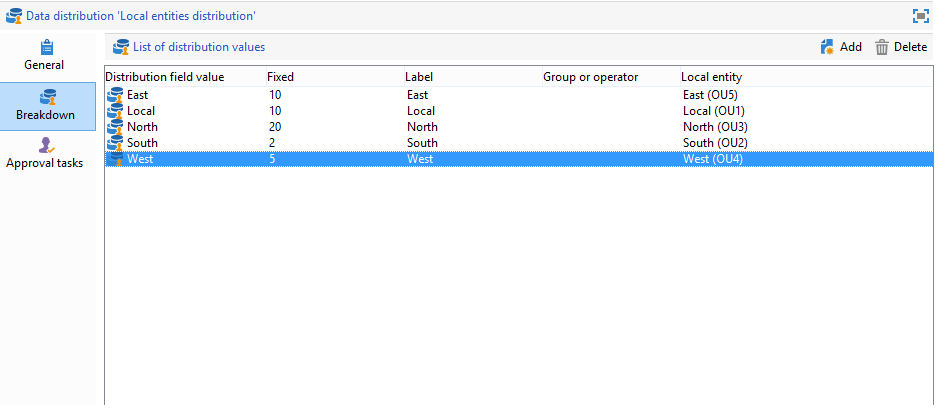

# Creare una campagna collaborativa{#creating-a-collaborative-campaign-intro}

L&#39;entità centrale crea campagne collaborative dai **modelli di campagne Marketing distribuito**. Consulta [questa pagina](about-distributed-marketing.md#collaborative-campaign).

## Creare una campagna collaborativa {#creating-a-collaborative-campaign}

Per configurare una campagna collaborativa, fare clic sulla cartella **[!UICONTROL Campaign management > Campaigns]**, quindi sull&#39;icona **[!UICONTROL New]**.

>[!NOTE]
>
>Oltre a **[!UICONTROL collaborative campaigns (by campaign)]**, queste campagne possono essere configurate ed eseguite tramite un&#39;interfaccia web.

Il processo di configurazione per un database di campagne collaborative è simile a quello di un modello di campagna locale. Le specifiche dei diversi tipi di campagne di collaborazione sono descritte di seguito.

### Per modulo {#by-form}

Per creare una campagna collaborativa (per modulo), è necessario selezionare il modello **[!UICONTROL Collaborative campaign (by form)]**.

Nella scheda **[!UICONTROL Edit]**, fai clic sul collegamento **[!UICONTROL Advanced campaign parameters...]** per accedere alla scheda **Marketing distribuito**.

Selezionare l&#39;interfaccia Web **Per modulo**. Questo tipo di interfaccia consente di creare campi di personalizzazione che verranno utilizzati dalle entità locali durante l’ordine di una campagna. Consulta [Creazione di una campagna locale (per modulo)](examples.md#creating-a-local-campaign--by-form-).

Salva la campagna. È ora possibile utilizzarlo dalla visualizzazione **Pacchetti campagna** nella scheda **Campaign** facendo clic sul pulsante **[!UICONTROL Create]**.

La visualizzazione **[!UICONTROL Campaign Package]** consente di utilizzare modelli di campagna locali (preconfigurati o duplicati), nonché campagne di riferimento per campagne collaborative, allo scopo di creare campagne per le diverse entità organizzative.

### Per campagna {#by-campaign}

Per creare una campagna collaborativa (per campagna), è necessario selezionare il modello **[!UICONTROL Collaborative campaign (by campaign) (opCollaborativeByCampaign)]**.

Quando ordina la campagna, l’entità locale può completare i criteri predefiniti dall’entità centrale e valutare la campagna prima di ordinarla.

Quando un ordine per una **campagna collaborativa (per campagna)** viene approvato dall&#39;entità centrale, viene creata una campagna figlio per l&#39;entità locale. Una volta disponibile, l’entità locale può quindi modificare:

* il flusso di lavoro della campagna,
* regole di tipologia,
* e di personalizzazione.

L’entità locale esegue la campagna figlio. L’entità centrale esegue la campagna principale.

L&#39;entità centrale può visualizzare tutte le campagne secondarie collegate a una **campagna collaborativa (per campagna)** da questo dashboard (tramite il collegamento **[!UICONTROL List of associated campaigns]**).

### Per approvazione target {#by-target-approval}

Per creare una campagna collaborativa (per approvazione target), è necessario selezionare il modello **[!UICONTROL Collaborative campaign (by target approval)]**.

>[!NOTE]
>
>In questa modalità, l’entità centrale non deve specificare le entità locali.

Il flusso di lavoro della campagna deve integrare l&#39;attività di tipo **Approvazione locale**. I parametri di attività sono i seguenti:

* **[!UICONTROL Action to perform]**: notifica di approvazione di Target.
* **[!UICONTROL Distribution context]**: Esplicito.
* **[!UICONTROL Data distribution]**: distribuzione entità locale.

**È necessario creare la distribuzione dei dati di tipo di entità locale**. Il modello di distribuzione dati consente di limitare il numero di record da un elenco di valori di raggruppamento. In **[!UICONTROL Resources > Campaign management > Data distribution]**, fare clic sull&#39;icona **[!UICONTROL New]** per creare un nuovo **[!UICONTROL Data distribution]**. Per ulteriori informazioni sulla distribuzione dei dati,

Selezionare la **dimensione di targeting** e la **[!UICONTROL Distribution field]**. Per **[!UICONTROL Assignment type]**, selezionare **Entità locale**.

Nella scheda **[!UICONTROL Distribution]**, aggiungi un campo per ogni entità locale e specifica il valore.

Puoi aggiungere una seconda **approvazione Target** dopo l&#39;attività di tipo **Consegna** per configurare un report su di essa.

Nel messaggio di notifica per la creazione della campagna, l’entità locale riceve un elenco di contatti predefinito dai parametri dell’entità centrale.

L’entità locale può eliminare alcuni contatti in base al contenuto della campagna.

### Semplice {#simple}

Per creare una semplice campagna collaborativa, è necessario selezionare il modello **[!UICONTROL Collaborative campaign (simple)]**.

## Creazione di un pacchetto di campagne collaborative {#creating-a-collaborative-campaign-package}

Per rendere una campagna disponibile alle entità locali, l’entità centrale deve creare un pacchetto di campagna.

Applica i seguenti passaggi:

1. Nella sezione **[!UICONTROL Navigation]** della pagina **Campagne**, fai clic sul collegamento **[!UICONTROL Campaign packages]**.
1. Fai clic sul pulsante **[!UICONTROL Create]**.
1. La sezione nella parte superiore della finestra consente di selezionare il modello **[!UICONTROL New collaborative package (mutualizedEmpty)]**.
1. Seleziona la campagna di riferimento.
1. Specifica l’etichetta, la cartella e la pianificazione di esecuzione per il pacchetto della campagna.

### Date {#dates}

Le date di inizio e di fine definiscono il periodo di visibilità della campagna nell’elenco dei pacchetti della campagna.

Per **campagne collaborative**, l&#39;entità centrale deve specificare la scadenza per la registrazione e la personalizzazione.

>[!NOTE]
>
>**[!UICONTROL Personalization deadline]** consente all&#39;entità centrale di scegliere una scadenza entro la quale le entità locali devono aver consegnato i documenti (fogli di calcolo, immagini) da utilizzare per configurare la campagna. Questa non è un’opzione obbligatoria. Il passaggio secondario di questa data non influirà sull’implementazione della campagna.

### Pubblico {#audience}

L’entità centrale deve specificare le entità locali coinvolte per campagna non appena viene creata la campagna collaborativa.

>[!CAUTION]
>
>Impossibile approvare **[!UICONTROL Simple, by form and by campaign collaborative campaign kits]** a meno che non siano state specificate le entità locali rilevanti.

### Modalità di approvazione {#approval-modes}

Per **campagne collaborative**, puoi specificare la modalità di approvazione dell&#39;ordine.

In modalità manuale, l’entità locale deve abbonarsi alla campagna per poter partecipare.

In modalità automatica, l’entità locale è preabbonata alla campagna. Può annullare l’abbonamento alla campagna o modificarne i parametri senza aver bisogno dell’approvazione dell’entità centrale.

### Notifiche {#notifications}

La configurazione per le notifiche è identica alle notifiche per un’entità locale. Fai riferimento a [questa sezione](creating-a-local-campaign.md#notifications).

## Ordinare una campagna {#ordering-a-campaign}

Quando una campagna collaborativa viene aggiunta all&#39;elenco dei pacchetti della campagna, le entità locali appartenenti al pubblico definito dall&#39;entità centrale ricevono una notifica (le **campagne collaborative (per approvazione target)** non hanno un pubblico predefinito). Il messaggio inviato contiene un collegamento che consente di registrarsi alla campagna, come illustrato di seguito:

Questo messaggio consente inoltre alle entità locali di visualizzare la descrizione immessa dall’operatore centrale che ha creato il pacchetto, nonché i documenti collegati alla campagna. Questi non appartengono alla campagna stessa, anche se forniscono informazioni aggiuntive su di essa.

Dopo aver effettuato l’accesso tramite un’interfaccia web, gli operatori locali possono immettere informazioni personalizzate per la campagna collaborativa che desiderano ordinare:

Dopo che un ente locale ha completato la registrazione, gli enti centrali ricevono una notifica via e-mail per approvare l’ordine.

Per ulteriori informazioni, consulta la sezione [Processo di approvazione](creating-a-local-campaign.md#approval-process).

## Approvare un ordine {#approving-an-order}

Il processo di approvazione di un ordine di pacchetti di campagne collaborative è lo stesso utilizzato per una campagna locale. Fai riferimento a [questa sezione](creating-a-local-campaign.md#approving-an-order).
