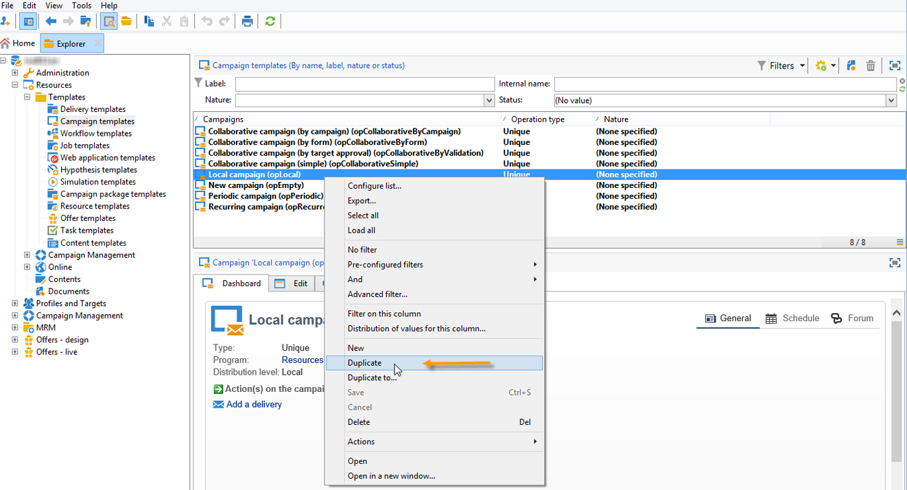
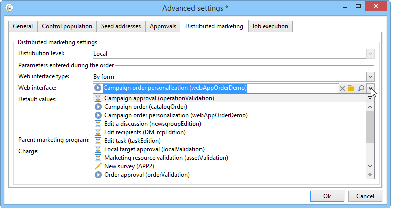
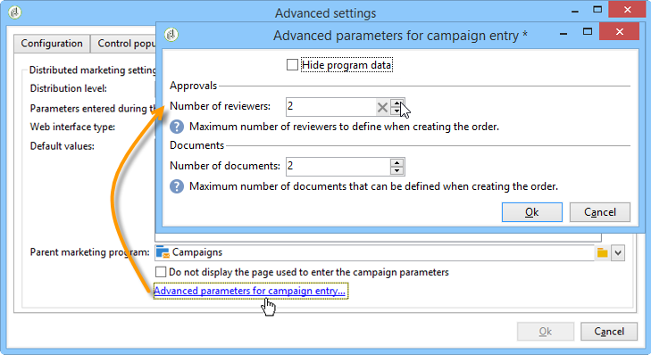

# Creare una campagna locale{#creating-a-local-campaign}

Una campagna locale è un’istanza creata da un modello a cui si fa riferimento nell’elenco di **[!UICONTROL campaign packages]** con un **pianificazione di esecuzione specifica**. Il suo obiettivo è soddisfare una necessità di comunicazione locale utilizzando un modello di campagna configurato e configurato dall’entità centrale. Le fasi principali per l&#39;attuazione di un&#39;operazione locale sono le seguenti:

**Per l&#39;entità centrale**

1. Creazione di un modello di campagna locale.
1. Creazione di un pacchetto di campagna da un modello.
1. Pubblicazione di un pacchetto della campagna.
1. Approvazione degli ordini.

**Per l’entità locale**

1. Ordinamento della campagna.
1. Esecuzione di campagne.

## Creazione di un modello di campagna locale {#creating-a-local-campaign-template}

Per creare un pacchetto della campagna, devi innanzitutto creare **modello di campagna** tramite **[!UICONTROL Resources > Templates]** nodo.

Per creare un nuovo modello locale, duplicare il modello predefinito **[!UICONTROL Local campaign (opLocal)]** modello.

Denomina il modello della campagna e completa i campi disponibili.

Nella finestra della campagna, fai clic su **[!UICONTROL Edit]** , quindi fare clic sulla scheda **[!UICONTROL Advanced campaign parameters...]** collegamento.

### Interfaccia Web {#web-interface}

In **Marketing distribuito** , è possibile scegliere il tipo di interfaccia Web e specificare i valori e i parametri predefiniti da immettere quando un&#39;entità locale effettua un ordine.

L’interfaccia web corrisponde a un modulo che l’entità locale deve compilare quando ordina la campagna.

Seleziona il tipo di interfaccia web da applicare alle campagne create dal modello:

Sono disponibili quattro tipi di interfacce web:

* **[!UICONTROL By brief]** : l’entità locale deve fornire una descrizione che descriva le configurazioni della campagna. Una volta approvato l’ordine, l’entità centrale configura ed esegue la campagna nel suo insieme.

  

* **[!UICONTROL By form]** : l’entità locale ha accesso a un modulo web in cui, a seconda del modello utilizzato, può modificare il contenuto, il target, la sua dimensione massima, nonché le date di creazione ed estrazione utilizzando i campi di personalizzazione. L’entità locale può valutare la destinazione e visualizzare in anteprima il contenuto di questo modulo web.

  

  Il modulo offerto è specificato in un’applicazione web che deve essere selezionata in un elenco a discesa dal **[!UICONTROL web Interface]** nel campo del modello **[!UICONTROL Advanced campaign parameters...]** collegamento. Fai riferimento a [Creazione di una campagna locale (per modulo)](examples.md#creating-a-local-campaign--by-form-).

  >[!NOTE]
  >
  >L’applicazione web utilizzata in questo esempio è un esempio. Devi creare un’app web specifica per poter utilizzare un modulo.

  

* **[!UICONTROL By external form]** : l’entità locale ha accesso ai parametri della campagna nella sua extranet (non Adobe Campaign). Questi parametri sono identici a quelli di un **campagna locale (per modulo)**.
* **[!UICONTROL Pre-set]** : l’entità locale ordina la campagna utilizzando il modulo predefinito, senza localizzarlo.

  

### Valori predefiniti {#default-values}

Seleziona la **[!UICONTROL Default values]** deve essere compilata dagli enti locali. Ad esempio:

* date di contatto e di estrazione,
* caratteristiche del target (segmento di età, ecc.).

Completa il **[!UICONTROL Parent marketing program]** e **[!UICONTROL Charge]** campi.

### Approvazioni {#approvals}

Dalla sezione **[!UICONTROL Advanced parameters for campaign entry]** , puoi specificare il numero massimo di revisori.

I revisori verranno inseriti dall&#39;entità locale quando si ordina la campagna.

Se non desideri assegnare un nome ai revisori per una campagna, immetti 0.

### Documenti {#documents}

Puoi consentire agli operatori di entità locali di collegare documenti (file di testo, fogli di calcolo, immagini, descrizioni di campagne, ecc.) alla campagna locale durante la creazione dell’ordine. Il **[!UICONTROL Advanced parameters for campaign entry...]** consente di limitare il numero di documenti. A questo scopo, inserisci semplicemente il numero massimo consentito nella **[!UICONTROL Number of documents]** campo.

Quando si ordina un pacchetto della campagna, il modulo suggerisce di collegare tutti i documenti come indicato nel campo corrispondente nel modello.

Se non desideri visualizzare un campo di caricamento documento, immetti **[!UICONTROL 0]** nel **[!UICONTROL Number of documents]** campo.

>[!NOTE]
>
>Il **[!UICONTROL Advanced parameters for campaign entry]** può essere disattivato selezionando **[!UICONTROL Do not display the page used to enter the campaign parameters]**.

### Flusso di lavoro {#workflow}

In **[!UICONTROL Targeting and workflows]** , crea il flusso di lavoro della campagna che raccoglie i **[!UICONTROL Default values]** specificato in **[!UICONTROL Advanced campaign parameters...]** e crea le consegne.

Fai doppio clic su **[!UICONTROL Query]** per configurarlo in base al valore specificato **[!UICONTROL Default values]**.

### Consegna {#delivery}

In **[!UICONTROL Audit]** , fare clic sulla scheda **[!UICONTROL Detail...]** per visualizzare **[!UICONTROL Scheduling]** per la consegna selezionata.

Il **[!UICONTROL Scheduling]** L’icona ti consente di configurare il contatto e la data di esecuzione della consegna.

Se necessario, configura la dimensione massima della consegna:

Individua il HTML della consegna. Ad esempio, in **[!UICONTROL Delivery > Current order > Additional fields]**, utilizza **[!UICONTROL Age segment]** per individuare la consegna in base all’età del target.

Salva il modello della campagna. Ora puoi utilizzarlo dalla sezione **[!UICONTROL Campaign packages]** visualizzare in **[!UICONTROL Campaigns]** , facendo clic sulla scheda **[!UICONTROL Create]** pulsante.

>[!NOTE]
>
>I modelli di campagna e la loro configurazione generale sono descritti in dettaglio nella [questa pagina](../campaigns/marketing-campaign-templates.md).

## Creazione del pacchetto della campagna {#creating-the-campaign-package}

Affinché il modello della campagna diventi disponibile per le entità locali, è necessario aggiungerlo all’elenco. Per farlo, l&#39;agenzia centrale deve creare un nuovo pacchetto.

Applica i seguenti passaggi:

1. In **[!UICONTROL Navigation]** sezione sul **Campagne** , fare clic su **[!UICONTROL Campaign packages]** collegamento.
1. Fai clic sul pulsante **[!UICONTROL Create]**.

   

1. La sezione sopra la finestra consente di selezionare [in precedenza](#creating-a-local-campaign-template) modello di pacchetto della campagna specificato.

   Per impostazione predefinita, il **[!UICONTROL New local campaign package (localEmpty)]** Il modello viene utilizzato per le campagne locali.

1. Specifica l’etichetta, la cartella e la pianificazione di esecuzione per il pacchetto della campagna.

### Date {#dates}

Le date di inizio e di fine definiscono il periodo di visibilità della campagna nell’elenco dei pacchetti della campagna.

La data di disponibilità è la data in cui la campagna diventerà disponibile per le entità locali (per l&#39;ordine).

>[!CAUTION]
>
>Se un’entità locale non riserva la campagna prima della scadenza, non potrà utilizzarla.

Queste informazioni si trovano nel messaggio di notifica inviato alle agenzie locali, come mostrato di seguito:

### Pubblico {#audience}

Per una campagna locale, l’entità centrale può specificare le entità locali coinvolte controllando **[!UICONTROL Limit the package to a set of local entities]**.

### Impostazioni aggiuntive {#additional-settings}

Una volta salvato il pacchetto, l’entità centrale può modificarlo dalla **[!UICONTROL Edit]** scheda.

Dalla sezione **[!UICONTROL General]** , l’entità centrale può:

* configura i revisori del pacchetto campaign da **[!UICONTROL Approval parameters...]** collegamento,
* rivedere il programma di esecuzione,
* aggiungere o eliminare entità locali.

>[!NOTE]
>
>Per impostazione predefinita, ogni entità può ordinare un **campagna locale** una sola volta.
>   
>Controlla la **[!UICONTROL Enable multiple creation]** per consentire la creazione di diverse campagne locali dal pacchetto della campagna.

### Notifiche {#notifications}

Quando una campagna diventa disponibile o viene raggiunto il termine di registrazione, viene inviato un messaggio agli operatori del gruppo di notifica locale. Per ulteriori informazioni, consulta [Entità organizzative](about-distributed-marketing.md#organizational-entities).

## Ordinamento di una campagna {#ordering-a-campaign}

I pacchetti di campagne diventano accessibili alle entità locali dopo che sono stati approvati e il loro periodo di implementazione è iniziato. Le entità locali ricevono un’e-mail che informa sulla disponibilità di un nuovo pacchetto della campagna (non appena viene raggiunta la data di disponibilità).

>[!NOTE]
>
>Se durante la creazione del pacchetto della campagna sono state specificate alcune entità locali, queste saranno le uniche a ricevere una notifica. Se non è stata specificata alcuna entità locale, tutte le entità locali riceveranno una notifica.

Per utilizzare una campagna offerta dall&#39;entità centrale, l&#39;entità locale deve ordinarla.

Per ordinare una campagna:

1. Clic **[!UICONTROL Order campaign]** nel messaggio di notifica o il pulsante corrispondente in Adobe Campaign.

   Immetti ID e password per ordinare la campagna. L’interfaccia è costituita da un set di pagine definite in un’applicazione web.

1. Inserisci le informazioni necessarie nella prima pagina (etichetta dell’ordine e commento) e fai clic su **[!UICONTROL Next]**.

   

1. Completa i parametri disponibili e approva l’ordine.

1. Al manager dell&#39;entità organizzativa a cui appartiene l&#39;entità locale viene inviata una notifica per approvare l&#39;ordine.

   

1. Le informazioni vengono restituite agli enti locali e centrali. Mentre le entità locali possono visualizzare solo i propri ordini, l&#39;entità centrale può visualizzare tutti gli ordini per qualsiasi entità locale, come illustrato di seguito:

   

   Gli operatori possono visualizzare i dettagli dell’ordine:

   

   Il **[!UICONTROL Edit]** La scheda contiene le informazioni immesse dall’entità locale durante l’ordine della campagna.

   

1. L&#39;ordine deve essere approvato dall&#39;entità centrale per essere finalizzato.

   

   Per ulteriori informazioni, consulta [Processo di approvazione](#approval-process) sezione.

1. L’operatore locale viene quindi informato che la campagna è disponibile: la disponibilità della campagna si trova nell’elenco dei pacchetti di campagna all’interno di **Campagne** scheda. È quindi possibile utilizzare la campagna. Per ulteriori informazioni, consulta [Accesso alle campagne](accessing-campaigns.md).

   Il **[!UICONTROL Start targeting with order approval]** consente all’entità locale di eseguire la campagna non appena l’ordine è stato approvato.

   

## Approvazione di un ordine {#approving-an-order}

Per confermare un ordine della campagna, l’entità centrale deve approvarlo.

Il **[!UICONTROL Campaign orders]** panoramica, accessibile tramite **Campagne** Questa scheda ti consente di visualizzare lo stato degli ordini delle campagne e di approvarli.

>[!NOTE]
>
>Le entità locali possono apportare modifiche all&#39;ordine fino a quando non viene approvato.

### Processo di approvazione {#approval-process}

#### Notifica e-mail {#email-notification}

Quando una campagna viene ordinata da un’entità locale, i revisori vengono avvisati via e-mail, come illustrato di seguito:

>[!NOTE]
>
>La selezione dei revisori è presentata nel [Revisori](#reviewers) sezione. Possono accettare o rifiutare l’ordine.

#### Approva tramite la console client {#approving-via-the-adobe-campaign-console}

L’ordine può essere approvato anche tramite la console client, nella panoramica dell’ordine della campagna. Per approvare un ordine, selezionalo e fai clic su **[!UICONTROL Approve the order]**.

>[!NOTE]
>
>È comunque possibile modificare e riconfigurare la campagna fino alla data di disponibilità. Le entità locali possono inoltre rifiutare la campagna facendo clic sul pulsante **[!UICONTROL Cancel]** pulsante.

#### Creazione di una campagna {#creating-a-campaign}

Una volta approvato, l’ordine di una campagna può essere configurato ed eseguito dall’entità locale.

Per ulteriori informazioni, consulta [Accesso alle campagne](accessing-campaigns.md).

### Rifiuto di un’approvazione {#rejecting-an-approval}

L’operatore responsabile dell’approvazione può rifiutare un ordine o un pacchetto della campagna.

Se il revisore rifiuta un ordine, la relativa notifica viene inviata automaticamente alle entità locali interessate: viene visualizzato il commento inserito dall’operatore che ha rifiutato l’approvazione.

Le informazioni vengono visualizzate nell’elenco della pagina dei pacchetti della campagna o nella pagina dell’ordine della campagna. Se hanno accesso alla console client di Adobe Campaign, le entità locali vengono informate di questo rifiuto.

Possono visualizzare il commento correlato nel pacchetto della campagna **[!UICONTROL Edit]** scheda.

### Revisori {#reviewers}

Ogni volta che è richiesta un’approvazione, i revisori ricevono una notifica via e-mail.

Per ogni entità locale, i revisori vengono selezionati per l’approvazione dell’ordine della campagna e della campagna. Per ulteriori informazioni sulla selezione dei revisori locali, fare riferimento a [Entità organizzative](about-distributed-marketing.md#organizational-entities).

>[!NOTE]
>
>Affinché questa selezione sia possibile, l&#39;approvazione dell&#39;ordine non deve ancora essere effettiva.

### Annullamento di un ordine {#canceling-an-order}

L’agenzia centrale può annullare un ordine utilizzando **[!UICONTROL Delete]** nel dashboard dell&#39;ordine.

La campagna verrà annullata in **[!UICONTROL Campaign orders]** visualizzazione.
