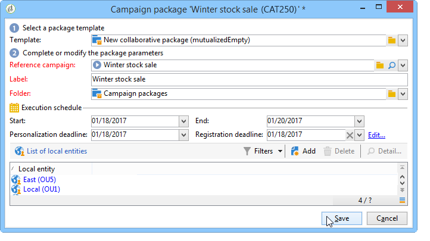

# Esempi di marketing distribuito{#distributed-marketing-samples}


## Creare una campagna locale (tramite modulo) {#creating-a-local-campaign--by-form-}

Il **Per modulo** l’interfaccia web di tipo prevede l’utilizzo di un **applicazione web**. A seconda della configurazione, questa applicazione web può contenere qualsiasi tipo di elementi personalizzati definiti. Ad esempio, puoi suggerire collegamenti per valutare il target, il budget, il contenuto e così via. tramite API dedicate.

>[!NOTE]
>
>L’applicazione web utilizzata in questo esempio non è un’app web pronta all’uso con Adobe Campaign. Per utilizzare un modulo in una campagna, devi creare l’applicazione web dedicata.

Durante la creazione del modello della campagna, fai clic su **[!UICONTROL Zoom]** all&#39;interno del **[!UICONTROL Web interface]** opzione del **[!UICONTROL Advanced campaign parameters...]** collegamento per accedere ai dettagli dell’applicazione web.


>[!NOTE]
>
>I parametri dell’applicazione web sono disponibili solo nel modello della campagna.

In **[!UICONTROL Edit]** , seleziona la scheda **Ordine delle campagne** e aprirlo per accedere al relativo contenuto.


In questo esempio, la proprietà **Ordine delle campagne** l&#39;attività include:

* campi che l’ente locale deve inserire durante l’ordine,

  

* collegamenti che consentano all’ente locale di valutare la campagna (ad esempio, target, budget, contenuto, ecc.),

  

* script che consentono di calcolare e visualizzare il risultato di queste valutazioni.

  

In questo esempio, vengono utilizzate le seguenti API:

* Per la valutazione del target,

  ```
  var res = nms.localOrder.EvaluateTarget(ctx.localOrder);
  ```

* Per la valutazione del bilancio,

  ```
  var res = nms.localOrder.EvaluateDeliveryBudget(ctx.@deliveryId, NL.XTK.parseNumber(ctx.@compt));
  ```

* Per la valutazione del contenuto,

  ```
  var res = nms.localOrder.EvaluateContent(ctx.localOrder, ctx.@deliveryId, "html", resSeed.@id);
  ```

## Creare una campagna collaborativa (tramite approvazione target) {#creating-a-collaborative-campaign--by-target-approval-}

### Introduzione {#introduction}

Sei il responsabile marketing di un grande marchio di abbigliamento che ha un negozio online e diverse boutique in tutti gli Stati Uniti. Ora che la primavera è arrivata, decidi di creare un&#39;offerta speciale che darà ai tuoi clienti migliori il 50% di sconto su tutti i vestiti nel tuo catalogo.

Questa offerta è rivolta ai migliori clienti dei tuoi negozi negli Stati Uniti, ovvero coloro che hanno speso più di $ 300 dall&#39;inizio dell&#39;anno.

Decidi quindi di utilizzare il Marketing distribuito per creare una campagna collaborativa (per approvazione target) che ti consenta di selezionare i migliori clienti dei tuoi store (raggruppati per regione), che riceveranno la consegna e-mail contenente l’offerta speciale.

La prima parte di questo esempio illustra le entità locali che ricevono la notifica di creazione della campagna e come utilizzarla per valutare la campagna e ordinarla.

La seconda parte di questo esempio spiega come creare la campagna.

I passaggi sono i seguenti:

**Per l’entità locale**

1. Utilizza la notifica di creazione della campagna per accedere all’elenco dei contatti selezionati dall’entità centrale.
1. Seleziona i contatti e approva la partecipazione.

**Per l&#39;entità centrale:**

1. Creare un **[!UICONTROL Data distribution]** attività.
1. Crea la campagna collaborativa.
1. Pubblica la campagna.

### Lato entità locale {#local-entity-side}

1. Le entità locali che sono state scelte per partecipare alla campagna riceveranno una notifica e-mail.

   

1. Facendo clic su **[!UICONTROL Access your contact list and approve targeting]** , l’entità locale ha accesso (tramite browser web) all’elenco dei client selezionati per la campagna.

   

1. L’ente locale deseleziona alcuni contatti dall’elenco perché è già stato contattato per un’offerta simile dall’inizio dell’anno.

   

Una volta approvati i controlli, la campagna può iniziare automaticamente.

### Lato entità centrale {#central-entity-side}

#### Creare un’attività di distribuzione dati {#creating-a-data-distribution-activity}

1. Per impostare una campagna collaborativa (tramite approvazione target) devi prima creare una **[!UICONTROL Data distribution activity]**. Fai clic su **[!UICONTROL New]** icona in **[!UICONTROL Resources > Campaign management > Data distribution]** cartella di Campaign explorer.

   

1. In **[!UICONTROL General]** , è necessario specificare:

   * il **[!UICONTROL Targeting dimension]**. Qui le **Distribuzione dei dati** viene eseguita il **Destinatari**.
   * il **[!UICONTROL Distribution type]**. Puoi scegliere un **Dimensioni fisse** o un **Dimensioni in percentuale**.
   * il **[!UICONTROL Assignment type]**. Seleziona la **Entità locale** opzione.
   * il **[!UICONTROL Distribution type]**. Ecco, è il **[!UICONTROL Origin (@origin)]** campo presente nella tabella Destinatario che consente di identificare la relazione tra il contatto e l’entità locale.
   * Il **[!UICONTROL Approval storage]** campo. Seleziona la **Approvazione locale del destinatario** opzione.

1. In **[!UICONTROL Breakdown]** , specificare:

   * il **[!UICONTROL Distribution field value]**, che corrisponde alle entità locali coinvolte nella prossima campagna.
   * l’entità locale **[!UICONTROL label]**.
   * il **[!UICONTROL Size]** (fisso o in percentuale). Il **0 valore predefinito** comporta la selezione di tutti i destinatari collegati all’entità locale.

   

1. Salva la nuova distribuzione dei dati.

#### Creare una campagna collaborativa {#creating-a-collaborative-campaign}

1. Dalla sezione **[!UICONTROL Campaign management > Campaign]** cartella di Campaign explorer, crea un nuovo **[!UICONTROL collaborative campaign (by target approval)]**.
1. In **[!UICONTROL Targeting and workflows]** , crea un flusso di lavoro per la campagna. Questo deve contenere **Dividi** attività in cui **[!UICONTROL Record count limitation]** è definito da **[!UICONTROL Data distribution]** attività.

   

1. Aggiungi un **[!UICONTROL Local approval]** azione in cui è possibile specificare:

   * il contenuto del messaggio che sarà inviato alle entità locali nella notifica,
   * il promemoria dell’approvazione,
   * elaborazione prevista per la campagna.

   

1. Salvare il record.

#### Pubblicare la campagna {#publishing-the-campaign}

Ora puoi aggiungere una **pacchetto della campagna** dal **[!UICONTROL Campaigns]** scheda.

1. Scegli il tuo **[!UICONTROL Reference campaign]**. In **[!UICONTROL Edit]** della confezione, è possibile selezionare la scheda **[!UICONTROL Approval mode]** da utilizzare per la campagna:

   * in **Manuale** in modalità, le entità locali partecipano alla campagna se accettano l’invito dall’entità centrale. Se lo desiderano, possono eliminare i contatti preselezionati ed è necessaria l’approvazione del manager per confermare la loro partecipazione alla campagna.
   * in **Automatico** , le entità locali devono partecipare alla campagna, a meno che non si annullino la registrazione. Possono eliminare i contatti senza bisogno di approvazione.

   

1. In **[!UICONTROL Description]** , è possibile aggiungere una descrizione della campagna ed eventuali documenti da inviare alle entità locali.

   

1. Approva il pacchetto della campagna, quindi avvia il flusso di lavoro per pubblicarlo e renderlo disponibile a tutte le entità locali nell’elenco dei pacchetti.

   

## Creare una campagna collaborativa (per modulo) {#creating-a-collaborative-campaign--by-form-}

### Introduzione {#introduction-1}

Sei il responsabile marketing per un grande marchio di trucco che ha un negozio online e diverse boutique in tutti gli Stati Uniti. Per scaricare il tuo stock invernale e fare spazio per il tuo nuovo stock, decidi di creare un’offerta speciale che sarà rivolta a due categorie di clienti: gli over 30, ai quali offrirai prodotti per la cura della pelle sensibili all’età, e gli under 30, ai quali offrirai i prodotti per la cura della pelle più semplici.

Decidi quindi di utilizzare il Marketing distribuito per creare una campagna collaborativa (per modulo) che ti consenta di selezionare i clienti dai diversi store in base alle fasce di età. Questi clienti riceveranno una consegna e-mail con un’offerta speciale che sarà stata personalizzata in base alla loro fascia di età.

La prima parte di questo esempio illustra le entità locali che ricevono la notifica di creazione della campagna e come utilizzarla per valutare la campagna e ordinarla.

La seconda parte di questo esempio spiega come creare la campagna.

I passaggi sono i seguenti:

**Per l’entità locale**

1. Utilizza la notifica di creazione della campagna per accedere al modulo online.
1. Personalizza la campagna (target, contenuto, volume di consegna).
1. Controlla questi campi e modificali se necessario.
1. Approva la tua partecipazione.
1. Il manager dell’entità locale (o dell’entità centrale) approva la configurazione e la partecipazione dell’utente.

**Per l&#39;entità centrale:**

1. Crea la campagna collaborativa.
1. Configurare **[!UICONTROL Advanced campaign parameters...]** come per una campagna locale.
1. Configura il flusso di lavoro della campagna e la consegna come faresti per una campagna locale.
1. Aggiornare il modulo web.
1. Crea il pacchetto della campagna e pubblicalo.

### Lato entità locale {#local-entity-side-1}

1. Le entità locali selezionate per partecipare alla campagna ricevono una notifica via e-mail che le informa della loro partecipazione alla campagna.

   

1. Le entità locali completano il modulo personalizzato, quindi:

   * valutare l&#39;obiettivo e il bilancio,
   * visualizzare in anteprima il contenuto della consegna,
   * approvano la loro partecipazione.

     

1. L’operatore incaricato di convalidare gli ordini ne approva la partecipazione.

   

### Lato entità centrale {#central-entity-side-1}

1. Per implementare una campagna collaborativa (per modulo), devi creare una campagna utilizzando **Campagna collaborativa (per modulo)** modello.

   

1. Nel di **[!UICONTROL Edit]** , fare clic sulla scheda **[!UICONTROL Advanced campaign parameters...]** per configurarlo come campagna locale. Fai riferimento a [Creazione di una campagna locale (per modulo)](#creating-a-local-campaign--by-form-).

   

1. Configura il flusso di lavoro della campagna e il modulo web. Fai riferimento a [Creazione di una campagna locale (per modulo)](#creating-a-local-campaign--by-form-).
1. Crea il pacchetto della campagna specificando la pianificazione di esecuzione e le entità locali coinvolte.

   

1. Completa la configurazione del pacchetto selezionando la modalità di approvazione in **[!UICONTROL Edit]** scheda.

   

1. Dalla sezione **[!UICONTROL Description]** , è possibile immettere una descrizione del pacchetto della campagna, un messaggio di notifica da inviare alle entità locali quando il pacchetto viene pubblicato e allegare eventuali documenti informativi al pacchetto della campagna.

   

1. Approva il pacchetto per pubblicarlo.

   
