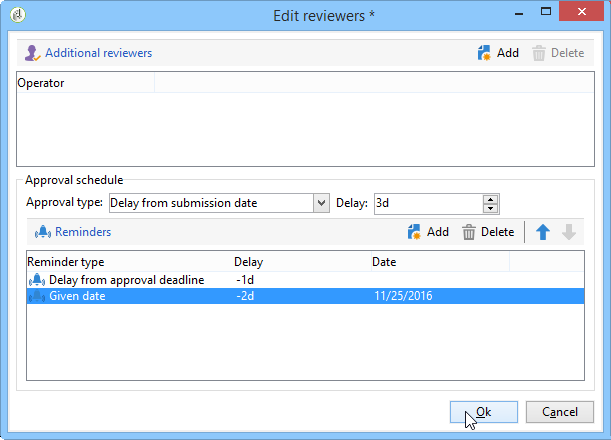

# Pubblicare il pacchetto della campagna{#publishing-the-campaign-package}

Gli operatori di entità centrali pubblicano le campagne che desiderano offrire alle entità locali in **[!UICONTROL list of campaign packages]**.

Prima di poter essere pubblicati nell’elenco dei pacchetti della campagna, i pacchetti della campagna devono essere approvati dall’entità centrale. A questo scopo, puoi specificare un revisore o un gruppo di revisori tramite il collegamento **[!UICONTROL Approval parameters]** nel pacchetto della campagna.

## Assegnare un revisore {#assigning-a-reviewer}

Per selezionare il revisore, fare clic sul collegamento **[!UICONTROL Approval parameters]** dal pacchetto della campagna e scegliere il revisore appropriato dall&#39;elenco a discesa.

È quindi possibile avviare il processo di approvazione facendo clic su **[!UICONTROL Submit for approval]**.

Viene quindi inviato un messaggio di notifica al revisore per confermare la disponibilità di questo pacchetto della campagna. Il messaggio contiene un collegamento per accettare o rifiutare l’approvazione tramite accesso web.

>[!NOTE]
>
>A livello di entità organizzativa, è inoltre possibile specificare revisori per approvare gli ordini. Per ulteriori informazioni, consulta [Entità organizzative](about-distributed-marketing.md#organizational-entities).

## Aggiungi altri revisori {#adding-other-reviewers}

Puoi aggiungere altri revisori dal collegamento **[!UICONTROL Edit...]**, che si trova nella scheda **[!UICONTROL Approval parameters...]** del pacchetto della campagna.

## Timeline di approvazione {#approval-periods}

Per impostazione predefinita, ai revisori vengono concessi tre giorni dalla data di invio per elaborare l’approvazione.

All’interno della finestra di modifica dei revisori, puoi anche impostare i promemoria per l’invio di uno o più messaggi se un pacchetto della campagna non è stato approvato. A tale scopo, fare clic sul collegamento **[!UICONTROL Add reminder]**, quindi sul pulsante **[!UICONTROL Add]**.

I promemoria possono essere inviati in una determinata data e/o **x** giorni dopo la data di invio. Il tipo di promemoria può essere configurato nella prima colonna della tabella dei promemoria. Nell&#39;esempio seguente, i revisori riceveranno un messaggio di promemoria il 01/11/2023, ovvero due giorni prima della data selezionata nella colonna **[!UICONTROL Date]**, e un secondo promemoria un giorno prima della fine del periodo di approvazione, ovvero due giorni dopo la data di invio per l&#39;approvazione.

Una volta definito e inviato il pacchetto per l&#39;approvazione, la pianificazione dell&#39;esecuzione viene visualizzata nella scheda **[!UICONTROL Audit]**. Mostra la scadenza dell’elaborazione calcolata in base alla configurazione precedente, nonché le date di tutti i promemoria configurati.

## Approva tramite la console client {#approving-via-the-adobe-campaign-console}

Se non è stato specificato alcun revisore o se nessuno degli operatori notificati ha approvato il pacchetto, il pulsante **[!UICONTROL Approve the package]** consente di passare direttamente all&#39;approvazione dal pacchetto della campagna **[!UICONTROL Dashboard]** o dalla panoramica dei pacchetti.

Dopo l’approvazione, la campagna viene pubblicata, aggiunta all’elenco e, non appena viene raggiunta la data di disponibilità, le entità locali possono utilizzarla. Se durante la creazione della campagna sono state specificate le entità locali, viene inviato un messaggio agli operatori nel gruppo di notifica per comunicare loro che la campagna è disponibile. Se in precedenza non è stata specificata alcuna entità, la campagna è disponibile per tutte le entità locali per impostazione predefinita. Per ulteriori informazioni, consulta [Entità organizzative](about-distributed-marketing.md#organizational-entities).
