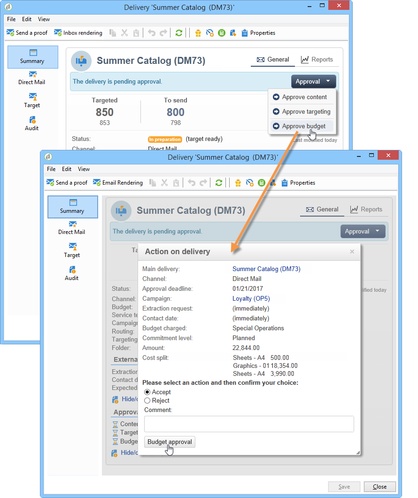

# Controllare i costi{#controlling-costs}

Adobe Campaign consente di controllare i costi di marketing pianificati, impegnati e fatturati e di suddividerli per categoria utilizzando il modulo Gestione delle risorse di marketing .

I costi impegnati per i vari processi di una campagna sono imputati a un budget definito in anticipo dal reparto marketing. Gli importi possono essere suddivisi in diverse categorie per rendere le informazioni più leggibili e fornire una relazione più dettagliata sugli investimenti di marketing.

La gestione e il tracciamento dei budget sono centralizzati in un nodo dedicato della struttura di Adobe Campaign. Questo consente di monitorare gli importi allocati, riservati, impegnati e spesi dalla stessa vista e per tutti i budget.

Per attuare la gestione del bilancio utilizzando MRM è necessario applicare le seguenti misure:

1. Definire il budget. [Ulteriori informazioni](#creating-a-budget).

1. Definire il metodo di calcolo del costo: per i fornitori di servizi sono definite le strutture dei costi. [Ulteriori informazioni](../campaigns/providers--stocks-and-budgets.md).

1. Definire i costi della campagna (consegne/attività) : i costi sostenuti dalle consegne e dalle attività vengono immessi singolarmente o globalmente per il modello della campagna. [Ulteriori informazioni](../campaigns/marketing-campaign-deliveries.md#compute-costs-and-stocks).

1. Consolidare: in base allo stato di avanzamento dei compiti, delle consegne e della campagna, i costi saranno calcolati e trasferiti al bilancio corrispondente. Quando la creazione della campagna è sufficientemente avanzata, lo stato di avanzamento del budget della campagna può essere modificato in **[!UICONTROL Specified]**. Il costo calcolato del programma viene quindi inserito automaticamente con i costi calcolati sulla campagna. [Ulteriori informazioni](#cost-commitment--calculation-and-charging).

## Creare un budget {#creating-a-budget}

Per creare un budget, segui i passaggi seguenti:

1. Sfoglia il **[!UICONTROL Campaign management > Budgets]** nodo di Campaign explorer.
1. Fai clic sul pulsante **[!UICONTROL New]** icona, nome e salva il budget.
1. Immettere l&#39;importo iniziale: indicare l&#39;importo assegnato nel campo pertinente. Gli altri importi vengono inseriti automaticamente. [Ulteriori informazioni](#calculating-amounts).
1. Definire il periodo di validità inserendo le date di inizio e di fine. Queste informazioni sono solo indicative.
1. Creare le categorie di spesa a cui vengono assegnati i costi a questo budget per campagne, attività, ecc. può essere collegato. [Ulteriori informazioni](#expense-categories).

>[!NOTE]
>
>È possibile selezionare un budget correlato. Per ulteriori informazioni al riguardo, consulta [questa sezione](#linking-a-budget-to-another).

### Calcola importi {#calculating-amounts}

Ogni budget è definito da un importo iniziale che verrà ridotto dai costi delle varie campagne, consegne o attività correlate dopo che sono state pianificate o eseguite. Lo stato degli importi (pianificati, riservati, impegnati, spesi o fatturati) dipende dal tipo di costo e dal livello di impegno definito nella campagna, nella consegna o nell’attività.

>[!NOTE]
>
>Gli importi inseriti per le categorie devono corrispondere alla dotazione di bilancio definita nella **[!UICONTROL Allocated]** campo .

Per le campagne, in base al livello di impegno, è possibile pianificare, impegnare o riservare un costo per un&#39;azione futura.

>[!CAUTION]
>
>Quando viene creata una campagna, lo stato di avanzamento in **[!UICONTROL Budget]** deve essere impostato su **[!UICONTROL Defined]** i costi da prendere in considerazione in sede di esecuzione. Se lo stato è **[!UICONTROL Being edited]**, i costi non saranno consolidati.
>   
>Opzione **[!UICONTROL Commitment level]** rappresenta una proiezione dei costi nel futuro prima che siano imputati al bilancio. In base all’avanzamento di una campagna, un’attività o una consegna, puoi decidere di assegnare un livello di impegno superiore o inferiore (1). Pianificato, 2. Riservato, 3. Impegnato) utilizzando la casella combinata.

Ad esempio, il costo previsto stimato per una campagna web è di 45.000 euro.

Per la campagna, quando lo stato di creazione del budget è impostato su **[!UICONTROL Defined]**, il costo reale della campagna (o, in caso contrario, il costo calcolato) sarà riportato nei totali di budget.

A seconda del livello di impegno del bilancio della campagna, l&#39;importo sarà iscritto nel **[!UICONTROL Planned]**, **[!UICONTROL Reserved]** o **[!UICONTROL Committed]** campo .

Il livello di impegno può essere modificato:

* in **campagna** a livello **[!UICONTROL Budget]** nella finestra **[!UICONTROL Edit]** scheda . Qui sono configurati budget, costi e spese.
* in **attività** a livello **[!UICONTROL Expenses and revenues]** finestra.

Quando il bilancio è **[!UICONTROL Reserved]**, l&#39;aggiornamento viene eseguito automaticamente per il budget addebitato.

La procedura è la stessa a livello di task.

Quando una spesa dà luogo a una fattura e la fattura viene pagata, il suo importo viene quindi inserito nella **[!UICONTROL Invoiced]** campo .

### Categorie di spese {#expense-categories}

Gli importi possono essere distribuiti in diverse categorie di spesa per una migliore leggibilità dei dati e per una più dettagliata segnalazione degli investimenti di marketing. Le categorie di spesa sono definite durante la creazione del budget tramite **[!UICONTROL Budgets]** nodo dell&#39;albero.

Per aggiungere una categoria, fai clic sul pulsante **[!UICONTROL Add]** nella sezione inferiore della finestra.

È possibile selezionare una categoria tra quelle esistenti o definire una nuova categoria immettendola direttamente nel campo . Quando confermi l’input, un messaggio di conferma ti consente di aggiungere questa categoria all’elenco delle categorie esistenti e di associarla, se necessario, a una Natura. Queste informazioni saranno utilizzate nei rapporti di bilancio.

### Collegare un budget a un altro {#linking-a-budget-to-another}

Puoi collegare un budget a un budget principale. A questo scopo, seleziona il budget principale nel **[!UICONTROL related budget]** settore dei bilanci secondari.

Verrà aggiunta una scheda aggiuntiva al budget principale per visualizzare l&#39;elenco dei budget correlati.

Tali informazioni sono riportate nelle relazioni di bilancio.

## Aggiungi righe di spesa {#adding-expense-lines}

Le linee di spesa vengono aggiunte automaticamente al budget. Vengono create durante l’analisi della consegna e al termine di un’attività.

Per ogni campagna, consegna o attività, i costi generati sono raggruppati nelle linee di spesa del budget a cui sono addebitati. Tali linee di spesa sono create in base alle linee di costo del fornitore di servizi interessato e calcolate tramite le strutture di costo associate.

Ciascuna riga di spesa contiene pertanto le seguenti informazioni:

* La campagna e la consegna o l’attività a cui è correlata
* Importo calcolato in base alle strutture di costo o ai costi provvisori stimati
* Costo reale della consegna o del compito in questione
* Linea della fattura corrispondente (solo MRM)
* Elenco dei costi calcolati per categoria di costi (se esiste una struttura dei costi)

Nell&#39;esempio precedente, la riga di spesa modificata contiene i costi calcolati per **Nuove schede** consegna per **Pacchetto di primavera fedeltà** campagna. Quando la consegna viene modificata, la **[!UICONTROL Direct Mail]** scheda ti consente di visualizzare il calcolo della riga di spesa.

Il calcolo dei costi per questa consegna si basa sulle categorie di costi selezionate per il fornitore di servizi interessato:

In base alle categorie di costo selezionate, le strutture di costo corrispondenti vengono applicate per calcolare le linee di costo. In questo esempio, per il fornitore di servizi interessato, le strutture di costo sono le seguenti:

>[!NOTE]
>
>Le categorie e le strutture di costo sono presentate in [questa pagina](../campaigns/providers--stocks-and-budgets.md#create-a-service-provider-and-its-cost-categories)

## Impegno sui costi, calcolo e addebito {#cost-commitment--calculation-and-charging}

I costi possono essere impegnati per consegne e attività. In base all&#39;avanzamento del processo a cui è correlato, lo stato di un costo viene aggiornato.

### Processo di calcolo dei costi {#cost-calculation-process}

I costi sono suddivisi in tre categorie:

1. Costo provvisorio stimato

   Il costo provvisorio stimato è una stima dei costi per i processi della campagna. Finché è in corso di modifica, gli importi immessi non sono consolidati. Deve avere **[!UICONTROL Specified]** stato degli importi da prendere in considerazione nei calcoli.

   Questo importo viene immesso manualmente e può essere suddiviso in diverse categorie di spesa. Per ridurre un costo, fai clic sul pulsante **[!UICONTROL Breakdown...]** e quindi il **[!UICONTROL Add]** per definire un nuovo importo.

   

   È possibile associare ogni costo a una categoria in modo che la suddivisione dei costi per categoria di spesa possa essere visualizzata in un secondo momento nel budget correlato e nei rapporti sul budget.

1. Costo calcolato

   Il costo calcolato dipende dall’elemento interessato (campagna, consegna, attività, ecc.) e il relativo stato (in corso, in corso, terminato). In ogni caso, se il costo reale è specificato, il costo calcolato utilizzerà questo importo.

   Se il costo reale non viene fornito, si applicano le seguenti regole:

   * Per una campagna in corso di modifica, il costo calcolato è il costo provvisorio stimato della campagna oppure, se tale costo non è definito, il costo calcolato sarà la somma di tutti i costi provvisori delle consegne e dei compiti della campagna. Se la campagna è finita, il costo calcolato della campagna sarà la somma di tutti i costi calcolati.
   * Per una consegna che non è ancora stata analizzata, il costo calcolato corrisponde al costo provvisorio stimato. Se l&#39;analisi è già stata eseguita, il costo calcolato sarà la somma di tutti i costi calcolati dal servizio che fornisce strutture di costo e il numero di destinatari interessati.
   * Per un&#39;attività in corso, il costo calcolato utilizza il costo provvisorio stimato. Se l&#39;attività è terminata, il costo calcolato sarà la somma di tutti i costi calcolati dalle strutture di costo del fornitore di servizi e del numero di giorni completati.
   * Per il piano di marketing, come per il programma, il costo calcolato corrisponde alla somma dei costi calcolati per le campagne. Se tali costi non sono specificati, il costo calcolato utilizzerà i costi provvisori stimati.

   >[!NOTE]
   >
   >La **[!UICONTROL Breakdown]** link ti consente di visualizzare i dettagli del calcolo e la data dell&#39;ultimo calcolo del costo.

1. Costo reale

   Il costo reale viene immesso manualmente e, se necessario, è suddiviso in diverse categorie di spesa.

### Calcolo e ricarica {#calculation-and-charging}

I costi sono calcolati tramite strutture di costo e imputati ai bilanci selezionati nelle campagne, nelle consegne o nei compiti in questione.

È possibile eseguire un controllo sugli importi impegnati nelle campagne tramite l’approvazione del budget. È possibile creare attività aggiuntive in stile checkpoint in una campagna per impostare altre approvazioni. Vedi [Tipi di attività](creating-and-managing-tasks.md#types-of-task).

### Esempio {#example}

Stiamo per creare una campagna con:

* Una consegna di direct mailing utilizzando le strutture dei costi di un fornitore di servizi
* Un&#39;attività con un costo fisso
* Un&#39;attività con un costo giornaliero

#### Passaggio 1: creare il budget {#step-1---creating-the-budget}

1. Crea un nuovo budget tramite **[!UICONTROL Campaign management > Budgets]** nodo.

1. Definire un budget di 10.000 euro nel **[!UICONTROL Allocated]** campo **[!UICONTROL Amounts]** sezione . Aggiungi due categorie di spesa nella sezione inferiore della finestra:

#### Passaggio 2: configurare il provider di servizi e definire le strutture dei costi {#step-2---configuring-the-service-provider-and-defining-the-cost-structures}

1. Creare un provider di servizi e un modello di servizio con la relativa struttura dei costi **[!UICONTROL Administration > Campaigns]** nodo. Per ulteriori informazioni al riguardo, consulta [questa sezione](../campaigns/providers--stocks-and-budgets.md#create-a-service-provider-and-its-cost-categories).

   Per le consegne di direct mailing, crea categorie di costi **[!UICONTROL Envelopes]** (tipi 114x229 e 162x229), **[!UICONTROL Postage]** e **[!UICONTROL Print]** (tipi A3 e A4). E poi creare le seguenti strutture di costo:

   

1. Aggiungi un costo fisso (nelle categorie di costo) il cui calcolo è fisso e il cui importo è vuoto (nella corrispondente struttura di costo) e che verrà specificato singolarmente per ciascuna consegna.

   

   Per le attività, creare le due categorie di costo seguenti:

   * **[!UICONTROL Room reservation]** (Camera piccola e Camera grande), con una **fisso** struttura dei costi per un importo di 300 e 500 euro:

   

   * **[!UICONTROL Creation]** (**Modello di contenuto** tipo), con un **giornaliero** struttura del costo di 300 euro:

   

#### Passo 3 - Carica il budget nella campagna {#step-3---charging-the-budget-in-the-campaign}

1. Crea una campagna e seleziona il budget creato al passaggio 1.

   >[!NOTE]
   >
   >Per impostazione predefinita, il budget selezionato per il programma viene applicato a tutte le campagne del programma.

   

1. Specificare il costo provvisorio stimato, con ripartizione:

   

1. Fai clic su **[!UICONTROL Ok]** e poi **[!UICONTROL Save]** per confermare queste informazioni. Il costo calcolato della campagna viene quindi aggiornato con il costo provvisorio stimato.

#### Passaggio 4: creare la consegna della direct mailing {#step-4---creating-the-direct-mail-delivery}

1. Crea un flusso di lavoro per la campagna e posiziona le attività di query per selezionare la destinazione (è necessario specificare l’indirizzo postale del destinatario).

1. Crea una consegna direct mailing e seleziona il provider di servizi creato nel passaggio 2: le categorie di costi vengono visualizzate automaticamente.

1. Ignorare il costo delle buste e aggiungere un costo fisso. Selezionare anche le categorie interessate da tali costi.

   

   >[!NOTE]
   >
   >Se una delle categorie di costi non viene utilizzata, non genererà alcuna spesa.

1. Avvia il flusso di lavoro appena creato per avviare l’analisi e calcolare i costi.

   

1. Se l&#39;approvazione del budget è abilitata per questa campagna, approva il budget dal dashboard. È possibile controllare l&#39;approvazione delle categorie di costi.

   

La riga di spesa relativa alla consegna viene aggiunta nel **[!UICONTROL Edit > Budget]** scheda della campagna. Modificalo per visualizzare i dettagli del calcolo.

Il costo calcolato per la consegna viene aggiornato con queste informazioni:

Quando si modifica il costo calcolato, è possibile controllare la suddivisione del costo e lo stato e la data del calcolo del costo.

#### Passaggio 5: creare attività {#step-5---creating-tasks}

A questa campagna aggiungeremo i due compiti per i quali le strutture dei costi erano [creato in precedenza](#step-2---configuring-the-service-provider-and-defining-the-cost-structures).

A questo scopo, nel dashboard della campagna, fai clic sul pulsante **[!UICONTROL Add a task]** pulsante . Assegna un nome all’attività e fai clic su **[!UICONTROL Save]**.

1. L’attività viene quindi aggiunta all’elenco delle attività. È necessario modificarlo per configurarlo.

1. In **[!UICONTROL Properties]** selezionare il servizio e la categoria di costo corrispondente:

   

1. Fai clic su **[!UICONTROL Expenses and revenue]** icona dell&#39;attività e specificare il costo provvisorio stimato.

   

   Una volta salvata l&#39;attività, il costo calcolato viene specificato con il valore inserito per il costo provvisorio stimato.

   Al termine dell’attività (stato **[!UICONTROL Finished]** ), il costo calcolato viene aggiornato automaticamente con il costo della Camera Grande come inserito nella sua struttura di costo. Anche questo costo figura in questa categoria nella disaggregazione.

1. Successivamente, creare un secondo task secondo la stessa procedura; programmato per più di cinque giorni e relativo alla struttura dei costi creata in precedenza.

   

   Al termine dell&#39;attività, il costo calcolato viene specificato con il valore della relativa struttura di costo, ovvero 1500 Euro nel nostro esempio (5 giorni x 300 Euro):

   

#### Passaggio 6: aggiornare lo stato del budget della campagna {#step-6---update-the-campaign-budget-status}

Quando la campagna è configurata, il suo stato può essere aggiornato impostandolo su **[!UICONTROL Specified]**. Il costo calcolato della campagna indicherà quindi la somma dei costi calcolati della consegna e delle attività della campagna:

#### Approvazione del budget {#budget-approval}

Quando l’approvazione viene attivata, uno speciale collegamento consente di approvare il budget dal dashboard della campagna. Questo collegamento viene visualizzato quando il flusso di lavoro di targeting è stato avviato e la consegna di direct mailing deve essere approvata.

Puoi quindi fare clic sul collegamento per concedere o rifiutare l’approvazione, oppure utilizzare il collegamento nell’e-mail di notifica se la notifica è stata attivata per questa campagna.

Una volta approvato il budget e completato la consegna, i costi vengono caricati automaticamente tramite uno speciale flusso di lavoro tecnico.

## Ordini e fatture {#orders-and-invoices}

Nel contesto di MRM, è possibile salvare gli ordini con un fornitore di servizi ed emettere fatture. L’intero ciclo di vita di tali ordini e fatture può essere gestito tramite l’interfaccia Adobe Campaign.

### Creazione dell&#39;ordine {#order-creation}

Per salvare un nuovo ordine con un provider di servizi, fai clic sul pulsante **[!UICONTROL MRM > Orders]** nodo della struttura, quindi fare clic sul **[!UICONTROL New]** pulsante .

Specificare il numero dell&#39;ordine, il fornitore di servizi interessato e l&#39;importo totale dell&#39;ordine.

### Rilascio e monitoraggio delle fatture {#issuing-and-tracking-invoices}

Per ogni provider di servizi è possibile salvare le fatture e definirne lo stato e il budget addebitato.

Le fatture vengono create e memorizzate nel **[!UICONTROL MRM > Invoices]** nodo della struttura Adobe Campaign.

Una fattura è costituita da linee di fattura il cui totale consente il calcolo automatico dell&#39;importo. Queste linee vengono create manualmente dal **[!UICONTROL Invoice lines]** scheda . Possono essere associati a un ordine per caricare le informazioni negli ordini.

Le fatture di ciascun fornitore di servizi sono visualizzate nella **[!UICONTROL Invoices]** scheda del profilo:

La **[!UICONTROL Details]** consente di visualizzare il contenuto della fattura.

Fai clic su **[!UICONTROL Add]** per creare una nuova fattura.
