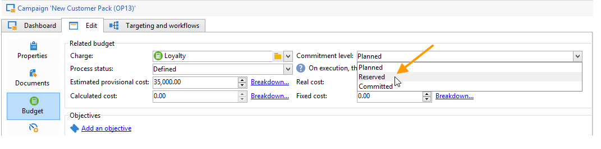
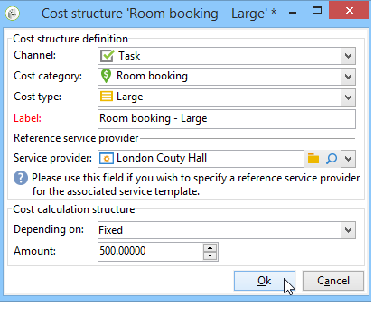

# Controllare i costi{#controlling-costs}

Adobe Campaign consente di controllare i costi di marketing programmati, impegnati e fatturati e di suddividerli per categoria utilizzando il modulo Gestione risorse marketing.

I costi impegnati per i vari processi di una campagna vengono addebitati a un budget definito in anticipo dal reparto marketing. Gli importi possono essere suddivisi in diverse categorie per rendere le informazioni più leggibili e per fornire informazioni più dettagliate sugli investimenti di marketing.

La gestione e il tracciamento dei budget sono centralizzati in un nodo dedicato della struttura Adobe Campaign. Questo consente di monitorare gli importi allocati, impegnati, impegnati e spesi dalla stessa visualizzazione e per tutti i budget.

Per implementare la gestione del budget utilizzando MRM, è necessario eseguire le operazioni seguenti:

1. Definire il budget. [Ulteriori informazioni](#creating-a-budget).

1. Definire il metodo di calcolo dei costi: le strutture dei costi vengono definite per i fornitori di servizi. [Ulteriori informazioni](../campaigns/providers--stocks-and-budgets.md).

1. Definire i costi della campagna (consegne/attività) : i costi sostenuti dalle consegne e dalle attività vengono inseriti singolarmente o globalmente per il modello della campagna. [Ulteriori informazioni](../campaigns/marketing-campaign-deliveries.md#compute-costs-and-stocks).

1. Consolida: in base allo stato di avanzamento delle attività, delle consegne e della campagna, i costi verranno calcolati e trasferiti al budget corrispondente. Quando la creazione della campagna è sufficientemente avanzata, lo stato di avanzamento del bilancio della campagna può essere modificato in **[!UICONTROL Specified]**. Il costo calcolato del programma viene quindi inserito automaticamente con i costi calcolati sulla campagna. [Ulteriori informazioni](#cost-commitment--calculation-and-charging).

## Creare un budget {#creating-a-budget}

Per creare un budget, effettua le seguenti operazioni:

1. Accedi a **[!UICONTROL Campaign management > Budgets]** cartella di Campaign explorer.
1. Fai clic su **[!UICONTROL New]** , assegna un nome e salva il budget.
1. Inserire l&#39;importo iniziale: indicare l&#39;importo allocato nel campo pertinente. Gli altri importi vengono inseriti automaticamente. [Ulteriori informazioni](#calculating-amounts).
1. Definire il periodo di validità inserendo le date di inizio e di fine. Queste informazioni sono puramente indicative.
1. Crea le categorie di spesa a cui assegnare i costi di questo budget per campagne, attività e così via. possono essere collegati. [Ulteriori informazioni](#expense-categories).

>[!NOTE]
>
>Puoi selezionare un budget correlato. Per ulteriori informazioni al riguardo, consulta [questa sezione](#linking-a-budget-to-another).
>

### Calcola importi {#calculating-amounts}

Ciascun bilancio è definito da un importo iniziale che verrà diminuito dai costi delle varie campagne, consegne o attività ad esse correlate dopo che sono state pianificate o eseguite. Lo stato degli importi (pianificato, prenotato, impegnato, speso o fatturato) dipende dal tipo di costo e dal livello di impegno definito nella campagna, nella consegna o nel task.

>[!NOTE]
>
>Gli importi inseriti per le categorie devono corrispondere alla dotazione di budget definita nella **[!UICONTROL Allocated]** campo.

Per le campagne, a seconda del livello di impegno, un costo può essere pianificato, impegnato o riservato per un’azione futura.

>[!CAUTION]
>
>Quando viene creata una campagna, lo stato di avanzamento in **[!UICONTROL Budget]** deve essere impostato su **[!UICONTROL Defined]** per i costi da prendere in considerazione al momento dell&#39;esecuzione. Se lo stato è **[!UICONTROL Being edited]**, i costi non saranno consolidati.
>   
>Opzione **[!UICONTROL Commitment level]** rappresenta una proiezione dei costi per il futuro prima che vengano imputati al bilancio. In base all’avanzamento di una campagna, un’attività o una consegna, puoi decidere di assegnare un livello di impegno più alto o più basso (1. Pianificato, 2. Riservato, 3. Eseguito) utilizzando la casella combinata.

Ad esempio, il costo previsto di una campagna web è di 45.000 Euro.

Per la campagna, quando lo stato di creazione del budget è impostato su **[!UICONTROL Defined]**, il costo reale della campagna (o, in assenza di questo, il costo calcolato) sarà riportato nei totali di bilancio.

In funzione del livello di impegno del bilancio della campagna, l&#39;importo sarà iscritto nel **[!UICONTROL Planned]**, **[!UICONTROL Reserved]** o **[!UICONTROL Committed]** campo.

Il livello di impegno può essere modificato:

* nel **campagna** livello, nel **[!UICONTROL Budget]** finestra, trovata in **[!UICONTROL Edit]** scheda. Qui vengono configurati budget, costi e spese.
* nel **attività** livello, nel **[!UICONTROL Expenses and revenues]** finestra.

Quando il budget è **[!UICONTROL Reserved]**, l&#39;aggiornamento viene eseguito automaticamente per il budget addebitato.

La procedura è la stessa a livello di attività.

Quando una spesa dà luogo a una fattura e la fattura viene pagata, il relativo importo viene quindi inserito nella **[!UICONTROL Invoiced]** campo.

### Categorie di spese {#expense-categories}

Gli importi possono essere distribuiti in diverse categorie di spesa per una migliore leggibilità dei dati e per una segnalazione più dettagliata degli investimenti di marketing. Le categorie di spesa vengono definite durante la creazione del budget tramite **[!UICONTROL Budgets]** dell&#39;albero.

Per aggiungere una categoria, fare clic su **[!UICONTROL Add]** nella sezione inferiore della finestra.

Puoi selezionare una categoria tra quelle esistenti o definirne una nuova inserendola direttamente nel campo. Quando confermi l’input, un messaggio di conferma ti consente di aggiungere questa categoria all’elenco delle categorie esistenti e associarla a una natura, se necessario. Queste informazioni verranno utilizzate nelle relazioni sul budget.

### Collegare un budget a un altro {#linking-a-budget-to-another}

Puoi collegare un budget a un budget principale. A questo scopo, seleziona il budget principale nel **[!UICONTROL related budget]** del bilancio secondario.

Al budget principale verrà aggiunta una scheda aggiuntiva per visualizzare l&#39;elenco dei budget correlati.

Queste informazioni sono riportate nelle relazioni sul bilancio.

## Aggiungi righe spese {#adding-expense-lines}

Le righe spese vengono aggiunte automaticamente al budget. Vengono creati durante l’analisi della consegna e al termine di un’attività.

Per ogni campagna, consegna o attività, i costi generati sono raggruppati nelle righe spese del budget a cui vengono addebitati. Queste linee di spesa vengono create in base alle linee di costo del fornitore di servizi interessato e calcolate tramite le strutture di costo associate.

Ogni riga spese contiene pertanto le seguenti informazioni:

* La campagna e la consegna o l’attività a cui è correlata
* Importo calcolato dalle strutture di costo o dal costo provvisorio stimato
* Costo reale della consegna o dell’attività interessata
* Riga fattura corrispondente (solo MRM)
* Elenco dei costi calcolati per categoria di costi (se esiste una struttura di costi)

Nell’esempio precedente, la riga spese modificata contiene i costi calcolati per il **Nuove schede** consegna per **Pacchetto primavera fedeltà** campagna. Quando si modifica la consegna, il **[!UICONTROL Direct Mail]** Questa scheda ti consente di visualizzare come viene calcolata la riga spese.

Il calcolo dei costi per questa consegna si basa sulle categorie di costi selezionate per il fornitore di servizi interessato:

In base alle categorie di costo selezionate, per calcolare le linee di costo vengono applicate le strutture di costo corrispondenti. In questo esempio, per il prestatore di servizi interessato, le strutture dei costi sono le seguenti:

>[!NOTE]
>
>Le categorie e le strutture di costo sono presentate in [questa pagina](../campaigns/providers--stocks-and-budgets.md#create-a-service-provider-and-its-cost-categories)

## Impegno, calcolo e addebito dei costi {#cost-commitment--calculation-and-charging}

È possibile eseguire il commit dei costi per consegne e attività. In base all&#39;avanzamento del processo a cui è correlato, lo stato di un costo viene aggiornato.

### Processo di calcolo dei costi {#cost-calculation-process}

I costi sono suddivisi in tre categorie:

1. Costo provvisorio stimato

   Il costo provvisorio stimato è una stima dei costi per i processi della campagna. Durante la modifica, gli importi immessi non vengono consolidati. Deve avere **[!UICONTROL Specified]** stato degli importi di cui tenere conto nei calcoli.

   Questo importo viene immesso manualmente e può essere suddiviso in diverse categorie di spesa. Per ridurre un costo, fare clic su **[!UICONTROL Breakdown...]** e quindi il **[!UICONTROL Add]** per definire un nuovo importo.

   

   È possibile associare ciascun costo a una categoria in modo che il raggruppamento dei costi per categoria di spesa possa essere visualizzato successivamente nei rapporti relativi al budget e al budget.

1. Costo calcolato

   Il costo calcolato dipende dall’elemento interessato (campagna, consegna, attività, ecc.) e il relativo stato (in corso di modifica, in corso, terminato). In ogni caso, se si specifica il costo reale, il costo calcolato utilizzerà tale importo.

   Se non viene fornito il costo effettivo, si applicano le seguenti regole:

   * Per una campagna in corso di modifica, il costo calcolato è il costo provvisorio stimato della campagna oppure, se questo costo non è definito, il costo calcolato sarà la somma di tutti i costi provvisori delle consegne e delle attività della campagna. Se la campagna è terminata, il costo calcolato della campagna sarà la somma di tutti i costi calcolati.
   * Per una consegna non ancora analizzata, il costo calcolato è il costo provvisorio stimato. Se l&#39;analisi è già stata eseguita, il costo calcolato sarà la somma di tutti i costi calcolati in base alle strutture dei costi del servizio prestato e del numero di destinatari interessati.
   * Per un&#39;attività in corso, il costo calcolato utilizza il costo provvisorio stimato. Se l&#39;attività è terminata, il costo calcolato corrisponderà alla somma di tutti i costi calcolati dalle strutture dei costi del fornitore di servizi e al numero di giorni di completamento.
   * Per il piano di marketing, come per il programma, il costo calcolato è la somma dei costi calcolati per le campagne. Se tali costi non sono specificati, il costo calcolato utilizzerà i costi provvisori stimati.

   >[!NOTE]
   >
   >Il **[!UICONTROL Breakdown]** Questo collegamento consente di visualizzare i dettagli del calcolo e la data dell&#39;ultimo calcolo dei costi.

1. Costo reale

   Il costo reale viene immesso manualmente e, se necessario, viene suddiviso in diverse categorie di spesa.

### Calcolo e addebito {#calculation-and-charging}

I costi vengono calcolati mediante strutture di costo e imputati ai bilanci selezionati nelle campagne, nelle consegne o nei compiti in questione.

È possibile verificare gli importi impegnati nelle campagne tramite l’approvazione del budget. È possibile creare attività aggiuntive in stile punto di controllo in una campagna per impostare altre approvazioni. Consulta [Tipi di attività](creating-and-managing-tasks.md#types-of-task).

### Esempio {#example}

Stiamo per creare una campagna con:

* Una consegna direct mail utilizzando le strutture dei costi di un fornitore di servizi
* Un&#39;attività con costo fisso
* Attività con costo giornaliero

#### Passaggio 1: creare il budget {#step-1---creating-the-budget}

1. Creare un nuovo budget tramite **[!UICONTROL Campaign management > Budgets]** nodo.

1. Definisci un budget di 10.000 euro nel **[!UICONTROL Allocated]** campo del **[!UICONTROL Amounts]** sezione. Aggiungere due categorie di spesa nella parte inferiore della finestra:

#### Passaggio 2: configurare il provider di servizi e definire le strutture dei costi {#step-2---configuring-the-service-provider-and-defining-the-cost-structures}

1. Creare un provider di servizi e un modello di servizi con la relativa struttura dei costi dall&#39;elenco **[!UICONTROL Administration > Campaigns]** nodo. Per ulteriori informazioni al riguardo, consulta [questa sezione](../campaigns/providers--stocks-and-budgets.md#create-a-service-provider-and-its-cost-categories).

   Per le consegne di direct mailing, crea categorie di costo **[!UICONTROL Envelopes]** (tipi 114x229 e 162x229), **[!UICONTROL Postage]** e **[!UICONTROL Print]** (tipi A3 e A4). Quindi creare le seguenti strutture di costo:

   

1. Aggiungere un costo fisso (nelle categorie di costo) il cui calcolo è fisso e il cui importo è vuoto (nella struttura di costo corrispondente) e che verrà specificato singolarmente per ogni consegna.

   

   Per le attività, creare le due categorie di costo seguenti:

   * **[!UICONTROL Room reservation]** (Camera piccola e Grande), con **fisso** struttura dei costi per un importo di 300 e 500 euro:

   

   * **[!UICONTROL Creation]** (**Modello di contenuto** type), con un **ogni giorno** struttura dei costi di 300 euro:

   

#### Passaggio 3: addebitare il budget nella campagna {#step-3---charging-the-budget-in-the-campaign}

1. Crea una campagna e seleziona il budget creato nel passaggio 1.

   >[!NOTE]
   >
   >Per impostazione predefinita, il budget selezionato per il programma viene applicato a tutte le campagne del programma.

   

1. Specificare il costo provvisorio stimato, con suddivisione:

   

1. Clic **[!UICONTROL Ok]** e poi **[!UICONTROL Save]** per confermare questa informazione. Il costo calcolato della campagna viene quindi aggiornato con il costo provvisorio stimato.

#### Passaggio 4: creare la consegna di direct mailing {#step-4---creating-the-direct-mail-delivery}

1. Crea un flusso di lavoro per la campagna e posiziona le attività di query per selezionare il target (avviso, è necessario specificare gli indirizzi postali dei destinatari).

1. Creare una consegna direct mailing e selezionare il fornitore di servizi creato nel passaggio 2: le categorie di costo vengono visualizzate automaticamente.

1. Sostituire il costo delle buste e aggiungere un costo fisso. Selezionare anche le categorie interessate da tali costi.

   

   >[!NOTE]
   >
   >Se una delle categorie di costo non viene utilizzata, non verranno generate spese.

1. Avvia il flusso di lavoro appena creato per avviare l’analisi e calcolare i costi.

   

1. Se per questa campagna è abilitata l&#39;approvazione del budget, approva il budget dal dashboard. È possibile controllare l&#39;approvazione delle categorie di costo.

   

La riga di spesa relativa alla consegna viene aggiunta nel **[!UICONTROL Edit > Budget]** della campagna. Modificalo per visualizzare i dettagli del calcolo.

Il costo calcolato per la consegna viene aggiornato con le seguenti informazioni:

Quando si modifica il costo calcolato, è possibile controllare il raggruppamento dei costi e lo stato e la data del calcolo del costo.

#### Passaggio 5: creare le attività {#step-5---creating-tasks}

A questa campagna verranno aggiunti i due task per i quali sono state definite le strutture dei costi [creato in precedenza](#step-2---configuring-the-service-provider-and-defining-the-cost-structures).

A questo scopo, nel dashboard della campagna, fai clic sul pulsante **[!UICONTROL Add a task]** pulsante. Assegna un nome all’attività e fai clic su **[!UICONTROL Save]**.

1. L&#39;attività viene quindi aggiunta all&#39;elenco delle attività. Devi modificarlo per configurarlo.

1. In **[!UICONTROL Properties]** , selezionare il servizio e la categoria di costo corrispondente:

   

1. Quindi, fai clic su **[!UICONTROL Expenses and revenue]** dell&#39;attività e specificare il costo provvisorio stimato.

   

   Quando l&#39;attività è stata salvata, il costo calcolato viene specificato con il valore immesso per il costo provvisorio stimato.

   Quando l&#39;attività è completata (stato **[!UICONTROL Finished]** ), il costo calcolato viene aggiornato automaticamente con il costo della Grande Camera come indicato nella struttura dei costi. Tale costo è incluso anche in questa categoria nella ripartizione.

1. Quindi, creare una seconda attività in base alla stessa procedura, programmata su cinque giorni e correlata alla struttura dei costi creata in precedenza.

   

   Al termine dell&#39;attività, il costo calcolato viene specificato con il valore della relativa struttura dei costi, ovvero 1500 euro nel nostro esempio (5 giorni x 300 euro):

   

#### Passaggio 6: aggiornare lo stato del budget della campagna {#step-6---update-the-campaign-budget-status}

Quando la campagna è configurata, è possibile aggiornarne lo stato impostandolo su **[!UICONTROL Specified]**. Il costo calcolato della campagna indica quindi la somma dei costi calcolati della consegna e delle attività della campagna:

#### Approvazione del budget {#budget-approval}

Quando è attivata l’approvazione, un collegamento speciale ti consente di approvare il budget dal dashboard della campagna. Questo collegamento viene visualizzato quando il flusso di lavoro di targeting viene avviato e occorre approvare una consegna direct mailing.

Puoi quindi fare clic sul collegamento per concedere o rifiutare l’approvazione, oppure utilizzare il collegamento nell’e-mail di notifica se la notifica è stata attivata per questa campagna.

Una volta approvato il budget e completata la consegna, i costi vengono caricati automaticamente tramite un flusso di lavoro tecnico speciale.

## Ordini e fatture {#orders-and-invoices}

Nel contesto di MRM, è possibile salvare gli ordini con un fornitore di servizi ed emettere fatture. L&#39;intero ciclo di vita di questi ordini e fatture può essere gestito tramite l&#39;interfaccia di Adobe Campaign.

### Creazione ordine {#order-creation}

Per salvare un nuovo ordine con un provider di servizi, fare clic sul pulsante **[!UICONTROL MRM > Orders]** dell&#39;albero, quindi fare clic sul pulsante **[!UICONTROL New]** pulsante.

Specifica il numero dell’ordine, il fornitore di servizi interessato e l’importo totale dell’ordine.

### Emissione e registrazione delle fatture {#issuing-and-tracking-invoices}

Per ogni fornitore di servizi è possibile salvare le fatture e definirne lo stato e il budget addebitato.

Le fatture vengono create e memorizzate in **[!UICONTROL MRM > Invoices]** della struttura Adobe Campaign.

Una fattura è costituita da righe di fattura il cui totale consente di calcolare automaticamente l&#39;importo. Queste linee vengono create manualmente dal **[!UICONTROL Invoice lines]** scheda. Possono essere associati a un ordine per caricare le informazioni negli ordini.

Le fatture di ciascun fornitore di servizi vengono visualizzate nel **[!UICONTROL Invoices]** scheda del profilo:

Il **[!UICONTROL Details]** scheda consente di visualizzare il contenuto della fattura.

Clic **[!UICONTROL Add]** per creare una nuova fattura.
