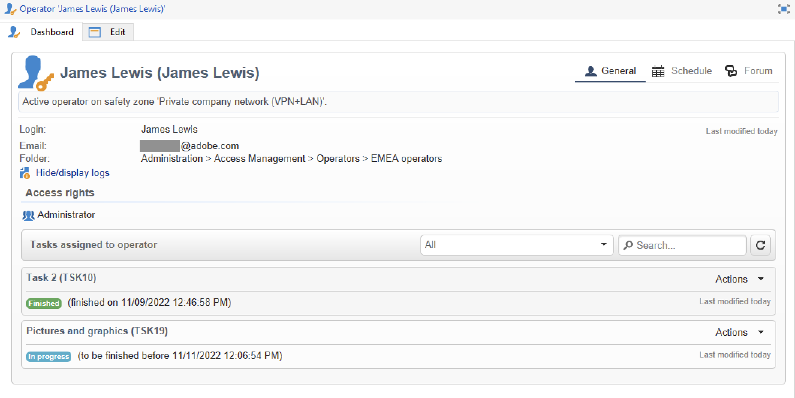
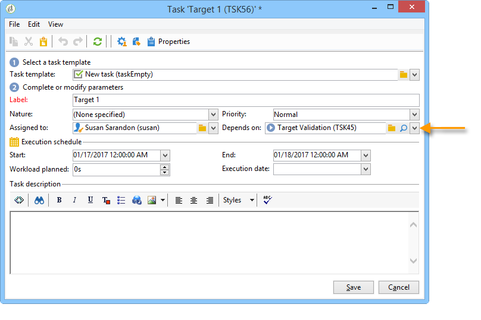
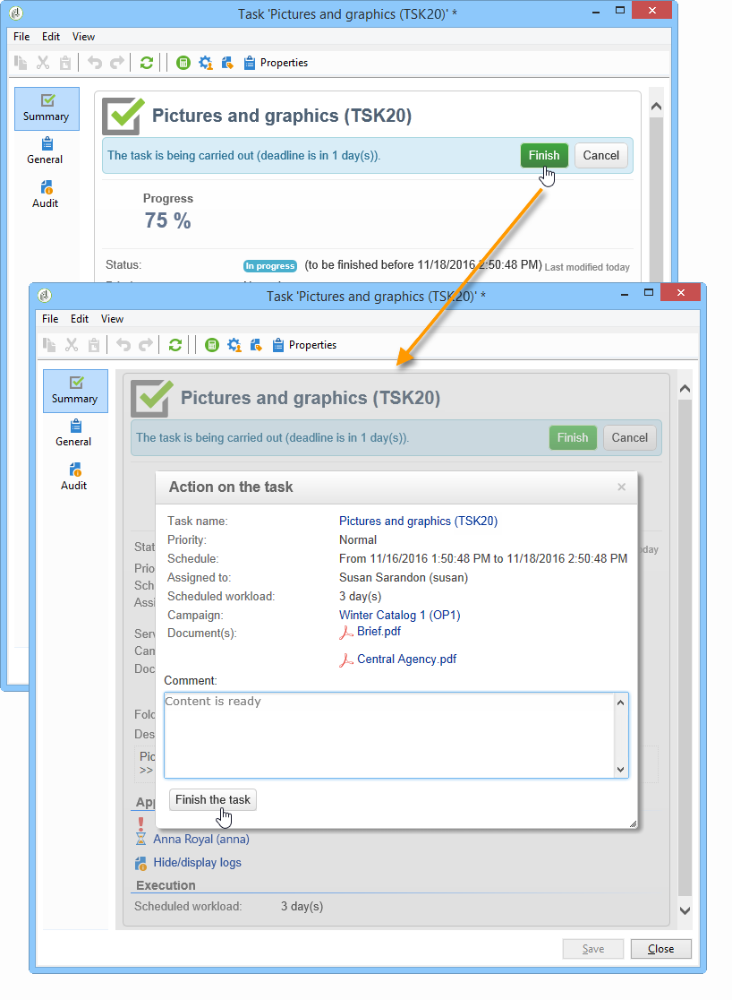

# Creare e gestire le attività{#creating-and-managing-tasks}

Adobe Campaign consente di creare attività e gestirne il ciclo di vita completo direttamente all’interno dell’applicazione. L’implementazione del programma e della campagna può essere suddivisa in attività assegnate ad operatori Adobe Campaign o a fornitori di servizi esterni. Questa modalità operativa consente di creare un ambiente di collaborazione aperto che includa tutti i partecipanti al programma e i partecipanti esterni.

Le attività possono essere create, visualizzate e monitorate dall’elenco delle attività o dal dashboard della campagna. Possono anche essere visualizzate e tracciate nelle pianificazioni del piano di marketing, dei programmi e delle campagne.

Le attività sono collegate alla campagna e possono avere dipendenze, ad esempio attività associate. Ogni attività ha uno stato, una priorità, un carico stimato e i costi correlati.

Tutte le attività sono raggruppate in un elenco accessibile tramite **Campagne** scheda. Per ulteriori informazioni, consulta [Accedere alle attività](#accessing-tasks).

Possono essere visualizzati nella pianificazione del programma a cui appartengono.

## Accedere alle attività {#accessing-tasks}

### Visualizza le attività {#displaying-tasks}

Le attività vengono visualizzate nell&#39;elenco accessibile tramite **[!UICONTROL Campaigns]** scheda.

Puoi visualizzare tutte le attività dell’operatore corrente.

Per ulteriori informazioni, consulta [Stato di esecuzione di un’attività](#execution-status-of-a-task) e [Stato di avanzamento di un&#39;attività](#progress-status-of-a-task).

### Filtra attività {#filtering-tasks}

Quando visualizzi questa vista, questa viene filtrata automaticamente in modo da visualizzare solo la **operazioni correnti dell&#39;operatore**. È inoltre possibile filtrare le attività utilizzando i campi nella sezione superiore della finestra.

### Modifica attività {#editing-tasks}

Fai clic su un’attività per modificarla.

## Crea una nuova attività {#creating-a-new-task}

Per creare un&#39;attività, effettuare le seguenti operazioni:

1. Accedi a **[!UICONTROL Tasks]** collegamento in **[!UICONTROL Campaigns]** e fai clic su **[!UICONTROL Create]**.

   

1. Immetti il nome dell’attività e seleziona la campagna a cui è collegata.
1. Imposta le date di inizio e di fine.
1. Clic **[!UICONTROL Save]** per creare l&#39;attività.

   

Puoi anche creare un’attività tramite il dashboard di una campagna: in questo caso, viene automaticamente collegata alla campagna da cui è stata creata.

Una volta creata, l’attività viene aggiunta alla pianificazione della campagna, al dashboard della campagna e all’elenco delle attività. Per modificare un’attività, fai clic sul suo nome nell’elenco delle attività oppure selezionala dalla pianificazione o dal dashboard della campagna e fai clic su **[!UICONTROL Open]**.

Una volta creata, puoi configurare l’attività definendo:

* Manager e partecipanti. [Ulteriori informazioni](#manager-and-participants)
* La pianificazione della creazione. [Ulteriori informazioni](#execution-schedule)
* I costi impegnati. [Ulteriori informazioni](#expenses-and-revenues)

Puoi anche aggiungere [revisori](#reviewers) e [documenti di riferimento](#documents-referenced).

Il ciclo di vita dell&#39;attività viene presentato in [questa sezione](#life-cycle).

### Manager e partecipanti {#manager-and-participants}

Per impostazione predefinita, l’attività viene assegnata all’operatore che l’ha creata. Questo operatore riceve una notifica quando è necessaria un’azione per tale attività.

È possibile selezionare un operatore diverso dal **[!UICONTROL Assigned to]** elenco a discesa.

>[!NOTE]
>
>La gestione degli operatori è descritta in [questa sezione](../../v8/start/gs-permissions.md).
>
>Solo l’operatore responsabile di un’attività può chiuderla.

È possibile specificare più operatori coinvolti nell&#39;esecuzione dell&#39;operazione. Questi operatori non sono autorizzati a chiudere l’attività: possono solo approvare l’attività loro assegnata.

Per aggiungere operatori di attività, attieniti alla procedura seguente:

1. Fai clic su **[!UICONTROL Resources]** nella barra degli strumenti dell’attività.

   

1. Clic **[!UICONTROL Add]** e seleziona gli operatori interessati.
1. Immettere il tasso di utilizzo: rappresenta il carico di lavoro assegnato all&#39;operatore per la durata dell&#39;esecuzione dell&#39;attività. Questo tasso è solo indicativo ed è espresso in percentuale.

   

   Ad esempio, per un’attività la cui pianificazione di esecuzione è impostata su 10 giorni, un operatore il cui tasso di utilizzo è del 50% verrà mobilizzato su questa attività per metà del tempo di lavoro per i 10 giorni.

   Per ogni operatore, è possibile immettere un carico di lavoro pianificato e un carico di lavoro effettivo. Queste durate sono fornite solo a scopo informativo.

1. Puoi configurare un promemoria da **[!UICONTROL Add a reminder...]** collegamento. Una notifica e-mail verrà inviata a tutti gli operatori coinvolti nell’attività prima della sua data di fine.

   

1. È inoltre possibile inviare una notifica prima dell&#39;inizio dell&#39;attività. Per impostare questa impostazione, seleziona la data in **[!UICONTROL Initial notification]** campo.
1. Quando viene raggiunta la data di fine e l&#39;attività non viene chiusa, è possibile inviare una notifica all&#39;assegnatario o al gruppo di assegnatari selezionati nel **[!UICONTROL Assignee]** elenco a discesa.

Il dashboard dell’operatore consente di controllarne il carico di lavoro (altre attività in corso).

### Approvazione attività {#reviewers}

Oltre ai partecipanti, è possibile definire gli operatori che rivederanno l&#39;attività una volta chiusa.

A questo scopo, fai clic su **[!UICONTROL Enable task approval]** nella sezione inferiore della sezione **[!UICONTROL Resources]** finestra. Può trattarsi di un singolo operatore, di un gruppo di operatori o di un elenco di operatori.

Per specificare un elenco di operatori, fare clic su **[!UICONTROL Edit...]** collegarsi a destra del primo revisore e aggiungere tutti gli operatori necessari, come illustrato di seguito:

Nella sezione inferiore della finestra di configurazione è possibile definire un programma di approvazione per il task. Per impostazione predefinita, i revisori dispongono di tre giorni a partire dalla data di invio per approvare l&#39;attività. Puoi anche aggiungere un promemoria, che verrà inviato automaticamente agli operatori interessati prima della scadenza dell’approvazione.

La persona responsabile dell’attività può assegnarsi il compito di approvarla, anche se altri operatori sono già stati assegnati a questo scopo. Se non è stato definito alcun revisore, le notifiche vengono inviate alla persona responsabile dell’attività. Tutti gli altri operatori Adobe Campaign con **[!UICONTROL Administrator]** I diritti possono anche approvare l&#39;attività. Tuttavia, non ricevono notifiche.

### Documenti a cui si fa riferimento {#documents-referenced}

Puoi aggiungere [documenti e risorse di marketing](managing-marketing-resources.md) a un&#39;attività.

Per eseguire questa operazione:

1. Apri l’attività e fai clic su **[!UICONTROL Documents]** nella barra degli strumenti dell’attività.

   

1. Clic **[!UICONTROL Add]** e selezionare il documento da aggiungere all&#39;attività. Applica lo stesso processo alle risorse di marketing.

I documenti a cui si fa riferimento vengono aggiunti alle notifiche inviate agli operatori coinvolti nell’attività. Vengono inoltre aggiunte al dashboard delle attività.

### Pianificazione di esecuzione {#execution-schedule}

Il periodo di validità di un&#39;attività è indicato nella **[!UICONTROL Start]** e **[!UICONTROL End]** campi. Il carico programmato esprime il carico di lavoro da eseguire durante il periodo. È espresso in giorni o ore.

>[!NOTE]
>
>Il ciclo di vita di un&#39;attività è presentato in [Ciclo di vita](#life-cycle).

Il **[!UICONTROL Workload performed]** espresso anche in giorni e ore, consente di aggiornare manualmente l’avanzamento dell’attività rispetto al carico di lavoro pianificato.

Il **[!UICONTROL Progress status]** dell’attività, espressa in percentuale, viene aggiornata automaticamente in base alle attività svolte dagli operatori interessati. Può essere immesso manualmente.

Queste informazioni possono essere visualizzate nel dashboard delle attività.

È visibile anche nella scheda Campaign.

Se la data di fine della pianificazione dell&#39;esecuzione dell&#39;attività è stata raggiunta ma l&#39;attività non è stata completata, l&#39;attività verrà **[!UICONTROL Late]**. Verrà inoltre visualizzato un messaggio di avviso per avvisare gli operatori.

Per ulteriori informazioni, consulta [Stato di avanzamento di un&#39;attività](#progress-status-of-a-task).

### Spese ed entrate {#expenses-and-revenues}

È possibile definire le spese correlate e i ricavi previsti per ciascun task. Questi verranno calcolati e quindi consolidati per la campagna a cui è associata l’attività.

Per specificare queste informazioni, fare clic su **[!UICONTROL Expenses and revenue]** nella barra degli strumenti dell’attività.

Per impostazione predefinita, il budget addebitato è il budget della campagna a cui è associata l&#39;attività. Viene visualizzato nei dettagli dell’attività.

>[!NOTE]
>
>Per ulteriori informazioni su spese e budget, consulta [questa sezione](../campaigns/providers-stocks-and-budgets.md#cost-commitment--calculation-and-charging).

In questa finestra puoi anche definire gli obiettivi da raggiungere. Gli obiettivi sono espressi in termini di ricavi previsti per l&#39;attività.

### Fornitori di servizi {#service-providers}

Un fornitore di servizi esterno può essere coinvolto nella gestione di un&#39;attività.

A tale scopo, modificare le proprietà dell&#39;attività e selezionare il provider di servizi interessato. Le categorie di costo associate al fornitore di servizi vengono elencate automaticamente nella sezione centrale della finestra.

Selezionare le categorie di costo correlate all&#39;esecuzione del task. A tale scopo, selezionare il tipo di costo e, se necessario, aggiungere un importo alla maggiorazione.

>[!NOTE]
>
>Il metodo di gestione dei budget e dei costi è presentato in [Controllare i costi](controlling-costs.md).

Quando viene selezionato un provider di servizi, questo viene visualizzato nel dashboard attività:

### Attività in ritardo {#late-tasks}

Un&#39;attività è in ritardo se ha raggiunto la data di fine senza che lo stato sia cambiato in **[!UICONTROL Finished]**. Per impostazione predefinita, nessun operatore viene avvisato quando un’attività è in ritardo. Puoi configurare la consegna di un’e-mail di notifica: tutti gli operatori possono ricevere una notifica anche se non sono coinvolti nell’attività.

Vai a **[!UICONTROL Resources]** e aggiungi l’operatore al **[!UICONTROL Assignation]** campo. Per inviare una notifica a più persone, seleziona un gruppo di operatori.

### Notifiche iniziali {#initial-notifications}

Quando crei o modifichi un’attività con una data di inizio nel futuro, Adobe Campaign offre di inviare un’e-mail alla persona responsabile dell’attività per informarla dell’inizio.

Tuttavia, se l&#39;attività che si sta creando è molto lontana, potrebbe essere preferibile pianificare l&#39;invio della notifica prima dell&#39;inizio dell&#39;attività. Ad esempio, se l&#39;attività inizia tra un mese, è possibile inviare una notifica alla persona responsabile una settimana prima dell&#39;inizio.

Per pianificare una notifica, passare alla **[!UICONTROL Resources]** e utilizzare la **[!UICONTROL Initial notification]** campo.

* Per le attività all’interno delle campagne, seleziona una data e un’ora specifiche.
* Per le attività all’interno dei modelli di campagna, il tempo di notifica è espresso come il tempo rimanente prima dell’inizio dell’attività (ad esempio, se immetti 2d nel file **[!UICONTROL Initial notification]** , l&#39;e-mail verrà inviata 2 giorni prima della data di inizio dell&#39;attività).

Se hai pianificato una notifica, quando salvi l’attività Adobe Campaign offre comunque di inviare immediatamente una notifica. Puoi decidere di inviarlo e questo non sostituirà la notifica pianificata.

### Attività collegata a un programma {#task-linked-to-a-program}

Puoi creare attività direttamente in un programma per gestire azioni relative alla loro organizzazione complessiva e non a una campagna specifica (ad esempio, una riunione per discutere il tema delle campagne imminenti all’interno del programma). L&#39;attività verrà visualizzata nella programmazione.

Per creare un&#39;attività collegata direttamente a un programma:

1. Apri la pianificazione del programma: nella home page, vai a **[!UICONTROL Campaigns > Browse > Other choices > Programs]**. La programmazione generale del programma si apre nella sezione destra della finestra.
1. Nella pianificazione, fai clic sul programma desiderato: viene visualizzata una finestra con il programma al suo interno.
1. In questa finestra, fai clic su **[!UICONTROL Open]**. Viene visualizzata la pianificazione del programma.
1. Fai clic su **[!UICONTROL Add]** sopra la pianificazione a destra, quindi fai clic su **[!UICONTROL Add a task]**.

### Disponibilità dell&#39;operatore {#operator-availability}

Nel dashboard attività, un&#39;icona accanto al nome dell&#39;operatore indica che questi sta già lavorando su un&#39;altra attività o evento durante il periodo coperto dall&#39;attività. Attività di cui l&#39;operatore è responsabile o in cui è coinvolto appare nel **[!UICONTROL Assigned to]** o nell&#39;attività **[!UICONTROL Resources]** casella.

### Attività in un flusso di lavoro {#task-in-a-workflow}

Utilizzo di un **[!UICONTROL Task]** in un flusso di lavoro di campaign consente di definire due scenari a seconda che l’attività sia approvata o meno.

Nei flussi di lavoro della campagna, il **[!UICONTROL Task]** l&#39;attività si trova in **[!UICONTROL Flow control]** scheda.

## Tipi di attività {#types-of-task}

Quando crei attività tramite una campagna, puoi creare attività specifiche. Il tipo di attività è definito nel modello selezionato.

È possibile pianificare le seguenti attività:

* [Attività di controllo](#control-tasks),
* [Attività di raggruppamento](#grouping-task),
* [Attività di raggruppamento](#grouping-task),
* [Attività di notifica](#notification-task).

>[!NOTE]
>
>**[!UICONTROL Control task]** e **[!UICONTROL Grouping]** è possibile creare le attività **solo** tramite il dashboard della campagna.\
>Vengono visualizzati nella mappa delle attività dell’operatore a cui sono assegnati. Consulta [Accedere alle attività](#accessing-tasks).

### Attività di controllo {#control-tasks}

A **[!UICONTROL Control task]** è collegato all’approvazione della consegna: approvazione di targeting, contenuto, file di estrazione, budget o bozza.

Una volta creata, l’attività viene aggiunta al dashboard della campagna.

È quindi possibile modificarlo e specificarne i parametri.

### Attività di creazione risorse marketing {#marketing-resource-creation-task}

Un’attività di creazione di risorse di marketing può essere utilizzata per gestire la creazione e la pubblicazione di una risorsa di marketing. Se gestisci una risorsa tramite un’attività e non tramite la risorsa stessa, puoi:

* Controlla il processo di creazione delle risorse tramite una campagna.
* Visualizzare il processo di creazione delle risorse in una programmazione.
* Gestisci il processo di creazione delle risorse (promemoria, notifiche).
* Calcola e controlla i costi legati alla creazione delle risorse.
* Approva e pubblica la risorsa tramite l’attività (se l’opzione rilevante è abilitata).

#### Interazione tra l&#39;attività e la relativa risorsa collegata {#interaction-between-the-task-and-its-linked-resource}

L’attività di creazione delle risorse di marketing interagisce con la risorsa collegata. Ciò significa che:

* Il programma di creazione delle risorse e i relativi costi vengono gestiti tramite l&#39;attività.
* Gli operatori possono lavorare sulla risorsa come di consueto (download o caricamento, blocco e sblocco): questo non influisce sull’attività.
* L’approvazione e la pubblicazione delle risorse possono essere eseguite tramite l’attività: se **[!UICONTROL Publish the marketing resource]** se questa opzione è abilitata, la risorsa viene approvata e pubblicata automaticamente al termine dell’attività. Se l&#39;opzione non è abilitata, l&#39;attività e la risorsa non interagiscono: agire su una delle due non influirà sull&#39;altra.

  È possibile utilizzare una serie di attività collegate per definire un ciclo di approvazione completo. Controlla la **[!UICONTROL Publish the marketing resource]** opzione solo per l’ultima attività: per pubblicare la risorsa è necessario che tutte le attività siano state completate. Inoltre, quando crei un’attività di risorsa di marketing figlio, la risorsa viene selezionata automaticamente nell’attività figlio.

   * **Tramite la risorsa**: se invii la risorsa per l’approvazione o la approvi, queste azioni non influiranno sull’attività.
   * **Tramite l’attività**: se il **[!UICONTROL Publish the marketing resource]** è selezionata nell’attività, la risorsa viene approvata e pubblicata automaticamente al termine dell’attività (vedi sopra). Se l&#39;opzione non è selezionata, l&#39;attività e la risorsa non interagiscono: agire su una delle due non influirà sull&#39;altra.

#### Configurare un’attività di creazione di risorse di marketing {#configuring-a-marketing-resource-creation-task}

La persona che rivede l’attività non è necessaria se è la stessa persona che rivede il contenuto definito nella risorsa. Tuttavia, se **[!UICONTROL Publish the marketing resource]** se l&#39;opzione è selezionata (vedere di seguito), il revisore dell&#39;attività è autorizzato ad approvare il contenuto della risorsa, poiché il completamento dell&#39;attività approva automaticamente la risorsa (o, se non è definito alcun revisore, il responsabile dell&#39;attività).

In **[!UICONTROL Marketing resource]** , definisci la risorsa da gestire tramite questa attività. Puoi eseguire le seguenti azioni:

* Selezionare una risorsa esistente: l’elenco a discesa offre tutte le risorse con lo stato **[!UICONTROL Being edited]**.
* Creazione di una risorsa: fai clic su **[!UICONTROL Select the link]** , quindi fare clic sul pulsante **[!UICONTROL Create]** icona.

Il **[!UICONTROL Publish the marketing resource]** consente di automatizzare la pubblicazione delle risorse: una volta che l’attività è **[!UICONTROL Finished]**, lo stato della risorsa passa automaticamente a **[!UICONTROL Published]**, anche se non è stata inviata per l’approvazione o approvata, anche se il revisore che completa l’attività non è il revisore del contenuto definito nella risorsa.

Il **[!UICONTROL Publish the resource]** il pulsante è disponibile e il revisore della pubblicazione della risorsa riceve un’e-mail di notifica per informarlo che è pronto per la pubblicazione. In **[!UICONTROL Edit > Tracking]** , la revisione e la pubblicazione da parte del revisore attività diventano visibili. Se è stato definito un flusso di lavoro di post-elaborazione della risorsa, questo viene eseguito ora.

### Raggruppa attività {#grouping-task}

Il **[!UICONTROL Grouping task]** tipo di attività consente di raggruppare più attività e sincronizzarne la gestione dell’avanzamento e dell’approvazione.

Le attività di raggruppamento non presentano spese o risorse collegate.

Tutte le attività raggruppate in un&#39;attività di raggruppamento possono essere visualizzate nel relativo dashboard. In questo modo è possibile filtrare l&#39;elenco delle attività in modo da visualizzare solo quelle di interesse.

Il raggruppamento delle attività include un collegamento che consente di creare facilmente un&#39;attività raggruppata.

Per creare un’attività raggruppata basata su un’attività di raggruppamento, passa al dashboard della campagna e fai clic sul nome dell’attività di raggruppamento per visualizzarne la descrizione, quindi fai clic su **[!UICONTROL Add a task]**.

Tuttavia, se è già stata creata un&#39;attività che si desidera collegare a un&#39;attività di raggruppamento, è possibile eseguirla tramite **[!UICONTROL Linked to]** campo del **[!UICONTROL Properties]** casella.

### Attività di notifica {#notification-task}

Le attività di notifica ti consentono di pianificare le consegne e-mail (a un operatore, a un gruppo di operatori, a un fornitore di servizi, ecc.). Questo consente di pianificare i promemoria, ad esempio per avvisare qualcuno che una campagna sta per terminare o per inviare documenti prima dell’inizio di una campagna in modo che gli operatori possano prepararla. Potrai quindi tenere traccia delle tue comunicazioni nella campagna o nel programma e seguire con attenzione le azioni svolte.

#### Ciclo di vita {#life-cycle}

Le attività di notifica non richiedono approvazione. Ciò significa che il loro ciclo di vita è più semplice di quello di un&#39;attività standard:

Un&#39;attività di notifica può avere i seguenti stati:

* **[!UICONTROL Scheduled]** fino all’invio dell’e-mail
* **[!UICONTROL In progress]** una volta inviata l’e-mail e fino al raggiungimento della data di fine
* **[!UICONTROL Finished]** una volta raggiunta la data di fine.

#### Configurazione {#configuration}

Durante la creazione, è necessario immettere i seguenti elementi nell&#39;attività:

* **[!UICONTROL Assigned to]** : l’operatore o il gruppo di operatori che riceverà l’e-mail. Se riassegni l’attività una volta inviata l’e-mail, questa non verrà inviata al nuovo operatore (affinché ciò accada, devi reinizializzare l’attività e modificarne la data di inizio).
* **Data di inizio attività**: data in cui l’e-mail di notifica verrà inviata. Tale data deve essere nel futuro al momento della registrazione dell&#39;attività.
* **Data di fine attività**: data in cui lo stato dell&#39;attività cambia in **[!UICONTROL Finished]**. Per impostazione predefinita, la data di fine è identica alla data di inizio. Tuttavia, l’assegnazione di una durata all’attività ti consente di simboleggiare il tempo di azione dell’operatore nella pianificazione, se necessario.
* **[!UICONTROL Description]** : il testo inserito qui verrà visualizzato nel corpo dell’e-mail di notifica.

  

Puoi aggiungere un allegato all’attività e all’e-mail di notifica. A questo scopo, fai clic su **[!UICONTROL Documents]** nella barra degli strumenti nell’angolo in alto a destra.

## Ciclo di vita {#life-cycle-1}

### Collegamenti tra attività {#links-between-tasks}

Il **[!UICONTROL Properties]** in ogni attività consente di definire i collegamenti tra le attività di una campagna. È possibile suddividere le attività in sottoattività utilizzando un&#39;attività di raggruppamento (vedere [Attività collegate](#linked-tasks)) o definire le dipendenze tra le attività (vedere [Raggruppamento di attività](#grouping-tasks)).

#### Attività collegate {#linked-tasks}

Utilizza il **[!UICONTROL Linked task]** per associare le attività a un&#39;attività di raggruppamento. Consulta [Tipi di attività](#types-of-task).

Nell’esempio seguente, l’approvazione del targeting è suddivisa in quattro sottoattività.

Ogni sottoattività è un&#39;attività standard collegata all&#39;attività principale.

#### Raggruppa attività {#grouping-tasks}

Utilizza il **[!UICONTROL Grouped to]** per rendere l&#39;esecuzione di un&#39;attività dipendente dall&#39;esecuzione di un&#39;altra attività.

La dipendenza tra le attività è rappresentata da frecce nel dashboard della campagna.

In caso di attività raggruppate, Adobe Campaign assegna automaticamente la data di fine dell&#39;attività padre all&#39;attività figlio come data di inizio. Ad esempio, se un **Crea invito** l&#39;attività termina il 15 ottobre alle 15:30, il **Invia e-mail di invito** l’attività secondaria inizierà il 15 ottobre alle 15:30.

Inoltre, se si posticipa la fine di un&#39;attività padre, alcune delle attività figlio potrebbero essere interessate: si tratta delle attività figlio il cui stato è **[!UICONTROL Scheduled]** e la cui data di inizio è precedente alla nuova data di fine dell&#39;attività padre. La durata dell&#39;attività rimane invariata. Se la data di inizio di un&#39;attività figlio è successiva alla nuova data di fine dell&#39;attività padre, l&#39;attività figlio non viene influenzata.

**Esempio**

Un&#39;attività padre con scadenza 9 ottobre alle 17 presenta due attività figlio, l&#39;attività A e l&#39;attività B. L&#39;attività A inizierà il 10 ottobre alle 14 e l&#39;attività B inizierà il 12 ottobre alle 8.

Posticipiamo il compito principale: adesso termina l&#39;11 ottobre alle 13. Solo l&#39;attività A è stata posticipata e inizierà l&#39;11 ottobre alle 13.

### Stato di esecuzione di un’attività {#execution-status-of-a-task}

Gli stati delle attività possono essere visualizzati nella mappa delle attività. Lo stato di esecuzione di un’attività viene aggiornato automaticamente in base alle azioni dell’operatore.

Un&#39;attività può essere: **[!UICONTROL Scheduled]**, **[!UICONTROL In progress]**, **[!UICONTROL Finished]**, **[!UICONTROL Canceled]**, **[!UICONTROL Pending approval]** o **[!UICONTROL Rejected]**.

* Quando viene creata un&#39;attività, questa viene **[!UICONTROL Scheduled]** se la data di inizio è nel futuro. Mantiene questo stato fino al raggiungimento della data di inizio.
* Una volta avviata, l’attività è **[!UICONTROL In progress]**. Quando la persona responsabile dell’attività la chiude, cambia in **[!UICONTROL Finished]**.
* Se è stato definito un revisore, l’attività sarà **[!UICONTROL Pending approval]** una volta che la persona che ne è responsabile la chiude e finché il revisore non la approva. Se il revisore lo rifiuta, l’attività sarà **[!UICONTROL Rejected]**.
* Un’attività può essere annullata dalla persona responsabile tramite la dashboard o **[!UICONTROL Task map]** facendo clic su **[!UICONTROL Cancel]** pulsante.
* Per pianificare un task, immettere una data di inizio nel futuro. Puoi quindi inviare una prima notifica agli operatori Adobe Campaign coinvolti nell’esecuzione dell’attività. Consulta [Completa ciclo di vita attività](#complete-task-life-cycle).

>[!NOTE]
>
>* Lo stato dell’attività viene aggiornato automaticamente.
>* Anche se il periodo di validità è terminato, le attività non chiuse vengono comunque visualizzate nell&#39;elenco delle attività in corso. Un avviso avvisa gli operatori che l&#39;attività è in ritardo.
>

### Stato di avanzamento di un&#39;attività {#progress-status-of-a-task}

Oltre allo stato di esecuzione, un&#39;attività può essere associata a uno stato di avanzamento: **[!UICONTROL Late]**, **[!UICONTROL To approve]**, **[!UICONTROL To do today]** o **[!UICONTROL To do this week]**. Queste informazioni vengono immesse automaticamente in base alla programmazione delle attività.

È possibile filtrare l&#39;elenco delle attività in base al processo o allo stato di avanzamento.

Per ulteriori informazioni, consulta [Accesso alle attività](#accessing-tasks).

### Completa ciclo di vita attività {#complete-task-life-cycle}

Di seguito sono riportate le fasi di un ciclo di vita completo di un&#39;attività per le quali la persona responsabile ha definito i partecipanti e i revisori.

1. Il responsabile crea l&#39;attività e immette i vari campi. Per ulteriori informazioni, consulta [Crea una nuova attività](#creating-a-new-task).

   Durante la creazione e la modifica di un’attività **pianificato nel futuro** (se non viene raggiunta la data di inizio dell&#39;attività), è possibile inviare una notifica ai partecipanti e ai manager per informarli che è stata pianificata una nuova attività.

   

   Per inviare questa prima notifica, fai clic su **[!UICONTROL Yes]**. Questa notifica comunica loro l’attività successiva e include dettagli sul contenuto e il numero di giorni rimanenti alla scadenza.

   Quando un&#39;attività viene creata e pianificata per il futuro, il suo stato è **[!UICONTROL Scheduled]**.

1. Alla data di inizio dell&#39;attività, la persona responsabile e i partecipanti ricevono una notifica che informa che l&#39;attività è stata avviata. Lo stato cambia in **[!UICONTROL In progress]**.
1. Dopo aver completato la sezione a loro assegnata, i partecipanti possono approvare l&#39;attività:

   * tramite l’e-mail di notifica.
   * tramite la console client o l’accesso web, nel dashboard attività.

     

1. Ogni volta che un partecipante approva un job, lo stato di avanzamento del task viene aggiornato.

   

1. Il revisore riceve un’e-mail di notifica che informa che l’operatore ha completato la sezione a lui assegnata.

   Possono seguire lo stato di avanzamento nel dashboard attività.

   

1. Una volta che il responsabile dell’attività decide che è terminata, può chiuderla utilizzando il collegamento nell’e-mail di notifica inviata all’avvio dell’attività, la console client o l’interfaccia.

   

   >[!NOTE]
   >
   >Il responsabile di un&#39;attività può chiuderla in qualsiasi momento, anche se mancano le approvazioni. Lo stato di avanzamento cambia automaticamente al 100%.

1. Lo stato dell’attività diventa **[!UICONTROL To approve]** e viene inviata una notifica al revisore.

   Approvano l’attività tramite l’e-mail di notifica, la console client o un browser web.

   Possono agire tramite il dashboard della campagna:

   

   Possono inoltre utilizzare il pulsante di approvazione dell’attività:

   

   >[!NOTE]
   >
   >Lo stato dell’attività diventerà **[!UICONTROL To approve]** se hai abilitato **[!UICONTROL Enable task validation]** opzione in **[!UICONTROL Resources]** dell&#39;attività.\
   >Se il revisore rifiuta l&#39;attività, lo stato cambia in **[!UICONTROL Rejected]** e il ciclo di vita dell&#39;attività viene riavviato automaticamente.

1. Lo stato dell’attività diventa **[!UICONTROL Finished]**. Viene inviata una notifica a tutte le persone coinvolte.

   >[!NOTE]
   >
   >Al termine dell&#39;attività, il relativo ciclo di vita può essere reinizializzato dalla persona responsabile. A questo scopo, apri l’attività e fai clic su **[!UICONTROL Reset task to execute it again...]** nella parte inferiore del dashboard.
