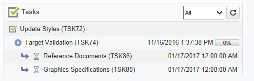

# Creare e gestire le attività{#creating-and-managing-tasks}

Adobe Campaign consente di creare attività e gestirne il ciclo di vita completo direttamente dall’interno dell’applicazione. L’implementazione di programmi e campagne può essere suddivisa in attività assegnate agli operatori Adobe Campaign o a fornitori di servizi esterni. Questa modalità operativa consente di creare un ambiente di collaborazione aperto che includa tutti i partecipanti al programma e i partecipanti esterni.

Le attività possono essere create, visualizzate e monitorate dall’elenco delle attività o dal dashboard della campagna. Possono anche essere visualizzati e monitorati nelle pianificazioni del piano di marketing, dei programmi e delle campagne.

Le attività sono collegate alla campagna e possono avere dipendenze, ovvero attività associate. Ogni attività ha uno stato, una priorità, un carico stimato e i relativi costi.

Tutte le attività sono raggruppate in un elenco accessibile tramite il **Campagne** scheda . Per ulteriori informazioni, consulta [Attività di accesso](#accessing-tasks).

Possono essere visualizzati nella pianificazione del programma a cui appartengono.

## Attività di accesso {#accessing-tasks}

### Visualizza attività {#displaying-tasks}

Le attività vengono visualizzate nell’elenco delle attività accessibile tramite la **[!UICONTROL Campaigns]** scheda .

È possibile visualizzare tutte le attività dell&#39;operatore corrente.

Per ulteriori informazioni, consulta [Stato di esecuzione di un&#39;attività](#execution-status-of-a-task) e [Stato di avanzamento di un&#39;attività](#progress-status-of-a-task).

### Filtrare le attività {#filtering-tasks}

Quando visualizzi questa visualizzazione, viene filtrata automaticamente per visualizzare solo il **attività dell&#39;operatore corrente**. È inoltre possibile filtrare le attività utilizzando i campi nella sezione superiore della finestra.

### Modifica delle attività {#editing-tasks}

Fai clic su un’attività per modificarla.

## Crea una nuova attività {#creating-a-new-task}

Per creare un’attività, segui i passaggi seguenti:

1. Sfoglia il **[!UICONTROL Tasks]** nel collegamento **[!UICONTROL Campaigns]** e fai clic su **[!UICONTROL Create]**.

   

1. Immetti il nome dell’attività e seleziona la campagna a cui è collegata.
1. Imposta le date di inizio e di fine.
1. Fai clic su **[!UICONTROL Save]** per creare l’attività.

   

Puoi anche creare un’attività tramite il dashboard di una campagna: in questo caso, viene automaticamente collegato alla campagna da cui è stato creato.

Dopo la creazione di un’attività, questa viene aggiunta alla pianificazione della campagna, al dashboard della campagna e all’elenco delle attività. Per modificare un&#39;attività, fai clic sul suo nome dall&#39;elenco delle attività oppure selezionala dalla pianificazione o dal dashboard della campagna, quindi fai clic su **[!UICONTROL Open]**.

Una volta creata, puoi configurare l’attività definendo:

* Il responsabile e i partecipanti. [Ulteriori informazioni](#manager-and-participants)
* Pianificazione della creazione. [Ulteriori informazioni](#execution-schedule)
* I costi impegnati. [Ulteriori informazioni](#expenses-and-revenues)

È inoltre possibile aggiungere [revisori](#reviewers) e [documenti di riferimento](#documents-referenced).

Il ciclo di vita dell&#39;attività è presentato in [questa sezione](#life-cycle).

### Manager e partecipanti {#manager-and-participants}

Per impostazione predefinita, l’attività viene assegnata all’operatore che l’ha creata. Questo operatore viene avvisato quando è necessaria un&#39;azione per tale attività.

Puoi selezionare un operatore diverso dal **[!UICONTROL Assigned to]** elenco a discesa.

>[!NOTE]
>
>La gestione degli operatori è descritta in [questa sezione](../../v8/start/gs-permissions.md).
>
>Solo l’operatore responsabile di un’attività può chiuderla.

Puoi specificare altri operatori coinvolti nell’esecuzione dell’attività. Questi operatori non sono autorizzati a chiudere l&#39;attività: possono approvare solo l&#39;attività loro assegnata.

Per aggiungere operatori attività, segui i passaggi seguenti:

1. Fai clic sul pulsante **[!UICONTROL Resources]** nella barra degli strumenti delle attività.

   

1. Fai clic su **[!UICONTROL Add]** e selezionare gli operatori interessati.
1. Immettere il tasso di utilizzo: rappresenta il carico di lavoro assegnato all&#39;operatore per la durata dell&#39;esecuzione dell&#39;attività. Questo tasso è solo indicativo ed è espresso in percentuale.

   

   Ad esempio, per un&#39;attività la cui pianificazione di esecuzione è impostata su 10 giorni, un operatore il cui tasso di utilizzo è pari al 50% verrà mobilitato su questa attività per la metà del tempo di lavoro per i 10 giorni.

   Per ogni operatore, è possibile inserire un carico di lavoro programmato e un carico di lavoro effettivo. Queste durate sono anche solo a scopo informativo.

1. Puoi configurare un promemoria da **[!UICONTROL Add a reminder...]** link. Una notifica e-mail verrà inviata a tutti gli operatori coinvolti nell’attività prima della data di fine.

   

1. È inoltre possibile inviare una notifica prima dell’avvio dell’attività. Per impostare questa impostazione, seleziona la data nella **[!UICONTROL Initial notification]** campo .
1. Quando viene raggiunta la data di fine e l’attività non viene chiusa, è possibile inviare una notifica all’assegnatario o al gruppo di assegnatari selezionati nella **[!UICONTROL Assignee]** elenco a discesa.

Il dashboard dell&#39;operatore consente di controllarne il carico di lavoro (altre attività in corso).

### Approvazione attività {#reviewers}

Oltre ai partecipanti, puoi definire gli operatori che esamineranno l’attività una volta chiusa.

A questo scopo, fai clic sul pulsante **[!UICONTROL Enable task approval]** nella sezione inferiore del **[!UICONTROL Resources]** finestra. Può trattarsi di un singolo operatore, di un gruppo di operatori o di un elenco di operatori.

Per specificare un elenco di operatori, fai clic sul pulsante **[!UICONTROL Edit...]** link a destra del primo revisore e aggiungi tutti gli operatori necessari, come mostrato di seguito:

È possibile definire una pianificazione di approvazione per l&#39;attività nella sezione inferiore della finestra di configurazione. Per impostazione predefinita, i revisori dispongono di tre giorni a partire dalla data di invio per approvare l’attività. È inoltre possibile aggiungere un promemoria, che verrà inviato automaticamente agli operatori interessati prima della scadenza dell’approvazione.

La persona responsabile dell&#39;attività può assegnarsi il compito di approvarla, anche se altri operatori sono già stati assegnati a farlo. Se non è stato definito alcun revisore, le notifiche verranno inviate alla persona responsabile dell&#39;attività. Tutti gli altri operatori Adobe Campaign con **[!UICONTROL Administrator]** l’attività può essere approvata anche tramite i diritti . Tuttavia, non ricevono notifiche.

### Documenti di riferimento {#documents-referenced}

Puoi aggiungere [documenti e risorse di marketing](managing-marketing-resources.md) a un&#39;attività.

Per eseguire questa operazione:

1. Apri l’attività e fai clic sul pulsante **[!UICONTROL Documents]** nella barra degli strumenti delle attività.

   

1. Fai clic su **[!UICONTROL Add]** e selezionare il documento da aggiungere all&#39;attività. Applica lo stesso processo per le risorse di marketing.

I documenti di riferimento vengono aggiunti alle notifiche inviate agli operatori coinvolti nell’attività. Vengono inoltre aggiunti nel dashboard delle attività.

### Programma di esecuzione {#execution-schedule}

Il periodo di validità di un&#39;attività è indicato nel **[!UICONTROL Start]** e **[!UICONTROL End]** campi. Il carico programmato esprime il carico di lavoro da eseguire durante il periodo. È espresso in giorni o ore.

>[!NOTE]
>
>Il ciclo di vita di un&#39;attività viene presentato in [Ciclo di vita](#life-cycle).

La **[!UICONTROL Workload performed]** campo espresso anche in giorni e ore, consente di aggiornare manualmente l&#39;avanzamento dell&#39;attività rispetto al carico di lavoro pianificato.

La **[!UICONTROL Progress status]** dell’attività, espressa in percentuale, viene aggiornata automaticamente in base ai compiti svolti dagli operatori interessati. Può essere immesso manualmente.

Queste informazioni possono essere visualizzate nel dashboard attività.

È visibile anche nella scheda della campagna.

Se la data di fine della pianificazione dell&#39;esecuzione dell&#39;attività è stata raggiunta ma l&#39;attività non è stata completata, l&#39;attività verrà **[!UICONTROL Late]**. Viene inoltre visualizzato un messaggio di avviso agli operatori di avviso.

Per ulteriori informazioni, consulta [Stato di avanzamento di un&#39;attività](#progress-status-of-a-task).

### Spese e entrate {#expenses-and-revenues}

È possibile definire le spese correlate e le entrate previste per ogni attività. Questi verranno calcolati e poi consolidati per la campagna a cui è associata l’attività.

Per specificare queste informazioni, fai clic sul pulsante **[!UICONTROL Expenses and revenue]** nella barra degli strumenti delle attività.

Per impostazione predefinita, il budget addebitato è il budget della campagna a cui è allegato l&#39;attività. Viene visualizzato nei dettagli dell’attività.

>[!NOTE]
>
>Per ulteriori informazioni su spese e budget, consulta [questa sezione](../campaigns/providers--stocks-and-budgets.md#cost-commitment--calculation-and-charging).

In questa finestra è inoltre possibile definire gli obiettivi da raggiungere. Gli obiettivi sono espressi in termini di entrate previste per il compito.

### Provider di servizi {#service-providers}

Un fornitore di servizi esterno può essere coinvolto nella gestione di un&#39;attività.

A questo scopo, modificare le proprietà dell&#39;attività e selezionare il provider di servizi interessato. Le categorie di costi associate al fornitore di servizi vengono automaticamente elencate nella sezione centrale della finestra.

Selezionare le categorie di costi relative all&#39;esecuzione dell&#39;attività. A questo scopo, selezionare il tipo di costo e, se necessario, aggiungere un importo a sovrapprezzo.

>[!NOTE]
>
>Il metodo di gestione dei bilanci e dei costi è presentato in [Costi di controllo](controlling-costs.md).

Quando un provider di servizi è selezionato, viene visualizzato nel dashboard attività:

### Attività in ritardo {#late-tasks}

Un&#39;attività è in ritardo se ha raggiunto la data di fine senza che il suo stato cambi in **[!UICONTROL Finished]**. Per impostazione predefinita, nessun operatore viene avvisato quando un&#39;attività è in ritardo. Puoi configurare la consegna di un messaggio e-mail di notifica: tutti gli operatori possono essere informati anche se non sono coinvolti nell&#39;attività.

Vai a **[!UICONTROL Resources]** e aggiungi l’operatore al **[!UICONTROL Assignation]** campo . Per avvisare più persone, selezionare un gruppo di operatori.

### Notifiche iniziali {#initial-notifications}

Quando crei o modifichi un’attività con una data di inizio futura, Adobe Campaign offre di inviare un’e-mail alla persona responsabile dell’attività per informarla all’inizio.

Tuttavia, se l&#39;attività che si sta creando è molto lontana, può essere preferibile pianificare l&#39;invio della notifica prima dell&#39;avvio dell&#39;attività. Ad esempio, se l’attività inizia tra un mese, puoi inviare una notifica alla persona responsabile una settimana prima dell’inizio dell’attività.

Per pianificare una notifica, passa alla pagina **[!UICONTROL Resources]** e utilizza **[!UICONTROL Initial notification]** campo .

* Per le attività all’interno delle campagne, seleziona una data e un’ora specifiche.
* Per le attività all’interno dei modelli di campagna, il tempo di notifica è espresso come il tempo rimanente prima dell’inizio dell’attività (ad esempio, se immetti 2d nel **[!UICONTROL Initial notification]** (campo , l’e-mail verrà inviata 2 giorni prima della data di inizio dell’attività).

Se hai pianificato una notifica, quando salvi l’attività, Adobe Campaign ti offre ancora di inviare una notifica immediatamente. Puoi decidere di inviarlo e questo non sostituirà la notifica pianificata.

### Attività collegata a un programma {#task-linked-to-a-program}

È possibile creare attività direttamente in un programma per gestire le azioni relative alla loro organizzazione complessiva e non a una campagna specifica (ad esempio, una riunione per discutere il tema delle prossime campagne all’interno del programma). L&#39;attività verrà visualizzata nella pianificazione del programma.

Per creare un&#39;attività collegata direttamente a un programma:

1. Apri la pianificazione del programma: nella home page, vai a **[!UICONTROL Campaigns > Browse > Other choices > Programs]**. Il programma generale si apre nella sezione a destra della finestra.
1. Nella pianificazione, fai clic sul programma desiderato: una finestra si apre con il programma in esso.
1. In questa finestra, fai clic su **[!UICONTROL Open]**. Viene visualizzata la pianificazione del programma.
1. Fai clic sul pulsante **[!UICONTROL Add]** pulsante sopra la pianificazione a destra, quindi fai clic su **[!UICONTROL Add a task]**.

### Disponibilità dell&#39;operatore {#operator-availability}

Nel dashboard attività, un&#39;icona accanto al nome dell&#39;operatore indica che sta già lavorando su un&#39;altra attività o un altro evento durante il periodo coperto dall&#39;attività. L&#39;attività a cui l&#39;operatore è responsabile o a cui è coinvolto appare nella **[!UICONTROL Assigned to]** o nell&#39;attività **[!UICONTROL Resources]** scatola.

### Attività in un flusso di lavoro {#task-in-a-workflow}

Utilizzo di un **[!UICONTROL Task]** in un flusso di lavoro della campagna puoi definire due scenari in base all’approvazione o meno dell’attività.

Nei flussi di lavoro delle campagne, la **[!UICONTROL Task]** si trova nella **[!UICONTROL Flow control]** scheda .

## Tipi di attività {#types-of-task}

Quando crei attività tramite una campagna, puoi creare attività specifiche. Il tipo di attività è definito nel modello selezionato.

È possibile pianificare le seguenti attività:

* [Attività di controllo](#control-tasks),
* [Attività di raggruppamento](#grouping-task),
* [Attività di raggruppamento](#grouping-task),
* [Attività di notifica](#notification-task).

>[!NOTE]
>
>**[!UICONTROL Control task]** e **[!UICONTROL Grouping]** le attività possono essere create **only** tramite il dashboard della campagna.\
>Vengono visualizzati nella mappa attività dell’operatore a cui sono assegnati. Vedi [Attività di accesso](#accessing-tasks).

### Attività di controllo {#control-tasks}

A **[!UICONTROL Control task]** è collegato all&#39;approvazione della consegna: approvazione di targeting, contenuto, file di estrazione, budget o bozza.

Una volta creata, l’attività viene aggiunta al dashboard della campagna.

Puoi quindi modificarlo e specificarne i parametri.

### Attività di creazione delle risorse di marketing {#marketing-resource-creation-task}

Puoi utilizzare un’attività di creazione di risorse di marketing per gestire la creazione e la pubblicazione di una risorsa di marketing. Se gestisci una risorsa tramite un’attività e non tramite la risorsa stessa, puoi:

* Controlla il processo di creazione delle risorse tramite una campagna.
* Visualizza il processo di creazione delle risorse in una pianificazione.
* Gestisci il processo di creazione delle risorse (promemoria, notifiche).
* Calcola e controlla i costi collegati alla creazione delle risorse.
* Approva e pubblica la risorsa tramite l’attività (se l’opzione pertinente è abilitata).

#### Interazione tra l’attività e la relativa risorsa collegata {#interaction-between-the-task-and-its-linked-resource}

L’attività di creazione delle risorse di marketing interagisce con la risorsa ad essa collegata. Ciò significa:

* La pianificazione della creazione delle risorse e i relativi costi vengono gestiti tramite l’attività.
* Gli operatori possono lavorare sulla risorsa come normale (download o caricamento, blocco e sblocco): questo non influisce sull’attività.
* L’approvazione e la pubblicazione delle risorse possono essere eseguite tramite l’attività : se **[!UICONTROL Publish the marketing resource]** è abilitata, la risorsa viene approvata e pubblicata automaticamente al termine dell’attività. Se l’opzione non è abilitata, l’attività e la risorsa non interagiscono: agire su uno non influenzerà l&#39;altro.

   È possibile utilizzare una serie di attività collegate per definire un ciclo di approvazione completo. Controlla la **[!UICONTROL Publish the marketing resource]** solo per l&#39;ultima attività: per pubblicare la risorsa, è necessario completare tutte le attività. Inoltre, quando crei un’attività risorsa marketing figlio, la risorsa verrà selezionata automaticamente nell’attività figlio.

   * **Tramite la risorsa**: se si invia la risorsa per l’approvazione o l’approvazione, queste azioni non avranno alcun impatto sull’attività.
   * **Tramite l&#39;attività**: se **[!UICONTROL Publish the marketing resource]** l’opzione è selezionata nell’attività, la risorsa viene approvata e pubblicata automaticamente al termine dell’attività (vedi sopra). Se l’opzione non è selezionata, l’attività e la risorsa non interagiscono: agire su uno non influenzerà l&#39;altro.

#### Configurare un’attività di creazione di risorse di marketing {#configuring-a-marketing-resource-creation-task}

La persona che esamina l’attività non è necessariamente la stessa persona che esamina il contenuto definito nella risorsa. Tuttavia, se **[!UICONTROL Publish the marketing resource]** Se questa opzione è selezionata (vedi di seguito), il revisore attività è autorizzato ad approvare il contenuto della risorsa, in quanto il completamento dell’attività approva automaticamente la risorsa (o, se non è definito alcun revisore, il task manager).

In **[!UICONTROL Marketing resource]** definisci la risorsa da gestire tramite questa attività. È possibile eseguire le seguenti operazioni:

* Seleziona una risorsa esistente: l’elenco a discesa offre tutte le risorse con lo stato **[!UICONTROL Being edited]**.
* Creazione di una risorsa: fai clic su **[!UICONTROL Select the link]** , quindi fai clic sul pulsante **[!UICONTROL Create]** icona.

La **[!UICONTROL Publish the marketing resource]** consente di automatizzare la pubblicazione delle risorse: una volta che l&#39;attività è **[!UICONTROL Finished]**, lo stato della risorsa passa automaticamente a **[!UICONTROL Published]**, anche se non è stato inviato per l’approvazione o approvato, anche se il revisore che completa l’attività non è il revisore del contenuto definito nella risorsa.

La **[!UICONTROL Publish the resource]** il revisore della pubblicazione delle risorse riceve un messaggio e-mail di notifica per informarlo che è pronto per essere pubblicato. In **[!UICONTROL Edit > Tracking]** diventa visibile la revisione e la pubblicazione da parte del revisore attività. Se è stato definito un flusso di lavoro di post-elaborazione della risorsa, questo viene eseguito ora.

### Attività gruppo {#grouping-task}

La **[!UICONTROL Grouping task]** task di tipo consente di raggruppare più attività e sincronizzare la gestione del loro avanzamento e la relativa approvazione.

Le attività di raggruppamento non presentano spese o risorse collegate.

Tutte le attività raggruppate in un&#39;attività di raggruppamento possono essere visualizzate sul proprio dashboard. Ciò ti consente di filtrare l’elenco delle attività in modo da visualizzare solo quelle che ti interessano.

Le attività di raggruppamento dispongono di un collegamento che consente di creare facilmente un’attività raggruppata.

Per creare un’attività raggruppata in base a un’attività di raggruppamento, accedi al dashboard della campagna e fai clic sul nome dell’attività di raggruppamento per visualizzarne la descrizione, quindi fai clic su **[!UICONTROL Add a task]**.

Tuttavia, se hai già creato un’attività che desideri collegare a un’attività di raggruppamento, puoi farlo tramite l’ **[!UICONTROL Linked to]** campo **[!UICONTROL Properties]** scatola.

### Attività di notifica {#notification-task}

Le attività di notifica consentono di pianificare le consegne e-mail (a un operatore, un gruppo di operatori, un provider di servizi, ecc.). Questo consente di pianificare i promemoria, ad esempio per avvisare un utente che una campagna è in fase di completamento o per inviare documenti prima dell’inizio di una campagna in modo che gli operatori possano prepararla. Ciò significa che puoi tenere traccia delle comunicazioni all’interno della campagna o del programma e controllare da vicino le azioni eseguite.

#### Ciclo di vita {#life-cycle}

Le attività di notifica non richiedono l&#39;approvazione. Ciò significa che il loro ciclo di vita è più semplice di quello di un compito standard:

Un&#39;attività di notifica può avere i seguenti stati:

* **[!UICONTROL Scheduled]** fino a quando l’e-mail non è stata inviata
* **[!UICONTROL In progress]** una volta inviata l’e-mail e fino al raggiungimento della data di fine
* **[!UICONTROL Finished]** una volta raggiunta la data di fine.

#### Configurazione {#configuration}

Durante la creazione, è necessario inserire nell’attività i seguenti elementi:

* **[!UICONTROL Assigned to]** : l’operatore o il gruppo di operatori che riceverà l’e-mail. Se riassegni l’attività una volta inviata l’e-mail, questa non verrà inviata al nuovo operatore (a questo scopo devi reinizializzare l’attività e modificarne la data di inizio).
* **Data di inizio attività**: data in cui verrà inviata l’e-mail di notifica. Tale data deve avvenire in futuro al momento della registrazione dell&#39;attività.
* **Data di fine attività**: data in cui lo stato dell&#39;attività cambia in **[!UICONTROL Finished]**. Per impostazione predefinita, la data di fine è identica alla data di inizio. Tuttavia, l&#39;assegnazione di una durata all&#39;attività consente di simboleggiare il tempo che l&#39;operatore deve utilizzare nella pianificazione, se necessario.
* **[!UICONTROL Description]** : il testo inserito qui verrà visualizzato nel corpo del messaggio e-mail di notifica.

   

Puoi aggiungere un allegato all’attività e all’e-mail di notifica. A questo scopo, fai clic sul pulsante **[!UICONTROL Documents]** nella barra degli strumenti nell’angolo in alto a destra.

## Ciclo di vita {#life-cycle-1}

### Collegamenti tra attività {#links-between-tasks}

La **[!UICONTROL Properties]** in ogni attività consente di definire i collegamenti tra le attività di una campagna. È possibile suddividere le attività in sottoattività utilizzando un&#39;attività di raggruppamento (vedere [Attività collegate](#linked-tasks)) o definisce le dipendenze tra le attività (consulta [Raggruppamento delle attività](#grouping-tasks)).

#### Attività collegate {#linked-tasks}

Utilizza la **[!UICONTROL Linked task]** per associare le attività a un&#39;attività di raggruppamento. Vedi [Tipi di attività](#types-of-task).

Nell’esempio seguente, l’approvazione del targeting è suddivisa in quattro sottoattività.

Ogni sottoattività è un’attività standard collegata all’attività principale.

#### Attività del gruppo {#grouping-tasks}

Utilizza la **[!UICONTROL Grouped to]** per fare in modo che l’esecuzione di un’attività dipenda dall’esecuzione di un’altra attività.

La dipendenza tra le attività è rappresentata dalle frecce nel dashboard della campagna.

Nel caso di attività raggruppate, Adobe Campaign assegna automaticamente la data di fine dell&#39;attività principale all&#39;attività figlio come data di inizio. Ad esempio se un **Creare un invito** il compito termina il 15 ottobre alle 15:30, **Invia e-mail di invito** il compito dei bambini inizierà il 15 ottobre alle 15.30.

Inoltre, se si posticipa la fine di un&#39;attività padre, alcune delle sue attività figlio potrebbero essere interessate: si tratta delle attività figlie il cui stato è **[!UICONTROL Scheduled]** e la cui data di inizio è precedente alla nuova data di fine dell&#39;attività principale. La durata dell&#39;attività rimane la stessa. Se la data di inizio di un&#39;attività figlio è successiva alla nuova data di fine dell&#39;attività padre, l&#39;attività figlio non viene interessata.

**Esempio**

Un&#39;attività padre pianificata per terminare il 9 ottobre alle 17:00 dispone di due attività figlio, l&#39;attività A e l&#39;attività B. L&#39;attività A è prevista per l&#39;inizio il 10 ottobre alle 22 e l&#39;attività B è prevista per l&#39;inizio il 12 ottobre alle 8.

Rimandiamo l&#39;attività padre: ora termina l&#39;11 ottobre alle 13. L&#39;unico compito A è rinviato e inizierà l&#39;11 ottobre alle 13.

### Stato di esecuzione di un&#39;attività {#execution-status-of-a-task}

Gli stati delle attività possono essere visualizzati nella mappa attività. Lo stato di esecuzione di un’attività viene aggiornato automaticamente in base alle azioni dell’operatore.

Un’attività può essere: **[!UICONTROL Scheduled]**, **[!UICONTROL In progress]**, **[!UICONTROL Finished]**, **[!UICONTROL Canceled]**, **[!UICONTROL Pending approval]** o **[!UICONTROL Rejected]**.

* Quando un&#39;attività viene creata, viene **[!UICONTROL Scheduled]** se la data di inizio è futura. Mantiene questo stato fino al raggiungimento della data di inizio.
* Una volta avviato, l&#39;attività è **[!UICONTROL In progress]**. Quando la persona responsabile dell&#39;attività la chiude, cambia in **[!UICONTROL Finished]**.
* Se è stato definito un revisore, l&#39;attività sarà **[!UICONTROL Pending approval]** una volta che la persona responsabile la chiude e fino a quando il revisore lo approva. Se il revisore lo rifiuta, l&#39;attività sarà **[!UICONTROL Rejected]**.
* Un&#39;attività può essere annullata dalla persona responsabile tramite il dashboard o il **[!UICONTROL Task map]** facendo clic sul pulsante **[!UICONTROL Cancel]** pulsante .
* Per pianificare un&#39;attività, immettere una data di inizio futura. Puoi quindi inviare una prima notifica agli operatori Adobe Campaign coinvolti nell’esecuzione dell’attività. Vedi [Ciclo di vita completo delle attività](#complete-task-life-cycle).

>[!NOTE]
>
>* Lo stato dell’attività viene aggiornato automaticamente.
>* Anche se il periodo di validità è terminato, i compiti non chiusi sono ancora inclusi nell&#39;elenco dei compiti in corso. Un avviso avvisa gli operatori che l’attività è in ritardo.
>

### Stato di avanzamento di un&#39;attività {#progress-status-of-a-task}

Oltre al relativo stato di esecuzione, un’attività può essere associata a uno stato di avanzamento: **[!UICONTROL Late]**, **[!UICONTROL To approve]**, **[!UICONTROL To do today]** o **[!UICONTROL To do this week]**. Queste informazioni vengono immesse automaticamente in base alla pianificazione delle attività.

È possibile filtrare l&#39;elenco delle attività in base allo stato di avanzamento o di processo.

Per ulteriori informazioni, consulta [Accesso alle attività](#accessing-tasks).

### Ciclo di vita completo delle attività {#complete-task-life-cycle}

Di seguito sono riportate le fasi di un ciclo completo di vita dell&#39;attività per le quali la persona responsabile ha definito partecipanti e revisori.

1. Il responsabile crea l’attività ed entra nei vari campi. Per ulteriori informazioni, consulta [Crea una nuova attività](#creating-a-new-task).

   Durante la creazione e la modifica di un’attività **previsto in futuro** (fino a quando la data di inizio dell&#39;attività non viene raggiunta), è possibile inviare una notifica ai partecipanti e ai manager per informarli che è stata pianificata una nuova attività.

   

   Per inviare questa prima notifica, fai clic su **[!UICONTROL Yes]**. Questa notifica comunica loro l’attività successiva e include dettagli sul contenuto e sul numero di giorni rimanenti fino alla scadenza.

   Quando un&#39;attività viene creata e pianificata per il futuro, il suo stato è **[!UICONTROL Scheduled]**.

1. Nella data di inizio dell’attività, la persona responsabile e i partecipanti ricevono una notifica che informa che l’attività è stata avviata. Il suo stato cambia in **[!UICONTROL In progress]**.
1. Dopo aver completato la sezione assegnata ai partecipanti, questi possono approvare l’attività:

   * tramite l’e-mail di notifica.
   * tramite la console o l’interfaccia Web, nel dashboard attività.

      

1. Ogni volta che un partecipante approva un processo, lo stato di avanzamento dell&#39;attività viene aggiornato.

   

1. Il revisore riceve un messaggio e-mail di notifica in cui viene indicato che l’operatore ha completato la sezione assegnata al revisore.

   Possono seguire i progressi nel dashboard delle attività.

   

1. Una volta che il responsabile dell’attività decide che è stata completata, può chiuderla, utilizzando il collegamento presente nell’e-mail di notifica inviata all’avvio dell’attività, nella console o nell’interfaccia.

   

   >[!NOTE]
   >
   >La persona responsabile di un&#39;attività può chiuderla in qualsiasi momento, anche se mancano le approvazioni. Lo stato di avanzamento diventa automaticamente 100%.

1. Lo stato dell’attività diventa **[!UICONTROL To approve]** e viene inviata una notifica al revisore.

   Approvano l’attività tramite l’e-mail di notifica, la console o l’interfaccia web.

   Possono agire tramite il dashboard della campagna:

   

   È inoltre possibile utilizzare il pulsante di approvazione attività:

   

   >[!NOTE]
   >
   >Lo stato dell’attività verrà modificato solo in **[!UICONTROL To approve]** se hai attivato la **[!UICONTROL Enable task validation]** in **[!UICONTROL Resources]** finestra dell&#39;attività.\
   >Se il revisore rifiuta l&#39;attività, il suo stato cambia in **[!UICONTROL Rejected]** e il ciclo di vita dell&#39;attività si riavvia automaticamente.

1. Lo stato dell’attività diventa **[!UICONTROL Finished]**. Viene inviata una notifica a tutte le parti interessate.

   >[!NOTE]
   >
   >Al termine di un&#39;attività, il suo ciclo di vita può essere reinizializzato dalla persona responsabile. A questo scopo, apri l’attività e fai clic sul pulsante **[!UICONTROL Reset task to execute it again...]** nella parte inferiore del dashboard.
