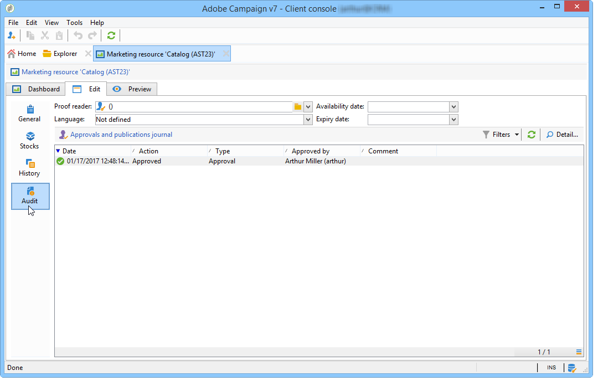

# Gestire le risorse di marketing{#managing-marketing-resources}

Adobe Campaign consente di gestire e monitorare le risorse di marketing coinvolte nel ciclo di vita della campagna. Queste risorse di marketing possono essere un opuscolo, un aiuto visivo o qualsiasi altro mezzo di comunicazione che coinvolga più operatori.

Per ogni risorsa di marketing gestita tramite Adobe Campaign, puoi tenere traccia dello stato e della cronologia in qualsiasi momento e visualizzare la versione corrente.

## Aggiunta di una risorsa di marketing {#adding-a-marketing-resource}

Le risorse di marketing sono accessibili tramite la **[!UICONTROL Campaigns]** scheda .

Per aggiungere una risorsa, fai clic sul pulsante **[!UICONTROL Create]** pulsante .

Per rendere disponibile una risorsa sul server Adobe Campaign, devi aggiungere la risorsa desiderata trascinandola e rilasciandola nell’area centrale dell’editor. Puoi anche fare clic sul pulsante **[!UICONTROL Upload file to server...]** link.

Un messaggio di conferma consente di avviare il caricamento.

Al termine del caricamento, la risorsa viene aggiunta all’elenco delle risorse disponibili. È accessibile agli operatori Adobe Campaign. Possono visualizzarlo (tramite la **[!UICONTROL Preview]** , creare una copia per modificarla o aggiornare il file sul server (utilizzando **[!UICONTROL Edit]** ).

Fai clic sul pulsante **[!UICONTROL General]** per selezionare gli operatori o i gruppi di operatori incaricati del monitoraggio, del tracciamento e dell’approvazione di questa risorsa. La selezione del revisore viene eseguita tramite il **[!UICONTROL Advanced parameters]** link.

* L’operatore a cui è assegnata la risorsa è responsabile del suo tracciamento.
* L’operatore che approva è responsabile dell’approvazione della risorsa di marketing. All’avvio del processo di convalida delle risorse, riceveranno una notifica.

   Se non è selezionato alcun revisore, la risorsa **[!UICONTROL cannot be]** previa approvazione.

* Se necessario, è anche possibile specificare un lettore di bozze.

Puoi specificare una data di disponibilità (indicativa) per la risorsa. Oltre questa data, verrà visualizzata con **[!UICONTROL Late]** stato.

## Lavoro collaborativo sulle risorse {#collaborative-work-on-resources}

Puoi modificare e aggiornare una risorsa di marketing e, se necessario, informarne altri operatori Adobe Campaign. È possibile eseguire le seguenti operazioni:

* Scarica la risorsa localmente per modificarla.
* Aggiorna il file sul server e rendilo accessibile ad altri operatori.
* Bloccare una risorsa per impedirne la modifica da parte di altri operatori.

>[!NOTE]
>
>La **[!UICONTROL History]** la scheda contiene il registro di download e aggiornamento della risorsa. La **[!UICONTROL Details]** consente di visualizzare la versione selezionata.

### Blocco/sblocco di una risorsa {#locking-unlocking-a-resource}

Una volta create, le risorse sono disponibili nel dashboard delle risorse di marketing e gli operatori possono modificarle e modificarle.

Quando un operatore desidera lavorare su una risorsa, è preferibile bloccarla prima di avviare il lavoro, per impedire ad altri operatori di modificarla allo stesso tempo. La risorsa viene quindi riservata; rimane accessibile ma non può essere pubblicato o aggiornato sul server da un altro operatore.

Un messaggio speciale notifica gli operatori che tentano di accedervi:

La **[!UICONTROL Tracking]** la scheda indica il nome dell’operatore che ha bloccato la risorsa e la data di aggiornamento pianificata.

Per bloccare una risorsa, fai clic sulla risorsa seguita dalla **[!UICONTROL Lock]** nel dashboard delle risorse.

Puoi indicare la data di ritorno pianificata nella **[!UICONTROL Tracking]** della risorsa.

Queste informazioni consentono di informare gli altri operatori Adobe Campaign della data in cui la risorsa verrà sbloccata.

Una volta aggiornata la risorsa, questa viene sbloccata automaticamente e resa nuovamente disponibile a tutti gli operatori.

Se necessario, puoi anche sbloccarlo manualmente dal dashboard.

>[!NOTE]
>
>Solo l’operatore che ha bloccato la risorsa e gli operatori con diritti di amministratore sono autorizzati a sbloccare una risorsa.

### Forum di discussione {#discussion-forums}

Per ogni risorsa, l’ **[!UICONTROL Forum]** consente ai partecipanti di scambiare informazioni.

[Forum di discussione](discussion-forums.md) spiega come funzionano i forum di discussione in Adobe Campaign.

## Ciclo di vita di una risorsa di marketing {#life-cycle-of-a-marketing-resource}

Quando la risorsa viene creata, gli operatori Adobe Campaign sono nominati per progettare, correggere, approvare e pubblicare la risorsa. È possibile determinare una durata per queste campagne.

La **[!UICONTROL Tracking]** consente di monitorare eventuali azioni eseguite sulla risorsa: approvazioni, rifiuti di approvazione, osservazioni correlate o pubblicazioni.

La **[!UICONTROL History]** visualizza i trasferimenti di file effettuati per questa risorsa.

### Processo di approvazione {#approval-process}

La data di disponibilità prevista viene visualizzata nei dettagli della risorsa, se è stata specificata nella **[!UICONTROL Tracking]** scheda . Una volta raggiunta questa data, puoi eseguire il processo di approvazione utilizzando **[!UICONTROL Submit for approval]** nel dashboard delle risorse. Lo stato della risorsa diventa **[!UICONTROL Approval in progress]**.

Una risorsa può essere approvata tramite il **[!UICONTROL Approve resource]** sul dashboard.

Gli operatori autorizzati possono quindi accettare o rifiutare l’approvazione. Questa azione è possibile: tramite il messaggio e-mail inviato (facendo clic sul collegamento nel messaggio di notifica) o tramite la console (facendo clic sul pulsante **[!UICONTROL Approve]** ).

La finestra di approvazione consente di inserire un commento.

La **[!UICONTROL Tracking]** consente a tutti gli operatori di tenere traccia delle varie fasi del processo di approvazione.

>[!NOTE]
>
>Oltre al revisore specificato per ogni risorsa di marketing, gli operatori con diritti di amministratore e il gestore risorse sono autorizzati ad approvare una risorsa di marketing.

### Pubblicazione di una risorsa {#publishing-a-resource}

Una volta approvata, la risorsa marketing deve essere pubblicata. Il processo di pubblicazione deve essere soggetto a un&#39;implementazione specifica in base ai requisiti aziendali. Ciò significa che le risorse possono essere pubblicate su un server extranet o qualsiasi altro server, che informazioni specifiche possono essere inviate a un provider di servizi esterno, ecc.

Per pubblicare una risorsa, fai clic sul pulsante **[!UICONTROL Publish]** nell’area di modifica del dashboard delle risorse di marketing.

Puoi anche automatizzare la pubblicazione di una risorsa tramite un flusso di lavoro.

La pubblicazione di una risorsa significa renderla disponibile per l’uso (ad esempio da un’altra attività). La pubblicazione in quanto tale varia a seconda della natura della risorsa: per un volantino, pubblicare può significare inviare il file a una stampante, per un&#39;agenzia web, può significare pubblicarlo su un sito web, ecc.

Affinché Adobe Campaign possa pubblicare, devi creare un flusso di lavoro adeguato e collegarlo alla risorsa. Per eseguire questa operazione, apri la **[!UICONTROL Advanced settings]** nella casella della risorsa , quindi seleziona il flusso di lavoro desiderato nel **[!UICONTROL Post-processing]** campo .

Il flusso di lavoro viene eseguito:

* Quando il revisore fa clic sul pulsante **[!UICONTROL Publish resource]** oppure, se non è stato definito alcun revisore, la persona responsabile della risorsa.
* Se la risorsa viene gestita tramite un’attività di creazione di risorse di marketing, viene eseguita quando l’attività è impostata su **[!UICONTROL Finished]**, purché **[!UICONTROL Publish the marketing resource]** casella selezionata nell’attività (fare riferimento a [Attività di creazione delle risorse di marketing](creating-and-managing-tasks.md#marketing-resource-creation-task))

Se un flusso di lavoro non viene avviato immediatamente (ad esempio se il flusso di lavoro viene interrotto), lo stato della risorsa diventa **[!UICONTROL Pending publication]**. Una volta avviato il flusso di lavoro, lo stato della risorsa diventa **[!UICONTROL Published]**. Questo stato non tiene conto di eventuali errori nel processo di pubblicazione. Controlla lo stato del flusso di lavoro per assicurarti che sia stato eseguito correttamente.

## Collegamento di una risorsa a una campagna {#linking-a-resource-to-a-campaign}

### Riferimento a una risorsa di marketing {#referencing-a-marketing-resource}

Le risorse di marketing possono essere associate alle campagne, purché questa funzione sia stata selezionata nel modello di campagna.

>[!NOTE]
>
>Per informazioni dettagliate su come creare e configurare i modelli delle campagne, consulta [Modelli di campagna](../campaigns/marketing-campaign-templates.md)

Fai clic sul pulsante **[!UICONTROL Documents > Resources]** nel dashboard della campagna, quindi fai clic su **[!UICONTROL Add]** per selezionare la risorsa in questione.

Puoi filtrare le risorse per stato, natura o tipo oppure applicare un filtro personalizzato.

Fai clic su **[!UICONTROL OK]** per aggiungere la risorsa all’elenco delle risorse di marketing a cui si fa riferimento per questa campagna.

La **[!UICONTROL Details]** consente di modificarlo e visualizzarlo.

Le risorse aggiunte vengono visualizzate nel dashboard. Possono anche essere modificati qui.

### Aggiunta di una risorsa di marketing a una struttura di consegna {#adding-a-marketing-resource-to-a-delivery-outline}

Le risorse di marketing possono essere associate alle consegne tramite i contorni di consegna.

>[!NOTE]
>
>Per ulteriori informazioni sui profili di consegna, consulta [Associazione e strutturazione delle risorse collegate tramite una struttura di consegna](../campaigns/marketing-campaign-deliveries.md).

## Gestione delle scorte {#stock-management}

Puoi associare una risorsa di marketing a uno o più stock per gestire gli approvvigionamenti e visualizzare un avviso sul dashboard in caso di stock insufficienti.

>[!NOTE]
>
>Per ulteriori informazioni sulla gestione delle azioni in Adobe Campaign, consulta [Gestione delle scorte](../campaigns/providers--stocks-and-budgets.md#stock-management).

Per associare una risorsa di marketing a una risorsa di marketing, modifica la mappa azioni e modifica o crea una risorsa. Aggiungi una linea di magazzino e seleziona la risorsa di marketing corrispondente.

Se necessario, puoi modificare la risorsa selezionata tramite la **[!UICONTROL Edit the link]** icona (lente di ingrandimento) situata a destra della risorsa una volta selezionata.

Specificare la risorsa iniziale e la scorta di avviso, quindi salvare.

La scorta è indicata nei dettagli della risorsa.

Se lo stock è insufficiente, viene inviata un&#39;avvertenza agli operatori interessati.

## Funzioni avanzate {#advanced-functions}

Il dashboard delle risorse di marketing ti consente di eseguire i tipi di operazioni consueti: aggiungi, modifica, blocca/sblocca, approva, pubblica. Puoi creare altri tipi di risorse di marketing e accedere a funzionalità avanzate tramite la struttura di Adobe Campaign. A questo scopo, fai clic su **[!UICONTROL Explorer]** nella home page di Adobe Campaign.

Per impostazione predefinita, le risorse di marketing sono memorizzate in **[!UICONTROL MRM > Marketing resources]** nodo dell&#39;albero.

Da questa visualizzazione puoi aggiungere le seguenti risorse:

* File
* HTML
* Testo
* URL
