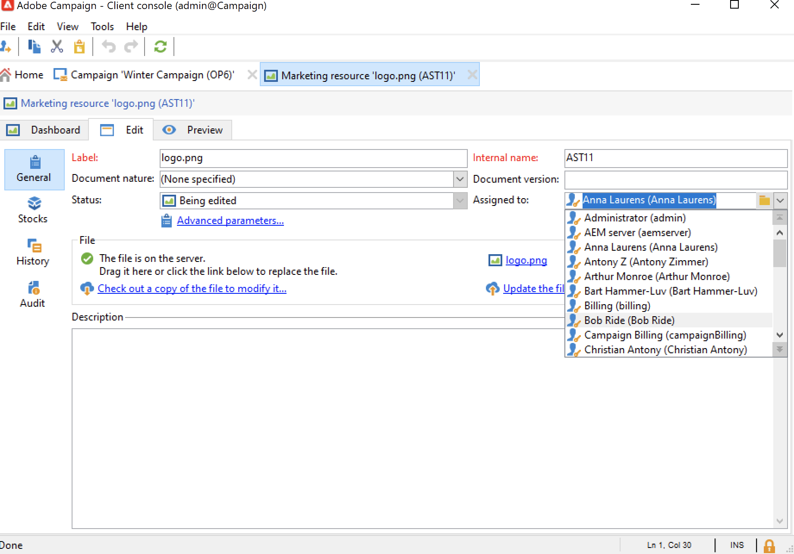
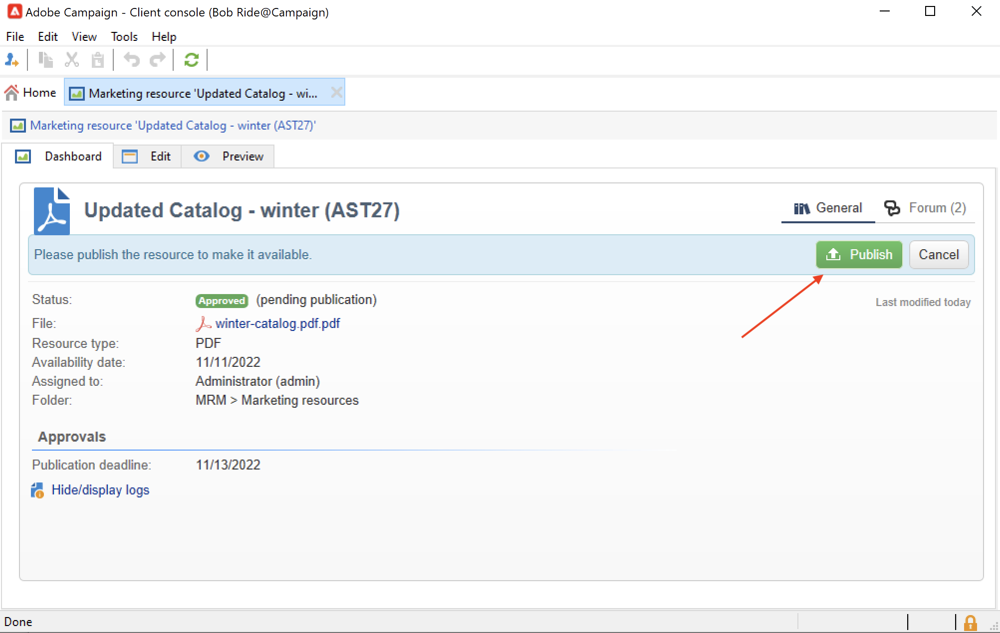
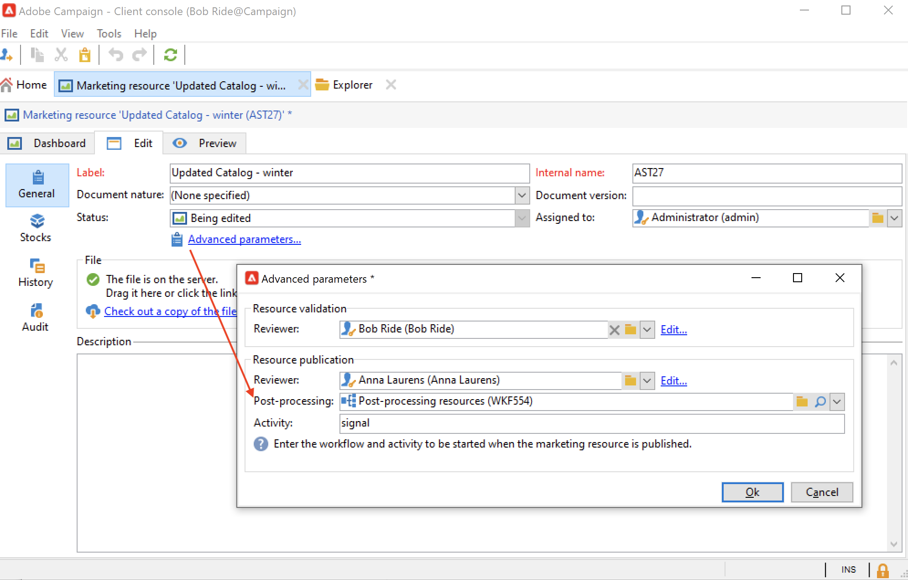

# Gestire le risorse di marketing{#managing-marketing-resources}

Utilizza Adobe Campaign per gestire e tenere traccia delle risorse di marketing coinvolte nel ciclo di vita della campagna. Queste risorse di marketing possono essere un white paper, un file di dati, un logo o qualsiasi altra risorsa correlata a una campagna.

Per ogni risorsa marketing gestita tramite Adobe Campaign, puoi tracciarne lo stato e la cronologia in qualsiasi momento e visualizzare la versione corrente.

Per impostazione predefinita, le risorse di marketing sono memorizzate in **[!UICONTROL MRM > Marketing resources]** cartella di Campaign explorer.

## Aggiungere una risorsa di marketing {#adding-a-marketing-resource}

Per aggiungere una risorsa di marketing, effettua le seguenti operazioni:

1. Accedi a **[!UICONTROL Campaigns]** e seleziona **[!UICONTROL Marketing resouces]**.

1. Fai clic sul pulsante **[!UICONTROL Create]**.
   
1. Trascina e rilascia il file nella finestra delle risorse Marketing per caricarlo sul server Campaign. È inoltre possibile utilizzare **[!UICONTROL Upload file to server...]** collegamento.
   

Al termine del caricamento, la risorsa viene aggiunta all’elenco delle risorse disponibili.

## Gestire le risorse di marketing {#manage-marketing-resources}

Una volta caricata, la risorsa marketing è disponibile per tutti gli operatori Adobe Campaign. Possono visualizzarlo, crearne una copia per modificarlo o aggiornare il file sul server.

Utilizza il **[!UICONTROL Assigned to]** elenco a discesa nella **[!UICONTROL Edit]** per selezionare l’operatore responsabile della risorsa.

Puoi anche selezionare gli operatori o i gruppi di operatori responsabili della convalida delle risorse e della pubblicazione delle risorse. Per accedere a queste opzioni, fai clic su  **[!UICONTROL Advanced parameters]** collegamento.

Questi operatori ricevono una notifica tramite e-mail all’avvio del processo di convalida delle risorse.

Se non è selezionato alcun revisore, la risorsa **[!UICONTROL cannot be]** soggetto ad approvazione.

Utilizza il **[!UICONTROL Audit]** per aggiungere un lettore di bozze e definire una data di disponibilità per la risorsa. Oltre questa data, verrà visualizzato con **[!UICONTROL Late]** stato.

>[!NOTE]
>
>Il **[!UICONTROL History]** contiene il registro di download e aggiornamento della risorsa. Il **[!UICONTROL Details]** consente di visualizzare la versione selezionata.
>
>Il **[!UICONTROL Audit]** Questa scheda ti consente di monitorare tutte le azioni eseguite sulla risorsa: approvazioni, rifiuti di approvazione, commenti correlati o pubblicazioni.

### Blocco/sblocco di una risorsa {#locking-unlocking-a-resource}

Una volta create, le risorse sono disponibili nel dashboard delle risorse di marketing e gli operatori possono modificarle.

Quando un operatore inizia a lavorare su una risorsa, si consiglia di bloccarla per impedire ad altri operatori di modificarla contemporaneamente. La risorsa viene quindi riservata: rimane accessibile, ma non può essere pubblicata o aggiornata sul server da un altro operatore.

Una risorsa marketing può essere bloccata solo se non è stata approvata.

Per bloccare una risorsa, fai clic su **[!UICONTROL Lock]** nel dashboard delle risorse.

Una volta aggiornata la risorsa, fai clic su **[!UICONTROL Lock]** nel dashboard delle risorse per renderli nuovamente disponibili a tutti gli operatori.

Un messaggio speciale avvisa gli operatori che tentano di accedervi:

Il **[!UICONTROL Tracking]** indica il nome dell’operatore che ha bloccato la risorsa.

>[!NOTE]
>
>Solo l&#39;operatore che ha bloccato la risorsa e gli operatori con diritti di amministratore sono autorizzati a sbloccare una risorsa.

### Forum di discussione {#discussion-forums}

Per ogni risorsa, il **[!UICONTROL Forum]** consente ai partecipanti di condividere le informazioni.

Per ulteriori informazioni, consulta [Forum di discussione](discussion-forums.md) sezione.

### Processo di approvazione {#approval-process}

La data di disponibilità prevista viene visualizzata nei dettagli della risorsa, se è stata specificata in **[!UICONTROL Tracking]** scheda. Una volta raggiunta tale data, puoi eseguire il processo di approvazione utilizzando **[!UICONTROL Submit for approval]** nel dashboard delle risorse. Lo stato della risorsa diventa **[!UICONTROL Approval in progress]**.

Per approvare una risorsa, fai clic su **[!UICONTROL Approve the resource]** sulla dashboard.

Gli operatori autorizzati possono quindi accettare o rifiutare l’approvazione. Questa azione è possibile tramite il messaggio e-mail inviato (facendo clic sul collegamento nel messaggio di notifica) o tramite la console (facendo clic sul pulsante **[!UICONTROL Approve]** ).

La finestra di approvazione consente di inserire un commento.

Accedi a **[!UICONTROL Tracking]** per verificare le approvazioni.

>[!NOTE]
>
>Oltre al revisore specificato per ogni risorsa di marketing, gli operatori con diritti di amministratore e il responsabile risorse sono autorizzati ad approvare una risorsa di marketing.

### Pubblicare una risorsa {#publishing-a-resource}

Una volta approvata, la risorsa marketing deve essere pubblicata. Il processo di pubblicazione deve essere soggetto a un&#39;implementazione specifica in base ai requisiti aziendali. Ciò significa che le risorse possono essere pubblicate su una extranet o su qualsiasi altro server, che è possibile inviare informazioni specifiche a un fornitore di servizi esterno e così via.

Per pubblicare una risorsa, fai clic su **[!UICONTROL Publish]** nell’area di modifica del dashboard delle risorse di marketing.

Puoi anche automatizzare la pubblicazione di una risorsa tramite un flusso di lavoro.

Pubblicare una risorsa significa renderla disponibile per l’uso (ad esempio, da un’altra attività). La pubblicazione varia a seconda della natura della risorsa: per un volantino, la pubblicazione può significare l&#39;invio del file a una stampante, per un&#39;agenzia web, può significare la pubblicazione su un sito web, ecc.

Per pubblicare Adobe Campaign, devi creare un flusso di lavoro adeguato e collegarlo alla risorsa. Per eseguire questa operazione, apri la **[!UICONTROL Advanced settings...]** della risorsa, quindi seleziona il flusso di lavoro desiderato nella sezione **[!UICONTROL Post-processing]** campo.

Il flusso di lavoro viene eseguito:

* Quando il revisore fa clic su **[!UICONTROL Publish resource]** (o, se non è stato definito alcun revisore, la persona responsabile della risorsa).
* Se la risorsa viene gestita tramite un’attività di creazione di risorse di marketing, verrà eseguita quando l’attività è impostata su **[!UICONTROL Finished]**, purché **[!UICONTROL Publish the marketing resource]** è selezionata nell&#39;attività. [Ulteriori informazioni](creating-and-managing-tasks.md#marketing-resource-creation-task))

Se un flusso di lavoro non viene avviato immediatamente (ad esempio se viene interrotto), lo stato della risorsa cambia in **[!UICONTROL Pending publication]**. Una volta avviato il flusso di lavoro, lo stato della risorsa cambia in **[!UICONTROL Published]**. Questo stato non tiene conto di possibili errori nel processo di pubblicazione. Controlla lo stato del flusso di lavoro per assicurarti che sia eseguito correttamente.

## Collegare una risorsa a una campagna {#linking-a-resource-to-a-campaign}

### Fare riferimento a una risorsa di marketing {#referencing-a-marketing-resource}

Le risorse di marketing possono essere associate alle campagne, purché questa funzione sia stata selezionata nel [modello di campagna](../campaigns/marketing-campaign-templates.md).

Accedi a **[!UICONTROL Edit > Documents > Resources]** nel dashboard della campagna, quindi fai clic su **[!UICONTROL Add]** per selezionare la risorsa in questione.

Puoi filtrare le risorse per stato, natura o tipo, oppure applicare un filtro personalizzato.

Utilizza il **[!UICONTROL Details]** per modificare e visualizzare in anteprima la risorsa.

### Aggiungere una risorsa marketing a una struttura di consegna {#adding-a-marketing-resource-to-a-delivery-outline}

Le risorse di marketing possono essere associate alle consegne tramite i profili di consegna.

Ulteriori informazioni sui profili di consegna in [questa sezione](../campaigns/marketing-campaign-deliveries.md).

A questo scopo, fai clic con il pulsante destro del mouse su una struttura di consegna e seleziona **Nuovo > Risorsa**.

Inserisci il nome della risorsa e selezionala dalla **Risorsa marketing** elenco a discesa.

## Gestione delle scorte {#stock-management}

È possibile associare una risorsa marketing a uno o più titoli per gestire le forniture e visualizzare un avviso nel dashboard in caso di scorte insufficienti.

Per associare una risorsa marketing a un magazzino, effettuare le seguenti operazioni:

1. Modificate un materiale grezzo o createne uno nuovo. Ulteriori informazioni sulle scorte in [questa sezione](../campaigns/providers--stocks-and-budgets.md#stock-management).

1. Aggiungere una linea magazzino e selezionare la risorsa marketing corrispondente.

   

   Puoi modificare la risorsa selezionata tramite **[!UICONTROL Edit the link]** a destra della risorsa, una volta selezionata.

1. Specificare il materiale iniziale e il materiale di allerta, quindi salvare.

Le scorte sono indicate nella risorsa di marketing **Scorte** scheda.
