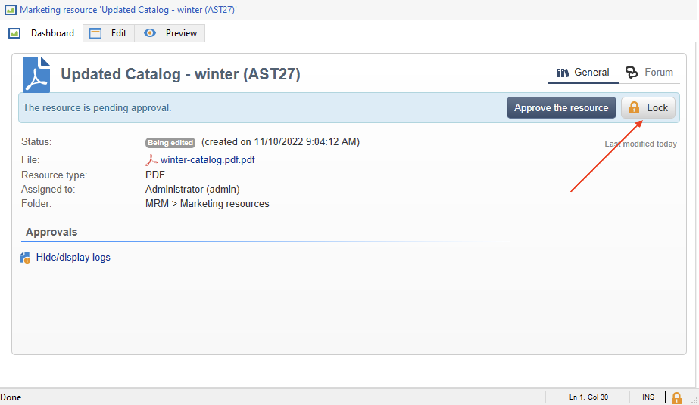
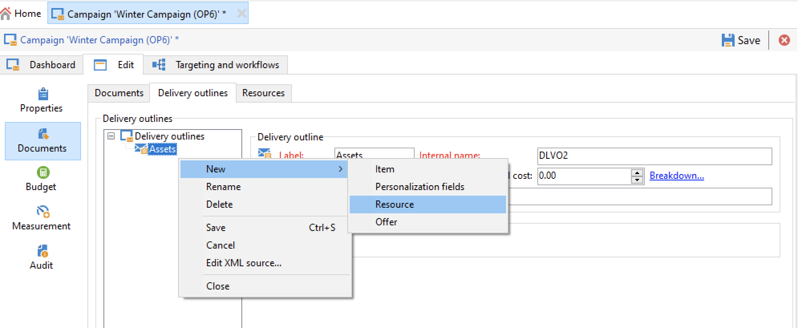
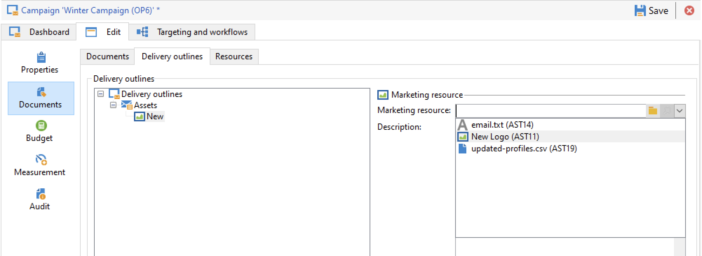

# Gestire le risorse di marketing{#managing-marketing-resources}

Utilizza Adobe Campaign per gestire e monitorare le risorse di marketing coinvolte nel ciclo di vita della campagna. Queste risorse di marketing possono essere un white paper, un file di dati, un logo o qualsiasi altra risorsa correlata a una campagna.

Per ogni risorsa di marketing gestita tramite Adobe Campaign, puoi tenere traccia dello stato e della cronologia in qualsiasi momento e visualizzare la versione corrente.

Per impostazione predefinita, le risorse di marketing sono memorizzate in **[!UICONTROL MRM > Marketing resources]** cartella di Campaign explorer.

## Aggiungere una risorsa di marketing {#adding-a-marketing-resource}

Per aggiungere una risorsa di marketing, segui i passaggi seguenti:

1. Sfoglia il **[!UICONTROL Campaigns]** e seleziona **[!UICONTROL Marketing resouces]**.

1. Fai clic sul pulsante **[!UICONTROL Create]**.
   
1. Trascina e rilascia il file nella finestra della risorsa Marketing per caricarlo sul server Campaign. È inoltre possibile utilizzare **[!UICONTROL Upload file to server...]** link.
   

Al termine del caricamento, la risorsa viene aggiunta all’elenco delle risorse disponibili.

## Gestire le risorse di marketing {#manage-marketing-resources}

Una volta effettuato l’aggiornamento, la risorsa di marketing è disponibile per tutti gli operatori Adobe Campaign. Possono visualizzarlo, creare una copia per modificarlo o aggiornare il file sul server.

Utilizza la **[!UICONTROL Assigned to]** elenco a discesa nella **[!UICONTROL Edit]** per selezionare l’operatore responsabile della risorsa.

È inoltre possibile selezionare gli operatori o i gruppi di operatori responsabili della convalida delle risorse e della pubblicazione delle risorse. Per accedere a queste opzioni, fai clic sul pulsante  **[!UICONTROL Advanced parameters]** link.

Questi operatori ricevono una notifica e-mail all’avvio del processo di convalida delle risorse.

Se non è selezionato alcun revisore, la risorsa **[!UICONTROL cannot be]** previa approvazione.

Utilizza la **[!UICONTROL Audit]** per aggiungere un lettore di prove e definire una data di disponibilità per la risorsa. Oltre questa data, verrà visualizzata con **[!UICONTROL Late]** stato.

>[!NOTE]
>
>La **[!UICONTROL History]** la scheda contiene il registro di download e aggiornamento della risorsa. La **[!UICONTROL Details]** consente di visualizzare la versione selezionata.
>
>La **[!UICONTROL Audit]** consente di monitorare eventuali azioni eseguite sulla risorsa: approvazioni, rifiuti di approvazione, osservazioni correlate o pubblicazioni.

### Blocco/sblocco di una risorsa {#locking-unlocking-a-resource}

Una volta create, le risorse sono disponibili nel dashboard delle risorse di marketing e gli operatori possono modificarle e modificarle.

Quando un operatore inizia a lavorare su una risorsa, è consigliabile bloccarla, per impedire ad altri operatori di modificarla allo stesso tempo. La risorsa viene quindi riservata: rimane accessibile ma non può essere pubblicato o aggiornato sul server da un altro operatore.

Una risorsa di marketing può essere bloccata solo se non è stata approvata.

Per bloccare una risorsa, fai clic sul pulsante **[!UICONTROL Lock]** nel dashboard delle risorse.

Una volta aggiornata la risorsa, fai clic sul pulsante **[!UICONTROL Lock]** nel dashboard delle risorse per renderlo nuovamente disponibile a tutti gli operatori.

Un messaggio speciale notifica gli operatori che tentano di accedervi:

La **[!UICONTROL Tracking]** la scheda indica il nome dell’operatore che ha bloccato la risorsa.

>[!NOTE]
>
>Solo l’operatore che ha bloccato la risorsa e gli operatori con diritti di amministratore sono autorizzati a sbloccare una risorsa.

### Forum di discussione {#discussion-forums}

Per ogni risorsa, l’ **[!UICONTROL Forum]** consente ai partecipanti di condividere informazioni.

Ulteriori informazioni nel [Forum di discussione](discussion-forums.md) sezione .

### Processo di approvazione {#approval-process}

La data di disponibilità prevista viene visualizzata nei dettagli della risorsa, se è stata specificata nella **[!UICONTROL Tracking]** scheda . Una volta raggiunta questa data, puoi eseguire il processo di approvazione utilizzando **[!UICONTROL Submit for approval]** nel dashboard delle risorse. Lo stato della risorsa diventa **[!UICONTROL Approval in progress]**.

Per approvare una risorsa, fai clic sul pulsante **[!UICONTROL Approve the resource]** sul dashboard.

Gli operatori autorizzati possono quindi accettare o rifiutare l’approvazione. Questa azione è possibile: tramite il messaggio e-mail inviato (facendo clic sul collegamento nel messaggio di notifica) o tramite la console (facendo clic sul pulsante **[!UICONTROL Approve]** ).

La finestra di approvazione consente di inserire un commento.

Sfoglia il **[!UICONTROL Tracking]** per controllare le approvazioni.

>[!NOTE]
>
>Oltre al revisore specificato per ogni risorsa di marketing, gli operatori con diritti di amministratore e il gestore risorse sono autorizzati ad approvare una risorsa di marketing.

### Pubblicare una risorsa {#publishing-a-resource}

Una volta approvata, la risorsa marketing deve essere pubblicata. Il processo di pubblicazione deve essere soggetto a un&#39;implementazione specifica in base ai requisiti aziendali. Ciò significa che le risorse possono essere pubblicate su un server extranet o qualsiasi altro server, che informazioni specifiche possono essere inviate a un provider di servizi esterno, ecc.

Per pubblicare una risorsa, fai clic sul pulsante **[!UICONTROL Publish]** nell’area di modifica del dashboard delle risorse di marketing.

Puoi anche automatizzare la pubblicazione di una risorsa tramite un flusso di lavoro.

La pubblicazione di una risorsa significa renderla disponibile per l’uso (ad esempio da un’altra attività). La pubblicazione in quanto tale varia a seconda della natura della risorsa: per un volantino, pubblicare può significare inviare il file a una stampante, per un&#39;agenzia web, può significare pubblicarlo su un sito web, ecc.

Affinché Adobe Campaign possa pubblicare, devi creare un flusso di lavoro adeguato e collegarlo alla risorsa. Per eseguire questa operazione, apri la **[!UICONTROL Advanced settings...]** nella casella della risorsa , quindi seleziona il flusso di lavoro desiderato nel **[!UICONTROL Post-processing]** campo .

Il flusso di lavoro viene eseguito:

* Quando il revisore fa clic sul pulsante **[!UICONTROL Publish resource]** oppure, se non è stato definito alcun revisore, la persona responsabile della risorsa.
* Se la risorsa viene gestita tramite un’attività di creazione di risorse di marketing, viene eseguita quando l’attività è impostata su **[!UICONTROL Finished]**, purché **[!UICONTROL Publish the marketing resource]** casella selezionata nell&#39;attività. [Ulteriori informazioni](creating-and-managing-tasks.md#marketing-resource-creation-task))

Se un flusso di lavoro non viene avviato immediatamente (ad esempio se il flusso di lavoro viene interrotto), lo stato della risorsa diventa **[!UICONTROL Pending publication]**. Una volta avviato il flusso di lavoro, lo stato della risorsa diventa **[!UICONTROL Published]**. Questo stato non tiene conto di eventuali errori nel processo di pubblicazione. Controlla lo stato del flusso di lavoro per assicurarti che sia stato eseguito correttamente.

## Collegamento di una risorsa a una campagna {#linking-a-resource-to-a-campaign}

### Riferimento a una risorsa di marketing {#referencing-a-marketing-resource}

Le risorse di marketing possono essere associate alle campagne, purché sia stata selezionata nella [modello di campagna](../campaigns/marketing-campaign-templates.md).

Sfoglia il **[!UICONTROL Edit > Documents > Resources]** nel dashboard della campagna, quindi fai clic su **[!UICONTROL Add]** per selezionare la risorsa in questione.

Puoi filtrare le risorse per stato, natura o tipo oppure applicare un filtro personalizzato.

Utilizza la **[!UICONTROL Details]** per modificare e visualizzare in anteprima la risorsa.

### Aggiungere una risorsa di marketing a una struttura di consegna {#adding-a-marketing-resource-to-a-delivery-outline}

Le risorse di marketing possono essere associate alle consegne tramite i contorni di consegna.

Ulteriori informazioni sui profili di consegna in [questa sezione](../campaigns/marketing-campaign-deliveries.md).

A questo scopo, fai clic con il pulsante destro del mouse su un profilo di consegna e seleziona **Nuovo > Risorsa**.

Immetti il nome della risorsa e selezionala dalla **Risorsa di marketing** elenco a discesa.

## Gestione delle scorte {#stock-management}

Puoi associare una risorsa di marketing a uno o più stock per gestire gli approvvigionamenti e visualizzare un avviso sul dashboard in caso di stock insufficienti.

Per associare una risorsa di marketing a un’azione, segui la procedura seguente:

1. Modificare una risorsa o crearne una nuova. Ulteriori informazioni sugli stock in [questa sezione](../campaigns/providers--stocks-and-budgets.md#stock-management).

1. Aggiungi una linea di magazzino e seleziona la risorsa di marketing corrispondente.

   

   Puoi modificare la risorsa selezionata tramite **[!UICONTROL Edit the link]** una volta selezionata, l’icona si trova a destra della risorsa.

1. Specificare la risorsa iniziale e la scorta di avviso, quindi salvare.

La risorsa è indicata nella risorsa marketing **Scorte** scheda .
