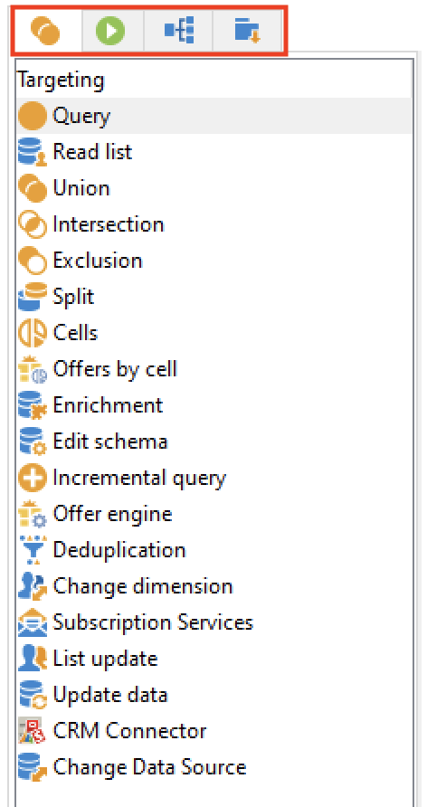
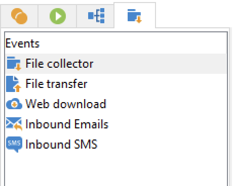

# Attività del flussi di lavoro{#wf-activities}

Le attività del flusso di lavoro sono raggruppate per categoria, in quattro schede diverse.

A seconda delle autorizzazioni, dell’implementazione e del contesto in cui viene progettato il flusso di lavoro, le attività disponibili possono essere diverse.

Ad esempio, i flussi di lavoro creati in una campagna hanno una scheda **Consegne** specifica, con tutti i canali. Questa scheda non è disponibile in [flusso di lavoro tecnico](technical-workflows.md).

I flussi di lavoro tecnici hanno una scheda **Eventi** specifica che non è disponibile nei [flussi di lavoro per campagne](campaign-workflows.md).

Tutte le attività sono descritte nelle sezioni seguenti:

* [Attività di targeting](targeting-activities.md)
* [Attività di controllo del flusso](flow-control-activities.md)
* [Attività azioni](action-activities.md)
* [Attività di eventi](event-activities.md)
* [Attività specifiche del flusso di lavoro della campagna](../campaigns/marketing-campaign-deliveries.md)
