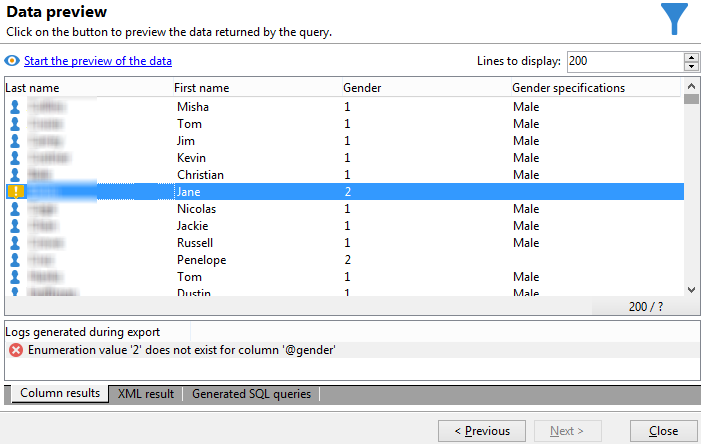

# Aggiungi un campo calcolato di tipo Enumerazione {#adding-an-enumeration-type-calculated-field}

Qui si desidera creare una query con un **[!UICONTROL Enumerations]** digitare campo calcolato. Questo campo genera una colonna aggiuntiva nella finestra di anteprima dati. Questa colonna specifica i valori numerici restituiti come risultato per ciascun destinatario (0, 1 e 2). A ogni valore della nuova colonna verrà assegnato un genere: &quot;Uomo&quot; per &quot;1&quot;, &quot;Donna&quot; per &quot;2&quot; o &quot;Non indicato&quot; se il valore è uguale a &quot;0&quot;.

* Quale tabella deve essere selezionata?

   Tabella dei destinatari (nms:recipient)

* Campi da selezionare nella colonna di output?

   Cognome, Nome, Genere

* Criteri su cui verranno filtrate le informazioni?

   Lingua di destinazione

Applica i seguenti passaggi:

1. Apri l’editor di query generico e seleziona la tabella Destinatario (**[!UICONTROL nms:recipient]**).
1. In **[!UICONTROL Data to extract]** finestra, seleziona **[!UICONTROL Last name]**, **[!UICONTROL First name]** e **[!UICONTROL Gender]**.

   

1. In **[!UICONTROL Sorting]** finestra, fai clic su **[!UICONTROL Next]**: non è necessario alcun tipo di ordinamento per questo esempio.
1. In **[!UICONTROL Data filtering]**, seleziona **[!UICONTROL Filtering conditions]**.
1. In **[!UICONTROL Target element]** imposta una condizione di filtro per raccogliere i destinatari che parlano inglese.

   

1. In **[!UICONTROL Data formatting]** finestra, fai clic su **[!UICONTROL Add a calculated field]**.

   

1. Vai a **[!UICONTROL Type]** finestra **[!UICONTROL Export calculated field definition]** finestra e seleziona **[!UICONTROL Enumerations]**.

   Definire la colonna a cui deve fare riferimento il nuovo campo calcolato. A questo scopo, seleziona la **[!UICONTROL Gender]** nel menu a discesa della **[!UICONTROL Source column]** campo: i valori di destinazione coincideranno con il **[!UICONTROL Gender]** colonna.

   

   Definisci la **Origine** e **Destinazione** valori: il valore di destinazione facilita la lettura del risultato della query. Questa query deve restituire il genere del destinatario e il risultato sarà 0, 1 o 2.

   Per ogni riga di &quot;destinazione di origine&quot; da inserire, fai clic su **[!UICONTROL Add]** in **[!UICONTROL List of enumeration values]**:

   * In **[!UICONTROL Source]** inserire il valore di origine per ogni genere (0,1,2) in una nuova riga.
   * In **[!UICONTROL Destination]** , immetti i valori seguenti: &quot;Non indicato&quot; per la riga &quot;0&quot;, &quot;Uomo&quot; per la riga &quot;1&quot; e &quot;Donna&quot; per la riga &quot;2&quot;.

   Seleziona la **[!UICONTROL Keep the source value]** funzione .

   Fai clic su **[!UICONTROL OK]** per approvare il campo calcolato.

   

1. In **[!UICONTROL Data formatting]** finestra, fai clic su **[!UICONTROL Next]**.
1. Nella finestra di anteprima, **[!UICONTROL start the preview of the data]**.

   La colonna aggiuntiva definisce il genere di 0, 1 e 2:

   * 0 per &quot;Non indicato&quot;
   * 1 per &quot;Uomo&quot;
   * 2 per &quot;Femmina&quot;

   

   Ad esempio, se non inserisci il genere &quot;2&quot; nel **[!UICONTROL List of enumeration values]** e **[!UICONTROL Generate a warning and continue]** funzione **[!UICONTROL In other cases]** campo selezionato, viene visualizzato un registro di avviso. Questo registro indica che il genere &quot;2&quot; (Femmina) non è stato inserito. Viene visualizzato nella **[!UICONTROL Logs generated during export]** campo della finestra di anteprima dati.

   

   Prendiamo un altro esempio e diciamo che il valore di enumerazione &quot;2&quot; non è inserito. Seleziona la **[!UICONTROL Generate an error and reject the line]** funzione: tutti i destinatari &quot;2&quot; di genere genereranno anomalie e altre informazioni nella riga (nome e cognome, ecc.) non verranno esportati. Viene visualizzato un registro degli errori nel **[!UICONTROL Logs generated during export]** campo della finestra di anteprima dati. Questo registro indica che il valore di enumerazione &quot;2&quot; non è inserito.

   
