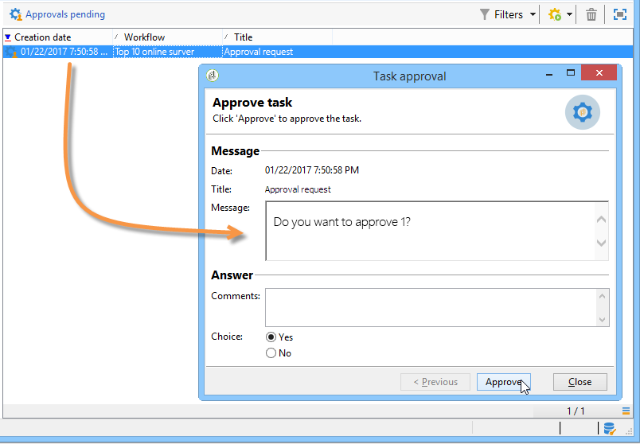

# Approvazione{#approval}

Un **Approvazione** l&#39;operazione richiede la partecipazione di un operatore. All’operatore viene assegnata un’attività e può rispondere tramite e-mail, utilizzando la pagina web collegata nel messaggio e-mail o tramite la console.

## Assegnazione attività {#task-assignment}

Per impostazione predefinita, l’approvazione viene assegnata a un gruppo di operatori. Questo gruppo rappresenta un ruolo, ad esempio &quot;Gruppo di contenuti newsletter&quot; o &quot;Gruppo di targeting newsletter&quot;. Ogni operatore del gruppo può rispondere, ma viene presa in considerazione solo la prima risposta (tranne in caso di più approvazioni).

Se necessario, è possibile assegnare l&#39;attività di approvazione a un singolo operatore o a un insieme di operatori definiti da un filtro.

* Per selezionare un singolo operatore, selezionare **[!UICONTROL Operator]** valore in **[!UICONTROL Assignment type]** e selezionare l&#39;operatore pertinente nell&#39;elenco a discesa del **[!UICONTROL Assignee]** campo.

   

   >[!CAUTION]
   >
   >Solo l&#39;operatore scelto sarà autorizzato ad approvare l&#39;attività.

* Puoi definire una query per filtrare gli operatori di approvazione. A questo scopo, seleziona la **[!UICONTROL Filter]** valore in **[!UICONTROL Assignment type]** e fare clic sul pulsante **[!UICONTROL Advanced parameters...]** per definire le condizioni di filtro, come mostrato nell’esempio seguente:

   

In caso di approvazione singola, viene attivata la transizione corrispondente alla scelta dell’operatore e l’operazione è terminata: gli altri operatori non possono rispondere.

In caso di più approvazioni, sono abilitate le transizioni corrispondenti alla scelta di ciascun operatore. L&#39;attività viene completata quando tutti gli operatori del gruppo hanno risposto o quando l&#39;attività è scaduta.

Questa attività non blocca l’elaborazione e il flusso di lavoro può eseguire altre attività in attesa di risposta.

Un operatore può approvare i compiti assegnati a tale operatore dalla console client. Un operatore con diritti di amministratore può visualizzare ed eliminare le attività assegnate a qualsiasi operatore, ma non può rispondervi.

La modifica del titolo o del corpo del messaggio dell’attività non influisce sulle attività correnti, ma, d’altra parte, la modifica delle scelte possibili influisce direttamente sulle attività correnti, che ereditano automaticamente il nuovo elenco di scelte.

**Approvazione** le attività di tipo sono accessibili da **[!UICONTROL Administration > Production > Objects created automatically > Approvals pending]** node: gli operatori possono accedere al modulo di approvazione direttamente tramite questa vista.

## Properties {#properties}

Le variabili di personalizzazione possono essere utilizzate nel messaggio inviato ai revisori. Possono essere inseriti nel titolo o nel corpo del messaggio.

Questo **[!UICONTROL Title]** contiene il titolo del messaggio: Questo è l’oggetto del messaggio e-mail inviato. Il titolo, così come il corpo del messaggio, sono modelli JavaScript e possono quindi contenere valori calcolati in base al contesto del flusso di lavoro.

La sezione inferiore dell’editor ti consente di definire l’elenco delle risposte possibili. Esiste una transizione corrispondente a ogni risposta. Il nome è l&#39;identificatore interno e l&#39;etichetta è il testo che verrà visualizzato nell&#39;elenco di scelte.

Fai clic su **[!UICONTROL Advanced parameters...]** per selezionare il modello di consegna da utilizzare per la notifica agli operatori. Il modello predefinito (nome interno &quot;notificationAssignee&quot;) prende il titolo e il messaggio e aggiunge un collegamento alla pagina web utilizzata per rispondere.

Questo modello può essere modificato per personalizzare il layout del messaggio, ma è preferibile crearne una copia. Il meccanismo di targeting (file esterno, mappatura destinazione) non deve essere modificato perché è necessario per il corretto funzionamento delle notifiche.

Un esempio di approvazione è mostrato in [Definizione delle approvazioni](define-approvals.md).

## Parametri di output {#output-parameters}

* **[!UICONTROL response]**

   Commento relativo alla risposta

* **[!UICONTROL responseOperator]**

   Identificatore dell’operatore che ha risposto. Questo campo è un valore numerico, ma **[!UICONTROL String]** campo.
