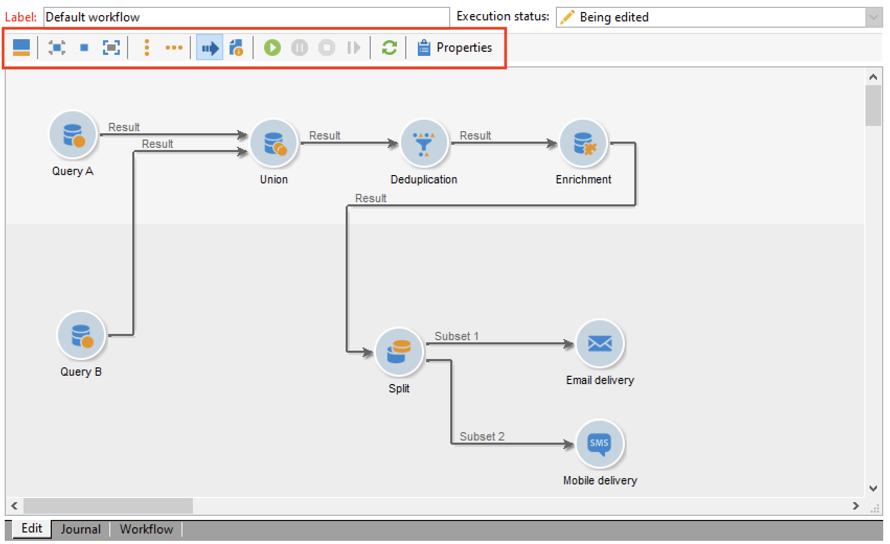
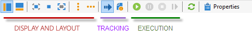
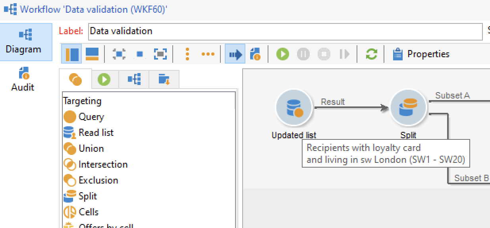

# Creare un flusso di lavoro {#build-a-workflow}

## Crea un nuovo flusso di lavoro {#create-a-new-workflow}

Il flusso di creazione del flusso di lavoro dipende dal tipo di flussi di lavoro. Puoi eseguire le seguenti azioni:

* Creare [flussi di lavoro di targeting](#targeting-workflows) dal nodo **[!UICONTROL Profiles and Targets]** > **[!UICONTROL Jobs]** > **[!UICONTROL Targeting workflows]** di Explorer o dalla scheda **[!UICONTROL Profiles and Targets]** della home page tramite la scheda secondaria **[!UICONTROL Targeting workflows]**.

  

* Crea [Flussi di lavoro per campagne](#campaign-workflows) dalla scheda **[!UICONTROL Targeting and workflows]** di una campagna

* Crea [flussi di lavoro tecnici](#technical-workflows) dal nodo **[!UICONTROL Administration]** > **[!UICONTROL Production]** > **[!UICONTROL Technical workflows]** di Explorer. Si consiglia di creare una cartella di flusso di lavoro specifica per salvare i flussi di lavoro tecnici.

Fare clic sul pulsante **[!UICONTROL New]** situato sopra l&#39;elenco dei flussi di lavoro.

Immettere un&#39;etichetta e fare clic su **[!UICONTROL Save]**.

## Aggiungere e collegare attività {#add-and-link-activities}

Ora devi definire le varie attività e collegarle nel diagramma. In questa fase della configurazione, è possibile visualizzare l’etichetta del diagramma e lo stato del flusso di lavoro (Modifica in corso). La sezione inferiore della finestra viene utilizzata solo per modificare il diagramma. Contiene una barra degli strumenti, una palette di attività (a sinistra) e il diagramma stesso (a destra).

>[!NOTE]
>
>Se la palette non viene visualizzata, fai clic sul primo pulsante sulla barra degli strumenti del flusso di lavoro per visualizzarla.

Le attività sono raggruppate per categoria nelle diverse schede della palette. Le schede e le attività disponibili possono variare a seconda del tipo di flusso di lavoro (tecnico, di targeting o del flusso di lavoro della campagna).

* La prima scheda contiene attività di targeting e manipolazione dei dati. Queste attività sono descritte in dettaglio in [Attività di targeting](targeting-activities.md).
* La seconda scheda contiene le attività di pianificazione, utilizzate principalmente per coordinare altre attività. Queste attività sono descritte in dettaglio in [Attività di controllo del flusso](flow-control-activities.md).
* La terza scheda contiene gli strumenti e le azioni che possono essere utilizzati nel flusso di lavoro. Queste attività sono descritte in dettaglio in [Attività azione](action-activities.md).
* La quarta scheda contiene attività che dipendono da un dato evento, ad esempio la ricezione di un messaggio e-mail o l’arrivo di un file su un server. Queste attività sono descritte in dettaglio in [Attività evento](event-activities.md).

Per creare il diagramma

1. Aggiungi un’attività selezionandola nella palette e spostandola nel diagramma con un’operazione di trascinamento della selezione.

   Aggiungi un&#39;attività **Inizio** e quindi un&#39;attività **Consegna** nel diagramma.

   

1. Collega le attività trascinando la transizione dell&#39;attività **Start** e rilasciandola sull&#39;attività **Delivery**.

   

   Puoi collegare automaticamente un’attività alla precedente inserendo la nuova attività alla fine della transizione.

1. Aggiungi le attività necessarie e collegale come mostrato nel diagramma seguente.

   

>[!CAUTION]
>
>Puoi copiare e incollare le attività all’interno dello stesso flusso di lavoro. Tuttavia, si sconsiglia di copiare e incollare le attività tra flussi di lavoro diversi. Alcune impostazioni associate ad attività come Consegne e Modulo di pianificazione potrebbero causare conflitti ed errori durante l’esecuzione del flusso di lavoro di destinazione. Ti consigliamo invece di **Duplicare** flussi di lavoro. Per ulteriori informazioni, vedere [Flussi di lavoro duplicati](#duplicate-workflows).

È possibile modificare la visualizzazione e il layout del grafico utilizzando i seguenti elementi:

* **Usa la barra degli strumenti**

  La barra degli strumenti di modifica del diagramma consente di accedere alle funzioni di layout ed esecuzione del flusso di lavoro.

  

  Questo consente di adattare il layout dello strumento di modifica: visualizzazione della palette e panoramica, dimensioni e allineamento degli oggetti grafici.

  

  Le icone relative all’avanzamento e alla visualizzazione dei registri sono descritte in dettaglio nelle sezioni seguenti:

   * [Avanzamento visualizzazione](monitor-workflow-execution.md#displaying-progress)
   * [Visualizza registri](monitor-workflow-execution.md#displaying-logs)

* **Allineamento oggetto**

  Per allineare le icone, selezionarle e fare clic sull&#39;icona **[!UICONTROL Align vertically]** o **[!UICONTROL Align horizontally]**.

  Utilizza il tasto **CTRL** per selezionare diverse attività sparse o per deselezionare una o più attività. Fare clic sullo sfondo del diagramma per deselezionare tutto.

* **Gestione immagini**

  Puoi personalizzare l’immagine di sfondo del diagramma e quelle relative alle varie attività. Consulta [Modificare le immagini dell&#39;attività](change-activity-images.md).

## Configurare le attività {#configure-activities}

Fare doppio clic su un&#39;attività per configurarla oppure fare clic con il pulsante destro del mouse e selezionare **[!UICONTROL Open...]**.

>[!NOTE]
>
>Le attività del flusso di lavoro di Campaign sono descritte in [questa sezione](activities.md).

La prima scheda contiene la configurazione di base. La scheda **[!UICONTROL Advanced]** contiene i parametri aggiuntivi utilizzati in particolare per definire il comportamento quando si verifica un errore, specificare la durata di esecuzione di un&#39;attività e immettere uno script di inizializzazione.

Per comprendere meglio le attività e migliorare la leggibilità del flusso di lavoro, puoi inserire commenti nelle attività.

Questi commenti vengono visualizzati automaticamente quando gli operatori scorrono sull’attività.

## Modelli di flusso di lavoro {#workflow-templates}

I modelli di flusso di lavoro contengono la configurazione generale delle proprietà e possibilmente una serie di attività concatenate all’interno di un diagramma. Questa configurazione può essere riutilizzata per creare nuovi flussi di lavoro contenenti un certo numero di elementi preconfigurati

Puoi creare nuovi modelli di flusso di lavoro basati su modelli esistenti o modificare direttamente un flusso di lavoro in un modello.

I modelli di flusso di lavoro sono archiviati nel nodo **[!UICONTROL Resources > Templates > Workflow templates]** di Explorer.

Oltre alle consuete proprietà del flusso di lavoro, le proprietà del modello consentono di specificare il file di esecuzione per i flussi di lavoro creati in base a questo modello.

## Flussi di lavoro duplicati {#duplicate-workflows}

Puoi duplicare diversi tipi di flussi di lavoro. Una volta eseguita la duplicazione, le modifiche del flusso di lavoro non vengono riportate nella copia del flusso di lavoro.

L’Adobe consiglia di duplicare un flusso di lavoro invece di eseguire un copia/incolla delle attività. Quando un’attività viene copiata, vengono mantenute tutte le relative impostazioni. Per le attività dei canali, viene copiato anche l’oggetto di consegna associato all’attività, il che può causare problemi gravi.

1. Fai clic con il pulsante destro del mouse su un flusso di lavoro.
1. Fai clic su **Duplica**.

   

1. Nella finestra del flusso di lavoro, modifica l’etichetta del flusso di lavoro.
1. Fai clic su **Salva**.

