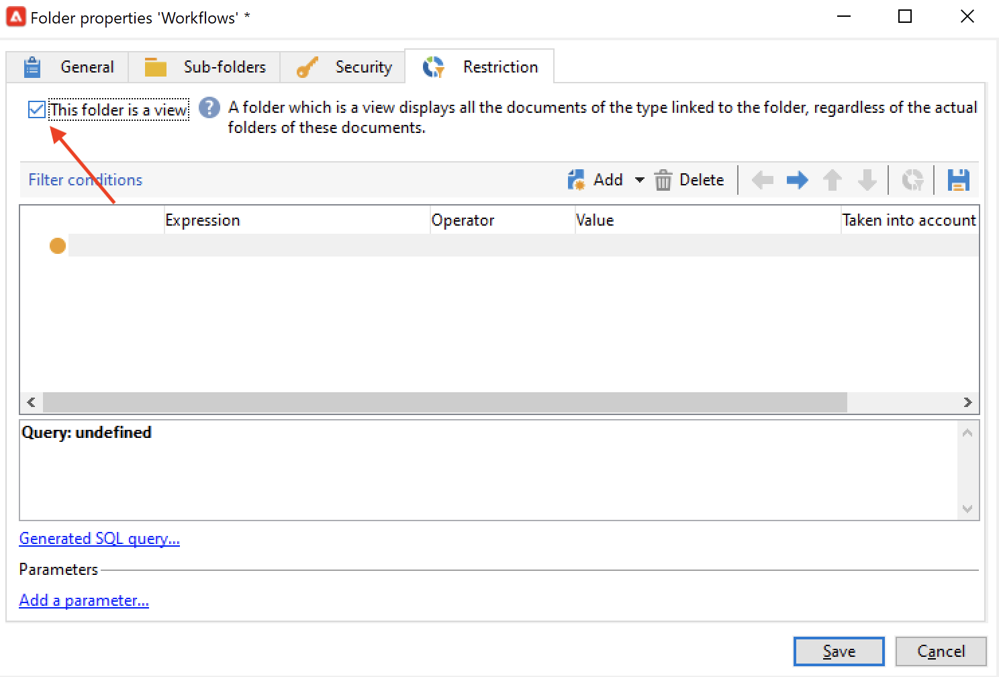

# Creare un flusso di lavoro {#build-a-workflow}

## Creare un nuovo flusso di lavoro {#create-a-new-workflow}

Il flusso di creazione del flusso di lavoro dipende dal tipo di flussi di lavoro. Puoi:

* Crea [Workflow di targeting](#targeting-workflows) dal **[!UICONTROL Profiles and Targets]** > **[!UICONTROL Jobs]** > **[!UICONTROL Targeting workflows]** del nodo di Explorer o dal **[!UICONTROL Profiles and Targets]** scheda della home page tramite **[!UICONTROL Targeting workflows]** sottoscheda .

   

* Crea [Flussi di lavoro di Campaign](#campaign-workflows) dal **[!UICONTROL Targeting and workflows]** scheda di una campagna

* Crea [Flussi di lavoro tecnici](#technical-workflows) dal **[!UICONTROL Administration]** > **[!UICONTROL Production]** > **[!UICONTROL Technical workflows]** del nodo Explorer. È consigliabile creare una cartella di flusso di lavoro specifica per salvare i flussi di lavoro tecnici.

Fai clic sul pulsante **[!UICONTROL New]** si trova sopra l’elenco dei flussi di lavoro.

Immetti un’etichetta e fai clic su **[!UICONTROL Save]**.

## Aggiungere e collegare attività {#add-and-link-activities}

Devi ora definire le varie attività e collegarle nel diagramma. A questo punto della configurazione, è possibile visualizzare l’etichetta del diagramma e lo stato del flusso di lavoro (Modifica in corso). La sezione inferiore della finestra viene utilizzata solo per modificare il diagramma. Contiene una barra degli strumenti, una palette di attività (a sinistra) e il diagramma stesso (a destra).

>[!NOTE]
>
>Se la palette non viene visualizzata, fai clic sul primo pulsante sulla barra degli strumenti del flusso di lavoro per visualizzarla.

Le attività sono raggruppate per categoria nelle diverse schede della palette. Le schede e le attività disponibili possono variare a seconda del tipo di flusso di lavoro (tecnico, di targeting o del flusso di lavoro della campagna).

* La prima scheda contiene attività di targeting e di manipolazione dei dati. Tali attività sono descritte in dettaglio in [Attività di targeting](targeting-activities.md).
* La seconda scheda contiene le attività di pianificazione, utilizzate principalmente per coordinare altre attività. Tali attività sono descritte in dettaglio in [Attività di controllo del flusso](flow-control-activities.md).
* La terza scheda contiene strumenti e azioni che possono essere utilizzati nel flusso di lavoro. Tali attività sono descritte in dettaglio in [Attività azione](action-activities.md).
* La quarta scheda contiene attività che dipendono da un determinato evento, ad esempio la ricezione di un’e-mail o l’arrivo di un file su un server. Tali attività sono descritte in dettaglio in [Attività evento](event-activities.md).

Per creare il diagramma

1. Aggiungi un’attività selezionandola nella palette e spostandola nel diagramma mediante un’operazione di trascinamento della selezione.

   Aggiungi un **Inizio** e quindi un **Consegna** sul diagramma.

   

1. Collega le attività trascinando la **Inizio** transizione di attività e rilasciarla su **Consegna** attività.

   

   Puoi collegare automaticamente un’attività a quella precedente inserendo la nuova attività alla fine della transizione.

1. Aggiungi le attività necessarie e collegale come mostrato nel diagramma seguente.

   

>[!CAUTION]
>
>Puoi copiare e incollare le attività all’interno di uno stesso flusso di lavoro. Tuttavia, si sconsiglia di copiare e incollare le attività tra flussi di lavoro diversi. Alcune impostazioni collegate ad attività come Consegne e Scheduler potrebbero causare conflitti ed errori durante l’esecuzione del flusso di lavoro di destinazione. Invece, ti abbiamo consigliato di  **Duplica** flussi di lavoro. Per ulteriori informazioni, consulta [Duplicare i flussi di lavoro](#duplicate-workflows).

È possibile modificare la visualizzazione e il layout del grafico utilizzando i seguenti elementi:

* **Utilizzare la barra degli strumenti**

   La barra degli strumenti di modifica del diagramma consente di accedere alle funzioni di layout ed esecuzione del flusso di lavoro.

   

   Questo consente di adattare il layout dello strumento di modifica: visualizzazione della palette e panoramica, dimensioni e allineamento degli oggetti grafici.

   

   Le icone relative all’avanzamento e alla visualizzazione dei registri sono descritte in dettaglio nelle sezioni seguenti:

   * [Visualizza stato](monitor-workflow-execution.md#displaying-progress)
   * [Visualizza registri](monitor-workflow-execution.md#displaying-logs)

* **Allineamento dell’oggetto**

   Per allineare le icone, selezionale e fai clic sul pulsante **[!UICONTROL Align vertically]** o **[!UICONTROL Align horizontally]** icona.

   Utilizza la **CTRL** per selezionare più attività sparse o per deselezionare una o più attività. Fai clic sullo sfondo del diagramma per deselezionare tutti gli elementi.

* **Gestione delle immagini**

   Puoi personalizzare l’immagine di sfondo del diagramma e quelle relative alle varie attività. Fai riferimento a [Modificare le immagini delle attività](change-activity-images.md).

## Configurare le attività {#configure-activities}

Fai doppio clic su un’attività per configurarla o fai clic con il pulsante destro del mouse e seleziona (Crea attività) **[!UICONTROL Open...]**.

>[!NOTE]
>
>Le attività del flusso di lavoro di Campaign sono descritte in [questa sezione](activities.md).

La prima scheda contiene la configurazione di base. La **[!UICONTROL Advanced]** La scheda contiene i parametri aggiuntivi, utilizzati in particolare per definire il comportamento in caso di errore, specificare la durata di esecuzione per un&#39;attività e per immettere uno script di inizializzazione.

Per una migliore comprensione delle attività e per migliorare la leggibilità del flusso di lavoro, puoi inserire commenti nelle attività.

Questi commenti vengono visualizzati automaticamente quando gli operatori scorrono sull’attività.

## Modelli di flusso di lavoro {#workflow-templates}

I modelli di flusso di lavoro contengono la configurazione complessiva delle proprietà ed eventualmente una serie di attività concatenate all’interno di un diagramma. Questa configurazione può essere riutilizzata per creare nuovi flussi di lavoro contenenti un certo numero di elementi preconfigurati

Puoi creare nuovi modelli di flusso di lavoro basati su modelli esistenti o modificare direttamente un flusso di lavoro in un modello.

I modelli di flusso di lavoro sono memorizzati nella **[!UICONTROL Resources > Templates > Workflow templates]** del nodo Explorer.

Oltre alle consuete proprietà del flusso di lavoro, le proprietà del modello ti consentono di specificare il file di esecuzione per i flussi di lavoro creati in base a questo modello.

## Duplicare i flussi di lavoro {#duplicate-workflows}

Puoi duplicare diversi tipi di flussi di lavoro. Una volta eseguita la duplicazione, le modifiche del flusso di lavoro non vengono riportate nella copia del flusso di lavoro.

>[!CAUTION]
>
>Copia e incolla è disponibile nei flussi di lavoro, ma ti consigliamo di utilizzare **Duplica**. Una volta copiata un’attività, viene mantenuta l’intera configurazione. Per le attività di consegna (e-mail, SMS, notifica push..), viene copiato anche l’oggetto di consegna allegato all’attività, il che può causare un arresto anomalo.

1. Fai clic con il pulsante destro del mouse su un flusso di lavoro.
1. Fai clic su **Duplica**.

   

1. Nella finestra del flusso di lavoro, modifica l’etichetta del flusso di lavoro.
1. Fai clic su **Salva**.

La funzione duplicata non è direttamente disponibile nella visualizzazione di una campagna.

Tuttavia, puoi creare una visualizzazione per visualizzare tutti i flussi di lavoro sull’istanza. In questa visualizzazione puoi duplicare i flussi di lavoro utilizzando **Duplica su**.

**Creare una visualizzazione**

1. In **Esplora risorse**, vai alla cartella in cui devi creare la visualizzazione.
1. Fai clic con il pulsante destro del mouse e vai a **Aggiungi una nuova cartella** > **Processo**, seleziona **Flussi di lavoro**.

   

La nuova cartella **Flussi di lavoro** viene creato.

1. Fai clic con il pulsante destro del mouse e seleziona **Proprietà**.
1. In **Restrizione** abilita **Questa cartella è una visualizzazione** e fai clic su **Salva**.

   

La cartella viene ora compilata con tutti i flussi di lavoro dell’istanza.

**Duplicare un flusso di lavoro della campagna**

1. Seleziona un flusso di lavoro della campagna nella visualizzazione del flusso di lavoro.
1. Fai clic con il pulsante destro del mouse **Duplica su**.
1. Cambia l’etichetta.
1. Fai clic su **Salva**.

Puoi visualizzare il flusso di lavoro duplicato nella visualizzazione del flusso di lavoro.
