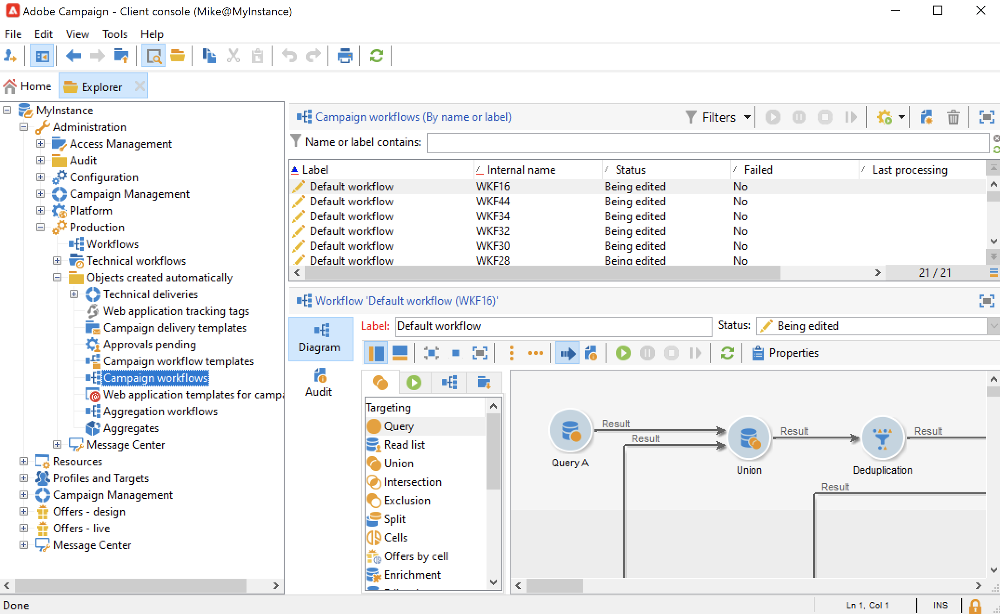

# Flussi di lavoro di Campaign {#campaign-workflows}

Per ogni campagna, puoi creare flussi di lavoro da eseguire dal **[!UICONTROL Targeting and workflows]** scheda . Questi flussi di lavoro sono specifici per la campagna.

Questa scheda contiene le stesse attività di tutti i flussi di lavoro. [Ulteriori informazioni](#implementation-steps-)

Oltre alle campagne di targeting, i flussi di lavoro delle campagne consentono di creare e configurare consegne interamente per tutti i canali disponibili. Una volta create nel flusso di lavoro, queste consegne sono disponibili dal dashboard della campagna.

Tutti i flussi di lavoro delle campagne sono centralizzati nella sezione **[!UICONTROL Administration > Production > Objects created automatically > Campaign workflows]** nodo.

I flussi di lavoro e gli esempi di implementazione di Campaign sono descritti in [questa sezione](../campaigns/marketing-campaign-target.md).
