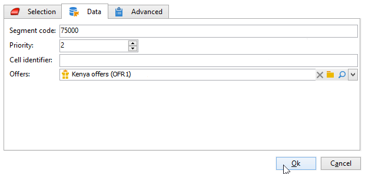

# Celle{#cells}

La **[!UICONTROL Cells]** L’attività fornisce una visualizzazione dei vari sottoinsiemi come colonne di dati. Semplifica la manipolazione dei sottoinsiemi ed è progettato anche per sfruttare le funzionalità di personalizzazione.


Puoi configurare questa attività per immettere parametri specifici in base alle esigenze degli utenti. Per impostazione predefinita, il dettaglio di ciascun sottoinsieme è descritto in una finestra dedicata tramite la **[!UICONTROL Cells]** e **[!UICONTROL Advanced]** schede.


Nell’esempio seguente, il modulo di input è stato modificato: a **[!UICONTROL Data]** è stata aggiunta una scheda per abilitare l’associazione di un’offerta e un livello di priorità per ciascun sottoinsieme.



Per questa configurazione, sono state aggiunte le seguenti informazioni al modulo del flusso di lavoro, nel **[!UICONTROL Administration > Configurations > Input forms]** nodo di Adobe Campaign explorer:

```
<container img="nms:miniatures/mini-enrich.png" label="Data">
                <input xpath="@code"/>
                <container xpath="select/node[@alias='@numTest']">
                  <input alwaysActive="true" expr="'long'" type="expr" xpath="@type"/>
                  <input alwaysActive="true" expr="'Priority'" type="expr" xpath="@label"/>
                  <input label="Priority" maxValue="12" minValue="0" type="number"
                         xpath="@value" xpathEditFromType="@type"/>
                </container>
                <container xpath="select/node[@alias='@test']">
                  <input alwaysActive="true" expr="'string'" type="expr" xpath="@type"/>
                  <input alwaysActive="true" expr="'Identifier'" type="expr" xpath="@label"/>
                  <input label="Cell identifier" xpath="@value"/>
                </container>
                <container xpath="select/node[@alias='linkTest']">
                  <input alwaysActive="true" expr="'link'" type="expr" xpath="@type"/>
                  <input alwaysActive="true" expr="'nms:offer'" type="expr" xpath="@dataType"/>
                  <input alwaysActive="true" expr="'Offre'" type="expr" xpath="@label"/>
                  <input computeStringAlias="@valueLabel" label="Offers" notifyPathList="@_cs|@valueLabel"
                         schema="nms:offer" type="linkEdit" xpath="@value"/>
                </container>
```

La personalizzazione dei moduli di input in Adobe Campaign è riservata agli utenti esperti. Per ulteriori informazioni, consulta questo articolo .
