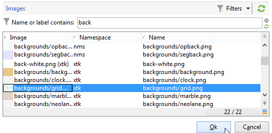

# Modificare le immagini dell’attività{#change-activity-images}

È possibile modificare le immagini utilizzate nei diagrammi dei vari flussi di lavoro. Essi devono tuttavia rispettare determinati vincoli. Di seguito sono riportate le fasi di implementazione:

* Per modificare l&#39;immagine di sfondo, selezionare il flusso di lavoro di destinazione desiderato, quindi fare clic sulla scheda **[!UICONTROL Properties]**.

  

  Per selezionare l&#39;immagine da utilizzare, fare clic sull&#39;icona **[!UICONTROL Select link]** a destra del campo **[!UICONTROL Background image]**.

  >[!NOTE]
  >
  >La larghezza in pixel dell&#39;immagine di sfondo deve essere un multiplo di 4.

  

  L&#39;icona **[!UICONTROL Edit link]** consente di visualizzare l&#39;immagine selezionata.

* Per modificare l&#39;immagine associata a un&#39;attività, fare doppio clic sull&#39;oggetto e quindi sulla scheda **[!UICONTROL Advanced]**.

  Per selezionare l&#39;immagine da utilizzare, fare clic sull&#39;icona **[!UICONTROL Select link]** a destra del campo **[!UICONTROL Image]**.

  

  L&#39;icona **[!UICONTROL Edit link]** consente di visualizzare l&#39;immagine selezionata.

  

>[!NOTE]
>
>Le immagini salvate nel nodo **[!UICONTROL Administration > Configuration > Images]** della struttura sono disponibili per la selezione.
>  
>Le immagini devono essere in formato PNG, con 48x48 pixel, 16 milioni di colori e uno sfondo trasparente.
