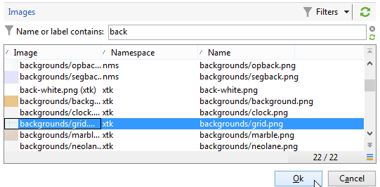

# Modificare le immagini dell’attività{#change-activity-images}

È possibile modificare le immagini utilizzate nei diagrammi dei vari flussi di lavoro. Tuttavia devono rispettare determinati vincoli. Ecco le fasi di implementazione:

* Per modificare l&#39;immagine di sfondo, seleziona il flusso di lavoro di targeting desiderato, quindi fai clic sul pulsante **[!UICONTROL Properties]** scheda .

   

   Per selezionare l’immagine da utilizzare, fai clic sul pulsante **[!UICONTROL Select link]** a destra della **[!UICONTROL Background image]** campo .

   >[!NOTE]
   >
   >La larghezza in pixel dell&#39;immagine di sfondo deve essere un multiplo di 4.

   

   La **[!UICONTROL Edit link]** consente di visualizzare l’immagine selezionata.

* Per modificare l’immagine associata a un’attività, fai doppio clic sull’oggetto, quindi fai clic sul pulsante **[!UICONTROL Advanced]** scheda .

   Per selezionare l’immagine da utilizzare, fai clic sul pulsante **[!UICONTROL Select link]** a destra della **[!UICONTROL Image]** campo .

   

   La **[!UICONTROL Edit link]** consente di visualizzare l’immagine selezionata.

   

>[!NOTE]
>
>Le immagini salvate nel **[!UICONTROL Administration > Configuration > Images]** il nodo della struttura ad albero è disponibile per la selezione.
>  
>Le immagini devono essere in formato PNG, con 48x48 pixel, 16 milioni di colori e uno sfondo trasparente.
