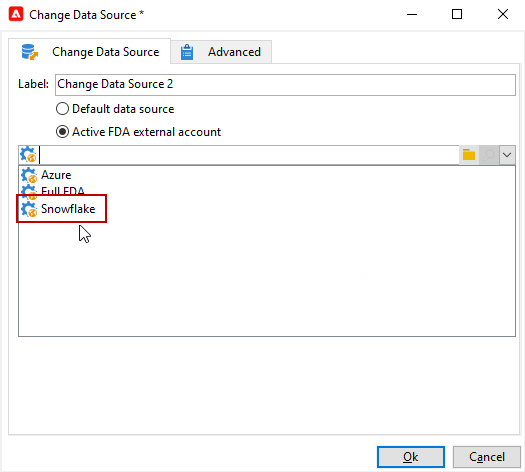

# Cambiare l’origine dati {#change-data-source}

Utilizzare l&#39;attività **[!UICONTROL Change data source]** per modificare l&#39;origine dati di una [tabella di lavoro del flusso di lavoro](use-workflow-data.md#workflow-temporary-work-table). Questa attività offre maggiore flessibilità per gestire i dati tra diverse origini dati, come Federated Data Access (FDA), Campaign Cloud database (FFDA) e Campaign Local database.

Il flusso di lavoro **[!UICONTROL Working table]** viene utilizzato per gestire e condividere dati con le attività del flusso di lavoro.

Per impostazione predefinita, **[!UICONTROL Working table]** viene creato nello stesso database dell&#39;origine dei dati su cui eseguire la query.
Ad esempio, quando si esegue una query sulla tabella **[!UICONTROL Recipients]** memorizzata nel database Cloud, il flusso di lavoro crea un **[!UICONTROL Working table]** nello stesso database Cloud.

Utilizzare un&#39;attività **[!UICONTROL Change Data Source]** per utilizzare un&#39;origine dati diversa per **[!UICONTROL Working table]**.

Quando si utilizza l&#39;attività **[!UICONTROL Change Data Source]**, è necessario tornare al database cloud per continuare l&#39;esecuzione del flusso di lavoro.

>[!IMPORTANT]
>
>Le attività **[!UICONTROL Change Dimension]** e **[!UICONTROL Change Data source]** non devono essere aggiunte in una riga. Se è necessario utilizzare entrambe le attività in sequenza, assicurarsi di includere un&#39;attività **[!UICONTROL Enrichement]** tra di esse. In questo modo si garantisce la corretta esecuzione e si evitano potenziali conflitti o errori.

>[!NOTE]
>
>L&#39;attività **Change Data Source** può elaborare un massimo di un milione di record per esecuzione. Se devi aumentare questo limite, contatta il rappresentante Adobe.

Per utilizzare l&#39;attività **[!UICONTROL Change Data Source]**, è necessario:

1. Creazione di un flusso di lavoro.

1. Eseguire una query sui destinatari con un&#39;attività **[!UICONTROL Query]**.

   Per ulteriori informazioni sull&#39;attività **[!UICONTROL Query]**, vedere questa [pagina](query.md#create-a-query).

1. Aggiungi un&#39;attività **[!UICONTROL Change data source]**.

   

1. Modifica l&#39;attività **[!UICONTROL Change data source]** per selezionare **[!UICONTROL Default data source]**.

   La tabella di lavoro, che contiene il risultato della query, viene quindi spostata nel database locale di Campaign predefinito.

   

1. Aggiungere un&#39;attività **[!UICONTROL JavaScript code]** per eseguire operazioni unitarie sulla tabella di lavoro.

   Per ulteriori informazioni sull&#39;attività **[!UICONTROL JavaScript code]**, vedere [questa pagina](sql-code-and-javascript-code.md#javascript-code).

1. Aggiungi un&#39;altra attività **[!UICONTROL Change data source]** per tornare al database cloud.

1. Modifica questa attività e seleziona **[!UICONTROL Active FDA external account]** e l&#39;account esterno **[!UICONTROL External database]** corrispondente.

   

1. Ora puoi avviare il flusso di lavoro.
