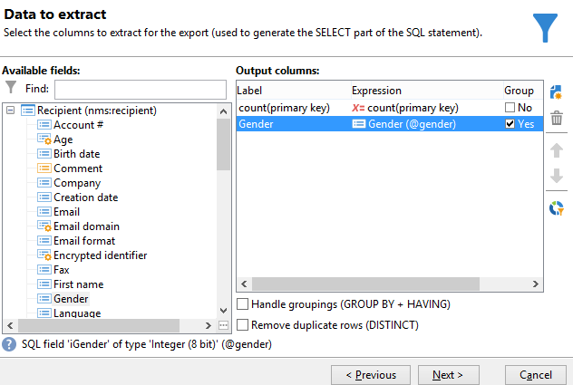
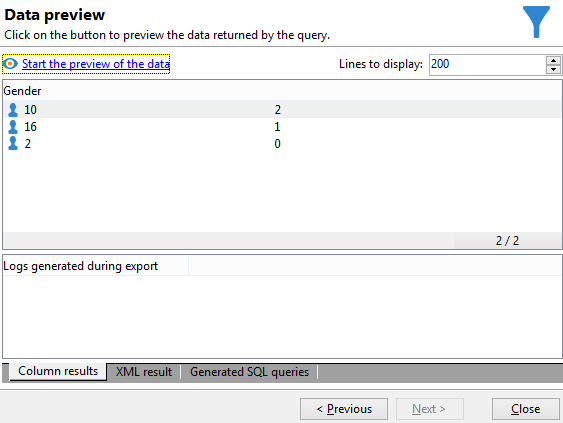

# Eseguire il calcolo aggregato {#performing-aggregate-computing}

In questo esempio, vogliamo contare il numero di destinatari che vivono a Londra, in base al genere.

* Quale tabella deve essere selezionata?

  Tabella dei destinatari (**nms:recipient**)

* Quali campi devono essere selezionati nella colonna di output?

  Chiave primaria (con conteggio) e genere

* Su quali condizioni vengono filtrate le informazioni?

  In base ai destinatari che vivono a Londra

Per creare questo esempio, attieniti alla seguente procedura:

1. In **[!UICONTROL Data to extract]**, definire un conteggio per la chiave primaria (come illustrato nell&#39;esempio precedente). Aggiungi il campo **[!UICONTROL Gender]** nella colonna di output. Selezionare l&#39;opzione **[!UICONTROL Group]** nella colonna **[!UICONTROL Gender]**. In questo modo i destinatari saranno raggruppati per genere.

   

1. Nella finestra **[!UICONTROL Sorting]**, fare clic su **[!UICONTROL Next]**: non è necessario alcun ordinamento.
1. Configura il filtro dei dati. In questo caso, si desidera limitare la selezione ai contatti che risiedono a Londra.

   

   >[!NOTE]
   >
   >I valori fanno distinzione tra maiuscole e minuscole. Se il valore &quot;Londra&quot; viene immesso nella condizione senza una lettera maiuscola e l’elenco dei destinatari contiene la parola &quot;Londra&quot; con una lettera maiuscola, la query avrà esito negativo.

1. Nella finestra **[!UICONTROL Data formatting]**, fare clic su **[!UICONTROL Next]**: nessuna formattazione richiesta per questo esempio.
1. Nella finestra di anteprima, fare clic su **[!UICONTROL Launch data preview]**.

   Esistono tre valori distinti per ogni ordinamento in base al sesso: **2** per la donna, **1** per il maschio e **0** quando il genere è sconosciuto. In questo esempio, l&#39;elenco contiene 10 donne, 16 uomini e 2 persone il cui genere non è noto.

   
