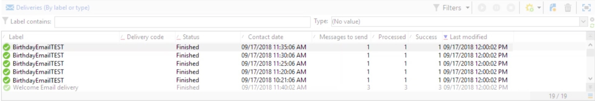

# Consegna continua{#continuous-delivery}

A **Consegna continua** l’azione digita ti consente di aggiungere nuovi destinatari a una consegna esistente. Questo tipo di consegna evita di dover creare una nuova consegna ogni volta: Questa modalità è spesso più efficiente, in particolare per gli avvisi o le notifiche a basso volume inviati come e quando necessario.

 [Scopri questa funzione nel video](#continuous-delivery-video)

A livello di modello di consegna, puoi specificare uno script per calcolare l’etichetta (e la cartella della campagna) della consegna associata. Se lo script calcola una consegna che non esiste ancora, viene creata immediatamente.

La **[!UICONTROL Process errors]** visualizza una particolare transizione che verrà attivata se viene generato un errore. In questo caso, il flusso di lavoro non passa alla modalità di errore e continua con l’esecuzione.

Gli errori presi in considerazione sono errori del file system (file non spostato, directory non accessibile, ecc.).

Questa opzione non elabora gli errori relativi alla configurazione dell’attività, ovvero i valori non validi.

## Parametri di input {#input-parameters}

* tableName
* schema

Ogni evento in entrata deve specificare un target definito da questi parametri.

Solo quando il **[!UICONTROL Specified by the inbound event]** è selezionata.

## Parametri di output {#output-parameters}

* tableName
* schema
* recCount

Questo insieme di tre valori identifica il target risultante dalla consegna rapida. **[!UICONTROL tableName]** è il nome della tabella che memorizza gli identificatori del target, **[!UICONTROL schema]** è lo schema della popolazione (in genere nms:recipient) e **[!UICONTROL recCount]** è il numero di elementi nella tabella.

La transizione associata al complemento ha gli stessi parametri.

## Come impostare una consegna continua

Questa sezione spiega come impostare una consegna continua.

La **consegna continua** consente di aggiungere nuovi destinatari a una consegna esistente ed evita di dover creare una nuova consegna ogni volta che viene aggiunto un nuovo destinatario. Puoi aggiornare il creativo direttamente nel flusso di lavoro della campagna e il modello verrà aggiornato nella cartella Resource del modello di consegna.

Una consegna continua creerà un singolo log di consegna e consegna (wideLog) e registri di tracciamento che fanno riferimento a tale consegna che vengono aggiunti ogni volta che viene eseguita.

## Video tutorial {#continuous-delivery-video}

Questo video mostra come configurare una consegna continua con una query incrementale.

>[!VIDEO](https://video.tv.adobe.com/v/25039?quality=12)

Sono disponibili ulteriori video dimostrativi su Campaign Classic [qui](https://experienceleague.adobe.com/docs/campaign-classic-learn/tutorials/overview.html?lang=it).
