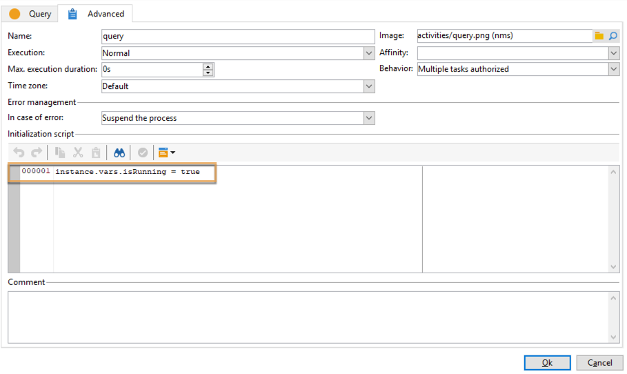
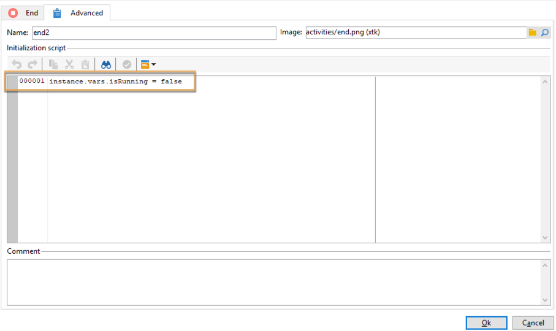

# Coordinare gli aggiornamenti dei dati{#coordinating-data-updates}

Questo caso d’uso descrive la creazione di un flusso di lavoro che consente di gestire gli aggiornamenti concomitanti quando si utilizzano diverse esecuzioni di un flusso di lavoro.

Lo scopo è verificare che il processo di aggiornamento sia terminato prima di eseguire un&#39;altra operazione di aggiornamento. A questo scopo, verrà impostata una variabile di istanza e verrà eseguito un test del flusso di lavoro se l’istanza è in esecuzione per decidere se continuare l’esecuzione del flusso di lavoro ed eseguire l’aggiornamento.

Questo flusso di lavoro è costituito da:

* un&#39;attività **Scheduler**, che esegue il flusso di lavoro su una frequenza specifica.
* un&#39;attività **Test** che controlla se il flusso di lavoro è già in esecuzione.
* **Query** e **Aggiorna dati** attività nel caso in cui il flusso di lavoro non sia già in esecuzione, seguite da un&#39;attività **End** che reinizializza la variabile dell&#39;istanza del flusso di lavoro su false.
* Attività **End** se il flusso di lavoro è già in esecuzione.

Per creare il flusso di lavoro, effettua le seguenti operazioni:

1. Aggiungi un&#39;attività **Scheduler**, quindi configurane la frequenza in base alle tue esigenze.
1. Aggiungi un&#39;attività **Test** per verificare se il flusso di lavoro è già in esecuzione, quindi configurala come segue.

   >[!NOTE]
   >
   >&quot;isRunning&quot; è il nome della variabile di istanza scelto per questo esempio. Questa non è una variabile incorporata.

   

1. Aggiungi un&#39;attività **End** al fork **No**. In questo modo, non viene eseguito nulla se il flusso di lavoro è già in esecuzione.
1. Aggiungi le attività desiderate al fork **Yes**. Nel nostro caso, **Attività Query** e **Aggiorna dati**.
1. Apri la prima attività, quindi aggiungi il comando **instance.vars.isRunning = true** nella scheda **[!UICONTROL Advanced]**. In questo modo, la variabile di istanza viene impostata come in esecuzione.

   

1. Aggiungi un&#39;attività **End** alla fine del fork **[!UICONTROL Yes]**, quindi aggiungi il comando **instance.vars.isRunning = false** nella scheda **[!UICONTROL Advanced]**.

   In questo modo, non verrà eseguita alcuna azione durante l’esecuzione del flusso di lavoro.

   

**Argomenti correlati:**

* [Impedire esecuzioni simultanee multiple](monitor-workflow-execution.md#preventing-simultaneous-multiple-executions)
* [Attività Aggiorna dati](update-data.md)
