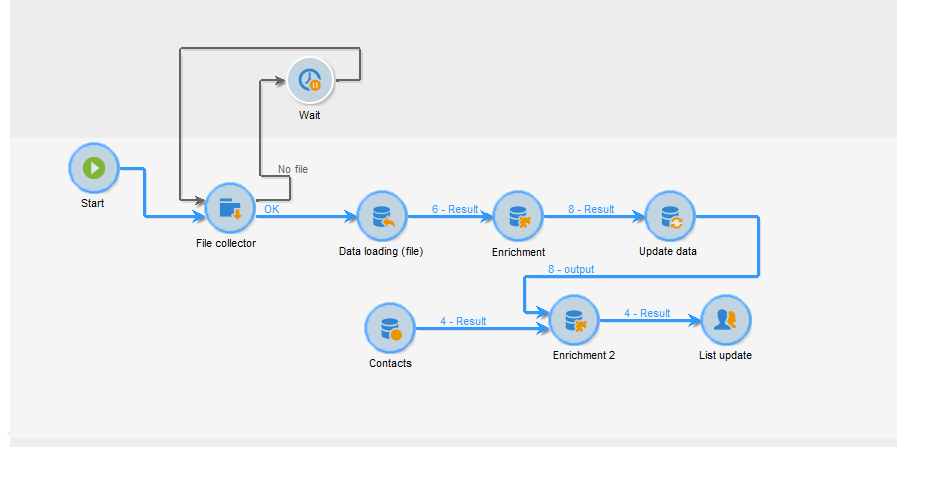
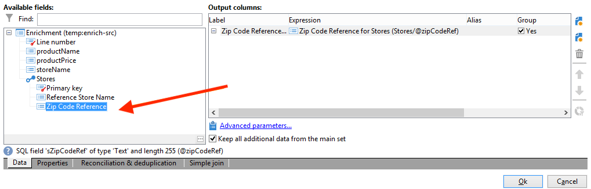
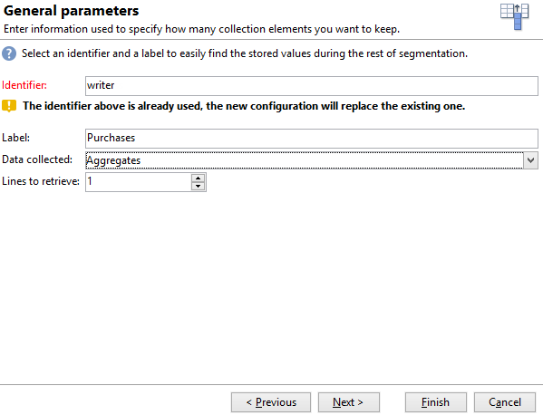

# Creare un elenco di riepilogo{#creating-a-summary-list}

Questo caso d’uso descrive la creazione di un flusso di lavoro che, dopo aver raccolto i file e seguito diversi arricchimenti, ti consente di creare un elenco di riepilogo. L&#39;esempio si basa su un elenco di contatti che hanno effettuato acquisti in un negozio.



Viene utilizzata la seguente struttura di dati:


Il suo obiettivo è:

* Per utilizzare le varie opzioni dell’attività di arricchimento
* Per aggiornare i dati nel database dopo una riconciliazione
* Creare una &quot;visualizzazione&quot; globale dei dati arricchiti

Per creare un elenco di riepilogo, è necessario seguire questi passaggi:

1. Raccolta e caricamento di un file &quot;Purchases&quot; nella tabella di lavoro del flusso di lavoro
1. Arricchimento dei dati importati creando un collegamento a una tabella di riferimento
1. Aggiornamento della tabella &quot;Acquisti&quot; con i dati arricchiti
1. Arricchimento dei dati &quot;Contatti&quot; con un calcolo aggregato dalla tabella &quot;Acquisti&quot;
1. Creazione di un elenco di riepilogo

## Passaggio 1: caricare il file e riconciliare i dati importati {#step-1--loading-the-file-and-reconciling-the-imported-data}

I dati da caricare sono dati relativi all’&quot;acquisto&quot; con il seguente formato:

```
Product Name;Product price;Store
Computer;2000;London 3
Tablet;600;Cambridge
Computer;2000;London 5
Computer;2000;London 8
Tablet;600;Cambridge
Phone;500;London 5
```

Questi dati sono contenuti in un file di testo &quot;Purchases.txt&quot;.

1. Aggiungi il **Raccoglitore file** e **Caricamento dati (file)** attività al flusso di lavoro.

   Il **Raccoglitore file** attività consente di raccogliere e inviare file da e al server Adobe Campaign.

   Il **Caricamento dati (file)** attività ti consente di arricchire la tabella di lavoro del flusso di lavoro con i dati raccolti. Per ulteriori informazioni su questa attività, consulta [questa pagina](data-loading--file-.md).

1. Configurare **Raccoglitore file** attività per raccogliere testo (&#42;.txt) dalla directory selezionata.

   

   Il **Raccoglitore file** attività consente di gestire l’assenza di un file nella directory di origine. A questo scopo, seleziona la **[!UICONTROL Process file nonexistence]** opzione. In questo flusso di lavoro, una **Wait** è stata aggiunta un&#39;attività per provare un&#39;altra raccolta di file, se questa non è presente nella directory al momento della raccolta.

1. Configurare **Caricamento dati (file)** utilizzando un file di esempio con lo stesso formato dei dati da importare.

   

   Fai clic su **[!UICONTROL Click here to change the file format...]** per rinominare le colonne utilizzando i nomi e le etichette interni della tabella &quot;Purchases&quot;.

   

Una volta importati i dati, l’arricchimento viene eseguito creando un collegamento a una tabella di riferimento corrispondente allo schema &quot;Archivi&quot;.

Aggiungi l’attività Enrichment e configurala come segue:

1. Seleziona l’impostazione principale composta dai dati del **Caricamento dati (file)** attività.

   

1. Clic **[!UICONTROL Add data]**, quindi seleziona la **[!UICONTROL A link]** opzione.

   

1. Seleziona la **[!UICONTROL Define a collection]** opzione.
1. Seleziona lo schema &quot;Archivi&quot; come destinazione.

   

Per ulteriori informazioni sui vari tipi di collegamenti, consulta [Arricchimento e modifica dei dati](targeting-workflows.md#enrich-and-modify-data).

Nella finestra seguente, è necessario creare una condizione di join selezionando il campo di origine (nel set principale) e il campo di destinazione (appartenente allo schema &quot;Archivi&quot;) per configurare la riconciliazione dei dati.


Ora che il collegamento è stato creato, aggiungeremo una colonna alla tabella di lavoro del flusso di lavoro dallo schema &quot;Archivi&quot;: il campo &quot;Riferimento Codice postale&quot;.

1. Apri l’attività di arricchimento.
1. Fai clic su **[!UICONTROL Edit additional data]**.
1. Aggiungi il campo &quot;Riferimento Codice postale&quot; al **[!UICONTROL Output columns]**.



I dati nella tabella di lavoro del flusso di lavoro dopo questo arricchimento saranno i seguenti:


## Passaggio 2: scrittura di dati arricchiti nella tabella &#39;Acquisti&#39; {#step-2--writing-enriched-data-to-the--purchases--table}

Questo passaggio descrive come scrivere i dati importati e arricchiti nella tabella &quot;Purchases&quot;. A questo scopo, è necessario utilizzare un’ **Aggiorna dati** attività.

Una riconciliazione tra i dati nella tabella di lavoro del flusso di lavoro e **Acquisti** la dimensione di targeting deve essere eseguita prima dei dati nella sezione **Acquisti** la tabella è aggiornata.

1. Fai clic su **[!UICONTROL Reconciliation]** dell’attività di arricchimento.
1. In questo caso, seleziona la dimensione di targeting, lo schema &quot;Purchases&quot;.
1. Selezionare un&#39;&quot;Espressione di origine&quot; per i dati nella tabella del flusso di lavoro (in questo caso il campo &quot;storeName&quot;).
1. Selezionare un&#39;&quot;Espressione di destinazione&quot; per i dati nella tabella &quot;Acquisti&quot; (in questo caso il campo &quot;nome dello storename&quot;).
1. Seleziona l’opzione **[!UICONTROL Keep unreconciled data coming from the work table]**.


In **Aggiorna dati** attività, è necessaria la seguente configurazione:

1. Seleziona la **[!UICONTROL Insert or update]** opzione in **[!UICONTROL Operation type]** per evitare di creare nuovi record ogni volta che il file viene raccolto.
1. Seleziona la **[!UICONTROL By directly using the targeting dimension]** valore per **[!UICONTROL Record identification]** opzione.
1. Seleziona lo schema &quot;Acquisti&quot; come **[!UICONTROL Document type]**.
1. Specifica l’elenco dei campi da aggiornare. Il **[!UICONTROL Destination]** consente di definire i campi dello schema &quot;Purchases&quot;. Il **[!UICONTROL Expression]** consente di selezionare i campi nella tabella di lavoro per eseguire una mappatura.
1. Fai clic su **[!UICONTROL Generate an outbound transition]** opzione.


## Passaggio 3: arricchire i dati dei contatti {#step-3--enriching--contact--data-}

Lo schema &quot;Contatti&quot; è fisicamente collegato allo schema &quot;Acquisti&quot;. Ciò significa che puoi utilizzare un’altra opzione dell’opzione &quot;Enrichment&quot;: aggiungere dati collegati alla dimensione di filtro.

Lo scopo di questo secondo arricchimento è quello di creare un aggregato sullo schema di acquisto per calcolare la quantità totale di acquisti per ciascun contatto identificato.

1. Aggiungi un **query** tipo di attività che consente di recuperare tutti **Contatti** archiviato.
1. Aggiungi un **Arricchimento** attività, quindi seleziona il set principale risultante dalla query precedente.
1. Fai clic su Aggiungi **[!UICONTROL Data]**.
1. Fai clic su **[!UICONTROL Data linked to the targeting dimension]** opzione.
1. Fai clic su **[!UICONTROL Data linked to the filtering dimension]** opzione in **[!UICONTROL Select fields to add]** finestra.
1. Seleziona la **[!UICONTROL Purchases]** quindi fai clic su **[!UICONTROL Next]**.

   

1. Modificare il **[!UICONTROL Collected data]** selezionando il campo **[!UICONTROL Aggregates]** opzione.

   

1. Fai clic su **[!UICONTROL Next]**.
1. Aggiungi la seguente espressione per calcolare il totale degli acquisti per ciascun contatto: &quot;Sum(@prodprice)&quot;.

   

Per preparare l&#39;elenco di riepilogo, è necessario aggiungere campi dai campi &quot;Purchases&quot; e dal primo arricchimento: il campo &quot;ZipCode Reference&quot;.

1. Fai clic su **[!UICONTROL Edit additional data...]** nell’attività di arricchimento.
1. Aggiungi i campi &quot;Nome store&quot; e &quot;Purchases / Zip Code Reference&quot;.

   

1. Fai clic su **[!UICONTROL Properties]** scheda.
1. Modifica il secondo collegamento per creare una sola riga.

## Passaggio 4: creare e aggiungere a un elenco di riepilogo {#step-4--creating-and-adding-to-a-summary-list}

L’ultimo passaggio prevede la scrittura di tutti i dati arricchiti in un elenco.

1. Aggiungi un **Aggiornamento elenco** al flusso di lavoro. Questa attività deve essere collegata alla transizione in uscita della seconda attività di arricchimento.
1. Seleziona la **[!UICONTROL Create the list if necessary (Calculated name)]** opzione.
1. Selezionare un valore per il nome calcolato. L&#39;etichetta scelta per l&#39;elenco è la data corrente: &lt;%= formatDate(new Date(), &quot;%2D/%2M/%2Y&quot;) %>.

Una volta eseguito il flusso di lavoro, l’elenco include:

* un elenco di contatti,
* una colonna &quot;Acquisti totali&quot;,
* una colonna &quot;Nome del negozio&quot;,
* una colonna &quot;Riferimento codice postale&quot; immessa per tutti gli archivi contenuti nello schema di riferimento dello store.


