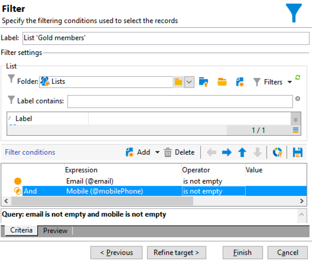

# Flusso di lavoro di consegna cross-channel{#cross-channel-delivery-workflow}

Questo caso d’uso presenta un esempio che coinvolge un flusso di lavoro di consegna cross-channel. Il concetto generale di consegne cross-channel è presentato in [questa sezione](cross-channel-deliveries.md).

L’obiettivo è quello di segmentare un pubblico dai destinatari del database in gruppi diversi allo scopo di inviare un’e-mail a un gruppo e un messaggio SMS a un altro gruppo.

Le principali fasi di implementazione per questo caso d’uso sono le seguenti:

1. Creazione di una **[!UICONTROL Query]** per eseguire il targeting del pubblico.
1. Creazione di un **[!UICONTROL Email delivery]** attività contenente un collegamento a un’offerta.
1. Utilizzo di un **[!UICONTROL Split]** attività per:

   * Invia un’altra e-mail ai destinatari che non hanno aperto la prima e-mail.
   * Invia un SMS ai destinatari che hanno aperto l’e-mail ma non hanno fatto clic sul collegamento all’offerta.
   * Aggiungi al database i destinatari che hanno aperto l’e-mail e fatto clic sul collegamento.

## Passaggio 1: Targeting del pubblico {#step-1--targeting-the-audience}

Per definire il target, crea una query per identificare i destinatari.

1. Creare una campagna. Per ulteriori informazioni, fai riferimento a  .
1. In **[!UICONTROL Targeting and workflows]** scheda della campagna, aggiungi una **Query** al flusso di lavoro. Per ulteriori informazioni sull’utilizzo di questa attività, consulta [questa sezione](query.md).
1. Definisci i destinatari che riceveranno le tue consegne. Ad esempio, selezionare i membri &quot;Gold&quot; come dimensione di destinazione.
1. Aggiungi condizioni di filtro alla query. In questo esempio, seleziona i destinatari che hanno un indirizzo e-mail e un numero di cellulare.

   

1. Salva le modifiche.

## Passaggio 2: Creazione di un messaggio e-mail con un’offerta {#step-2--creating-an-email-including-an-offer}

1. Crea un ** .
1. Progetta il messaggio e inserisci un collegamento che include un’offerta nel contenuto.

   

   Per ulteriori informazioni sull’integrazione di un’offerta nel corpo di un messaggio, consulta .

1. Salva le modifiche.
1. Fai clic con il pulsante destro del mouse sul pulsante **[!UICONTROL Email delivery]** attività per aprirla.
1. Seleziona la **[!UICONTROL Generate an outbound transition]** per recuperare la popolazione e i registri di tracciamento.

   

   In questo modo potrai utilizzare queste informazioni per inviare un’altra consegna a seconda dei comportamenti dei destinatari alla ricezione della prima e-mail.

1. Aggiungi un **[!UICONTROL Wait]** per consentire ai destinatari di aprire l’e-mail in alcuni giorni.

   

## Passaggio 3: Segmentazione del pubblico risultante {#step-3--segmenting-the-resulting-audience}

Una volta identificato il target e creata la prima consegna, devi segmentarlo in popolazioni diverse utilizzando condizioni di filtro.

1. Aggiungi un **Divisione** al flusso di lavoro e aprilo. Per ulteriori informazioni sull’utilizzo di questa attività, consulta [questa sezione](split.md).
1. Crea tre segmenti dalla popolazione calcolata a monte nella query.

   

1. Per il primo sottoinsieme, seleziona la **[!UICONTROL Add a filtering condition on the inbound population]** e fai clic su **[!UICONTROL Edit]**.

   

1. Seleziona **[!UICONTROL Recipients of a delivery]** come filtro di restrizione e fai clic su **[!UICONTROL Next]**.

   

1. Nelle impostazioni del filtro, seleziona **[!UICONTROL Recipients who have not opened or clicked (email)]** dal **[!UICONTROL Behavior]** elenco a discesa e seleziona l’e-mail con l’offerta da inviare dall’elenco di consegna. Fai clic su **[!UICONTROL Finish]**.

   

1. Procedi in modo simile per il secondo sottoinsieme e seleziona **[!UICONTROL Recipients who have not clicked (email)]** dal **[!UICONTROL Behavior]** elenco a discesa.

   

1. Per il terzo sottoinsieme, dopo aver selezionato il **[!UICONTROL Add a filtering condition on the inbound population]** e facendo clic su **[!UICONTROL Edit]**, seleziona **[!UICONTROL Use a specific filtering dimension]** opzione .
1. Seleziona **[!UICONTROL Recipient tracking log]** dal **[!UICONTROL Filtering dimension]** elenco a discesa, evidenziazione **[!UICONTROL Filtering conditions]** dal **[!UICONTROL List of restriction filters]** e fai clic su **[!UICONTROL Next]**.

   

1. Seleziona le condizioni del filtro come segue:

   

1. Fai clic su **[!UICONTROL Finish]** per salvare le modifiche.

## Passaggio 4: Finalizzazione del flusso di lavoro {#step-4--finalizing-the-workflow}

1. Aggiungi le attività rilevanti al flusso di lavoro dopo i tre sottoinsiemi risultanti dalla **[!UICONTROL Split]** attività:

   * Aggiungi un **[!UICONTROL Email delivery]** attività per inviare un messaggio e-mail di promemoria al primo sottoinsieme.
   * Aggiungi un **[!UICONTROL Mobile delivery]** per inviare un messaggio SMS al secondo sottoinsieme.
   * Aggiungi un **[!UICONTROL List update]** attività per aggiungere i destinatari corrispondenti al database.

1. Fai doppio clic sulle attività di consegna nel flusso di lavoro per modificarle. Per ulteriori informazioni sulla creazione di un’e-mail e di un SMS, consulta .
1. Fai doppio clic sul pulsante **[!UICONTROL List update]** e seleziona la **[!UICONTROL Generate an outbound transition]** opzione .

   Puoi quindi esportare i destinatari risultanti da Adobe Campaign in Adobe Experience Cloud. Ad esempio, puoi utilizzare il pubblico in Adobe Target aggiungendo un ** .

1. Fai clic sul pulsante **Inizio** nella barra delle azioni per eseguire il flusso di lavoro.

La popolazione oggetto della campagna **Query** l’attività verrà segmentata per ricevere un’e-mail o un SMS di consegna in base ai comportamenti dei destinatari. La popolazione rimanente verrà aggiunta al database utilizzando **[!UICONTROL List update]** attività.
