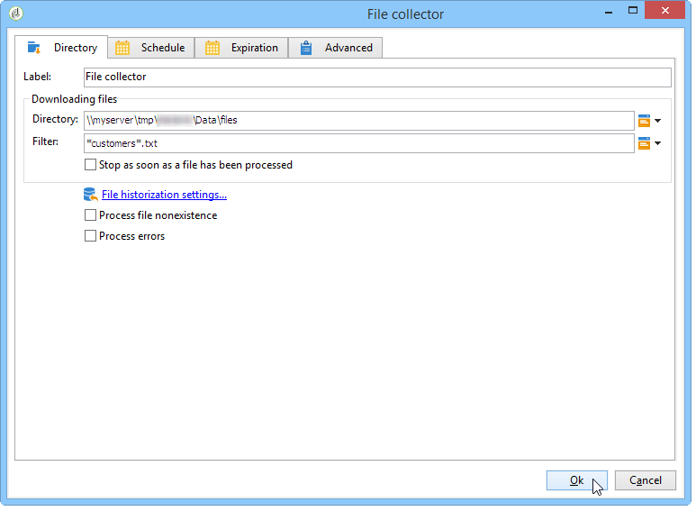

# Caricamento dati (file){#data-loading-file}

## Utilizzare {#use}

Il **[!UICONTROL Data loading (File)]** L’attività ti consente di accedere direttamente a un’origine di dati esterni e di utilizzarla in Adobe Campaign. Infatti, tutti i dati necessari per le operazioni di targeting non sempre si trovano nel database di Adobe Campaign: possono essere resi disponibili in file esterni.

Il file da caricare può essere specificato dalla transizione o calcolato durante l’esecuzione di questa attività. Ad esempio, può essere l’elenco dei 10 prodotti preferiti di un cliente i cui acquisti vengono gestiti in un database esterno.

La sezione superiore della finestra di configurazione per questa attività ti consente di definire il formato del file. A questo scopo, utilizza un file di esempio con lo stesso formato di quello da importare. Questo file può essere archiviato localmente o sul server.

>[!CAUTION]
>
>Sono supportati solo i file con struttura &quot;flat&quot; (ad esempio CSV, TXT, ecc.). Non è consigliabile utilizzare il formato XML.

È possibile definire un pre-processo da eseguire durante l&#39;importazione dei file, ad esempio per non dover decomprimere il file sul server (e quindi risparmiare spazio per il file decompresso) ma per includere la decompressione nell&#39;elaborazione dei file. Seleziona la **[!UICONTROL Pre-process the file]** e scegliere una delle tre opzioni seguenti: **[!UICONTROL None]**, **[!UICONTROL Decompression]** (zcat) oppure **[!UICONTROL Decrypt]** (gpg).

## Definizione del formato del file {#defining-the-file-format}

Quando si carica un file, il formato colonna viene rilevato automaticamente con i parametri predefiniti per ogni tipo di dati. È possibile modificare questi parametri predefiniti al fine di specificare i processi specifici da applicare ai dati, in particolare in caso di errore o di valore vuoto.

A questo scopo, seleziona **[!UICONTROL Click here to change the file format...]** nella finestra principale del **[!UICONTROL Data loading (file)]** attività. Viene visualizzata la finestra dei dettagli del formato.

È quindi possibile modificare la formattazione generale del file e la formattazione di ogni colonna.

La formattazione generale del file consente di definire il modo in cui le colonne verranno riconosciute (codifica file, separatori utilizzati, ecc.).

La formattazione della colonna ti consente di definire il valore di elaborazione di ciascuna colonna:

* **[!UICONTROL Ignore column]**: non elabora questa colonna durante il caricamento dei dati.
* **[!UICONTROL Data type]**: specifica il tipo di dati previsto per ogni colonna.
* **[!UICONTROL Allow NULLs]**: specifica come gestire i valori vuoti.

   * **[!UICONTROL Adobe Campaign default]**: genera un errore solo per i campi numerici, altrimenti inserisce un valore NULL.
   * **[!UICONTROL Empty value allowed]**: autorizza valori vuoti. Pertanto, viene inserito il valore NULL.
   * **[!UICONTROL Always populated]**: se un valore è vuoto, genera un errore.

* **[!UICONTROL Length]**: specifica il numero massimo di caratteri per **stringa** tipo di dati.
* **[!UICONTROL Format]**: definisce il formato di data e ora.
* **[!UICONTROL Data transformation]**: definisce se è necessario applicare un processo relativo alle maiuscole/minuscole dei caratteri a **stringa**.

   * **[!UICONTROL None]**: la stringa importata non viene modificata.
   * **[!UICONTROL First letter in upper case]**: la prima lettera di ciascuna parola della stringa inizia con una maiuscola.
   * **[!UICONTROL Upper case]**: tutti i caratteri nella stringa sono in maiuscolo.
   * **[!UICONTROL Lower case]**: tutti i caratteri nella stringa sono in minuscolo.

* **[!UICONTROL White space management]**: specifica se alcuni spazi devono essere ignorati in una stringa. Il **[!UICONTROL Ignore spaces]** value consente di ignorare solo gli spazi all’inizio e alla fine di una stringa.
* **[!UICONTROL Error processings]**: definisce il comportamento in caso di errore.

   * **[!UICONTROL Ignore the value]**: il valore viene ignorato. Nel registro di esecuzione del flusso di lavoro viene generato un avviso.
   * **[!UICONTROL Reject line]**: l’intera linea non viene elaborata.
   * **[!UICONTROL Use a default value in case of error]**: sostituisce il valore che causava l’errore con uno predefinito, definito nel campo **[!UICONTROL Default value]**.
   * **[!UICONTROL Reject the line when there is no remapping value]**: l’intera linea viene elaborata solo se è stata definita una mappatura per il valore errato (vedi **[!UICONTROL Mapping]** di seguito).
   * **[!UICONTROL Use a default value in case the value is not remapped]**: sostituisce il valore che causava l’errore con un valore predefinito, definito in **[!UICONTROL Default value]** a meno che non sia stata definita una mappatura per il valore errato (vedere **[!UICONTROL Mapping]** di seguito).

* **[!UICONTROL Default value]**: specifica il valore predefinito in base all’elaborazione dell’errore selezionata.
* **[!UICONTROL Mapping]**: questo campo è disponibile solo nella configurazione dei dettagli delle colonne (accessibile tramite un doppio clic o tramite le opzioni a destra dell’elenco delle colonne). Questo trasforma alcuni valori quando vengono importati. Ad esempio, puoi trasformare &quot;tre&quot; in &quot;3&quot;.

## Esempio: raccolta dei dati e caricamento nel database {#example--collecting-data-and-loading-it-in-the-database}

L&#39;esempio seguente consente di raccogliere un file sul server ogni giorno, caricarne il contenuto e aggiornare i dati nel database in base alle informazioni in esso contenute. Il fascicolo da raccogliere contiene informazioni sui clienti che possono aver effettuato acquisti (per un valore superiore o inferiore a 3,000 euro), chiesto un rimborso su un acquisto o visitato il negozio senza acquistare nulla. A seconda di queste informazioni, vari processi verranno applicati al loro profilo nel database.

1. Il raccoglitore di file consente di recuperare i file memorizzati in una directory, a seconda della frequenza specificata.

   Il **[!UICONTROL Directory]** contiene informazioni sui file da recuperare. Nel nostro esempio, verranno recuperati tutti i file in formato testo i cui nomi contengono la parola &quot;clienti&quot; e che sono memorizzati nella directory tmp/Adobe/Data/files del server.

   Utilizzo di **[!UICONTROL File collector]** è descritto in [Raccoglitore file](file-collector.md) sezione.

   

   Il **[!UICONTROL Schedule]** Questa scheda consente di pianificare l&#39;esecuzione del raccoglitore, ovvero di specificare la frequenza con cui verrà verificata la presenza di questi file.

   In questo caso, vogliamo attivare il raccoglitore ogni giorno alle 21.

   

   A questo scopo, fai clic su **[!UICONTROL Change...]** nella sezione in basso a destra dello strumento di modifica e configura la pianificazione.

   Per ulteriori informazioni, consulta [Scheduler](scheduler.md).

1. Quindi configura l’attività di caricamento dei dati (file) per indicare come devono essere letti i file raccolti. A questo scopo, seleziona un file di esempio con la stessa struttura dei file da caricare.

   

   In questo caso, il file contiene cinque colonne:

   * la prima colonna contiene un codice che coincide con l’evento: acquisto (più o meno di 3.000 euro), nessun acquisto o rimborso per uno o più acquisti.
   * le quattro colonne seguenti contengono il nome, il cognome, l’e-mail e il numero di account del cliente.

   La configurazione del formato del file da caricare coincide con quella definita durante un’importazione di dati in Adobe Campaign.

1. Nell’attività di suddivisione, specifica i sottoinsiemi da creare, in base al **Evento** valore della colonna.

   L’attività Dividi è descritta nella sezione.

   

   Per ogni sottoinsieme, specifica uno dei valori in **Evento** colonna.

   

   Il **[!UICONTROL Split]** L&#39;attività conterrà pertanto le seguenti informazioni:

   

1. Specificare quindi i processi da eseguire per ciascun tipo di popolazione. Nel nostro esempio, andremo a **[!UICONTROL Update the data]** nel database. Per eseguire questa operazione, inserire un **[!UICONTROL Update data]** alla fine di ogni transizione in uscita dall’attività divisa.

   Il **[!UICONTROL Update data]** l&#39;attività è descritta nel [Aggiorna dati](update-data.md) sezione.
