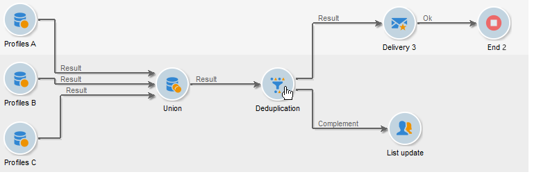

# Deduplica{#deduplication}

La deduplicazione elimina i duplicati dai risultati delle attività in entrata. La deduplicazione può essere eseguita sull’indirizzo e-mail, sul numero di telefono o su un altro campo.

Il **[!UICONTROL Deduplication]** L’attività viene utilizzata per rimuovere le righe duplicate da un set di dati. Ad esempio, i record seguenti potrebbero essere considerati duplicati in quanto hanno lo stesso indirizzo e-mail e lo stesso telefono cellulare e/o di casa.

| Data ultima modifica | Nome | Cognome | E-mail | Telefono cellulare | Telefono |
-----|------------|-----------|-------|--------------|------
| 02/03/2020 | Bob | Tisner | bob@mycompany.com | 444 44 44 444 | 888 88 88 888 |
| 05/19/2020 | Robert | Tisner | bob@mycompany.com | 444 44 44 444 | 777 77 77 777 |
| 07/22/2020 | Bobby | Tisner | bob@mycompany.com | 444 44 44 444 | 777 77 77 777 |

Il **[!UICONTROL Deduplication]** L’attività di consente di mantenere un’intera riga come record univoco dopo l’identificazione dei duplicati. Ad esempio, nel caso d’uso precedente, se l’attività è configurata per conservare solo il record con il più vecchio **[!UICONTROL Date]**, il risultato sarebbe:

| Data | Nome | Cognome | E-mail | Telefono cellulare | Telefono |
-----|----------|------------|-------|--------------|------
| 02/03/2020 | Bob | Tisner | bob@mycompany.com | 444 44 44 444 | 888 88 88 888 |

Il record principale selezionato riporterà i dati senza unire i dati dei campi con altri dati pertinenti nelle righe duplicate.

Complemento:

| Data | Nome | Cognome | E-mail | Telefono cellulare | Telefono |
-----|------------|-----------|-------|--------------|------
| 05/19/2020 | Robert | Tisner | bob@mycompany.com | 444 44 44 444 | 777 77 77 777 |
| 07/22/2020 | Bobby | Tisner | bob@mycompany.com | 444 44 44 444 | 777 77 77 777 |

## Best practice {#best-practices}

Durante la deduplicazione, i flussi in entrata vengono elaborati separatamente. Se, ad esempio, il destinatario A si trova nel risultato della query 1 e nel risultato della query 2, non verrà deduplicato.

La questione deve essere affrontata come segue:

* Creare un **Union** per unificare ogni flusso in entrata.
* Creare un **Deduplicazione** attività dopo il **Union** attività.

## Configurazione {#configuration}

Per configurare una deduplicazione, immetti l’etichetta, il metodo e i criteri di deduplicazione, nonché le opzioni relative al risultato.

1. Fai clic su **[!UICONTROL Edit configuration...]** per definire la modalità di deduplicazione.

   

1. Seleziona il tipo di destinazione per questa attività (per impostazione predefinita, la deduplicazione è collegata ai destinatari) e il criterio da utilizzare, ovvero il campo per il quale valori identici ti consentono di identificare i duplicati.

   >[!NOTE]
   >
   >Se utilizzi dati esterni come input, ad esempio da un file esterno, assicurati di selezionare **[!UICONTROL Temporary schema]** opzione.
   >
   >Nel passaggio successivo, **[!UICONTROL Other]** L’opzione ti consente di selezionare il criterio o i criteri da utilizzare:

   

1. Nel passaggio successivo, **[!UICONTROL Other]** consente di selezionare il criterio o i criteri da utilizzare in caso di valori identici.

   

1. Dall’elenco a discesa, seleziona il metodo di deduplicazione da utilizzare e inserisci il numero di duplicati da conservare.

   

   Sono disponibili i seguenti metodi:

   * **[!UICONTROL Choose for me]**: seleziona in modo casuale il record da escludere dai duplicati.
   * **[!UICONTROL Following a list of values]**: ti consente di definire un valore di priorità per uno o più campi. Per definire i valori, seleziona un campo o crea un’espressione, quindi aggiungi i valori nella tabella appropriata. Per definire un nuovo campo, fai clic sul pulsante **[!UICONTROL Add]** situato sopra l’elenco dei valori.

     

   * **[!UICONTROL Non-empty value]**: questo ti consente di conservare i record per i quali il valore dell’espressione selezionata non è vuoto come priorità.

     

   * **[!UICONTROL Using an expression]**: consente di conservare i record con il valore più basso (o più alto) dell’espressione specificata.

     

   >[!NOTE]
   >
   >Il **[!UICONTROL Merge]** , accessibile tramite **[!UICONTROL Advanced parameters]** , ti consente di configurare un set di regole per unire un campo o un gruppo di campi in un singolo record di dati risultante. Per ulteriori informazioni, consulta [Unione di campi in un unico record](#merging-fields-into-single-record).

1. Clic **[!UICONTROL Finish]** per approvare il metodo di deduplicazione selezionato.

   La sezione centrale della finestra riepiloga la configurazione definita.

   Nella sezione inferiore della finestra dell’editor attività, puoi modificare l’etichetta per la transizione in uscita dell’oggetto grafico e inserire un codice di segmento che verrà associato al risultato dell’attività. Questo codice può essere utilizzato in seguito come criterio di targeting.

   

1. Controlla la **[!UICONTROL Generate complement]** se desideri sfruttare il gruppo rimanente. Il complemento è costituito da tutti i duplicati. Verrà quindi aggiunta una transizione aggiuntiva all’attività, come segue:

   

## Esempio: identificare i duplicati prima di una consegna {#example--identify-the-duplicates-before-a-delivery}

Nell’esempio seguente, la deduplicazione riguarda l’unione di tre query.

Lo scopo del flusso di lavoro è quello di definire il target di una consegna escludendo i duplicati per evitare di inviarla più volte allo stesso destinatario.

I duplicati identificati saranno inoltre integrati in un elenco dedicato che può essere riutilizzato, se necessario.

1. Aggiungi e collega le varie attività necessarie per il funzionamento del flusso di lavoro, come illustrato in precedenza.

   L’attività di unione viene utilizzata qui per &quot;unificare&quot; le tre query in un’unica transizione. Pertanto, la deduplicazione non funziona per ogni singola query, ma per l’intera query. Per ulteriori informazioni su questo argomento, consulta [Best practice](#best-practices).

1. Apri l’attività di deduplicazione, quindi fai clic su **[!UICONTROL Edit configuration...]** per definire la modalità di deduplicazione.
1. Nella nuova finestra, seleziona **[!UICONTROL Database schema]**.
1. Seleziona **Destinatari** come dimensioni di targeting e filtro.
1. Seleziona il campo ID per il **[!UICONTROL Email]** duplicati, per inviare la consegna una sola volta a ogni indirizzo e-mail, quindi fai clic su **[!UICONTROL Next]**.

   Se desideri basare gli ID duplicati su un campo specifico, seleziona **[!UICONTROL Other]** per accedere all’elenco dei campi disponibili.

1. Scegli di mantenere una sola voce quando lo stesso indirizzo e-mail viene identificato per più destinatari.
1. Seleziona la **[!UICONTROL Choose for me]** in modo che i record salvati in caso di duplicati identificati vengano scelti in modo casuale, quindi fai clic su **[!UICONTROL Finish]**.

Durante l’esecuzione del flusso di lavoro, tutti i destinatari identificati come duplicati vengono esclusi dal risultato (e quindi dalla consegna) e aggiunti all’elenco dei duplicati. Questo elenco può essere utilizzato nuovamente anziché dover identificare nuovamente i duplicati.

## Unione di campi in un singolo record di dati {#merging-fields-into-single-record}

Il **[!UICONTROL Merge]** Questa funzionalità consente di configurare un set di regole per la deduplicazione in modo da definire un campo o un gruppo di campi da unire in un singolo record di dati risultante.

Ad esempio, con un set di record duplicati, è possibile scegliere di mantenere il numero di telefono meno recente o il nome più recente.

Un caso d’uso che sfrutta questa funzione è disponibile in [questa sezione](deduplication-merge.md).

Per farlo, segui questi passaggi:

1. In **[!UICONTROL Deduplication method]** fase di selezione, fai clic sul pulsante **[!UICONTROL Advanced Parameters]** collegamento.

   

1. Seleziona la **[!UICONTROL Merge records]** per attivare la funzionalità.

   Se desideri raggruppare più campi dati in ciascuna condizione di unione, attiva il **[!UICONTROL Use several record merging criteria]** opzione.

   

1. Dopo l’attivazione della funzionalità, viene **[!UICONTROL Merge]** viene aggiunta alla scheda **[!UICONTROL Deduplication]** attività. Consente di definire gruppi di campi da unire e le relative regole associate.

   Per ulteriori informazioni, consulta il caso d’uso dedicato disponibile in [questa sezione](deduplication-merge.md).

## Parametri di input {#input-parameters}

* tableName
* schema

Ogni evento in entrata deve specificare una destinazione definita da questi parametri.

## Parametri di output {#output-parameters}

* tableName
* schema
* recCount

Questo insieme di tre valori identifica il target risultante dalla deduplicazione. **[!UICONTROL tableName]** è il nome della tabella che salva gli identificatori di destinazione, **[!UICONTROL schema]** è lo schema della popolazione (in genere nms:recipient) e **[!UICONTROL recCount]** è il numero di elementi nella tabella.

La transizione associata al complemento ha gli stessi parametri.
