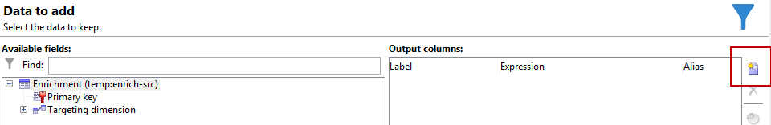

# Arricchimento delle e-mail con campi data personalizzati{#email-enrichment-with-custom-date-fields}


In questo esempio, vogliamo inviare un’e-mail con campi di dati personalizzati ai destinatari che questo mese festeggiano i loro compleanni. L&#39;e-mail includerà un coupon valido una settimana prima e dopo i loro compleanni.

Dobbiamo indirizzare i destinatari da una lista che festeggerà i loro compleanni questo mese con un **[!UICONTROL Split]** attività. Quindi, utilizzando **[!UICONTROL Enrichment]** attività , il campo dati personalizzato fungerà da data di validità nell’e-mail per l’offerta speciale del cliente.


Per creare questo esempio, esegui i seguenti passaggi:

1. In **[!UICONTROL Targeting and workflows]** scheda della campagna, trascina e rilascia una **[!UICONTROL Read list]** attività per eseguire il targeting dell’elenco di destinatari.
1. L’elenco da elaborare può essere specificato esplicitamente, calcolato da uno script o localizzato dinamicamente, in base alle opzioni selezionate e ai parametri qui definiti.

   

1. Aggiungi un **[!UICONTROL Split]** attività per differenziare i destinatari che questo mese festeggeranno i loro compleanni da altri destinatari.
1. Per dividere l&#39;elenco, nella **[!UICONTROL Filtering of selected records]** categoria, seleziona **[!UICONTROL Add a filtering condition on the inbound population]**. Quindi, fai clic su **[!UICONTROL Edit]**.

   

1. Seleziona **[!UICONTROL Filtering conditions]** quindi fai clic su **[!UICONTROL Edit expression]** per filtrare il mese del compleanno del destinatario.

   

1. Fai clic su **[!UICONTROL Advanced Selection]** then **[!UICONTROL Edit the formula using an expression]** e aggiungi la seguente espressione: Month(@datadinascita).
1. In **[!UICONTROL Operator]** seleziona la colonna **[!UICONTROL equal to]**.
1. Per filtrare ulteriormente la condizione, aggiungi la **[!UICONTROL Value]** mese della data corrente: Month(GetDate()).

   Verranno eseguiti query sui destinatari il cui mese di compleanno corrisponde al mese corrente.

   

1. Fai clic su **[!UICONTROL Finish]**. Quindi, nella **[!UICONTROL General]** scheda **[!UICONTROL Split]** fai clic su **[!UICONTROL Generate complement]** in **[!UICONTROL Results]** categoria.

   Con la **[!UICONTROL Complement]** di conseguenza, puoi aggiungere un’attività di consegna o aggiornare un elenco. Qui abbiamo appena aggiunto un **[!UICONTROL End]** attività.

   

È ora necessario configurare il **[!UICONTROL Enrichment]** attività:

1. Aggiungi un **[!UICONTROL Enrichment]** dopo il sottoinsieme per aggiungere campi data personalizzati.

   

1. Apri il tuo **[!UICONTROL Enrichment]** attività. In **[!UICONTROL Complementary information]** categoria, fai clic su **[!UICONTROL Add data]**.

   

1. Seleziona **[!UICONTROL Data linked to the filtering dimension]** then **[!UICONTROL Data of the filtering dimension]**.
1. Fai clic sul pulsante **[!UICONTROL Add]**.

   

1. Aggiungi un **[!UICONTROL Label]**. Quindi, nella **[!UICONTROL Expression]** colonna, fai clic su **[!UICONTROL Edit expression]**.

   

1. Per prima cosa, dobbiamo eseguire il targeting della settimana prima della data di nascita come **Data di inizio validità** con i seguenti **[!UICONTROL Expression]**: `SubDays([target/@birthDate], 7)`.

   

1. Quindi, per creare il campo data personalizzato **Data di fine validità** che eseguirà il targeting della settimana dopo la data di nascita, è necessario aggiungere il **[!UICONTROL Expression]**: `AddDays([target/@birthDate], 7)`.

   Puoi aggiungere un’etichetta all’espressione.

   

1. Fai clic su **[!UICONTROL Ok]**. L&#39;arricchimento è ora pronto.

Dopo il **[!UICONTROL Enrichment]** puoi aggiungere una consegna. In questo caso, abbiamo aggiunto una consegna e-mail per inviare ai destinatari un’offerta speciale con date di validità ai clienti che festeggiano il compleanno questo mese.

1. Trascina e rilascia una **[!UICONTROL Email delivery]** dopo la **[!UICONTROL Enrichment]** attività.

   

1. Fai doppio clic sul **[!UICONTROL Email delivery]** per iniziare a personalizzare la consegna.
1. Aggiungi un **[!UICONTROL Label]** alla consegna e fai clic su **[!UICONTROL Continue]**.
1. Fai clic su **[!UICONTROL Save]** per creare la consegna e-mail.
1. Archivia i **[!UICONTROL Approval]** scheda della consegna e-mail **[!UICONTROL Properties]** che **[!UICONTROL Confirm delivery before sending option]** è controllata.

   Quindi, avvia il flusso di lavoro per arricchire la transizione in uscita con le informazioni mirate.

   

Ora puoi iniziare a progettare la consegna e-mail con i campi data personalizzati creati nella **[!UICONTROL Enrichment]** attività.

1. Fai doppio clic sul **[!UICONTROL Email delivery]** attività.
1. Aggiungi le estensioni di destinazione all’e-mail. Deve trovarsi all’interno della seguente espressione per configurare il formato delle date di validità:

   ```
   <%=
           formatDate(targetData.alias of your expression,"%2D.%2M")  %>
   ```

1. Fai clic su . Seleziona **[!UICONTROL Target extension]** quindi le date di validità personalizzate create in precedenza con **[!UICONTROL Enrichment]** per aggiungere l&#39;estensione all&#39;espressione formatDate.

   

1. Configura il contenuto dell’e-mail in base alle esigenze.

   

1. Visualizza l’anteprima del messaggio e-mail per verificare se i campi data personalizzati sono stati configurati correttamente

   

L’e-mail è ora pronta. Puoi iniziare a inviare le bozze e confermare la consegna per inviare le e-mail di compleanno.
