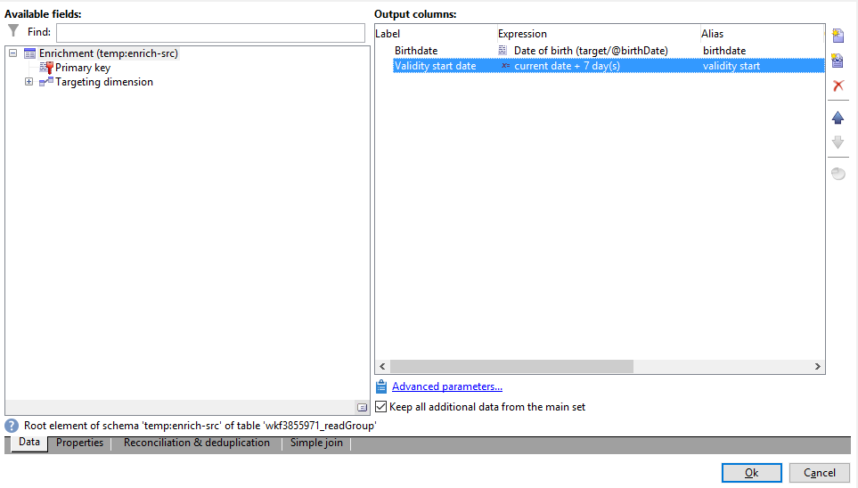

# Arricchimento delle e-mail con campi data personalizzati{#email-enrichment-with-custom-date-fields}


In questo esempio, vogliamo inviare un’e-mail con campi dati personalizzati ai destinatari che festeggeranno il loro compleanno questo mese. L’e-mail includerà un coupon valido una settimana prima e dopo il loro compleanno.

È necessario eseguire il targeting dei destinatari di un elenco che festeggeranno il loro compleanno questo mese con un **[!UICONTROL Split]** attività. Quindi, utilizzando **[!UICONTROL Enrichment]** attività, il campo dati personalizzato fungerà da date di validità nell’e-mail per l’offerta speciale del cliente.


Per creare questo esempio, attieniti alla seguente procedura:

1. In **[!UICONTROL Targeting and workflows]** della campagna, trascina e rilascia una **[!UICONTROL Read list]** attività per eseguire il targeting dell’elenco di destinatari.
1. L’elenco da elaborare può essere specificato in modo esplicito, calcolato da uno script o localizzato in modo dinamico, in base alle opzioni selezionate e ai parametri definiti qui.

   

1. Aggiungi un **[!UICONTROL Split]** attività per distinguere i destinatari che festeggeranno il loro compleanno questo mese da altri destinatari.
1. Per suddividere l’elenco, in **[!UICONTROL Filtering of selected records]** categoria, seleziona **[!UICONTROL Add a filtering condition on the inbound population]**. Quindi, fai clic su **[!UICONTROL Edit]**.

   

1. Seleziona **[!UICONTROL Filtering conditions]** quindi fai clic su **[!UICONTROL Edit expression]** per filtrare il mese del compleanno del destinatario.

   

1. Clic **[!UICONTROL Advanced Selection]** allora **[!UICONTROL Edit the formula using an expression]** e aggiungi la seguente espressione: Month(@birthDate).
1. In **[!UICONTROL Operator]** , seleziona la **[!UICONTROL equal to]**.
1. Filtrare ulteriormente la condizione aggiungendo il **[!UICONTROL Value]** mese della data corrente: Month(GetDate()).

   Questa operazione eseguirà una query sui destinatari il cui mese di compleanno corrisponde al mese corrente.

   

1. Fai clic su **[!UICONTROL Finish]**. Quindi, nella **[!UICONTROL General]** scheda del **[!UICONTROL Split]** attività, fai clic su **[!UICONTROL Generate complement]** nel **[!UICONTROL Results]** categoria.

   Con il **[!UICONTROL Complement]** di conseguenza, puoi aggiungere un’attività di consegna o aggiornare un elenco. In questo caso, abbiamo appena aggiunto un’ **[!UICONTROL End]** attività.

   

Ora devi configurare il **[!UICONTROL Enrichment]** attività:

1. Aggiungi un **[!UICONTROL Enrichment]** per aggiungere campi data personalizzati, attività dopo il sottoinsieme.

   

1. Apri il **[!UICONTROL Enrichment]** attività. In **[!UICONTROL Complementary information]** categoria, fai clic su **[!UICONTROL Add data]**.

   

1. Seleziona **[!UICONTROL Data linked to the filtering dimension]** allora **[!UICONTROL Data of the filtering dimension]**.
1. Fai clic sul pulsante **[!UICONTROL Add]**.

   

1. Aggiungi un **[!UICONTROL Label]**. Quindi, nella **[!UICONTROL Expression]** , fare clic su **[!UICONTROL Edit expression]**.

   

1. Innanzitutto, dobbiamo impostare come target la settimana precedente la data di nascita **Data di inizio validità** con le seguenti **[!UICONTROL Expression]**: `SubDays([target/@birthDate], 7)`.

   

1. Quindi, per creare il campo data personalizzato **Data di fine validità** , che eseguirà il targeting della settimana successiva alla data di nascita, è necessario aggiungere **[!UICONTROL Expression]**: `AddDays([target/@birthDate], 7)`.

   È possibile aggiungere un&#39;etichetta all&#39;espressione.

   

1. Fai clic su **[!UICONTROL Ok]**. Il tuo arricchimento è ora pronto.

Dopo il **[!UICONTROL Enrichment]** attività, puoi aggiungere una consegna. In questo caso, abbiamo aggiunto una consegna e-mail per inviare ai destinatari un’offerta speciale con date di validità ai clienti che festeggiano il loro compleanno questo mese.

1. Trascina e rilascia una **[!UICONTROL Email delivery]** attività dopo **[!UICONTROL Enrichment]** attività.

   

1. Fai doppio clic sul tuo **[!UICONTROL Email delivery]** attività per iniziare a personalizzare la consegna.
1. Aggiungi un **[!UICONTROL Label]** alla consegna e fai clic su **[!UICONTROL Continue]**.
1. Clic **[!UICONTROL Save]** per creare la consegna e-mail.
1. Archivia **[!UICONTROL Approval]** scheda della consegna e-mail **[!UICONTROL Properties]** che il **[!UICONTROL Confirm delivery before sending option]** è selezionato.

   Quindi, avvia il flusso di lavoro per arricchire la transizione in uscita con le informazioni di destinazione.

   

Ora puoi iniziare a progettare la consegna e-mail con i campi data personalizzati creati nel **[!UICONTROL Enrichment]** attività.

1. Fai doppio clic sul tuo **[!UICONTROL Email delivery]** attività.
1. Aggiungi le estensioni target all’e-mail. Per configurare il formato delle date di validità, deve trovarsi all’interno della seguente espressione:

   ```
   <%=
           formatDate(targetData.alias of your expression,"%2D.%2M")  %>
   ```

1. Fai clic su . Seleziona **[!UICONTROL Target extension]** quindi le date di validità personalizzate create in precedenza con **[!UICONTROL Enrichment]** per aggiungere la tua estensione all’espressione formatDate.

   

1. Configura il contenuto dell’e-mail in base alle esigenze.

   

1. Visualizza l’anteprima del messaggio e-mail per verificare se i campi data personalizzati sono stati configurati correttamente

   

L’e-mail è ora pronta. Puoi iniziare a inviare le bozze e confermare la consegna per inviare le e-mail di compleanno.
