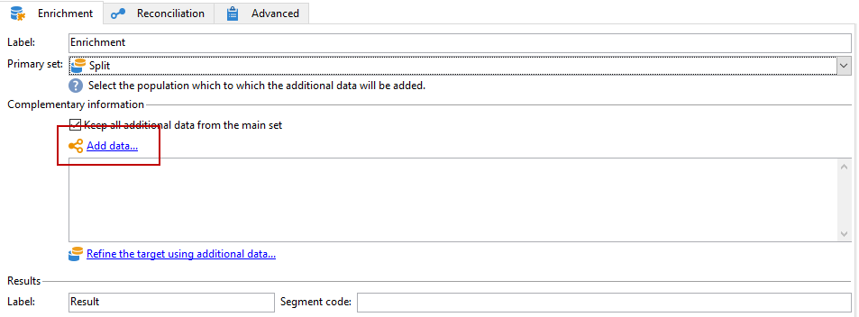

# Arricchimento delle e-mail con campi data personalizzati{#email-enrichment-with-custom-date-fields}


In questo esempio, vogliamo inviare un’e-mail con campi dati personalizzati ai destinatari che festeggeranno il loro compleanno questo mese. L’e-mail includerà un coupon valido una settimana prima e dopo il loro compleanno.

È necessario eseguire il targeting dei destinatari di un elenco che celebreranno il loro compleanno questo mese con un&#39;attività **[!UICONTROL Split]**. Quindi, utilizzando l&#39;attività **[!UICONTROL Enrichment]**, il campo dati personalizzato fungerà da date di validità nell&#39;e-mail per l&#39;offerta speciale del cliente.


Per creare questo esempio, attieniti alla seguente procedura:

1. Nella scheda **[!UICONTROL Targeting and workflows]** della campagna, trascina e rilascia un&#39;attività **[!UICONTROL Read list]** per eseguire il targeting dell&#39;elenco di destinatari.
1. L’elenco da elaborare può essere specificato in modo esplicito, calcolato da uno script o localizzato in modo dinamico, in base alle opzioni selezionate e ai parametri definiti qui.

   

1. Aggiungi un&#39;attività **[!UICONTROL Split]** per differenziare i destinatari che questo mese festeggeranno il loro compleanno da altri destinatari.
1. Per dividere l&#39;elenco, nella categoria **[!UICONTROL Filtering of selected records]**, selezionare **[!UICONTROL Add a filtering condition on the inbound population]**. Quindi fare clic su **[!UICONTROL Edit]**.

   

1. Seleziona **[!UICONTROL Filtering conditions]**, quindi fai clic sul pulsante **[!UICONTROL Edit expression]** per filtrare il mese del compleanno del destinatario.

   

1. Fare clic su **[!UICONTROL Advanced Selection]**, quindi su **[!UICONTROL Edit the formula using an expression]** e aggiungere la seguente espressione: Month(@birthDate).
1. Nella colonna **[!UICONTROL Operator]** selezionare **[!UICONTROL equal to]**.
1. Filtra ulteriormente la condizione aggiungendo **[!UICONTROL Value]** mese della data corrente: Month(GetDate()).

   Questa operazione eseguirà una query sui destinatari il cui mese di compleanno corrisponde al mese corrente.

   

1. Fai clic su **[!UICONTROL Finish]**. Nella scheda **[!UICONTROL General]** dell&#39;attività **[!UICONTROL Split]**, fare clic su **[!UICONTROL Generate complement]** nella categoria **[!UICONTROL Results]**.

   Con il risultato **[!UICONTROL Complement]**, puoi aggiungere un&#39;attività di consegna o aggiornare un elenco. In questo caso, è stata aggiunta un&#39;attività **[!UICONTROL End]**.

   

È ora necessario configurare l&#39;attività **[!UICONTROL Enrichment]**:

1. Aggiungi un&#39;attività **[!UICONTROL Enrichment]** dopo il tuo sottoinsieme per aggiungere i tuoi campi data personalizzati.

   

1. Apri l&#39;attività **[!UICONTROL Enrichment]**. Nella categoria **[!UICONTROL Complementary information]**, fare clic su **[!UICONTROL Add data]**.

   

1. Selezionare **[!UICONTROL Data linked to the filtering dimension]** e quindi **[!UICONTROL Data of the filtering dimension]**.
1. Fai clic sul pulsante **[!UICONTROL Add]**.

   

1. Aggiungi **[!UICONTROL Label]**. Nella colonna **[!UICONTROL Expression]** fare clic su **[!UICONTROL Edit expression]**.

   

1. Innanzitutto, la settimana precedente la data di nascita deve essere impostata come **Data di inizio validità** con **[!UICONTROL Expression]** seguente: `SubDays([target/@birthDate], 7)`.

   

1. Quindi, per creare il campo data personalizzato **Data di fine validità** che avrà come destinazione la settimana successiva alla data di nascita, devi aggiungere **[!UICONTROL Expression]**: `AddDays([target/@birthDate], 7)`.

   È possibile aggiungere un&#39;etichetta all&#39;espressione.

   

1. Fai clic su **[!UICONTROL Ok]**. Il tuo arricchimento è ora pronto.

Dopo l&#39;attività **[!UICONTROL Enrichment]**, puoi aggiungere una consegna. In questo caso, abbiamo aggiunto una consegna e-mail per inviare ai destinatari un’offerta speciale con date di validità ai clienti che festeggiano il loro compleanno questo mese.

1. Trascina un&#39;attività **[!UICONTROL Email delivery]** dopo l&#39;attività **[!UICONTROL Enrichment]**.

   

1. Fai doppio clic sull&#39;attività **[!UICONTROL Email delivery]** per iniziare a personalizzare la consegna.
1. Aggiungi **[!UICONTROL Label]** alla consegna e fai clic su **[!UICONTROL Continue]**.
1. Fai clic su **[!UICONTROL Save]** per creare la consegna e-mail.
1. Verificare nella scheda **[!UICONTROL Approval]** della consegna e-mail **[!UICONTROL Properties]** che **[!UICONTROL Confirm delivery before sending option]** sia selezionato.

   Quindi, avvia il flusso di lavoro per arricchire la transizione in uscita con le informazioni di destinazione.

   

Ora puoi iniziare a progettare la consegna e-mail con i campi data personalizzati creati nell&#39;attività **[!UICONTROL Enrichment]**.

1. Fare doppio clic sull&#39;attività **[!UICONTROL Email delivery]**.
1. Aggiungi le estensioni target all’e-mail. Per configurare il formato delle date di validità, deve trovarsi all’interno della seguente espressione:

   ```
   <%=
           formatDate(targetData.alias of your expression,"%2D.%2M")  %>
   ```

1. Fai clic su . Seleziona **[!UICONTROL Target extension]** e quindi le date di validità personalizzate create in precedenza con l&#39;attività **[!UICONTROL Enrichment]** per aggiungere l&#39;estensione all&#39;espressione formatDate.

   

1. Configura il contenuto dell’e-mail in base alle esigenze.

   

1. Visualizza l’anteprima del messaggio e-mail per verificare se i campi data personalizzati sono stati configurati correttamente

   

L’e-mail è ora pronta. Puoi iniziare a inviare le bozze e confermare la consegna per inviare le e-mail di compleanno.
