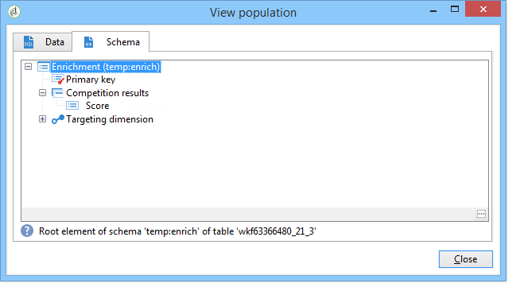

# Arricchire i dati{#enriching-data}

## Informazioni sull’arricchimento dei dati {#about-enriching-data}

Questo caso d&#39;uso descrive i possibili utilizzi dell&#39;attività **[!UICONTROL Enrichment]** in un flusso di lavoro di targeting. Per ulteriori informazioni sull&#39;utilizzo dell&#39;attività **[!UICONTROL Enrichment]**, vedere: [Arricchimento](enrichment.md).

Un caso d&#39;uso su come arricchire una consegna e-mail con date personalizzate è disponibile anche in [questa sezione](email-enrichment-with-custom-date-fields.md).

I contatti della banca dati di marketing ricevono un invito a partecipare a un concorso tramite un’applicazione web. I risultati della concorrenza vengono recuperati nella tabella **[!UICONTROL Competition results]**. Tabella collegata alla tabella dei contatti (**[!UICONTROL Recipients]**). La tabella **[!UICONTROL Competition results]** contiene i campi seguenti:

* Nome concorrenza (@game)
* Numero della prova (@trial)
* Punteggio (@score)

Un contatto trovato nella tabella **[!UICONTROL Recipients]** può essere collegato a diverse righe della tabella **[!UICONTROL Competition results]**. La relazione tra queste due tabelle è di tipo 1-n. Ecco un esempio dei registri dei risultati per un destinatario:

Lo scopo di questo caso d’uso è quello di inviare consegne personalizzate a persone che hanno partecipato all’ultimo concorso a seconda dei punteggi più elevati. Il destinatario con il punteggio più alto ottiene il primo premio, il destinatario con il secondo punteggio più alto riceve un premio di consolazione e tutti gli altri ricevono un messaggio augurando loro maggiore fortuna la prossima volta.

Per impostare questo caso d’uso, abbiamo creato il seguente flusso di lavoro di targeting:

Per creare il flusso di lavoro, effettua le seguenti operazioni:

1. Due attività **[!UICONTROL Query]** e un&#39;attività **[!UICONTROL Intersection]** vengono aggiunte per eseguire il targeting dei nuovi abbonati che sono entrati per ultimi nel concorso.
1. L&#39;attività **[!UICONTROL Enrichment]** viene utilizzata per aggiungere i dati archiviati nella tabella **[!UICONTROL Competition results]**. Il campo **[!UICONTROL Score]** in cui avverrà la personalizzazione della consegna viene aggiunto alla tabella di lavoro del flusso di lavoro.
1. L&#39;attività di tipo **[!UICONTROL Split]** viene utilizzata per creare sottoinsiemi di destinatari in base ai punteggi.
1. Per ogni sottoinsieme viene aggiunta un&#39;attività **[!UICONTROL Delivery]**.

## Passaggio 1: targeting {#step-1--targeting}

La prima query viene utilizzata per eseguire il targeting dei destinatari aggiunti al database negli ultimi sei mesi.

La seconda query viene utilizzata per eseguire il targeting dei destinatari che hanno partecipato all’ultimo concorso.

Viene quindi aggiunta un&#39;attività di tipo **[!UICONTROL Intersection]** per individuare i destinatari aggiunti al database negli ultimi sei mesi e che hanno partecipato all&#39;ultimo concorso.

## Passaggio 2: Arricchimento {#step-2--enrichment}

In questo esempio, scopri come personalizzare le consegne in base al campo **[!UICONTROL Score]** memorizzato nella tabella **[!UICONTROL Competition results]**. Questa tabella ha una relazione di tipo 1-n con la tabella dei destinatari. L&#39;attività **[!UICONTROL Enrichment]** viene utilizzata per aggiungere dati da una tabella collegata alla dimensione di filtro alla tabella di lavoro del flusso di lavoro.

1. Nella schermata di modifica dell&#39;attività di arricchimento, selezionare **[!UICONTROL Add data]**, quindi **[!UICONTROL Data linked to the filtering dimension]** e fare clic su **[!UICONTROL Next]**.

   

1. Selezionare quindi l&#39;opzione **[!UICONTROL Data linked to the filtering dimension]**, selezionare la tabella **[!UICONTROL Competition results]** e fare clic su **[!UICONTROL Next]**.

   

1. Immettere un ID e un&#39;etichetta e selezionare l&#39;opzione **[!UICONTROL Limit the line count]** nel campo **[!UICONTROL Data collected]**. Nel campo **[!UICONTROL Lines to retrieve]**, selezionare &#39;1&#39; come valore. Per ogni destinatario, l&#39;attività di arricchimento aggiungerà una singola riga dalla tabella **[!UICONTROL Competition results]** alla tabella di lavoro del flusso di lavoro. Fai clic su **[!UICONTROL Next]**.

   

1. In questo esempio, vogliamo recuperare il punteggio più alto del destinatario, ma solo per l’ultimo concorso. A questo scopo, aggiungere un filtro al campo **[!UICONTROL Competition name]** per escludere tutte le righe relative ai concorsi precedenti. Fai clic su **[!UICONTROL Next]**.

   

1. Andare alla schermata **[!UICONTROL Sort]** e fare clic sul pulsante **[!UICONTROL Add]**, selezionare il campo **[!UICONTROL Score]** e selezionare la casella nella colonna **[!UICONTROL descending]** per ordinare gli elementi dei campi **[!UICONTROL Score]** in ordine decrescente. Per ogni destinatario, l’attività di arricchimento aggiunge una riga che corrisponde al punteggio più alto dell’ultima partita. Fai clic su **[!UICONTROL Next]**.

   

1. Nella finestra **[!UICONTROL Data to add]** fare doppio clic sul campo **[!UICONTROL Score]**. Per ogni destinatario, l&#39;attività di arricchimento aggiungerà solo il campo **[!UICONTROL Score]**. Fai clic su **[!UICONTROL Finish]**.

   

Fare clic con il pulsante destro del mouse sulla transizione in entrata dell&#39;attività di arricchimento e selezionare **[!UICONTROL Display the target]**. La tabella di lavoro contiene i dati seguenti:

Schema collegato:

Rinnova questa operazione nella transizione in uscita dell’attività di arricchimento. Possiamo vedere che sono stati aggiunti i dati collegati ai punteggi dei destinatari. È stato recuperato il punteggio più alto di ciascun destinatario.

Anche lo schema corrispondente è stato arricchito.

## Passaggio 3: suddivisione e consegna {#step-3--split-and-delivery}

Per ordinare i destinatari in base ai loro punteggi, viene aggiunta un&#39;attività **[!UICONTROL Split]** dopo l&#39;arricchimento.

1. È stato definito un primo sottoinsieme (**Vincitore**) per includere il destinatario con il punteggio più alto. A questo scopo, definisci un limite del numero di record, applica un ordinamento decrescente al punteggio e limita il numero di record a 1.

   

1. Il secondo sottoinsieme (**Secondo posto**) include il destinatario con il secondo punteggio più alto. La configurazione è la stessa del primo sottoinsieme.

   

1. Il terzo sottoinsieme (**perdenti**) contiene tutti gli altri destinatari. Vai alla scheda **[!UICONTROL General]** e seleziona la casella **[!UICONTROL Generate complement]** per eseguire il targeting di tutti i destinatari che non hanno ottenuto i due punteggi più alti.

   

1. Aggiungere un&#39;attività di tipo **[!UICONTROL Delivery]** per ogni sottoinsieme utilizzando un modello di consegna diverso per ogni sottoinsieme.

   
