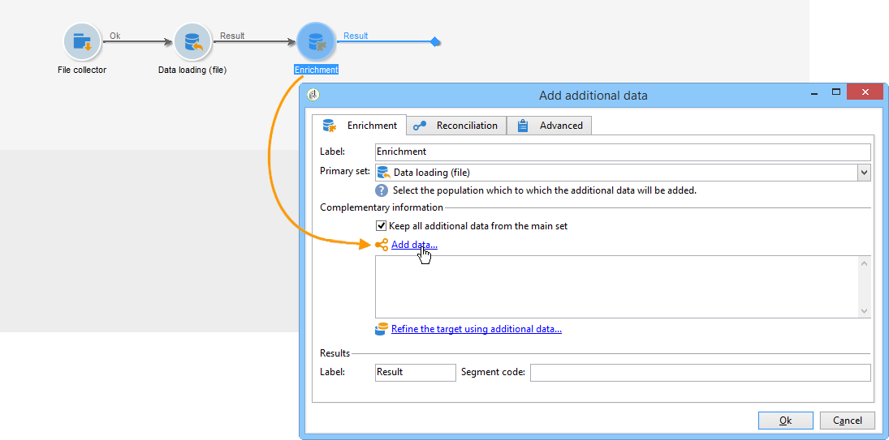
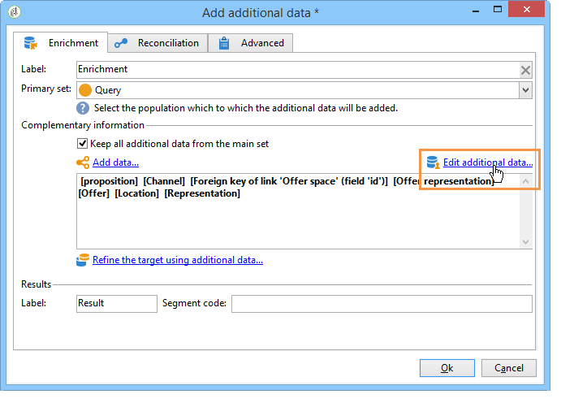

# Arricchimento{#enrichment}


L&#39;attività **[!UICONTROL Enrichment]** consente di aggiungere informazioni a un elenco di profili e collegamenti a una tabella esistente (creare un nuovo join). È inoltre possibile definire i criteri di riconciliazione con i profili nel database.


## Definizioni {#definitions}

Per utilizzare l’attività di arricchimento, è necessario avere familiarità con le varie opzioni disponibili quando si aggiungono i dati.


L&#39;opzione **[!UICONTROL Data linked to the filtering dimension]** consente di accedere a:

* Dati della dimensione filtro: accesso ai dati della tabella di lavoro
* Dati collegati alla dimensione filtro: accesso ai dati collegati alla tabella di lavoro


L&#39;opzione **[!UICONTROL A link]** consente di creare un join su qualsiasi tabella del database.


Esistono quattro tipi di collegamenti:

* **[!UICONTROL Define a collection]**: consente di definire un collegamento con cardinalità 1-N tra le tabelle.
* **[!UICONTROL Define a link whose target is still available]**: consente di definire un collegamento con cardinalità 1-1 tra le tabelle. Le condizioni di join devono essere definite da un singolo record nella tabella di destinazione.
* **[!UICONTROL Define a link whose target does not necessarily exist in the base]**: consente di definire un collegamento con cardinalità 0-1 tra le tabelle. La condizione di unione deve essere definita da 0 o 1 (max) nella tabella di destinazione.

  Questa opzione è configurata nella scheda **[!UICONTROL Simple Join]** a cui è possibile accedere tramite il collegamento **[!UICONTROL Edit additional data]** dell&#39;attività **[!UICONTROL Enrichment]**.

* **[!UICONTROL Define a link by searching for a reference among several options]**: questo tipo di collegamento definisce una riconciliazione verso un record univoco. Adobe Campaign crea un collegamento a una tabella di destinazione aggiungendo una chiave esterna nella tabella di destinazione per la memorizzazione di un riferimento al record univoco.

  Questa opzione è configurata nella scheda **[!UICONTROL Reconciliation and deduplication]** a cui è possibile accedere tramite il collegamento **[!UICONTROL Edit additional data]** dell&#39;attività **[!UICONTROL Enrichment]**.

I casi d’uso che descrivono nel dettaglio il funzionamento delle attività di arricchimento nel loro contesto sono disponibili anche in queste sezioni:

* [Arricchimento delle e-mail con campi data personalizzati](email-enrichment-with-custom-date-fields.md).
* [Arricchimento dei dati](enrich-data.md)
* [Creazione di un elenco di riepilogo](create-a-summary-list.md)

## Aggiunta di informazioni {#adding-information}

Utilizzare l&#39;attività **[!UICONTROL Enrichment]** per aggiungere colonne a una tabella di lavoro: questa attività può essere utilizzata come complemento a un&#39;attività di query.

La configurazione delle colonne aggiuntive è descritta in [Aggiunta di dati](query.md#adding-data).

Il campo **[!UICONTROL Primary set]** consente di selezionare la transizione in entrata: i dati della tabella di lavoro di questa attività verranno arricchiti.

Fare clic sul collegamento **[!UICONTROL Add data]** e selezionare il tipo di dati da aggiungere. L’elenco dei tipi di dati offerti dipende dai moduli e dalle opzioni installati nella piattaforma. In una configurazione minima, puoi sempre aggiungere dati collegati alla dimensione di filtro e un collegamento.


Nell’esempio seguente, la transizione in uscita verrà arricchita con informazioni sull’età dei profili target.


Fai clic con il pulsante destro del mouse sulla transizione in entrata dell’attività di arricchimento per visualizzare i dati prima della fase di arricchimento.


La tabella di lavoro contiene i dati seguenti e lo schema associato:


Ripetete questa operazione nell&#39;output della fase di arricchimento.


Puoi vedere che sono stati aggiunti i dati relativi alle età del profilo:


Anche lo schema corrispondente è stato arricchito.

## Gestione di dati aggiuntivi {#managing-additional-data}

Deselezionare l&#39;opzione **[!UICONTROL Keep all additional data from the main set]** se non si desidera conservare i dati aggiuntivi definiti in precedenza. In questo caso, solo le colonne aggiuntive selezionate nell&#39;attività di arricchimento verranno aggiunte alla tabella di lavoro in uscita. Le informazioni aggiuntive aggiunte alle attività a monte non verranno salvate.


I dati e lo schema nell’output della fase di arricchimento saranno i seguenti:


## Creazione di un collegamento {#creating-a-link}

Puoi utilizzare l’attività di arricchimento per creare un collegamento tra i dati di lavoro e il database di Adobe Campaign: si tratterà di un collegamento locale al flusso di lavoro tra i dati in entrata.

Ad esempio, se carichi i dati di un file che contiene il numero di account, il paese e l’e-mail dei destinatari, dovrai creare un collegamento alla tabella del paese per aggiornare queste informazioni nei loro profili.

A questo scopo, esegui i seguenti passaggi:

1. Raccogli e carica il seguente tipo di file:

   ```
   Account number;Country;Email
   18D65;FRANCE;agnes@gmail.com
   243PP;RUSSIA;paul@gmail.com
   55H87;CROATIA;dave@gmail.com
   56U81;USA;susan@gmail.com
   853PI;ITALY;anna@gmail.com
   890LP;FRANCE;robert@gmail.com
   83TY2;SWITZERLAND;mike@gmail.com
   ```

1. Modificare l&#39;attività di arricchimento e fare clic sul collegamento **Aggiungi dati...** per creare un join con la tabella Paese.

   

1. Selezionare l&#39;opzione **[!UICONTROL Link definition]** e fare clic sul pulsante **[!UICONTROL Next]**. Specifica il tipo di collegamento da creare. In questo esempio, vogliamo riconciliare il paese del destinatario del file con un paese nell’elenco dei paesi disponibili nella tabella dedicata del database. Scegliere l&#39;opzione **[!UICONTROL Define a link by searching for a reference among several options]**. Selezionare la tabella dei paesi nel campo **[!UICONTROL Target schema]**.

   

1. Infine, selezionare i campi che consentono di collegare i valori del file di origine a quelli del database.

   

All’output di questa attività di arricchimento, lo schema temporaneo conterrà il collegamento alla tabella del paese:


## Riconciliazione dei dati {#data-reconciliation}

L’attività di arricchimento può essere utilizzata per configurare la riconciliazione dei dati, anche dopo che i dati sono stati caricati nel database. In questo caso, la scheda **[!UICONTROL Reconciliation]** ti consente di definire il collegamento tra i dati nel database di Adobe Campaign e i dati nella tabella di lavoro.

Selezionare l&#39;opzione **[!UICONTROL Identify the targeting document based on work data]**, specificare lo schema a cui si desidera creare un collegamento e definire le condizioni di unione: a tale scopo, selezionare i campi da riconciliare nei dati di lavoro (**[!UICONTROL Source expression]**) e nella dimensione di targeting (**[!UICONTROL Destination expression]**).

Puoi utilizzare uno o più criteri di riconciliazione.


Se sono specificate più condizioni di unione, è necessario verificarle TUTTE in modo che i dati possano essere collegati tra loro.

## Inserimento di una proposta di offerta {#inserting-an-offer-proposition}

L’attività Enrichment ti consente di aggiungere offerte o collegamenti alle offerte per i destinatari della consegna.

Per ulteriori informazioni sull&#39;attività di arricchimento, fare riferimento a questa [sezione](enrichment.md).

Ad esempio, puoi arricchire i dati di una query del destinatario prima di una consegna.


Dopo aver configurato la query (consulta questa [sezione](query.md)):

1. Aggiungi e apri un’attività di arricchimento.
1. Nella scheda **[!UICONTROL Enrichment]**, selezionare **[!UICONTROL Add data]**.
1. Selezionare **[!UICONTROL An offer proposition]** nei tipi di dati da aggiungere.

   

1. Specifica un identificatore e un’etichetta per la proposta che verrà aggiunta.
1. Specifica la selezione dell’offerta. Esistono due opzioni possibili per questo:

   * **[!UICONTROL Search for the best offer in a category]**: selezionare questa opzione e specificare i parametri di chiamata del motore di offerta (spazio dell&#39;offerta, categoria o temi, data di contatto, numero di offerte da mantenere). Il motore calcola automaticamente le offerte da aggiungere in base a questi parametri. È consigliabile completare il campo **[!UICONTROL Category]** o **[!UICONTROL Theme]**, anziché entrambi contemporaneamente.

     

   * **[!UICONTROL A predefined offer]**: selezionare questa opzione e specificare uno spazio dell&#39;offerta, un&#39;offerta specifica e una data di contatto per configurare direttamente l&#39;offerta da aggiungere senza chiamare il motore delle offerte.

     

1. Quindi configura un’attività di consegna che corrisponde al canale scelto. Consulta [Consegne cross-channel](cross-channel-deliveries.md).

   Il numero di proposte disponibili per l’anteprima dipende dalla configurazione eseguita nell’attività di arricchimento anziché da qualsiasi configurazione possibile eseguita direttamente nella consegna.

Per specificare le proposte di offerta, puoi anche scegliere di fare riferimento a un collegamento a un’offerta. Per ulteriori informazioni, consulta la seguente sezione [Riferimento a un collegamento a un&#39;offerta](#referencing-a-link-to-an-offer).

## Riferimento a un collegamento a un’offerta {#referencing-a-link-to-an-offer}

Puoi anche fare riferimento a un collegamento a un’offerta in un’attività di arricchimento.

Per eseguire questa operazione:

1. Selezionare **[!UICONTROL Add data]** nella scheda **[!UICONTROL Enrichment]** dell&#39;attività.
1. Nella finestra in cui si sceglie il tipo di dati da aggiungere, selezionare **[!UICONTROL A link]**.
1. Seleziona il tipo di collegamento che desideri stabilire e la relativa destinazione. In questo caso, la destinazione è lo schema dell’offerta.

   

1. Specifica il join tra i dati della tabella in entrata nell’attività di arricchimento (qui la tabella dei destinatari) e la tabella delle offerte. Ad esempio, puoi collegare un codice di offerta a un destinatario.

   

1. Quindi configura un’attività di consegna che corrisponde al canale scelto. Consulta [Consegne cross-channel](cross-channel-deliveries.md).

   >[!NOTE]
   >
   >Il numero di proposte disponibili per l’anteprima dipende dalla configurazione eseguita nella consegna.

## Memorizzazione delle classificazioni e dei pesi delle offerte {#storing-offer-rankings-and-weights}

Per impostazione predefinita, quando un&#39;attività **arricchimento** viene utilizzata per distribuire le offerte, le classificazioni e i pesi non vengono memorizzati nella tabella delle proposte.

L&#39;attività **[!UICONTROL Offer engine]** memorizza queste informazioni per impostazione predefinita.

Tuttavia, è possibile memorizzare queste informazioni come segue:

1. Crea una chiamata al motore di offerta in un’attività di arricchimento inserita dopo una query e prima di un’attività di consegna.
1. Nella finestra principale dell&#39;attività, selezionare **[!UICONTROL Edit additional data...]**.

   

1. Aggiungi le colonne **[!UICONTROL @rank]** per la classificazione e **[!UICONTROL @weight]** per il peso dell&#39;offerta.

   

1. Conferma l’aggiunta e salva il flusso di lavoro.

La consegna memorizza automaticamente la classificazione e il peso delle offerte. Queste informazioni sono visibili nella scheda **[!UICONTROL Offers]** della consegna.
